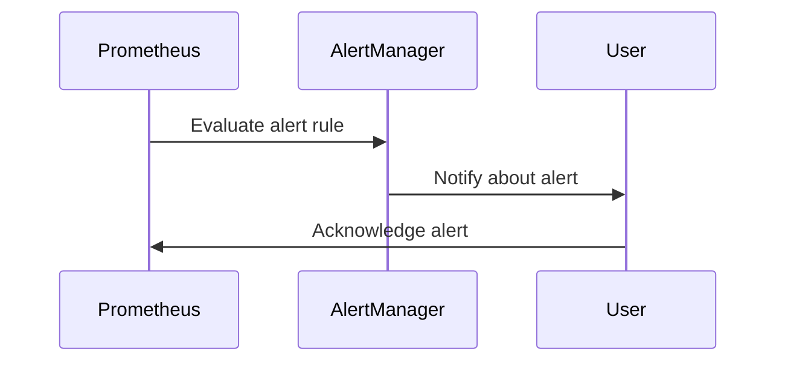
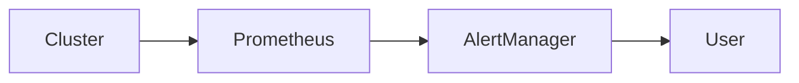

## Introduction to Prometheus Alert Rules

Prometheus is an open-source monitoring system and time series database designed to collect and store metrics from various sources. One of its key features is the ability to define alert rules that trigger notifications based on specific conditions within your monitored environment. This chapter will delve into the configuration and usage of alert rules in Prometheus, providing a comprehensive understanding of how to set up effective monitoring and alerting for your cluster.

### What Are Alert Rules?

Alert rules in Prometheus are used to define conditions under which an alert should be triggered. These rules are defined in YAML files and can be configured to monitor various aspects of your infrastructure, such as CPU usage, memory consumption, disk space, and service availability. When a condition specified in an alert rule is met, Prometheus triggers an alert, which can then be managed by the Alertmanager.

### Why Use Alert Rules?

Alert rules are crucial for maintaining the health and stability of your cluster. They allow you to proactively identify and address issues before they escalate into critical problems. By setting up appropriate alert rules, you can:

- **Detect anomalies**: Identify unexpected behavior in your services or infrastructure.
- **Ensure SLAs**: Monitor key performance indicators (KPIs) to ensure that your services meet their Service Level Agreements (SLAs).
- **Prevent downtime**: Quickly respond to issues that could lead to service outages.
- **Optimize resource utilization**: Monitor resource usage to ensure efficient allocation and scaling.

### How Alert Rules Work

Alert rules in Prometheus work by evaluating expressions at regular intervals. These expressions are typically written in PromQL (Prometheus Query Language), which is a powerful query language designed specifically for Prometheus. When an expression evaluates to a non-zero value, an alert is triggered.

#### Example of an Alert Rule

Let's consider a simple example of an alert rule that monitors CPU usage:

```yaml
groups:
- name: example
  rules:
  - alert: HighCPUUsage
    expr: sum(rate(node_cpu_seconds_total{mode="idle"}[5m])) by (instance) < 0.1
    for: 5m
    labels:
      severity: critical
    annotations:
      summary: "High CPU Usage on {{ $labels.instance }}"
      description: "The average idle CPU time on {{ $labels.instance }} is below 10%."
```

In this example:
- `alert`: The name of the alert.
- `expr`: The PromQL expression that defines the condition for triggering the alert.
- `for`: The duration for which the condition must be true before the alert is triggered.
- `labels`: Additional metadata associated with the alert.
- `annotations`: Human-readable descriptions of the alert.

### Understanding the Syntax of Alert Rules

The syntax of alert rules in Prometheus is defined in YAML format. Each alert rule is part of a group, and each group can contain multiple rules. Let's break down the components of an alert rule:

#### Name

The `name` attribute provides a descriptive label for the alert rule. This helps in identifying the purpose of the alert.

#### Expression

The `expr` attribute contains the PromQL expression that defines the condition for triggering the alert. This expression is evaluated at regular intervals, and if it returns a non-zero value, the alert is triggered.

#### Duration (`for`)

The `for` attribute specifies the duration for which the condition must be true before the alert is triggered. This helps in avoiding false positives due to temporary spikes or anomalies.

#### Labels

Labels are additional metadata associated with the alert. They can be used to categorize alerts and provide context. Common labels include `severity`, `service`, and `component`.

#### Annotations

Annotations are human-readable descriptions of the alert. They can include summaries and detailed explanations of the issue. These are particularly useful for end-users who may not be familiar with the technical details of the alert.

### Real-World Examples of Alert Rules

To illustrate the practical application of alert rules, let's consider some real-world scenarios and recent CVEs/breaches where proper alerting could have helped mitigate the situation.

#### Example 1: High Memory Usage

A common issue in clusters is high memory usage, which can lead to performance degradation and even service outages. Consider the following alert rule:

```yaml
groups:
- name: memory_usage
  rules:
  - alert: HighMemoryUsage
    expr: node_memory_MemAvailable_bytes / node_memory_MemTotal_bytes * 100 < 20
    for: 5m
    labels:
      severity: critical
    annotations:
      summary: "High Memory Usage on {{ $labels.instance }}"
      description: "The available memory on {{ $labels.instance }} is below 20% of total memory."
```

This alert rule triggers when the available memory falls below 20% of the total memory. This can help in proactively addressing memory-related issues before they cause significant problems.

#### Example 2: Service Unavailability

Another critical scenario is the unavailability of a service. Consider the following alert rule:

```yaml
groups:
- name: service_availability
  rules:
  - alert: ServiceDown
    expr: up == 0
    for: 5m
    labels:
      severity: critical
    annotations:
      summary: "Service Down on {{ $labels.instance }}"
      description: "The service on {{ $labels.instance }} is currently unavailable."
```

This alert rule triggers when a service becomes unavailable. This can help in quickly identifying and addressing service outages.

### How to Prevent / Defend Against Issues

To effectively prevent and defend against issues identified by alert rules, it's essential to implement robust monitoring and alerting practices. Here are some strategies:

#### Detection

- **Regular Monitoring**: Continuously monitor your cluster using Prometheus and other monitoring tools.
- **Automated Alerts**: Set up automated alerts to notify you of potential issues.

#### Prevention

- **Resource Management**: Ensure that resources are allocated efficiently and scaled appropriately.
- **Service Health Checks**: Implement health checks for services to ensure they are functioning correctly.

#### Secure Coding Fixes

Here’s an example of a vulnerable configuration and its secure counterpart:

**Vulnerable Configuration:**

```yaml
groups:
- name: cpu_usage
  rules:
  - alert: HighCPUUsage
    expr: sum(rate(node_cpu_seconds_total{mode="idle"}[5m])) by (instance) < 0.1
    for: 1m
    labels:
      severity: critical
    annotations:
      summary: "High CPU Usage on {{ $labels.instance }}"
      description: "The average idle CPU time on {{ $labels.instance }} is below 10%."
```

**Secure Configuration:**

```yaml
groups:
- name: cpu_usage
  rules:
  - alert: HighCPUUsage
    expr: sum(rate(node_cpu_seconds_total{mode="idle"}[5m])) by (instance) < 0.1
    for: 5m
    labels:
      severity: critical
    annotations:
      summary: "High CPU Usage on {{ $labels.instance }}"
      description: "The average idle CPU time on {{ $labels.instance }} is below 10%."
```

In the secure configuration, the `for` duration is increased to 5 minutes, reducing the likelihood of false positives.

### Complete Example of Request, Response, and Result

Let's consider a complete example of setting up an alert rule and observing its behavior.

#### Setting Up the Alert Rule

1. **Create the Alert Rule File:**

```yaml
# alerts.yml
groups:
- name: example
  rules:
  - alert: HighCPUUsage
    expr: sum(rate(node_cpu_seconds_total{mode="idle"}[5m])) by (instance) < 0.1
    for: 5m
    labels:
      severity: critical
    annotations:
      summary: "High CPU Usage on {{ $labels.instance }}"
      description: "The average idle CPU time on {{ $labels.instance }} is below 10%."
```

2. **Load the Alert Rule into Prometheus:**

```sh
promtool check rules alerts.yml
curl -X POST http://localhost:9090/api/v1/admin/reload
```

#### Observing the Alert Rule

1. **Simulate High CPU Usage:**

```sh
stress --cpu 8 --timeout 300s &
```

2. **Observe the Alert in Prometheus:**

Navigate to the Prometheus UI and observe the alert being triggered.

#### Full HTTP Request and Response

When querying Prometheus for alerts, you can use the following HTTP request:

```http
GET /api/v1/alerts?active=true HTTP/1.1
Host: localhost:9090
Accept: application/json
```

Response:

```json
{
  "status": "success",
  "data": [
    {
      "labels": {
        "alertname": "HighCPUUsage",
        "instance": "localhost:9100",
        "job": "node",
        "severity": "critical"
      },
      "annotations": {
        "summary": "High CPU Usage on localhost:9100",
        "description": "The average idle CPU time on localhost:9100 is below 10%."
      },
      "startsAt": "2023-10-01T12:00:00Z",
      "endsAt": "0001-01-01T00:00:00Z",
      "generatorURL": "http://localhost:9090/graph?g0.expr=sum(rate(node_cpu_seconds_total%7Bmode%3D%22idle%22%7D%5B5m%5D))%20by%20(instance)%20%3C%200.1&g0.tab=0",
      "fingerprint": "abc123def456ghi789jkl012mno345pqr678stu901vwxyz234"
    }
  ]
}
```

### Mermaid Diagrams

#### Alert Rule Flow



#### Network Topology



### Hands-On Labs

For hands-on practice with configuring alert rules in Prometheus, consider the following labs:

- **PortSwigger Web Security Academy**: Offers a variety of labs related to web application security, including monitoring and alerting.
- **OWASP Juice Shop**: Provides a vulnerable web application for practicing security testing and monitoring.
- **DVWA (Damn Vulnerable Web Application)**: Another popular platform for learning web application security.
- **WebGoat**: An interactive training application for learning about web application security.

These labs provide practical experience in setting up and managing alert rules in Prometheus, helping you to become proficient in monitoring and alerting for your cluster.

By thoroughly understanding and implementing alert rules in Prometheus, you can significantly enhance the reliability and stability of your cluster, ensuring that potential issues are detected and addressed promptly.

---
<!-- nav -->
[[02-Introduction to Prometheus Alert Manager|Introduction to Prometheus Alert Manager]] | [[DevOps/DevOps Bootcamp/10-Monitoring & Alerting/03-Configuring Alert Rules In Prometheus For Cluster Monitoring/00-Overview|Overview]] | [[04-Introduction to Prometheus and Alert Manager|Introduction to Prometheus and Alert Manager]]
