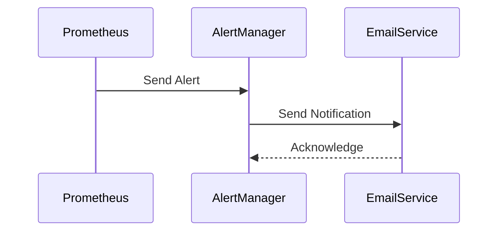

## Introduction to Prometheus and Alert Manager

Prometheus is an open-source monitoring system and time series database developed by SoundCloud. It collects and stores metrics from configured targets at regular intervals and then processes this data to provide valuable insights into the health and performance of your systems. One of the key components of the Prometheus ecosystem is the Alert Manager, which is responsible for managing and dispatching alerts based on the rules defined within Prometheus.

### What is Alert Manager?

Alert Manager is a component of the Prometheus monitoring system that handles the routing, deduplication, and escalation of alerts sent by Prometheus. It allows you to define rules for when alerts should be triggered and how those alerts should be delivered to the appropriate recipients. This ensures that you can quickly respond to issues as they arise, minimizing downtime and maintaining the reliability of your services.

### Why Use Alert Manager?

Using Alert Manager provides several benefits:

1. **Centralized Alert Management**: All alerts are managed through a single interface, making it easier to track and respond to issues.
2. **Flexible Routing**: You can route alerts to different recipients based on various criteria, such as severity, time of day, or specific teams.
3. **Deduplication and Grouping**: Alerts can be deduplicated and grouped to avoid overwhelming recipients with redundant notifications.
4. **Escalation Policies**: You can define escalation policies to ensure that critical alerts are addressed promptly, even if initial recipients are unavailable.

### How Does Alert Manager Work?

Alert Manager operates by receiving alerts from Prometheus and then processing them according to predefined rules. Here’s a high-level overview of the process:

1. **Alert Generation**: Prometheus generates alerts based on the rules defined in the `rules` section of the Prometheus configuration.
2. **Alert Sending**: These alerts are sent to Alert Manager, which then processes them according to the rules defined in the `alertmanager.yml` configuration file.
3. **Routing and Deduplication**: Alert Manager routes alerts to the appropriate recipients and deduplicates them to avoid sending duplicate notifications.
4. **Notification Delivery**: Finally, Alert Manager sends the notifications to the specified recipients, such as email, SMS, or other messaging services.

### Example Configuration

Let’s start by looking at a basic configuration for Alert Manager. Below is an example of an `alertmanager.yml` file:

```yaml
global:
  resolve_timeout: 5m

route:
  group_by: ['alertname']
  group_wait: 30s
  group_interval: 5m
  repeat_interval: 1h
  receiver: 'email'

receivers:
- name: 'email'
  email_configs:
  - to: 'admin@example.com'
```

In this configuration:

- `resolve_timeout`: Specifies the duration after which an alert is considered resolved if no further alerts are received.
- `route`: Defines the routing rules for alerts.
  - `group_by`: Groups alerts by the `alertname` label.
  - `group_wait`: Waits for 30 seconds before sending the first notification.
  - `group_interval`: Sends subsequent notifications every 5 minutes.
  - `repeat_interval`: Repeats the notification every hour.
- `receiver`: Specifies the receiver for the alerts, in this case, an email.

### Configuring Alert Rules in Prometheus

Before we dive into configuring alert rules, let’s understand the structure of an alert rule in Prometheus. An alert rule is defined in the `rules` section of the Prometheus configuration file (`prometheus.yml`). Here’s an example of an alert rule for CPU usage:

```yaml
rule_files:
  - "alert.rules"

alert.rules:
- alert: HighCPUUsage
  expr: sum(node_cpu_seconds_total{mode="idle"}) by (instance) < 0.5
  for: 5m
  labels:
    severity: "critical"
  annotations:
    summary: "High CPU Usage on {{ $labels.instance }}"
    description: "The idle CPU time on {{ $labels.instance }} is below 50% for more than 5 minutes."
```

In this rule:

- `alert`: The name of the alert.
- `expr`: The expression that defines the condition for triggering the alert. In this case, it checks if the idle CPU time is below 50%.
- `for`: The duration for which the condition must be true before the alert is triggered.
- `labels`: Additional labels that can be attached to the alert.
- `annotations`: Descriptive information about the alert, including a summary and a detailed description.

### Exploring Existing Alert Rules

Before creating our own alert rules, it’s useful to examine the existing alert rules that come with the Prometheus stack. These rules are typically found in the `rules` directory of the Prometheus installation.

To view these rules, navigate to the Prometheus UI and click on the “Alerts” tab. Here, you’ll see a list of already configured alerts grouped by their names. Each alert has a set of labels and annotations that provide additional context about the alert.

For example, you might see an alert named `InstanceDown`, which triggers when a target becomes unreachable. This alert would have labels such as `severity` and `instance`, and annotations providing a summary and description of the issue.

### Creating Custom Alert Rules

Now that we’ve explored the existing alert rules, let’s create our own custom alert rule for CPU usage. We’ll define an alert that triggers when the CPU usage exceeds 50%.

#### Step 1: Define the Alert Rule

First, we need to define the alert rule in the `alert.rules` file:

```yaml
- alert: HighCPUUsage
  expr: sum(node_cpu_seconds_total{mode!="idle"}) by (instance) > 0.5 * sum(node_cpu_seconds_total) by (instance)
  for: 5m
  labels:
    severity: "critical"
  annotations:
    summary: "High CPU Usage on {{ $labels.instance }}"
    description: "The non-idle CPU time on {{ $labels.instance }} is above 50% for more than  5 minutes."
```

In this rule:

- `expr`: The expression checks if the non-idle CPU time exceeds 50% of the total CPU time.
- `for`: The condition must be true for 5 minutes before the alert is triggered.
- `labels`: Adds a `severity` label to the alert.
- `annotations`: Provides a summary and description of the alert.

#### Step 2: Configure Alert Manager

Next, we need to configure Alert Manager to handle this alert. Open the `alertmanager.yml` file and add a new receiver for email notifications:

```yaml
receivers:
- name: 'email'
  email_configs:
  - to: 'admin@example.com'
```

Then, update the `route` section to include this receiver:

```yaml
route:
  group_by: ['alertname']
  group_wait: 30s
  group_interval: 5m
  repeat_interval: 1h
  receiver: 'email'
```

### Testing the Alert Rule

Once the alert rule and Alert Manager configuration are set up, you can test the alert by simulating high CPU usage on one of the nodes in your cluster. You can use tools like `stress` to generate CPU load:

```bash
stress --cpu 4 --timeout 300s
```

This command will generate CPU load on four cores for 300 seconds. After a few minutes, you should receive an email notification from Alert Manager indicating that the CPU usage has exceeded 50%.

### Common Pitfalls and Best Practices

When configuring alert rules and Alert Manager, there are several common pitfalls to avoid:

1. **Overloading Recipients**: Avoid sending too many alerts to the same recipient, as this can lead to alert fatigue.
2. **Incorrect Thresholds**: Ensure that the thresholds for triggering alerts are set appropriately to avoid false positives or negatives.
3. **Insufficient Labels and Annotations**: Use descriptive labels and annotations to provide context about the alert.
4. **Inconsistent Naming Conventions**: Use consistent naming conventions for alerts to make it easier to identify and manage them.

### How to Prevent / Defend

#### Detection

To detect misconfigurations or issues with alert rules and Alert Manager, you can use the following methods:

1. **Monitoring Alert Manager Metrics**: Prometheus exposes metrics about Alert Manager, which can be used to monitor its health and performance.
2. **Logging and Auditing**: Enable logging and auditing for Alert Manager to track changes and identify potential issues.

#### Prevention

To prevent issues with alert rules and Alert Manager, follow these best practices:

1. **Regularly Review and Update Alert Rules**: Periodically review and update alert rules to ensure they remain relevant and effective.
2. **Use Consistent Naming Conventions**: Use consistent naming conventions for alerts to make it easier to identify and manage them.
3. **Test Alert Rules Thoroughly**: Test alert rules thoroughly in a staging environment before deploying them to production.

#### Secure Coding Fixes

Here’s an example of a vulnerable alert rule and its secure counterpart:

**Vulnerable Alert Rule:**

```yaml
- alert: HighCPUUsage
  expr: sum(node_cpu_seconds_total{mode!="idle"}) by (instance) > 0.5 * sum(node_cpu_seconds_total) by (instance)
  for: 5m
  labels:
    severity: "critical"
  annotations:
    summary: "High CPU Usage on {{ $labels.instance }}"
    description: "The non-idle CPU time on {{ $labels.instance }} is above 50% for more than 5 minutes."
```

**Secure Alert Rule:**

```yaml
- alert: HighCPUUsage
  expr: sum(node_cpu_seconds_total{mode!="idle"}) by (instance) > 0.5 * sum(node_cpu_seconds_total) by (instance)
  for: 5m
  labels:
    severity: "critical"
  annotations:
    summary: "High CPU Usage on {{ $labels.instance }}"
    description: "The non-idle CPU time on {{ $labels.instance }} is above 50% for more than 5 minutes."
  # Add additional labels and annotations for better context
  labels:
    team: "operations"
    service: "web-server"
  annotations:
    runbook: "https://example.com/runbook/cpu-high-usage"
```

In the secure version, additional labels and annotations are added to provide better context and guidance for resolving the issue.

### Real-World Examples

#### Recent CVEs and Breaches

While Prometheus and Alert Manager themselves have not been the subject of major CVEs or breaches, they play a crucial role in detecting and responding to security incidents. For example, in the Equifax breach of 2017, timely alerts could have helped detect the unauthorized access to sensitive data.

#### Recent Real-World Example: Capital One Data Breach

In the Capital One data breach of 2019, an attacker exploited a misconfigured web application firewall to gain unauthorized access to sensitive customer data. Properly configured alert rules and Alert Manager could have detected unusual traffic patterns and alerted the security team in a timely manner.

### Complete Example: Full HTTP Request and Response

Here’s a complete example of a full HTTP request and response for configuring an alert rule in Prometheus:

**HTTP Request:**

```http
POST /api/v1/rules HTTP/1.1
Host: localhost:9090
Content-Type: application/json

{
  "groups": [
    {
      "name": "example",
      "rules": [
        {
          "alert": "HighCPUUsage",
          "expr": "sum(node_cpu_seconds_total{mode!=\"idle\"}) by (instance) > 0.5 * sum(node_cpu_seconds_total) by (instance)",
          "for": "5m",
          "labels": {
            "severity": "critical",
            "team": "operations",
            "service": "web-server"
          },
          "annotations": {
            "summary": "High CPU Usage on {{ $labels.instance }}",
            "description": "The non-idle CPU time on {{ $labels.instance }} is above 50% for more than 5 minutes.",
            "runbook": "https://example.com/runbook/cpu-high-usage"
          }
        }
      ]
    }
  ]
}
```

**HTTP Response:**

```http
HTTP/1.1 200 OK
Content-Type: application/json

{
  "status": "success",
  "data": {
    "alerts": [
      {
        "type": "alert",
        "name": "HighCPUUsage",
        "expr": "sum(node_cpu_seconds_total{mode!=\"idle\"}) by (instance) > 0.5 * sum(node_cpu_seconds_total) by (instance)",
        "for": "5m",
        "labels": {
          "severity": "critical",
          "team": "operations",
          "service": "web-server"
        },
        "annotations": {
          "summary": "High CPU Usage on {{ $labels.instance }}",
          "description": "The non-idle CPU time on {{ $labels.instance }} is above 50% for more than 5 minutes.",
          "runbook": "https://example.com/runbook/cpu-high-usage"
        }
      }
    ]
  }
}
```

### Mermaid Diagrams

#### Prometheus and Alert Manager Architecture


#### Alert Rule Flow



### Practice Labs

For hands-on practice with configuring alert rules in Prometheus and Alert Manager, consider the following labs:

- **PortSwigger Web Security Academy**: Offers a comprehensive set of labs covering various aspects of web security, including monitoring and alerting.
- **OWASP Juice Shop**: A deliberately insecure web application for security training, which includes scenarios for setting up monitoring and alerting.
- **DVWA (Damn Vulnerable Web Application)**: Another popular web application for security training, which can be used to practice setting up monitoring and alerting.

By following these steps and best practices, you can effectively configure alert rules in Prometheus and Alert Manager to ensure the health and performance of your systems.

---
<!-- nav -->
[[03-Introduction to Prometheus Alert Rules|Introduction to Prometheus Alert Rules]] | [[DevOps/DevOps Bootcamp/10-Monitoring & Alerting/03-Configuring Alert Rules In Prometheus For Cluster Monitoring/00-Overview|Overview]] | [[05-Configuring Alert Rules in Prometheus for Cluster Monitoring|Configuring Alert Rules in Prometheus for Cluster Monitoring]]
