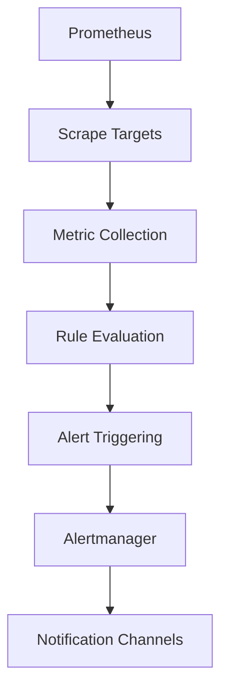
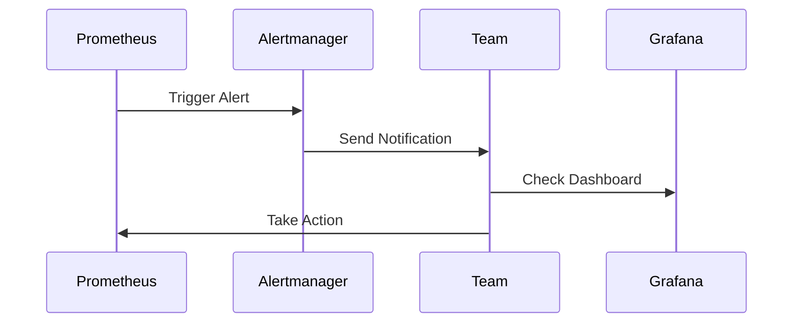

## Configuring Alert Rules in Prometheus

Prometheus is a powerful open-source monitoring system and time series database. It allows you to define alert rules that trigger notifications based on specific conditions.

### Background Theory

Prometheus uses a declarative approach to define alert rules. These rules are written in PromQL (Prometheus Query Language), which is a powerful query language designed specifically for querying time series data.

#### Key Concepts

1. **Metrics**: Data points collected by Prometheus, representing various aspects of the cluster's performance.
2. **Alert Rules**: Conditions defined using PromQL that determine when an alert should be triggered.
3. **Alertmanager**: A component of Prometheus that handles the routing and delivery of alerts to various notification channels.

### Setting Up Prometheus Alert Rules

To configure alert rules in Prometheus, you need to create a `rules.yml` file that defines the alert conditions. Here’s a step-by-step guide:

#### Step 1: Define Metrics

First, ensure that Prometheus is collecting the necessary metrics. For example, to monitor CPU usage, you might have a metric like `node_cpu_seconds_total`.

```yaml
# Example metric definition
metric {
  name: "node_cpu_seconds_total"
  help: "Total CPU time consumed."
}
```

#### Step 2: Create Alert Rules

Next, create alert rules in the `rules.yml` file. Each rule defines a condition that triggers an alert.

```yaml
groups:
- name: example
  rules:
  - alert: HighCPUUsage
    expr: sum(rate(node_cpu_seconds_total{mode="idle"}[5m])) by (instance) < 0.5
    for: 5m
    labels:
      severity: "critical"
    annotations:
      summary: "High CPU Usage on {{ $labels.instance }}"
      description: "The average idle CPU time on {{ $labels.instance }} is below 50% for the past 5 minutes."

  - alert: PodStartFailure
    expr: count(kube_pod_status_phase{phase!="Running"}) > 0
    for: 5m
    labels:
      severity: "critical"
    annotations:
      summary: "Pod Start Failure on {{ $labels.namespace }}"
      description: "One or more pods failed to start in the {{ $labels.namespace }} namespace."
```

#### Step 3: Configure Alertmanager

Alertmanager is responsible for routing and delivering alerts. You need to configure it to send notifications via email, Slack, etc.

```yaml
global:
  resolve_timeout: 5m

route:
  group_by: ['alertname']
  group_wait: 30s
  group_interval: 5m
  repeat_interval: 1h
  receiver: 'email'

receivers:
- name: 'email'
  email_configs:
  - to: 'team@example.com'
    from: 'alerts@example.com'
    smarthost: 'smtp.example.com:587'
    auth_username: 'alerts@example.com'
    auth_password: 'yourpassword'
    auth_secret: 'yoursecret'
```

### Full Example

Here’s a complete example of configuring Prometheus alert rules and Alertmanager:

#### Prometheus Configuration (`prometheus.yml`)

```yaml
scrape_configs:
  - job_name: 'example'
    static_configs:
      - targets: ['localhost:9100']

rule_files:
  - 'rules.yml'
```

#### Alert Rules (`rules.yml`)

```yaml
groups:
- name: example
  rules:
  - alert: HighCPUUsage
    expr: sum(rate(node_cpu_seconds_total{mode="idle"}[5m])) by (instance) < 0.5
    for: 5m
    labels:
      severity: "critical"
    annotations:
      summary: "High CPU Usage on {{ $labels.instance }}"
      description: "The average idle CPU time on {{ $labels.instance }} is below  50% for the past 5 minutes."

  - alert: PodStartFailure
    expr: count(kube_pod_status_phase{phase!="Running"}) > 0
    for: 5m
    labels:
      severity: "critical"
    annotations:
      summary: "Pod Start Failure on {{ $labels.namespace }}"
      description: "One or more pods failed to start in the {{ $labels.namespace }} namespace."
```

#### Alertmanager Configuration (`alertmanager.yml`)

```yaml
global:
  resolve_timeout: 5m

route:
  group_by: ['alertname']
  group_wait: 30s
  group_interval: 5m
  repeat_interval: 1h
  receiver: 'email'

receivers:
- name: 'email'
  email_configs:
  - to: 'team@example.com'
    from: 'alerts@example.com'
    smarthost: 'smtp.example.com:587'
    auth_username: 'alerts@example.com'
    auth_password: 'yourpassword'
    auth_secret: 'yoursecret'
```

### How to Prevent / Defend

#### Detection

To detect potential issues, regularly review the alert logs and Grafana dashboards. Ensure that all critical metrics are being monitored and that alert rules are correctly configured.

#### Prevention

1. **Regular Maintenance**: Perform regular maintenance on the cluster to ensure optimal performance.
2. **Resource Allocation**: Properly allocate resources to avoid overloading the cluster.
3. **Security Best Practices**: Follow security best practices to prevent unauthorized access and malicious activities.

#### Secure Coding Fixes

Compare the vulnerable and secure versions of the alert rules:

**Vulnerable Version**

```yaml
groups:
- name: example
  rules:
  - alert: HighCPUUsage
    expr: sum(rate(node_cpu_seconds_total{mode="idle"}[5m])) by (instance) < 0.5
    for: 5m
    labels:
      severity: "critical"
    annotations:
      summary: "High CPU Usage on {{ $labels.instance }}"
      description: "The average idle CPU time on {{ $labels.instance }} is below 50% for the past 5 minutes."
```

**Secure Version**

```yaml
groups:
- name: example
  rules:
  - alert: HighCPUUsage
    expr: sum(rate(node_cpu_seconds_total{mode="idle"}[5m])) by (instance) < 0.5
    for: 5m
    labels:
      severity: "critical"
    annotations:
      summary: "High CPU Usage on {{ $labels.instance }}"
      description: "The average idle CPU time on {{ $labels.instance }} is below 50% for the past 5 minutes."
    # Additional checks and validations
    - alert: PodStartFailure
      expr: count(kube_pod_status_phase{phase!="Running"}) > 0
      for: 5m
      labels:
        severity: "critical"
      annotations:
        summary: "Pod Start Failure on {{ $labels.namespace }}"
        description: "One or more pods failed to start in the {{ $labels.namespace }} namespace."
```

#### Configuration Hardening

Ensure that the Alertmanager configuration is hardened against unauthorized access:

```yaml
global:
  resolve_timeout: 5m

route:
  group_by: ['alertname']
  group_wait: 30s
  group_interval: 5m
  repeat_interval: 1h
  receiver: 'email'

receivers:
- name: 'email'
  email_configs:
  - to: 'team@example.com'
    from: 'alerts@example.com'
    smarthost: 'smtp.example.com:587'
    auth_username: 'alerts@example.com'
    auth_password: 'yourpassword'
    auth_secret: 'yoursecret'
```

### Real-World Examples

#### Recent CVEs/Breaches

- **CVE-2021-44228 (Log4j)**: This vulnerability could have been detected earlier if proper alerting mechanisms were in place. Regular monitoring and alerting would have alerted teams to unusual log activity.
- **SolarWinds Supply Chain Attack**: This attack could have been mitigated if the organization had robust alerting systems to detect anomalous behavior in their infrastructure.

### Mermaid Diagrams

#### Prometheus Architecture



#### Alert Flow



### Practice Labs

For hands-on practice with configuring alert rules in Prometheus, consider the following labs:

- **PortSwigger Web Security Academy**: Offers a comprehensive set of labs covering various aspects of web security, including monitoring and alerting.
- **OWASP Juice Shop**: A deliberately insecure web application for security training, which can be used to practice setting up monitoring and alerting systems.
- **DVWA (Damn Vulnerable Web Application)**: Another popular web application for security training, useful for practicing monitoring and alerting configurations.

By following these steps and best practices, you can effectively configure alert rules in Prometheus to ensure the health and stability of your cluster.

---
<!-- nav -->
[[05-Configuring Alert Rules in Prometheus for Cluster Monitoring|Configuring Alert Rules in Prometheus for Cluster Monitoring]] | [[DevOps/DevOps Bootcamp/10-Monitoring & Alerting/03-Configuring Alert Rules In Prometheus For Cluster Monitoring/00-Overview|Overview]] | [[DevOps/DevOps Bootcamp/10-Monitoring & Alerting/03-Configuring Alert Rules In Prometheus For Cluster Monitoring/07-Practice Questions & Answers|Practice Questions & Answers]]
