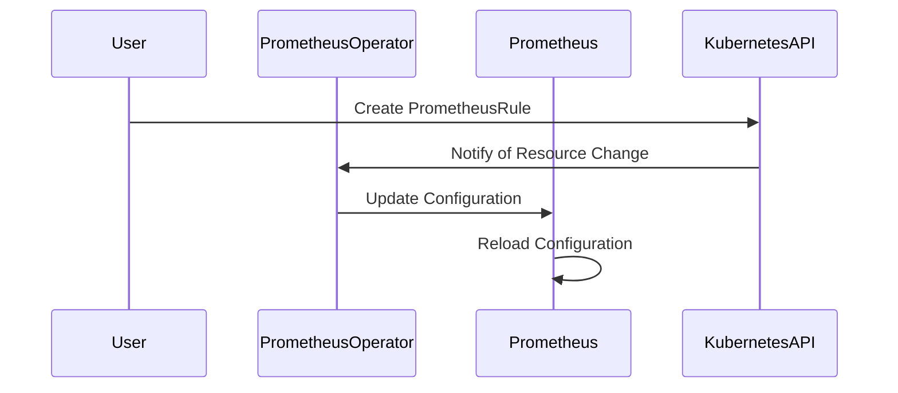

## Introduction to Prometheus and Prometheus Operator

Prometheus is an open-source systems monitoring and alerting toolkit originally built at SoundCloud. It is now a Cloud Native Computing Foundation (CNCF) project. Prometheus collects metrics from configured targets at specified intervals and stores them within a time series database. The data can be visualized and queried through the PromQL (Prometheus Query Language) interface. Prometheus is widely used in various environments, including Kubernetes clusters, due to its powerful querying capabilities and flexible alerting rules.

### Prometheus Configuration Outside Kubernetes

Before diving into the specifics of configuring Prometheus within a Kubernetes environment, it's important to understand how Prometheus operates outside of Kubernetes. In a non-Kubernetes setup, Prometheus runs as a standalone service and requires manual configuration. This involves editing the `prometheus.yml` configuration file, which contains all the necessary settings for scraping metrics from target services.

#### Example of Prometheus Configuration File

Here is an example of a basic `prometheus.yml` configuration file:

```yaml
# my_custom_prometheus.yml
global:
  scrape_interval: 15s

scrape_configs:
  - job_name: 'prometheus'
    static_configs:
      - targets: ['localhost:9090']

alerting:
  alertmanagers:
    - static_configs:
        - targets: ['localhost:9090']
```

In this configuration:
- `scrape_interval` specifies how often Prometheus should scrape metrics from the targets.
- `job_name` identifies the job being scraped.
- `static_configs` defines the targets to scrape.
- `alerting` section specifies the alert manager configurations.

To add an alert rule, you would typically define it in a separate file and reference it in the main configuration file. For example, you might have a `rules.yml` file:

```yaml
# rules.yml
groups:
  - name: example
    rules:
      - alert: HighRequestLatency
        expr: job:request_latency_seconds:mean5m{job="myjob"} > 0.5
        for: 10m
        labels:
          severity: page
        annotations:
          summary: High request latency on {{ $labels.job }}
          description: "{{ $labels.job }} has a mean request latency above 0.5 seconds for more than 10 minutes."
```

Then, you would include this file in your `prometheus.yml`:

```yaml
rule_files:
  - "rules.yml"
```

After making these changes, you would need to reload the Prometheus configuration manually to apply the new rules.

### Prometheus Operator and Custom Resources

The Prometheus Operator simplifies the management of Prometheus within a Kubernetes cluster. Instead of manually editing configuration files, the operator allows you to define Prometheus instances, alert rules, and recording rules as custom Kubernetes resources. These resources are then managed by the operator, which automatically updates the Prometheus configuration and reloads it as needed.

#### API Version and Custom Resources

The Prometheus Operator extends the Kubernetes API to allow the creation of custom resources. These resources are defined using a specific API version, which is `monitoring.coreos.com/v1`. This API version is used for defining Prometheus instances, alert rules, and other related resources.

Here is an example of a custom resource definition for an alert rule:

```yaml
apiVersion: monitoring.coreos.com/v1
kind: PrometheusRule
metadata:
  name: example-alert-rules
  namespace: monitoring
spec:
  groups:
    - name: example
      rules:
        - alert: HighRequestLatency
          expr: job:request_latency_seconds:mean5m{job="myjob"} > 0.5
          for: 10m
          labels:
            severity: page
          annotations:
            summary: High request latency on {{ $labels.job }}
            description: "{{ $labels.job }} has a mean request latency above 0.5 seconds for more than 10 minutes."
```

In this example:
- `apiVersion` specifies the API version for the Prometheus Operator.
- `kind` indicates the type of resource (`PrometheusRule` for alert rules).
- `metadata` includes the name and namespace of the resource.
- `spec` contains the actual alert rule definitions.

### How the Operator Works

When you create a custom resource like the one above, the Prometheus Operator watches for changes to these resources. When a change is detected, the operator updates the corresponding Prometheus configuration and triggers a reload. This process is automated, making it much easier to manage Prometheus within a Kubernetes environment.

#### Diagram of Prometheus Operator Workflow



### Benefits of Using Prometheus Operator

Using the Prometheus Operator provides several benefits:
- **Ease of Management**: You can manage Prometheus configurations using familiar Kubernetes tools and commands.
- **Automated Updates**: Changes to alert rules and other configurations are automatically applied and reloaded.
- **Consistency**: All configurations are stored as Kubernetes resources, ensuring consistency across different environments.

### Real-World Examples and Recent Breaches

While Prometheus itself is generally secure, misconfigurations and improper usage can lead to vulnerabilities. For example, in 2021, a misconfigured Prometheus instance exposed sensitive data from a Kubernetes cluster. This incident highlights the importance of proper configuration and access controls.

#### Secure Configuration Practices

To prevent such incidents, follow these best practices:
- **Limit Access**: Ensure that Prometheus has access only to the necessary metrics and namespaces.
- **Use RBAC**: Implement Role-Based Access Control (RBAC) to restrict access to Prometheus resources.
- **Secure Storage**: Store sensitive information securely and avoid exposing it in configuration files.

### How to Prevent / Defend

#### Detection

To detect potential issues with Prometheus configurations, you can use tools like `kube-prometheus` to audit your configurations. Additionally, regular security audits and penetration testing can help identify vulnerabilities.

#### Prevention

1. **Secure Configuration**:
   - Use RBAC to limit access to Prometheus resources.
   - Avoid exposing sensitive information in configuration files.

2. **Regular Audits**:
   - Perform regular security audits to ensure compliance with best practices.
   - Use tools like `kube-prometheus` to validate configurations.

3. **Monitoring and Alerts**:
   - Set up alerts to notify you of any unauthorized access attempts.
   - Monitor Prometheus logs for suspicious activity.

### Complete Example

Here is a complete example of setting up an alert rule using the Prometheus Operator:

#### Step 1: Define the Alert Rule

Create a `PrometheusRule` resource:

```yaml
apiVersion: monitoring.coreos.com/v1
kind: PrometheusRule
metadata:
  name: example-alert-rules
  namespace: monitoring
spec:
  groups:
    - name: example
      rules:
        - alert: HighRequestLatency
          expr: job:request_latency_seconds:mean5m{job="myjob"} > 0.5
          for: 10m
          labels:
            severity: page
          annotations:
            summary: High request latency on {{ $labels.job }}
            description: "{{ $labels.job }} has a mean request latency above 0.5 seconds for more than 10 minutes."
```

#### Step 2: Apply the Configuration

Apply the configuration using `kubectl`:

```sh
kubectl apply -f prometheus-rule.yaml
```

#### Step 3: Verify the Configuration

Verify that the configuration has been applied correctly:

```sh
kubectl get prometheusrule example-alert-rules -n monitoring
```

### Conclusion

Using the Prometheus Operator simplifies the management of Prometheus within a Kubernetes environment. By leveraging custom resources and automated updates, you can ensure that your Prometheus configurations are consistent and secure. Following best practices for configuration and access control can help prevent vulnerabilities and ensure the reliability of your monitoring system.

### Practice Labs

For hands-on practice with Prometheus and the Prometheus Operator, consider the following labs:
- **PortSwigger Web Security Academy**: Offers exercises on securing Prometheus and other monitoring tools.
- **Kubernetes Goat**: Provides scenarios for managing Prometheus within a Kubernetes environment.
- **CloudGoat**: Includes exercises on securing monitoring tools in cloud environments.

These labs provide practical experience in configuring and securing Prometheus within a Kubernetes cluster.

---
<!-- nav -->
[[02-Introduction to Prometheus and Alert Rules|Introduction to Prometheus and Alert Rules]] | [[DevOps/DevOps Bootcamp/10-Monitoring & Alerting/04-Configuring Alert Rules With Prometheus Operator/00-Overview|Overview]] | [[DevOps/DevOps Bootcamp/10-Monitoring & Alerting/04-Configuring Alert Rules With Prometheus Operator/04-Common Pitfalls and Best Practices|Common Pitfalls and Best Practices]]
