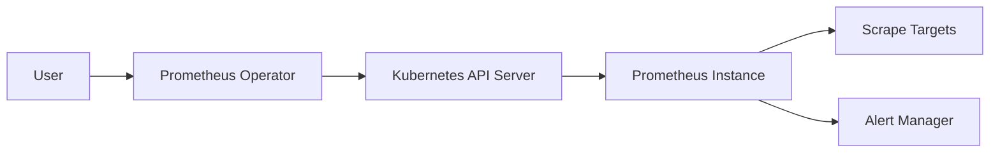
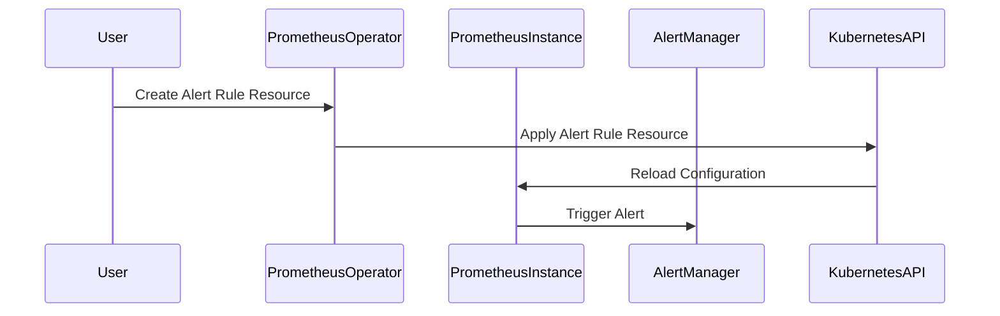

## Common Pitfalls and Best Practices

### Common Pitfalls

1. **Incorrect PromQL Expressions**: Ensure that the PromQL expressions in your alert rules are correct and cover the intended scenarios.
2. **Insufficient Labels and Annotations**: Properly label and annotate your alerts to provide meaningful context and facilitate easier triage.
3. **Overloading Prometheus**: Avoid defining too many complex and resource-intensive alert rules that could overload Prometheus.

### Best Practices

1. **Regularly Review and Update Alert Rules**: Periodically review and update your alert rules to ensure they remain relevant and effective.
2. **Use Labels and Annotations Effectively**: Utilize labels and annotations to provide additional context and improve the usability of your alerts.
3. **Monitor Prometheus Performance**: Regularly monitor the performance of Prometheus to ensure it can handle the load of your alert rules.

### How to Prevent / Defend

#### Detection

To detect issues with your alert rules, regularly review the Prometheus logs and UI. Look for any errors or warnings that indicate problems with the alert rules.

#### Prevention

1. **Validate PromQL Expressions**: Use tools like the Prometheus query browser to validate your PromQL expressions before deploying them.
2. **Test Alert Rules**: Before deploying alert rules in production, test them in a staging environment to ensure they work as expected.
3. **Monitor Prometheus Performance**: Set up monitoring for Prometheus itself to detect any performance issues that could affect the reliability of your alert rules.

#### Secure-Coding Fixes

Compare the vulnerable and secure versions of an alert rule configuration:

**Vulnerable Version**

```yaml
groups:
- name: example
  rules:
  - alert: HostHighCPULoad
    expr: sum(rate(node_cpu_seconds_total{mode="idle"}[5m])) BY (instance) < 0.5
    for: 5m
    labels:
      severity: critical
    annotations:
      summary: "Host high CPU load on {{ $labels.instance }}"
      description: "The average idle CPU time is below 50% for more than 5 minutes."
```

**Secure Version**

```yaml
groups:
- name: example
  rules:
  - alert: HostHighCPULoad
    expr: sum(rate(node_cpu_seconds_total{mode="idle"}[5m])) BY (instance) < 0.5
    for: 5m
    labels:
      severity: critical
    annotations:
      summary: "Host high CPU load on {{ $labels.instance }}"
      description: "The average idle CPU time is below 50% for more than 5 minutes."
    # Add additional validation and testing steps
```

### Configuration Hardening

1. **Limit Alert Rule Complexity**: Keep alert rules simple and avoid overly complex PromQL expressions.
2. **Use Labels and Annotations**: Ensure that all alerts have meaningful labels and annotations to provide context.
3. **Monitor Prometheus Performance**: Set up monitoring for Prometheus to detect and address any performance issues.

### Complete Example

Here is a complete example of configuring alert rules with Prometheus Operator:

#### Step 1: Install Prometheus Operator

```bash
helm repo add prometheus-community https://prometheus-community.github.io/helm-charts
helm repo update
helm install prometheus-operator prometheus-community/prometheus-operator --namespace monitoring --create-namespace
```

#### Step 2: Create Alert Rule Resource

```yaml
apiVersion: monitoring.coreos.com/v1
kind: PrometheusRule
metadata:
  name: example-rules
  namespace: monitoring
spec:
  groups:
  - name: example
    rules:
    - alert: HostHighCPULoad
      expr: sum(rate(node_cpu_seconds_total{mode="idle"}[5m])) BY (instance) < 0.5
      for: 5m
      labels:
        severity: critical
      annotations:
        summary: "Host high CPU load on {{ $labels.instance }}"
        description: "The average idle CPU time is below 50% for more than 5 minutes."
    - alert: PodCrashLooping
      expr: count(kube_pod_container_status_restarts_total{job="kube-state-metrics"}) > 0
      for: 5m
      labels:
        severity: warning
      annotations:
        summary: "Pod crash looping"
        description: "One or more pods are experiencing frequent restarts."
```

#### Step 3: Verify Alert Rule Configuration

```bash
kubectl logs -n monitoring <prometheus-pod-name> | grep "completed loading of configuration file"
```

### Mermaid Diagrams

#### Prometheus Operator Architecture



#### Alert Rule Flow



### Practice Labs

For hands-on practice with configuring alert rules using Prometheus Operator, consider the following labs:

- **PortSwigger Web Security Academy**: Offers exercises on setting up monitoring and alerting for web applications.
- **OWASP Juice Shop**: Provides a vulnerable web application for practicing security monitoring and alerting.
- **CloudGoat**: Focuses on cloud security and includes exercises on setting up monitoring and alerting in cloud environments.

By following these detailed steps and best practices, you can effectively configure and manage alert rules using Prometheus Operator, ensuring robust monitoring and incident management in your DevOps environment.

---
<!-- nav -->
[[03-Introduction to Prometheus and Prometheus Operator|Introduction to Prometheus and Prometheus Operator]] | [[DevOps/DevOps Bootcamp/10-Monitoring & Alerting/04-Configuring Alert Rules With Prometheus Operator/00-Overview|Overview]] | [[05-Configuring Alert Rules with Prometheus Operator|Configuring Alert Rules with Prometheus Operator]]
