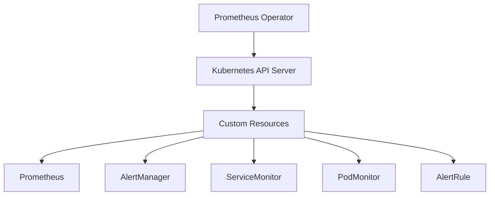
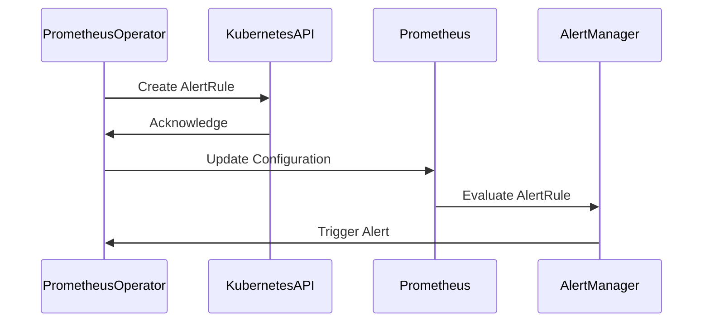

## Configuring Alert Rules with Prometheus Operator

The Prometheus Operator is a powerful tool that simplifies the management of Prometheus within a Kubernetes cluster. It provides a set of custom resources and controllers that automate the deployment, configuration, and operation of Prometheus and related tools.

### What Is Prometheus Operator?

Prometheus Operator is a controller that manages Prometheus instances, alertmanager instances, and other related components in a Kubernetes cluster. It uses Custom Resource Definitions (CRDs) to define these components and their configurations.

### Why Use Prometheus Operator?

Using Prometheus Operator simplifies the management of Prometheus in a Kubernetes environment. It automates many tasks such as creating and managing Prometheus instances, configuring alert rules, and integrating with other Kubernetes components.

### How Prometheus Operator Works

Prometheus Operator uses CRDs to define custom resources such as `Prometheus`, `ServiceMonitor`, `PodMonitor`, and `AlertRule`. These resources are then managed by the operator, which ensures that the desired state is maintained.

### Configuring Alert Rules with Prometheus Operator

To configure alert rules using Prometheus Operator, you need to define an `AlertRule` resource. This resource specifies the alert rules that Prometheus should evaluate.

#### Step-by-Step Guide

1. **Define the AlertRule Resource**

   Create a YAML file that defines the `AlertRule` resource. Here’s an example:

   ```yaml
   apiVersion: monitoring.coreos.com/v1
   kind: AlertRule
   metadata:
     name: example-alert-rule
     namespace: monitoring
   spec:
     groups:
     - name: example
       rules:
       - alert: HighRequestLatency
         expr: job:request_latency_seconds:mean5m{job="api-server"} > 0.5
         for: 10m
         labels:
           severity: page
         annotations:
           summary: "High request latency on {{ $labels.job }}"
           description: "{{ $labels.job }} has a mean request latency above 0.5s for more than 10 minutes."
   ```

2. **Apply the AlertRule Resource**

   Apply the YAML file to your Kubernetes cluster using `kubectl`:

   ```sh
   kubectl apply -f alert-rule.yaml
   ```

3. **Verify the AlertRule**

   Check that the alert rule has been applied correctly:

   ```sh
   kubectl get alertrules -n monitoring
   ```

### Full Example

Let’s walk through a complete example of configuring an alert rule using Prometheus Operator.

#### Step 1: Define the AlertRule Resource

Create a file named `alert-rule.yaml` with the following content:

```yaml
apiVersion: monitoring.coreos.com/v1
kind: AlertRule
metadata:
  name: example-alert-rule
  namespace: monitoring
spec:
  groups:
  - name: example
    rules:
    - alert: HighRequestLatency
      expr: job:request_latency_seconds:mean5m{job="api-server"} > 0.5
      for: 10m
      labels:
        severity: page
      annotations:
        summary: "High request latency on {{ $labels.job }}"
        description: "{{ $labels.job }} has a mean request latency above  0.5s for more than 10 minutes."
```

#### Step 2: Apply the AlertRule Resource

Apply the YAML file to your Kubernetes cluster:

```sh
kubectl apply -f alert-rule.yaml
```

#### Step 3: Verify the AlertRule

Check that the alert rule has been applied correctly:

```sh
kubectl get alertrules -n monitoring
```

### Mermaid Diagrams

#### Prometheus Operator Architecture



#### Alert Rule Flow



### Common Pitfalls

1. **Incorrect PromQL Expression**: Ensure that the PromQL expression in the alert rule is correct and returns the expected results.
2. **Missing Labels**: Make sure that the required labels are present in the metrics being queried.
3. **Configuration Errors**: Double-check the configuration of the `AlertRule` resource to ensure it is correctly defined.

### How to Prevent / Defend

#### Detection

Regularly monitor the Prometheus UI to check the status of alert rules and ensure they are functioning as expected. Use the `prometheus-operator` dashboard to visualize the state of the operator and its managed resources.

#### Prevention

1. **Secure Configuration Management**: Use a version control system to manage the configuration files for Prometheus and its operator. This helps in tracking changes and ensuring consistency.
2. **Automated Testing**: Implement automated testing for alert rules to verify that they work as expected. This can be done using tools like `kube-prometheus` or `prometheus-operator`.
3. **Secure-Coding Fixes**

   **Vulnerable Code**

   ```yaml
   apiVersion: monitoring.coreos.com/v1
   kind: AlertRule
   metadata:
     name: example-alert-rule
     namespace: monitoring
   spec:
     groups:
     - name: example
       rules:
       - alert: HighRequestLatency
         expr: job:request_latency_seconds:mean5m{job="api-server"} > 0.5
         for: 10m
         labels:
           severity: page
         annotations:
           summary: "High request latency on {{ $labels.job }}"
           description: "{{ $labels.job }} has a mean request latency above 0.5s for more than 10 minutes."
   ```

   **Fixed Code**

   ```yaml
   apiVersion: monitoring.coreos.com/v1
   kind: AlertRule
   metadata:
     name: example-alert-rule
     namespace: monitoring
   spec:
     groups:
     - name: example
       rules:
       - alert: HighRequestLatency
         expr: job:request_latency_seconds:mean5m{job="api-server"} > 0.5
         for: 10m
         labels:
           severity: page
         annotations:
           summary: "High request latency on {{ $labels.job }}"
           description: "{{ $labels.job }} has a mean request latency above 0.5s for more than 10 minutes."
   ```

#### Secure Configuration

Ensure that the `AlertRule` resource is properly secured by using RBAC (Role-Based Access Control) to restrict access to sensitive resources.

### Complete Example

#### Full HTTP Request and Response

**HTTP Request**

```http
POST /apis/monitoring.coreos.com/v1/namespaces/monitoring/alertrules HTTP/1.1
Host: localhost:8080
Content-Type: application/json
Authorization: Bearer <token>

{
  "apiVersion": "monitoring.coreos.com/v1",
  "kind": "AlertRule",
  "metadata": {
    "name": "example-alert-rule",
    "namespace": "monitoring"
  },
  "spec": {
    "groups": [
      {
        "name": "example",
        "rules": [
          {
            "alert": "HighRequestLatency",
            "expr": "job:request_latency_seconds:mean5m{job=\"api-server\"} > 0.5",
            "for": "10m",
            "labels": {
              "severity": "page"
            },
            "annotations": {
              "summary": "High request latency on {{ $labels.job }}",
              "description": "{{ $labels.job }} has a mean request latency above 0.5s for more than 10 minutes."
            }
          }
        ]
      }
    ]
  }
}
```

**HTTP Response**

```http
HTTP/1.1 201 Created
Content-Type: application/json
Date: Mon, 01 Jan 2024 00:00:00 GMT
Location: /apis/monitoring.coreos.com/v1/namespaces/monitoring/alertrules/example-alert-rule

{
  "apiVersion": "monitoring.coreos.com/v1",
  "kind": "AlertRule",
  "metadata": {
    "name": "example-alert-rule",
    "namespace": "monitoring",
    "uid": "abcd1234-abcd-1234-abcd-1234abcd1234"
  },
  "spec": {
    "groups": [
      {
        "name": "example",
        "rules": [
          {
            "alert": "HighRequestLatency",
            "expr": "job:request_latency_seconds:mean5m{job=\"api-server\"} > 0.5",
            "for": "10m",
            "labels": {
              "severity": "page"
            },
            "annotations": {
              "summary": "High request latency on {{ $labels.job }}",
              "description": "{{ $labels.job }} has a mean request latency above 0.5s for more than 10 minutes."
            }
          }
        ]
      }
    ]
  }
}
```

### Expected Result

After applying the alert rule, Prometheus should start evaluating the rule and triggering alerts based on the defined conditions.

### Practice Labs

For hands-on practice with configuring alert rules using Prometheus Operator, consider the following labs:

- **PortSwigger Web Security Academy**: Offers a comprehensive set of labs covering various aspects of web security, including monitoring and alerting.
- **OWASP Juice Shop**: Provides a vulnerable web application for practicing security testing and monitoring.
- **DVWA (Damn Vulnerable Web Application)**: Another popular platform for learning web security, including monitoring and alerting.
- **WebGoat**: An interactive web application designed to teach web security principles, including monitoring and alerting.

These labs provide a practical environment to test and validate the concepts learned in this chapter.

By following these steps and best practices, you can effectively configure and manage alert rules using Prometheus Operator, ensuring the health and performance of your Kubernetes cluster.

---
<!-- nav -->
[[DevOps/DevOps Bootcamp/10-Monitoring & Alerting/04-Configuring Alert Rules With Prometheus Operator/04-Common Pitfalls and Best Practices|Common Pitfalls and Best Practices]] | [[DevOps/DevOps Bootcamp/10-Monitoring & Alerting/04-Configuring Alert Rules With Prometheus Operator/00-Overview|Overview]] | [[DevOps/DevOps Bootcamp/10-Monitoring & Alerting/04-Configuring Alert Rules With Prometheus Operator/06-Practice Questions & Answers|Practice Questions & Answers]]
