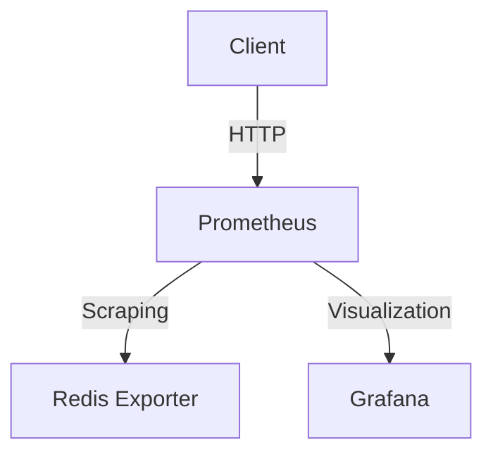
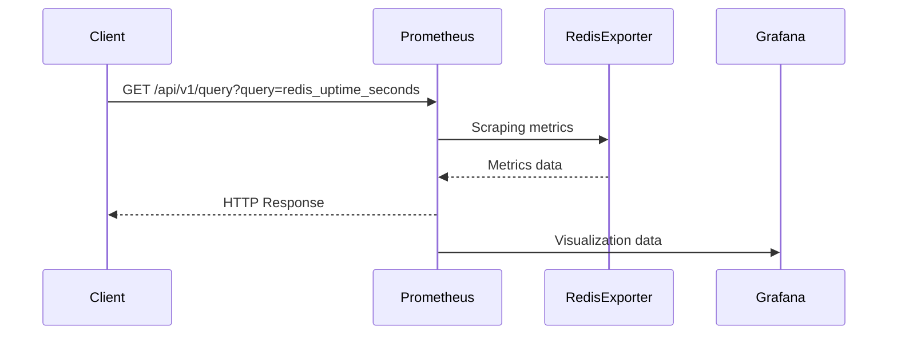

## Introduction to Redis Monitoring and Alert Rules

Redis is an in-memory data structure store, used as a database, cache, and message broker. Effective monitoring and alerting are crucial for maintaining the reliability and performance of Redis instances. This chapter delves into creating alert rules for Redis monitoring using Prometheus and Grafana, two popular open-source tools for monitoring and visualization.

### Background Theory

#### What is Redis?
Redis is a key-value store that supports various data structures such as strings, hashes, lists, sets, and sorted sets. It is widely used for caching, session management, and real-time analytics due to its high performance and low latency.

#### Why Monitor Redis?
Monitoring Redis helps in identifying issues such as high memory usage, slow operations, and connectivity problems. By setting up alerts, you can proactively address these issues before they affect your applications.

#### What is Prometheus?
Prometheus is an open-source systems monitoring and alerting toolkit. It collects metrics from configured targets at specified intervals and stores them in a time series database. Prometheus provides a flexible query language called PromQL to analyze the collected metrics.

#### What is Grafana?
Grafana is an open-source platform for monitoring and observability. It allows you to visualize data from multiple sources, including Prometheus, and create custom dashboards. Grafana integrates seamlessly with Prometheus to provide rich visualizations and alerting capabilities.

### Setting Up Prometheus and Grafana for Redis Monitoring

To monitor Redis effectively, you need to set up Prometheus to scrape metrics from Redis and configure Grafana to visualize these metrics.

#### Installing Prometheus and Grafana
First, install Prometheus and Grafana on your system. You can download the binaries from their respective websites or use package managers like `apt` or `yum`.

```bash
# Install Prometheus
wget https://github.com/prometheus/prometheus/releases/download/v2.37.0/prometheus-2.37.0.linux-amd64.tar.gz
tar xvfz prometheus-2.37.0.linux-amd64.tar.gz
cd prometheus-2.37.0.linux-amd64

# Install Grafana
wget https://dl.grafana.com/oss/release/grafana-8.5.2.linux-amd64.tar.gz
tar xvfz grafana-8.5.2.linux-amd64.tar.gz
cd grafana-8.5.2
```

#### Configuring Prometheus
Next, configure Prometheus to scrape metrics from Redis. You need to install the `prometheus_exporter` for Redis and update the Prometheus configuration file (`prometheus.yml`).

```yaml
# prometheus.yml
scrape_configs:
  - job_name: 'redis'
    static_configs:
      - targets: ['localhost:9121']
```

In this configuration, Prometheus scrapes metrics from the Redis exporter running on port 9121.

#### Configuring Grafana
Start Grafana and configure it to use Prometheus as the data source. Navigate to `Configuration > Data Sources` and add a new data source with the following settings:

- **Name**: Prometheus
- **Type**: Prometheus
- **URL**: http://localhost:9090

### Creating Alert Rules for Redis Monitoring

Alert rules in Prometheus allow you to define conditions that trigger alerts when certain metrics exceed predefined thresholds. Here’s how to create alert rules for Redis monitoring.

#### Uptime Metric
The uptime metric measures how long the Redis application has been running and available. This is crucial for ensuring high availability.

```promql
# Alert rule for Redis uptime
ALERT RedisUptimeLow
IF redis_uptime_seconds < 3600
FOR 5m
LABELS { severity="critical" }
ANNOTATIONS { description="Redis uptime is less than 1 hour.", summary="Redis instance has been running for less than 1 hour." }
```

This alert triggers if the Redis uptime is less than one hour for more than five minutes.

#### Number of Clients Connected
The number of clients connected to Redis is another important metric. High client counts can indicate load issues or potential denial-of-service attacks.

```promql
# Alert rule for Redis connected clients
ALERT RedisClientsHigh
IF redis_connected_clients > 1000
FOR 5m
LABELS { severity="warning" }
ANNOTATIONS { description="Number of connected clients exceeds 1000.", summary="Redis instance has more than 1000 connected clients." }
```

This alert triggers if the number of connected clients exceeds 1000 for more than five minutes.

### Visualizing Metrics in Grafana

Grafana provides a powerful interface to visualize Prometheus metrics. You can create custom dashboards to monitor Redis metrics.

#### Creating a Dashboard
1. Log in to Grafana and navigate to `Create > Dashboard`.
2. Add a new panel by clicking the `+` icon.
3. Select `Prometheus` as the data source.
4. Enter the PromQL query for the desired metric, e.g., `redis_uptime_seconds`.

```promql
# Example PromQL query for Redis uptime
redis_uptime_seconds
```

5. Customize the panel settings such as title, legend, and visualization type.

### Real-World Examples and Recent CVEs

#### Example: High Memory Usage
A common issue with Redis is high memory usage, which can lead to out-of-memory errors. In a real-world scenario, a company might experience a sudden spike in memory usage due to a bug in their application.

**CVE Example**: CVE-2021-21235 - Redis Memory Exhaustion Vulnerability
This vulnerability allowed attackers to exhaust Redis memory by sending specially crafted commands. Proper monitoring and alerting could have helped detect and mitigate this issue.

### How to Prevent / Defend

#### Detection
Use Prometheus and Grafana to monitor critical Redis metrics such as memory usage, uptime, and connected clients. Set up alert rules to notify you when these metrics exceed predefined thresholds.

#### Prevention
1. **Limit Memory Usage**: Configure Redis to limit its maximum memory usage.
2. **Regular Audits**: Perform regular audits of Redis configurations and application code to identify potential issues.
3. **Secure Coding Practices**: Follow secure coding practices to prevent vulnerabilities such as memory exhaustion.

#### Secure-Coding Fixes

**Vulnerable Code**
```python
import redis

r = redis.Redis(host='localhost', port=6379, db=0)
r.set('key', 'value')
```

**Secure Code**
```python
import redis

r = redis.Redis(host='localhost', port=6379, db=0, maxmemory=100000000)
r.set('key', 'value')
```

In the secure code, the `maxmemory` parameter limits Redis memory usage to 100MB.

### Configuration Hardening

#### Redis Configuration
Ensure your Redis configuration file (`redis.conf`) includes security-hardening settings.

```conf
# redis.conf
maxmemory 100mb
maxmemory-policy allkeys-lru
requirepass your_password
```

#### Prometheus Configuration
Update the Prometheus configuration file (`prometheus.yml`) to include additional scraping targets and alert rules.

```yaml
# prometheus.yml
alerting:
  alertmanagers:
    - static_configs:
        - targets:
          - localhost:9093

rule_files:
  - "rules/*.yml"
```

### Complete Example

#### Full HTTP Request and Response

**HTTP Request**
```http
GET /api/v1/query?query=redis_uptime_seconds HTTP/1.1
Host: localhost:9090
Accept: application/json
```

**HTTP Response**
```http
HTTP/1.1 200 OK
Content-Type: application/json

{
  "status": "success",
  "data": {
    "resultType": "vector",
    "result": [
      {
        "metric": {},
        "value": [1677859200, "3600"]
      }
    ]
  }
}
```

### Mermaid Diagrams

#### Network Topology


#### Request/Response Flow


### Practice Labs

For hands-on practice, consider the following labs:

- **PortSwigger Web Security Academy**: Offers a comprehensive course on web security, including sections on monitoring and alerting.
- **OWASP Juice Shop**: A deliberately insecure web application for security training. It includes features for monitoring and alerting.
- **DVWA (Damn Vulnerable Web Application)**: Another popular web application for security training, which can be used to practice monitoring and alerting techniques.

By following this detailed guide, you will be able to effectively monitor and alert on Redis instances using Prometheus and Grafana, ensuring the reliability and performance of your Redis deployments.

---
<!-- nav -->
[[DevOps/DevOps Bootcamp/10-Monitoring & Alerting/05-Creating Alert Rules for Redis Monitoring/00-Overview|Overview]] | [[02-Introduction to Redis Monitoring and Alerting|Introduction to Redis Monitoring and Alerting]]
