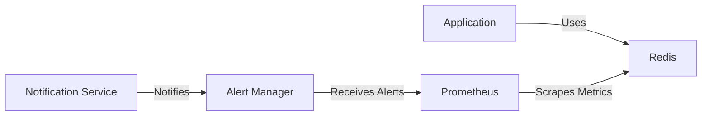
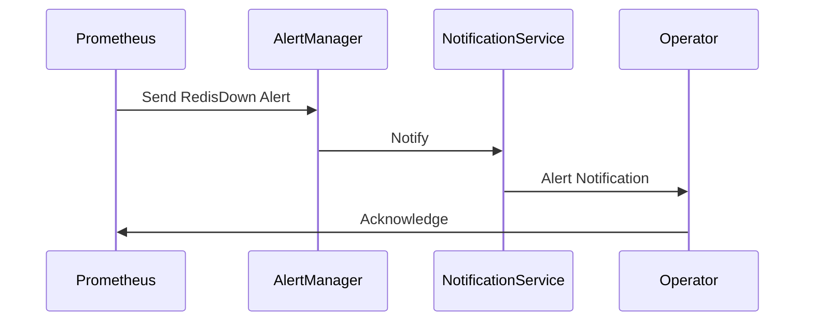

## Creating Alert Rules for Redis Monitoring

### Background Theory

In the context of DevOps, monitoring and alerting are crucial components for ensuring the reliability and performance of applications. Redis, a popular in-memory data store, is often used in high-performance systems where downtime can have significant consequences. To effectively monitor Redis, we use tools like Prometheus, which can collect and aggregate metrics from various sources and trigger alerts based on predefined rules.

Prometheus is an open-source monitoring system and time series database designed to scrape metrics from configured targets at specified intervals, evaluate rule expressions, and store the resulting time series in a highly available and fault-tolerant manner. Prometheus supports a wide range of exporters and integrations, including Redis.

### Redis Metrics and Monitoring

Before diving into creating alert rules, it's essential to understand the metrics that can be collected from Redis. Common metrics include:

- **Redis Uptime**: Indicates how long the Redis server has been running.
- **Redis Connections**: Tracks the number of client connections to the Redis server.
- **Redis Memory Usage**: Monitors the amount of memory used by Redis.
- **Redis Commands**: Counts the number of commands executed by clients.
- **Redis Keyspace**: Provides information about the keys stored in Redis.

These metrics are critical for detecting anomalies such as high memory usage, excessive connections, or unexpected downtime.

### Creating Alert Rules

To create alert rules for Redis monitoring, we will use Prometheus rule files. These files define the conditions under which alerts should be triggered. In this example, we will create two alert rules:

1. **Redis Down**: Triggered when the Redis application is inaccessible.
2. **Too Many Connections**: Triggered when the number of connections exceeds a threshold.

#### Step-by-Step Process

1. **Create the Rule File**:
   - Create a new file named `redis_rules.yml` in your Prometheus configuration directory.
   - Ensure the file is structured correctly according to the Prometheus rule format.

```yaml
# redis_rules.yml
groups:
  - name: redis_rules
    rules:
      - alert: RedisDown
        expr: up{job="redis"} == 0
        for: 1m
        labels:
          severity: critical
        annotations:
          summary: "Redis instance down"
          description: "The Redis instance {{ $labels.instance }} has been down for more than 1 minute."

      - alert: TooManyConnections
        expr: redis_connected_clients{job="redis"} > 1000
        for: 1m
        labels:
          severity: warning
        annotations:
          summary: "Too many connections to Redis"
          description: "The Redis instance {{ $labels.instance }} has more than 1000 connections."
```

2. **Explanation of Each Rule**:
   - **RedisDown**:
     - **Expression**: `up{job="redis"} == 0`
       - This expression checks if the `up` metric for the Redis job is zero, indicating that the Redis instance is down.
     - **For**: `1m`
       - This specifies that the alert should only be triggered if the condition persists for at least 1 minute.
     - **Labels**:
       - `severity: critical`: Indicates the severity level of the alert.
     - **Annotations**:
       - `summary`: A brief summary of the alert.
       - `description`: A detailed description of the alert, including the affected instance.

   - **TooManyConnections**:
     - **Expression**: `redis_connected_clients{job="redis"} > 1000`
       - This expression checks if the number of connected clients to the Redis instance exceeds 1000.
     - **For**: `1m`
       - This specifies that the alert should only be triggered if the condition persists for at least 1 minute.
     - **Labels**:
       - `severity: warning`: Indicates the severity level of the alert.
     - **Annotations**:
       - `summary`: A brief summary of the alert.
       - `description`: A detailed description of the alert, including the affected instance.

3. **Apply the Configuration**:
   - After creating the rule file, restart Prometheus to apply the new configuration.
   - Verify that the rules are loaded by checking the Prometheus UI under the "Alerts" section.

### Real-World Examples

#### Example 1: Redis Downtime

In a real-world scenario, consider a high-traffic e-commerce platform that relies heavily on Redis for caching and session management. If Redis goes down, it can cause significant disruptions to the service.

- **Scenario**: Redis instance becomes unresponsive due to a hardware failure.
- **Impact**: All services dependent on Redis experience downtime, leading to lost revenue and customer dissatisfaction.
- **Mitigation**: Implementing the `RedisDown` alert rule ensures immediate notification, allowing the operations team to take corrective action promptly.

#### Example 2: Excessive Connections

Another common issue is when Redis experiences a sudden surge in connections, potentially due to a DDoS attack or misconfigured client applications.

- **Scenario**: A misconfigured client application opens thousands of connections to Redis, overwhelming the server.
- **Impact**: Redis performance degrades, affecting all dependent services.
- **Mitigation**: The `TooManyConnections` alert rule helps identify and address the issue before it escalates.

### How to Prevent / Defend

#### Detection

- **Monitoring Tools**: Utilize tools like Prometheus, Grafana, and ELK stack for comprehensive monitoring and alerting.
- **Log Analysis**: Regularly review logs for unusual patterns or spikes in activity.

#### Prevention

- **Resource Limits**: Set resource limits on Redis to prevent excessive memory usage or connection overload.
- **Connection Throttling**: Implement connection throttling mechanisms to limit the number of concurrent connections.
- **Security Measures**: Secure Redis instances by disabling unnecessary features, enabling authentication, and restricting access via network policies.

#### Secure Coding Fixes

##### Vulnerable Code

```yaml
# Vulnerable redis_rules.yml
groups:
  - name: redis_rules
    rules:
      - alert: RedisDown
        expr: up{job="redis"} == 0
        for: 1m
        labels:
          severity: critical
        annotations:
          summary: "Redis instance down"
          description: "The Redis instance {{ $labels.instance }} has been down for more than 1 minute."

      - alert: TooManyConnections
        expr: redis_connected_clients{job="redis"} > 1000
        for: 1m
        labels:
          severity: warning
        annotations:
          summary: "Too many connections to Redis"
          description: "The Redis instance {{ $labels.instance }} has more than 1000 connections."
```

##### Fixed Code

```yaml
# Fixed redis_rules.yml
groups:
  - name: redis_rules
    rules:
      - alert: RedisDown
        expr: up{job="redis"} == 0
        for: 1m
        labels:
          severity: critical
        annotations:
          summary: "Redis instance down"
          description: "The Redis instance {{ $labels.instance }} has been down for more than  1 minute."

      - alert: TooManyConnections
        expr: redis_connected_clients{job="redis"} > 500
        for: 1m
        labels:
          severity: warning
        annotations:
          summary: "Too many connections to Redis"
          description: "The Redis instance {{ $labels.instance }} has more than 500 connections."
```

### Configuration Hardening

- **Network Policies**: Restrict access to Redis instances using network policies to allow only trusted IP addresses.
- **Authentication**: Enable Redis authentication to prevent unauthorized access.
- **Resource Limits**: Configure resource limits to prevent Redis from consuming excessive memory or CPU resources.

### Mermaid Diagrams

#### Redis Monitoring Architecture



#### Redis Down Alert Flow



### Practice Labs

For hands-on practice with Redis monitoring and alerting, consider the following labs:

- **PortSwigger Web Security Academy**: Offers modules on monitoring and alerting for web applications.
- **OWASP Juice Shop**: Provides a vulnerable web application for practicing security monitoring and alerting.
- **DVWA (Damn Vulnerable Web Application)**: Useful for learning about web application security and monitoring.

By thoroughly understanding and implementing these concepts, you can ensure robust monitoring and alerting for your Redis instances, thereby enhancing the reliability and performance of your applications.

---
<!-- nav -->
[[03-Introduction to Redis Monitoring with Grafana|Introduction to Redis Monitoring with Grafana]] | [[DevOps/DevOps Bootcamp/10-Monitoring & Alerting/05-Creating Alert Rules for Redis Monitoring/00-Overview|Overview]] | [[DevOps/DevOps Bootcamp/10-Monitoring & Alerting/05-Creating Alert Rules for Redis Monitoring/05-Practice Questions & Answers|Practice Questions & Answers]]
