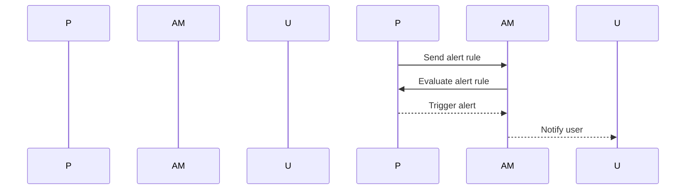

## Creating Custom Alert Rules for Kubernetes Monitoring

In the context of Kubernetes monitoring, creating custom alert rules is crucial for maintaining the health and performance of your cluster. These alerts help you identify issues proactively and take corrective actions before they escalate into major problems. This section will delve deep into the process of creating custom alert rules, including best practices, recent real-world examples, and comprehensive code snippets.

### Understanding Alert Rules in Kubernetes

Alert rules in Kubernetes are defined using Prometheus, a popular open-source monitoring system. Prometheus collects metrics from various sources within the Kubernetes cluster and evaluates them against predefined rules to trigger alerts.

#### Components of an Alert Rule

An alert rule typically consists of:

1. **Expression**: A PromQL (Prometheus Query Language) expression that defines the condition under which the alert should be triggered.
2. **Labels**: Key-value pairs that provide metadata about the alert.
3. **Annotations**: Additional information that can be used to describe the alert in more detail.

#### Example of an Alert Rule

Here’s a basic example of an alert rule that triggers when the CPU usage of a pod exceeds 80%:

```yaml
groups:
- name: example
  rules:
  - alert: HighCPUUsage
    expr: sum(rate(container_cpu_usage_seconds_total{pod!="",container!=""}[5m])) BY (pod) > 0.8
    for: 5m
    labels:
      severity: critical
    annotations:
      summary: "High CPU Usage"
      description: "Pod {{ $labels.pod }} has high CPU usage (> 80%) for the past 5 minutes."
```

### Adding Runbook URLs to Alerts

One of the best practices in creating alert rules is to include a runbook URL that provides detailed steps for resolving the issue. This ensures that the team responding to the alert has immediate access to the necessary information.

#### Why Include Runbook URLs?

Including a runbook URL in your alert rules serves several purposes:

1. **Immediate Action**: Responders can quickly access the steps needed to resolve the issue.
2. **Consistency**: Ensures that the same steps are followed every time the alert is triggered.
3. **Documentation**: Keeps the resolution steps up-to-date and easily accessible.

#### Example with Runbook URL

Let’s modify the previous alert rule to include a runbook URL:

```yaml
groups:
- name: example
  rules:
  - alert: HighCPUUsage
    expr: sum(rate(container_cpu_usage_seconds_total{pod!="",container!=""}[5m])) BY (pod) > 0.8
    for: 5m
    labels:
      severity: critical
    annotations:
      summary: "High CPU Usage"
      description: "Pod {{ $labels.pod }} has high CPU usage (>  80%) for the past 5 minutes."
      runbook_url: "https://example.com/runbooks/high-cpu-usage"
```

### Including Instance Information in Alerts

Another important aspect of alert rules is including the specific instance that is affected. This helps in pinpointing the exact resource causing the issue.

#### Accessing Instance Labels

In Prometheus, you can access instance labels using `{{ $labels.instance }}`. This allows you to dynamically insert the instance information into the alert message.

#### Example with Instance Information

Let’s update the alert rule to include the instance information:

```yaml
groups:
- name: example
  rules:
  - alert: HighCPUUsage
    expr: sum(rate(container_cpu_usage_seconds_total{pod!="",container!=""}[5m])) BY (pod) > 0.8
    for: 5m
    labels:
      severity: critical
    annotations:
      summary: "High CPU Usage"
      description: "Pod {{ $labels.pod }} on instance {{ $labels.instance }} has high CPU usage (> 80%) for the past 5 minutes."
      runbook_url: "https://example.com/runbooks/high-cpu-usage"
```

### Adding Additional Labels to Alert Rules

Additional labels can be added to alert rules to categorize them further. This is particularly useful when managing multiple alert rules and needing to filter or group them based on specific criteria.

#### Example with Additional Labels

Let’s add an additional label `namespace` to the alert rule:

```yaml
groups:
- name: example
  rules:
  - alert: HighCPUUsage
    expr: sum(rate(container_cpu_usage_seconds_total{pod!="",container!=""}[5m])) BY (pod) > 0.8
    for: 5m
    labels:
      severity: critical
      namespace: monitoring
    annotations:
      summary: "High CPU Usage"
      description: "Pod {{ $labels.pod }} on instance {{ $labels.instance }} has high CPU usage (> 80%) for the past 5 minutes."
      runbook_url: "https://example.com/runbooks/high-cpu-usage"
```

### Real-World Examples and Recent Breaches

Recent real-world examples highlight the importance of effective monitoring and alerting strategies. For instance, the 2021 SolarWinds breach demonstrated the critical role of monitoring and alerting in detecting and responding to security incidents.

#### SolarWinds Breach

The SolarWinds breach involved the compromise of the Orion software, which was then used to infiltrate numerous organizations. Effective monitoring and alerting could have helped detect unusual activity and taken preventive measures.

#### Example Alert Rule for Security Incidents

Here’s an example of an alert rule that triggers on suspicious network traffic:

```yaml
groups:
- name: security
  rules:
  - alert: SuspiciousNetworkTraffic
    expr: sum(rate(network_packets_received_total[5m])) BY (source_ip) > 100000
    for: 5m
    labels:
      severity: critical
      namespace: security
    annotations:
      summary: "Suspicious Network Traffic Detected"
      description: "Source IP {{ $labels.source_ip }} has sent more than 100,000 packets in the last 5 minutes."
      runbook_url: "https://example.com/runbooks/suspicious-network-traffic"
```

### How to Prevent / Defend

Effective monitoring and alerting are crucial for maintaining the health and security of your Kubernetes cluster. Here are some best practices and defensive measures:

#### Secure Coding Practices

Ensure that your alert rules are written securely. Avoid hardcoding sensitive information such as API keys or passwords. Use environment variables or secrets management tools like Kubernetes Secrets.

#### Example of Secure Coding

```yaml
groups:
- name: example
  rules:
  - alert: HighCPUUsage
    expr: sum(rate(container_cpu_usage_seconds_total{pod!="",container!=""}[5m])) BY (pod) > 0.8
    for: 5m
    labels:
      severity: critical
      namespace: monitoring
    annotations:
      summary: "High CPU Usage"
      description: "Pod {{ $labels.pod }} on instance {{ $labels.instance }} has high CPU usage (> 80%) for the past 5 minutes."
      runbook_url: "{{ env "RUNBOOK_URL" }}"
```

#### Configuration Hardening

Regularly review and harden your alert configurations. Ensure that all alerts are properly labeled and annotated. Use tools like `kube-linter` to validate your configurations.

#### Detection and Prevention

Implement a robust incident response plan that includes regular monitoring and alerting drills. Use tools like `Prometheus Operator` to manage and monitor your alert rules.

### Complete Example with Request and Response

Here’s a complete example of creating an alert rule and its corresponding HTTP request and response:

#### Alert Rule Configuration

```yaml
apiVersion: monitoring.coreos.com/v1
kind: PrometheusRule
metadata:
  name: example-alerts
spec:
  groups:
  - name: example
    rules:
    - alert: HighCPUUsage
      expr: sum(rate(container_cpu_usage_seconds_total{pod!="",container!=""}[5m])) BY (pod) > 0.8
      for: 5m
      labels:
        severity: critical
        namespace: monitoring
      annotations:
        summary: "High CPU Usage"
        description: "Pod {{ $labels.pod }} on instance {{ $labels.instance }} has high CPU usage (> 80%) for the past 5 minutes."
        runbook_url: "https://example.com/runbooks/high-cpu-usage"
```

#### HTTP Request to Apply the Alert Rule

```http
PUT /apis/monitoring.coreos.com/v1/namespaces/default/prometheusrules/example-alerts HTTP/1.1
Host: api.example.com
Content-Type: application/yaml

apiVersion: monitoring.coreos.com/v1
kind: PrometheusRule
metadata:
  name: example-alerts
spec:
  groups:
  - name: example
    rules:
    - alert: HighCPUUsage
      expr: sum(rate(container_cpu_usage_seconds_total{pod!="",container!=""}[5m])) BY (pod) > 0.8
      for: 5m
      labels:
        severity: critical
        namespace: monitoring
      annotations:
        summary: "High CPU Usage"
        description: "Pod {{ $labels.pod }} on instance {{ $labels.instance }} has high CPU usage (> 80%) for the past 5 minutes."
        runbook_url: "https://example.com/runbooks/high-cpu-usage"
```

#### HTTP Response

```http
HTTP/1.1 200 OK
Content-Type: application/json

{
  "apiVersion": "monitoring.coreos.com/v1",
  "kind": "PrometheusRule",
  "metadata": {
    "name": "example-alerts",
    "namespace": "default"
  },
  "spec": {
    "groups": [
      {
        "name": "example",
        "rules": [
          {
            "alert": "HighCPUUsage",
            "expr": "sum(rate(container_cpu_usage_seconds_total{pod!=\"\",container!=\"\"}[5m])) BY (pod) > 0.8",
            "for": "5m",
            "labels": {
              "severity": "critical",
              "namespace": "monitoring"
            },
            "annotations": {
              "summary": "High CPU Usage",
              "description": "Pod {{ $labels.pod }} on instance {{ $labels.instance }} has high CPU usage (> 80%) for the past 5 minutes.",
              "runbook_url": "https://example.com/runbooks/high-cpu-usage"
            }
          }
        ]
      }
    ]
  }
}
```

### Mermaid Diagrams

#### Alert Rule Flow



### Hands-On Labs

For practical experience in creating custom alert rules for Kubernetes monitoring, consider the following labs:

- **PortSwigger Web Security Academy**: Offers hands-on labs for web application security, including monitoring and alerting.
- **OWASP Juice Shop**: Provides a vulnerable web application for practicing security monitoring and alerting.
- **Kubernetes Goat**: A vulnerable Kubernetes cluster for learning and practicing security monitoring and alerting.

By following these detailed steps and best practices, you can effectively create and manage custom alert rules for your Kubernetes cluster, ensuring optimal health and security.

---
<!-- nav -->
[[01-Introduction to Kubernetes Monitoring and Alerting|Introduction to Kubernetes Monitoring and Alerting]] | [[DevOps/DevOps Bootcamp/10-Monitoring & Alerting/06-Creating Custom Alert Rules For Kubernetes Monitoring/00-Overview|Overview]] | [[03-Understanding Node Utilization in Kubernetes|Understanding Node Utilization in Kubernetes]]
