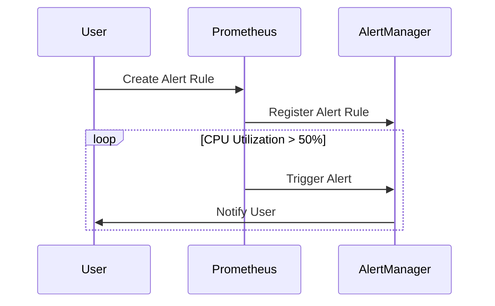

## Understanding Node Utilization in Kubernetes

In Kubernetes, monitoring the utilization of nodes is crucial for maintaining optimal performance and resource management. One key metric is the idle time of the node, which indicates how much of the node's resources are being used. Idle time is essentially the percentage of time during which the node's CPU is not performing any tasks. 

### What is Node Idle Time?

Node idle time is the amount of time that a node's CPU spends in an idle state. This is typically measured as a percentage of the total time. For example, if a node's CPU is idle 91% of the time, it means that only 9% of the time is spent on actual processing tasks.

### Why Monitor Node Idle Time?

Monitoring node idle time helps in identifying underutilized resources. If a node is mostly idle, it suggests that the workload could potentially be consolidated onto fewer nodes, leading to cost savings and better resource management. Conversely, if a node is heavily utilized, it might indicate the need for additional resources to handle the load.

### How to Calculate Node Utilization

To calculate the utilization of a node, you can subtract the idle time from 100%. For instance, if a node has an idle time of 91%, the utilization would be:

\[ \text{Utilization} = 100\% - \text{Idle Time} \]

\[ \text{Utilization} = 100\% - 91\% = 9\% \]

This calculation provides a clear picture of how much of the node's resources are being used.

### Example Calculation

Let's consider the example provided in the lecture:

- **First Instance**: 91% idle time
- **Second Instance**: 86% idle time

The utilization for these instances would be:

- **First Instance**: \( 100\% - 91\% = 9\% \)
- **Second Instance**: \( 100\% - 86\% = 14\% \)

### Setting Up Custom Alert Rules

Once you have calculated the utilization, you can set up custom alert rules to monitor when the utilization exceeds a certain threshold. This is particularly useful for proactive resource management and ensuring that your cluster remains performant.

#### Creating an Alert Rule

To create an alert rule, you need to define a condition based on the utilization metric. In Prometheus, which is commonly used for monitoring Kubernetes clusters, you can define an alert rule using PromQL (Prometheus Query Language).

Here’s an example of how to set up an alert rule in Prometheus:

```yaml
groups:
- name: kubernetes-monitoring
  rules:
  - alert: HighCPUUtilization
    expr: 100 - (node_cpu_seconds_total{mode="idle"} / node_cpu_seconds_total) * 100 > 50
    for: 2m
    labels:
      severity: critical
    annotations:
      summary: "High CPU Utilization on {{ $labels.node }}"
      description: "The CPU utilization on {{ $labels.node }} is above 50%. Current value is {{ $value }}%"
```

### Explanation of the Alert Rule

- **alert**: The name of the alert.
- **expr**: The PromQL expression that defines the condition for triggering the alert. Here, it checks if the CPU utilization is greater than 50%.
- **for**: The duration for which the condition must hold true before the alert is triggered. In this case, it is set to 2 minutes.
- **labels**: Additional metadata associated with the alert.
- **annotations**: Descriptive information about the alert, including a summary and a detailed description.

### Full HTTP Request and Response

When setting up the alert rule, you would typically send a POST request to the Prometheus API to create the rule. Here’s an example of the full HTTP request and response:

```http
POST /api/v1/rules HTTP/1.1
Host: prometheus.example.com
Content-Type: application/json

{
  "groups": [
    {
      "name": "kubernetes-monitoring",
      "rules": [
        {
          "alert": "HighCPUUtilization",
          "expr": "100 - (node_cpu_seconds_total{mode=\"idle\"} / node_cpu_seconds_total) * 100 > 50",
          "for": "2m",
          "labels": {
            "severity": "critical"
          },
          "annotations": {
            "summary": "High CPU Utilization on {{ $labels.node }}",
            "description": "The CPU utilization on {{ $labels.node }} is above  50%. Current value is {{ $value }}%"
          }
        }
      ]
    }
  ]
}
```

Response:

```http
HTTP/1.1 200 OK
Content-Type: application/json

{
  "status": "success",
  "data": {
    "group": "kubernetes-monitoring",
    "rule": "HighCPUUtilization",
    "message": "Rule created successfully"
  }
}
```

### Mermaid Diagram for Alert Flow

A mermaid diagram can help visualize the flow of the alert rule:



### Common Pitfalls and How to Avoid Them

#### Pitfall 1: Incorrect Thresholds

Setting incorrect thresholds can lead to false positives or negatives. For example, setting the threshold too low might result in frequent alerts, while setting it too high might miss critical issues.

**How to Avoid**: Conduct thorough testing and analysis to determine appropriate thresholds based on historical data and expected workloads.

#### Pitfall 2: Not Considering Variability

Workloads can vary significantly over time. A static threshold might not account for these fluctuations.

**How to Avoid**: Implement dynamic thresholds that adjust based on historical data and current trends.

### Real-World Examples

#### Example 1: CVE-2021-25741

CVE-2021-25741 was a vulnerability in Kubernetes that allowed attackers to bypass authentication and gain unauthorized access to the cluster. Proper monitoring and alerting mechanisms could have helped detect such unauthorized activities early.

#### Example 2: AWS Outage in 2021

An outage in AWS in 2021 affected several services, including Kubernetes clusters. Effective monitoring and alerting could have helped organizations quickly identify and mitigate the issue.

### How to Prevent / Defend

#### Detection

Regularly review logs and metrics to detect unusual patterns or spikes in resource utilization. Use tools like Prometheus and Grafana for visualizing and analyzing metrics.

#### Prevention

Implement proper resource management practices, such as horizontal pod autoscaling (HPA) and vertical pod autoscaling (VPA), to dynamically adjust resource allocation based on demand.

#### Secure Coding Fixes

Ensure that your alert rules are correctly configured and tested. Compare the vulnerable and secure versions side by side:

**Vulnerable Version**:

```yaml
groups:
- name: kubernetes-monitoring
  rules:
  - alert: HighCPUUtilization
    expr: 100 - (node_cpu_seconds_total{mode="idle"} / node_cpu_seconds_total) * 100 > 50
    for: 1m
    labels:
      severity: critical
    annotations:
      summary: "High CPU Utilization on {{ $labels.node }}"
      description: "The CPU utilization on {{ $labels.node }} is above 50%. Current value is {{ $value }}%"
```

**Secure Version**:

```yaml
groups:
- name: kubernetes-monitoring
  rules:
  - alert: HighCPUUtilization
    expr: 100 - (node_cpu_seconds_total{mode="idle"} / node_cpu_seconds_total) * 100 > 50
    for: 2m
    labels:
      severity: critical
    annotations:
      summary: "High CPU Utilization on {{ $labels.node }}"
      description: "The CPU utilization on {{ $labels.node }} is above 50%. Current value is {{ $value }}%"
```

### Configuration Hardening

Ensure that your Prometheus and AlertManager configurations are hardened against potential attacks. Use strong authentication mechanisms and limit access to sensitive endpoints.

### Practice Labs

For hands-on practice, consider the following labs:

- **PortSwigger Web Security Academy**: Offers comprehensive training on web security, including Kubernetes security.
- **OWASP Juice Shop**: A deliberately insecure web application for practicing security skills.
- **Kubernetes Goat**: A vulnerable Kubernetes cluster for learning and testing security measures.

By thoroughly understanding and implementing these concepts, you can effectively monitor and manage your Kubernetes cluster, ensuring optimal performance and security.

---
<!-- nav -->
[[02-Creating Custom Alert Rules for Kubernetes Monitoring|Creating Custom Alert Rules for Kubernetes Monitoring]] | [[DevOps/DevOps Bootcamp/10-Monitoring & Alerting/06-Creating Custom Alert Rules For Kubernetes Monitoring/00-Overview|Overview]] | [[DevOps/DevOps Bootcamp/10-Monitoring & Alerting/06-Creating Custom Alert Rules For Kubernetes Monitoring/04-Practice Questions & Answers|Practice Questions & Answers]]
