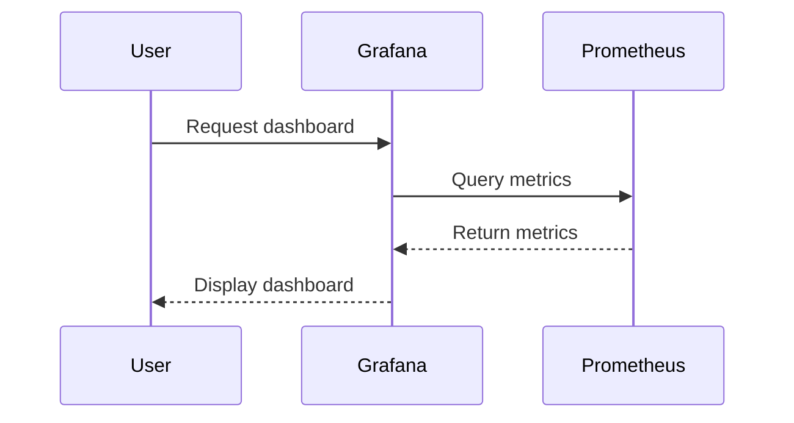
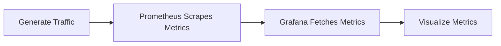

## Introduction to Service Monitoring and Metrics Collection

In the realm of DevOps, monitoring the health and performance of applications is crucial for maintaining high availability and optimal user experience. One of the key tools used for this purpose is Prometheus, an open-source systems monitoring and alerting toolkit. Prometheus collects and stores metrics from configured targets at regular intervals and provides a flexible query language to analyze this data.

### What is Prometheus?

Prometheus is a powerful monitoring system that allows you to scrape metrics from various sources and store them in a time-series database. It supports a wide range of exporters and integrations, making it highly versatile for different environments. Prometheus is designed to be highly scalable and can handle large volumes of data efficiently.

#### Why Use Prometheus?

Prometheus offers several advantages over traditional monitoring solutions:

1. **Scalability**: Prometheus can handle a large number of metrics and is designed to scale horizontally.
2. **Flexibility**: It supports a rich query language (PromQL) that allows complex queries and aggregations.
3. **Integration**: Prometheus integrates seamlessly with many popular services and frameworks, including Kubernetes, Docker, and Node.js applications.
4. **Alerting**: Prometheus includes built-in alerting capabilities that can trigger actions based on defined rules.

### What is Grafana?

Grafana is an open-source platform for monitoring and observability. It is often used alongside Prometheus to visualize the collected metrics. Grafana provides a user-friendly interface to create dashboards, set up alerts, and explore data interactively.

#### Why Use Grafana?

Grafana complements Prometheus by offering:

1. **Visualization**: Grafana allows you to create custom dashboards with various types of charts and graphs.
2. **Interactivity**: Users can drill down into specific data points and explore trends over time.
3. **Alerting**: Grafana can be configured to send alerts based on specific conditions.
4. **Data Sources**: Grafana supports multiple data sources, including Prometheus, InfluxDB, Elasticsearch, and more.

### Setting Up Prometheus and Grafana

To set up Prometheus and Grafana for monitoring a Node.js application, follow these steps:

1. **Install Prometheus**:
    - Download the latest release from the [Prometheus website](https://prometheus.io/download/).
    - Extract the tarball and navigate to the `prometheus` directory.
    - Configure the `prometheus.yml` file to define the targets and scrape intervals.

```yaml
# prometheus.yml
global:
  scrape_interval: 15s

scrape_configs:
  - job_name: 'node_app'
    static_configs:
      - targets: ['localhost:9090']
```

2. **Install Grafana**:
    - Download the latest release from the [Grafana website](https://grafana.com/download).
    - Follow the installation instructions for your operating system.
    - Start Grafana and log in using the default credentials (`admin/admin`).

3. **Configure Grafana to Use Prometheus as a Data Source**:
    - Navigate to the Grafana UI and go to `Configuration > Data Sources`.
    - Click `Add data source` and select `Prometheus`.
    - Enter the URL of your Prometheus instance (e.g., `http://localhost:9090`) and save the configuration.

### Collecting Metrics from a Node.js Application

To collect metrics from a Node.js application, you can use a library like `prom-client`. This library provides a simple way to expose metrics via an HTTP endpoint that Prometheus can scrape.

#### Installing `prom-client`

First, install the `prom-client` package:

```bash
npm install prom-client
```

#### Configuring Metrics in Your Node.js Application

Next, configure the metrics in your Node.js application:

```javascript
const express = require('express');
const { Counter } = require('prom-client');

// Create a counter metric
const requestCounter = new Counter({
  name: 'requests_total',
  help: 'Total number of requests',
});

// Initialize Express app
const app = express();

// Define a route to increment the counter
app.get('/metrics', (req, res) => {
  requestCounter.inc();
  res.send(requestCounter);
});

// Start the server
app.listen(9090, () => {
  console.log('Server listening on port 9090');
});
```

### Visualizing Metrics in Grafana

Once Prometheus is scraping metrics from your Node.js application, you can visualize these metrics in Grafana.

#### Creating a Dashboard in Grafana

1. **Create a New Dashboard**:
    - Click `+` in the left sidebar and select `Dashboard`.
    - Click `Add new panel`.

2. **Configure the Panel**:
    - Select `Prometheus` as the data source.
    - Enter the PromQL query to retrieve the metrics (e.g., `requests_total`).



3. **Customize the Panel**:
    - Set the time range to `Last 1 hour` for a better view.
    - Change the panel title to `Requests per Second`.

### Simulating Traffic and Observing Metrics

To simulate changes in the number of requests, you can generate traffic to your Node.js application using tools like `curl` or `ab` (Apache Benchmark).

#### Generating Traffic

Use `curl` to send multiple requests:

```bash
for i in {1..100}; do curl http://localhost:9090/metrics; done
```

Or use `ab` to send a high volume of requests:

```bash
ab -n 1000 -c 10 http://localhost:9090/metrics
```

#### Observing Metrics in Grafana

After generating traffic, wait a few seconds and refresh the Grafana dashboard. You should see a spike in the number of requests for your application.



### Real-World Examples and Recent Breaches

Recent breaches and vulnerabilities have highlighted the importance of effective monitoring and alerting mechanisms. For example, the Log4j vulnerability (CVE-2021-44228) demonstrated the critical nature of monitoring logs and metrics to detect unusual activity.

#### Example: Log4j Vulnerability

The Log4j vulnerability allowed attackers to execute arbitrary code on affected systems. By monitoring logs and metrics, organizations could detect unusual patterns and respond quickly to mitigate the impact.

### Pitfalls and Common Mistakes

When setting up monitoring and visualization, there are several common pitfalls to avoid:

1. **Incorrect Configuration**: Ensure that Prometheus and Grafana are correctly configured to scrape and visualize metrics.
2. **Insufficient Metrics**: Collect enough metrics to provide a comprehensive view of the application's performance.
3. **Overloading Metrics**: Avoid collecting too many metrics, which can lead to performance issues and increased storage requirements.
4. **Security Risks**: Ensure that sensitive information is not exposed through metrics endpoints.

### How to Prevent / Defend

#### Secure Configuration

1. **Secure Metrics Endpoints**:
    - Restrict access to metrics endpoints using authentication and authorization mechanisms.
    - Use HTTPS to encrypt data in transit.

2. **Monitor and Alert**:
    - Set up alerts for unusual patterns in metrics.
    - Regularly review logs and metrics to detect potential security incidents.

3. **Secure Code Practices**:
    - Use secure coding practices to prevent vulnerabilities in the application.
    - Regularly update dependencies and libraries to patch known vulnerabilities.

#### Example: Secure Metrics Endpoint

Here is an example of securing a metrics endpoint using basic authentication:

```javascript
const express = require('express');
const { Counter } = require('prom-client');
const basicAuth = require('express-basic-auth');

// Create a counter metric
const requestCounter = new Counter({
  name: 'requests_total',
  help: 'Total number of requests',
});

// Initialize Express app
const app = express();

// Enable basic authentication
app.use(basicAuth({
  users: { admin: 'password' },
  challenge: true,
}));

// Define a route to increment the counter
app.get('/metrics', (req, res) => {
  requestCounter.inc();
  res.send(requestCounter);
});

// Start the server
app.listen(9090, () => {
  console.log('Server listening on port 9090');
});
```

### Conclusion

Monitoring and visualizing metrics using Prometheus and Grafana is essential for maintaining the health and performance of your applications. By following best practices and avoiding common pitfalls, you can ensure that your monitoring setup is robust and secure. Regularly reviewing and updating your monitoring configurations will help you stay ahead of potential issues and maintain optimal performance.

### Practice Labs

For hands-on practice with Prometheus and Grafana, consider the following labs:

- **PortSwigger Web Security Academy**: Offers interactive labs to learn about web security and monitoring.
- **OWASP Juice Shop**: A deliberately insecure web application for learning about web security.
- **DVWA (Damn Vulnerable Web Application)**: A PHP/MySQL web application that is riddled with vulnerabilities for educational purposes.

These labs provide practical experience in setting up and configuring monitoring tools, helping you gain a deeper understanding of the concepts covered in this chapter.

---
<!-- nav -->
[[DevOps/DevOps Bootcamp/10-Monitoring & Alerting/07-Creating Service Monitor For Node App Metrics Endpoint/00-Overview|Overview]] | [[02-Introduction to Service Monitoring and Metrics|Introduction to Service Monitoring and Metrics]]
