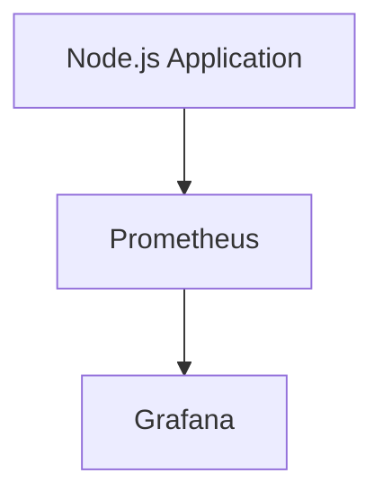
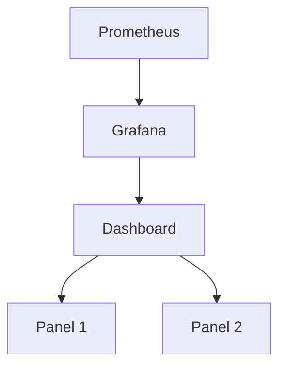

## Introduction to Service Monitoring and Metrics

In the realm of DevOps, monitoring the health and performance of applications is crucial. This involves collecting metrics, setting up alerts based on those metrics, and visualizing the data to gain insights into the application's behavior. In this section, we will delve into creating a service monitor for a Node.js application's metrics endpoint using Prometheus and Grafana.

### What Are Metrics?

Metrics are quantitative measurements that provide insight into the performance and health of an application. They can include various types of data such as:

- **Request counts**: Number of HTTP requests received.
- **Response times**: Time taken to process a request.
- **Error rates**: Percentage of failed requests.
- **Resource usage**: CPU, memory, disk usage.

These metrics help in identifying issues, optimizing performance, and ensuring the application remains stable under varying loads.

### Why Use Metrics?

Metrics are essential for several reasons:

- **Performance optimization**: By analyzing metrics, you can identify bottlenecks and optimize resource usage.
- **Troubleshooting**: Metrics help in diagnosing issues by providing a historical record of application behavior.
- **Alerting**: Setting up alerts based on metrics allows you to proactively address potential issues before they affect users.
- **Visualization**: Visual representations of metrics make it easier to understand trends and patterns.

### How Metrics Work

Metrics are typically collected by a monitoring agent or library embedded within the application. These agents expose metrics via an endpoint, which can then be scraped by a monitoring system like Prometheus.

#### Example: Node.js Metrics Endpoint

Consider a Node.js application that exposes a metrics endpoint. Here’s a simple example of how you might set up a metrics endpoint using the `prom-client` library:

```javascript
const express = require('express');
const { Counter } = require('prom-client');

const app = express();
const httpRequestsTotal = new Counter({
    name: 'http_requests_total',
    help: 'Total number of HTTP requests',
    labelNames: ['method', 'path']
});

app.get('/metrics', (req, res) => {
    res.set('Content-Type', register.contentType);
    res.end(register.metrics());
});

app.use((req, res, next) => {
    httpRequestsTotal.inc({ method: req.method, path: req.path });
    next();
});

app.listen(3000, () => {
    console.log('Server listening on port 3000');
});
```

This code sets up an Express server that increments a counter for each HTTP request and exposes the metrics at `/metrics`.

### Real-World Examples

#### Recent Breaches and CVEs

Monitoring and alerting on metrics can help prevent and mitigate security incidents. For instance, consider the following recent CVEs:

- **CVE-2021-21972**: A vulnerability in Apache Log4j that could lead to remote code execution. Monitoring log entries and request counts could help detect unusual activity indicative of exploitation.
- **CVE-2022-22965**: A vulnerability in Spring Framework that could allow attackers to execute arbitrary code. Monitoring request patterns and error rates could help detect attempts to exploit this vulnerability.

### Prometheus and Grafana

Prometheus is an open-source monitoring system and time series database. It collects and stores metrics, and Grafana is a visualization tool that can display these metrics in dashboards.

#### Setting Up Prometheus

To set up Prometheus, you need to configure it to scrape metrics from your Node.js application. Here’s an example `prometheus.yml` configuration:

```yaml
scrape_configs:
  - job_name: 'nodejs-app'
    static_configs:
      - targets: ['localhost:3000']
```

This configuration tells Prometheus to scrape metrics from the target `localhost:3000`.

#### Setting Up Grafana

Grafana is used to visualize the metrics collected by Prometheus. To set up Grafana:

1. Install Grafana.
2. Add a Prometheus data source.
3. Create a new dashboard and add panels to display metrics.

### Creating a Service Monitor for Node.js Application Metrics

Let’s walk through the steps to create a service monitor for a Node.js application's metrics endpoint using Prometheus and Grafana.

#### Step 1: Expose Metrics from Node.js Application

Ensure your Node.js application exposes metrics via an endpoint. We already covered this in the previous example using the `prom-client` library.

#### Step 2: Configure Prometheus to Scrape Metrics

Configure Prometheus to scrape metrics from your Node.js application. Here’s the `prometheus.yml` configuration again:

```yaml
scrape_configs:
  - job_name: 'nodejs-app'
    static_configs:
      - targets: ['localhost:3000']
```

#### Step 3: Set Up Grafana Dashboard

1. **Install Grafana**: Follow the installation instructions for your operating system.
2. **Add Prometheus Data Source**:
   - Open Grafana and navigate to `Configuration > Data Sources`.
   - Click `Add data source` and select `Prometheus`.
   - Enter the URL of your Prometheus server and click `Save & Test`.

3. **Create a New Dashboard**:
   - Click `+` to create a new dashboard.
   - Click `Add panel` to add a new panel.

4. **Add Panels to Display Metrics**:
   - In the panel editor, select `Prometheus` as the data source.
   - Enter the query to fetch the desired metric. For example, to display the total number of HTTP requests:

     ```promql
     http_requests_total
     ```

   - Customize the visualization settings as needed.

#### Step 4: Visualize Request Rate Per Second

To visualize the request rate per second, you can use the `rate()` function in PromQL. Here’s how to set it up:

1. **Add a New Panel**:
   - Click `Add panel` to add a new panel.
   - Select `Prometheus` as the data source.

2. **Enter the Query**:
   - Enter the following PromQL query to calculate the request rate per second:

     ```promql
     rate(http_requests_total[2m])
     ```

   - This query calculates the rate of `http_requests_total` over a 2-minute interval.

3. **Customize Visualization**:
   - Customize the visualization settings to display the data as a line graph.

### Mermaid Diagrams

Here are some mermaid diagrams to illustrate the setup:

#### Prometheus Scraping Configuration



#### Grafana Dashboard Setup



### Common Pitfalls and Best Practices

#### Common Pitfalls

- **Incorrect Metric Names**: Ensure that metric names are consistent and descriptive.
- **Insufficient Granularity**: Collect metrics at a granular level to capture detailed information.
- **Overloading Metrics**: Avoid collecting too many metrics, which can lead to performance issues.

#### Best Practices

- **Use Descriptive Labels**: Include labels in metrics to provide context.
- **Regularly Review Metrics**: Periodically review and refine the metrics being collected.
- **Set Up Alerts**: Configure alerts based on critical metrics to proactively address issues.

### How to Prevent / Defend

#### Detection

- **Monitor Unusual Activity**: Set up alerts for unusual spikes in request counts or response times.
- **Log Analysis**: Regularly analyze logs to detect patterns indicative of security incidents.

#### Prevention

- **Secure Metrics Endpoints**: Ensure that metrics endpoints are accessible only to authorized users.
- **Rate Limiting**: Implement rate limiting to prevent abuse of metrics endpoints.

#### Secure Coding Fixes

Here’s an example of how to securely expose metrics in a Node.js application:

```javascript
const express = require('express');
const { Counter } = require('prom-client');

const app = express();
const httpRequestsTotal = new Counter({
    name: 'http_requests_total',
    help: 'Total number of HTTP requests',
    labelNames: ['method', 'path']
});

// Middleware to authenticate access to metrics endpoint
function authenticate(req, res, next) {
    const authHeader = req.headers.authorization;
    if (!authHeader || !authHeader.startsWith('Bearer ')) {
        return res.status(401).send('Unauthorized');
    }
    const token = authHeader.split(' ')[1];
    if (token !== 'your-secret-token') {
        return res.status(401).send('Unauthorized');
    }
    next();
}

app.get('/metrics', authenticate, (req, res) => {
    res.set('Content-Type', register.contentType);
    res.end(register.metrics());
});

app.use((req, res, next) => {
    httpRequestsTotal.inc({ method: req.method, path: req.path });
    next();
});

app.listen(3000, () => {
    console.log('Server listening on port  3000');
});
```

### Conclusion

Creating a service monitor for a Node.js application's metrics endpoint using Prometheus and Grafana is a powerful way to ensure the health and performance of your application. By collecting and visualizing metrics, you can proactively address issues and optimize performance. Always ensure that metrics are securely exposed and regularly reviewed to maintain the integrity of your monitoring setup.

### Practice Labs

For hands-on practice, consider the following labs:

- **PortSwigger Web Security Academy**: Offers exercises on web application security, including monitoring and alerting.
- **OWASP Juice Shop**: A deliberately insecure web application for practicing security skills, including monitoring.
- **DVWA (Damn Vulnerable Web Application)**: Another intentionally vulnerable web application for learning security concepts.

By completing these labs, you can gain practical experience in setting up and managing service monitors for your applications.

---
<!-- nav -->
[[01-Introduction to Service Monitoring and Metrics Collection|Introduction to Service Monitoring and Metrics Collection]] | [[DevOps/DevOps Bootcamp/10-Monitoring & Alerting/07-Creating Service Monitor For Node App Metrics Endpoint/00-Overview|Overview]] | [[03-Introduction to Service Monitoring in DevOps|Introduction to Service Monitoring in DevOps]]
