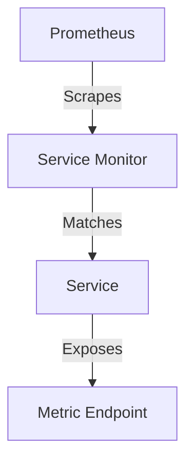
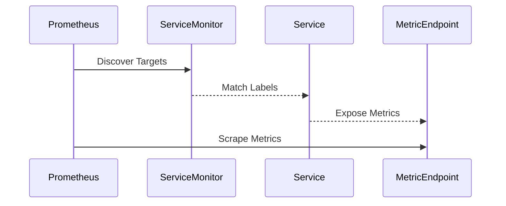

## Introduction to Service Monitoring in DevOps

In the realm of DevOps, monitoring services is crucial for maintaining the health and performance of applications. One of the most popular tools for monitoring is Prometheus, an open-source systems monitoring and alerting toolkit. Prometheus collects and stores metrics from configured targets at regular intervals and then processes these metrics through a flexible query language called PromQL.

### What is a Service Monitor?

A Service Monitor is a custom resource definition (CRD) used in Kubernetes environments to configure Prometheus to scrape metrics from specific services. Essentially, it tells Prometheus where to look for metrics and how to interpret them. This is particularly useful in microservices architectures where numerous services might be running, each with its own set of metrics.

### Why Use Service Monitors?

Service Monitors provide a structured way to manage and discover metrics across multiple services. They allow you to define labels that help Prometheus identify and group related services together. This is especially important in large-scale deployments where manual configuration would be impractical.

### How Service Monitors Work

When Prometheus runs, it periodically queries the Service Monitors to discover new targets to scrape. Each Service Monitor specifies the endpoints and ports where the metrics are exposed. Prometheus then scrapes these endpoints and aggregates the data for analysis and visualization.

### Labels in Service Monitors

Labels are key-value pairs that provide additional context about the monitored services. They are used to filter and aggregate metrics in PromQL queries. In the given transcript, two labels are mentioned:

1. **release-monitoring**: This label is used to match all the service monitors in the cluster.
2. **Node app**: This label is specific to the Node.js application being monitored.

These labels help Prometheus understand the structure of the services and how they relate to each other.

### Metadata and Specification

The metadata section of a Service Monitor contains basic information such as the name and labels. The specification section defines the actual configuration for scraping metrics.

#### Example of a Service Monitor Configuration

```yaml
apiVersion: monitoring.coreos.com/v1
kind: ServiceMonitor
metadata:
  name: node-app-monitor
  labels:
    release: monitoring
    app: node-app
spec:
  selector:
    matchLabels:
      app: node-app
  endpoints:
  - port: service
    path: /metrics
```

### Understanding the Configuration

- **selector.matchLabels**: This field specifies the labels that the Service Monitor should match. In this case, it matches services with the label `app: node-app`.
- **endpoints.port**: This field specifies the name of the port where the metrics are exposed. The name `service` corresponds to a named port in the service definition.
- **endpoints.path**: This field specifies the path where the metrics are available. In this case, it is `/metrics`.

### Naming Ports in Services

In Kubernetes, services can have named ports. This allows you to specify the port name in the Service Monitor configuration. Here’s an example of a service definition with named ports:

```yaml
apiVersion: v1
kind: Service
metadata:
  name: node-app-service
spec:
  selector:
    app: node-app
  ports:
  - name: service
    protocol: TCP
    port: 8080
    targetPort: 8080
```

In this example, the service has a port named `service` which listens on port 8080.

### Full Example of Service Monitor and Service Definition

Let’s put everything together with a complete example:

#### Service Definition

```yaml
apiVersion: v1
kind: Service
metadata:
  name: node-app-service
spec:
  selector:
    app: node-app
  ports:
  - name: service
    protocol: TCP
    port: 8080
    targetPort: 8080
```

#### Service Monitor Definition

```yaml
apiVersion: monitoring.coreos.com/v
kind: ServiceMonitor
metadata:
  name: node-app-monitor
  labels:
    release: monitoring
    app: node-app
spec:
  selector:
    matchLabels:
      app: node-app
  endpoints:
  - port: service
    path: /metrics
```

### How to Prevent / Defend

#### Detection

To ensure that your Service Monitors are correctly configured and functioning, you can use Prometheus's built-in alerting capabilities. You can create alerts based on specific conditions, such as missing metrics or unexpected values.

#### Prevention

1. **Secure Metrics Endpoints**: Ensure that metrics endpoints are not exposed to unauthorized users. Use network policies or authentication mechanisms to restrict access.
2. **Regular Audits**: Regularly review and audit your Service Monitor configurations to ensure they are up-to-date and correctly configured.
3. **Use Secure Labels**: Avoid using sensitive information in labels. Labels should be used for grouping and filtering purposes only.

#### Secure Code Fix

Here’s an example of a vulnerable configuration and a secure configuration:

**Vulnerable Configuration**

```yaml
apiVersion: monitoring.coreos.com/v1
kind: ServiceMonitor
metadata:
  name: node-app-monitor
  labels:
    release: monitoring
    app: node-app
spec:
  selector:
    matchLabels:
      app: node-app
  endpoints:
  - port: service
    path: /metrics
```

**Secure Configuration**

```yaml
apiVersion: monitoring.coreos.com/v1
kind: ServiceMonitor
metadata:
  name: node-app-monitor
  labels:
    release: monitoring
    app: node-app
spec:
  selector:
    matchLabels:
      app: node-app
  endpoints:
  - port: service
    path: /metrics
    scheme: https
    tlsConfig:
      insecureSkipVerify: false
```

In the secure configuration, we added `scheme: https` and `tlsConfig` to ensure that the metrics are fetched securely over HTTPS.

### Real-World Examples

#### Recent CVEs and Breaches

One notable example is the CVE-2021-25285, which affected Prometheus and allowed attackers to bypass authentication and gain unauthorized access to metrics. This highlights the importance of securing metrics endpoints and regularly auditing configurations.

### Mermaid Diagrams

#### Service Monitor Architecture



#### Request/Response Flow



### Practice Labs

For hands-on practice with Service Monitors, consider the following labs:

- **PortSwigger Web Security Academy**: Offers comprehensive tutorials on setting up and configuring Prometheus and Service Monitors.
- **OWASP Juice Shop**: Provides a vulnerable web application that can be used to practice monitoring and securing metrics endpoints.
- **Kubernetes Goat**: Focuses on Kubernetes security and includes scenarios for setting up and securing Service Monitors.

By following these detailed explanations and examples, you can effectively set up and manage Service Monitors in your Kubernetes environment, ensuring robust monitoring and security for your applications.

---
<!-- nav -->
[[02-Introduction to Service Monitoring and Metrics|Introduction to Service Monitoring and Metrics]] | [[DevOps/DevOps Bootcamp/10-Monitoring & Alerting/07-Creating Service Monitor For Node App Metrics Endpoint/00-Overview|Overview]] | [[04-Introduction to Service Monitoring with Prometheus|Introduction to Service Monitoring with Prometheus]]
