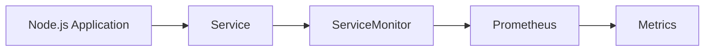

## Introduction to Service Monitors in Kubernetes

In the context of DevOps and Kubernetes, monitoring is a critical component for ensuring the health and performance of applications. One of the key tools used for monitoring in Kubernetes is Prometheus, an open-source systems monitoring and alerting toolkit. To enable Prometheus to scrape metrics from your applications, you need to configure a `ServiceMonitor` resource. This chapter will delve into the details of creating a `ServiceMonitor` for a Node.js application's metrics endpoint, covering the necessary background, steps, and practical examples.

### Background Theory

Prometheus is designed to scrape metrics from various sources, including Kubernetes services. A `ServiceMonitor` is a custom resource definition (CRD) that extends Prometheus's capabilities by allowing it to dynamically discover and scrape metrics from services based on labels. This approach simplifies the process of setting up monitoring for multiple services within a cluster.

#### What is a Service Monitor?

A `ServiceMonitor` is a Kubernetes object that defines how Prometheus should scrape metrics from a set of services. It specifies the labels to match, the endpoints to scrape, and other parameters such as scrape intervals and timeouts. By using `ServiceMonitor`, you can decouple the monitoring configuration from the application itself, making it easier to manage and scale.

#### Why Use Service Monitors?

Using `ServiceMonitor` offers several advantages:

1. **Dynamic Discovery**: Prometheus can automatically discover new services that match the specified labels, reducing the need for manual configuration updates.
2. **Label-Based Configuration**: You can use labels to group services and define different scraping strategies for different groups.
3. **Scalability**: As your application scales, Prometheus can automatically start scraping metrics from new instances without additional configuration.

### Setting Up a Service Monitor for a Node.js Application

Let's walk through the process of creating a `ServiceMonitor` for a Node.js application that exposes a `/metrics` endpoint.

#### Step 1: Define the Node.js Application

First, ensure your Node.js application is exposing a `/metrics` endpoint. This endpoint should return metrics in a format that Prometheus can understand, typically Prometheus exposition format.

```javascript
const express = require('express');
const promClient = require('prom-client');

const app = express();
const PORT = 3000;

// Create a new registry
const register = new promClient.Registry();

// Default metrics
register.setDefaultLabels({ application: 'node-app' });

// Register the default metrics
promClient.collectDefaultMetrics({ register });

// Expose the metrics endpoint
app.get('/metrics', async (req, res) => {
  res.set('Content-Type', register.contentType);
  await res.send(await register.metrics());
});

app.listen(PORT, () => {
  console.log(`Server running on port ${PORT}`);
});
```

This code sets up an Express server that listens on port 3000 and exposes a `/metrics` endpoint. The `prom-client` library is used to generate and expose metrics.

#### Step 2: Deploy the Node.js Application to Kubernetes

Next, deploy the Node.js application to your Kubernetes cluster. Ensure that the deployment includes a label that can be used to identify the service.

```yaml
apiVersion: apps/v1
kind: Deployment
metadata:
  name: node-app-deployment
spec:
  replicas: 3
  selector:
    matchLabels:
      app: node-app
  template:
    metadata:
      labels:
        app: node-app
    spec:
      containers:
      - name: node-app
        image: your-node-app-image:latest
        ports:
        - containerPort: 3000
---
apiVersion: v1
kind: Service
metadata:
  name: node-app-service
spec:
  selector:
    app: node-app
  ports:
  - protocol: TCP
    port: 80
    targetPort: 3000
  type: ClusterIP
```

This manifest deploys a Node.js application with three replicas and exposes it via a `ClusterIP` service. The service is labeled with `app: node-app`.

#### Step 3: Create a Service Monitor

Now, create a `ServiceMonitor` that tells Prometheus to scrape metrics from the Node.js application.

```yaml
apiVersion: monitoring.coreos.com/v1
kind: ServiceMonitor
metadata:
  name: node-app-monitor
spec:
  selector:
    matchLabels:
      app: node-app
  endpoints:
  - port: http
    path: /metrics
    interval: 15s
```

This `ServiceMonitor` specifies that Prometheus should scrape metrics from services labeled with `app: node-app`. The metrics are exposed on the `/metrics` endpoint, and Prometheus should scrape them every 15 seconds.

#### Step 4: Apply the Configuration

Apply the `ServiceMonitor` and update the service configuration.

```sh
kubectl apply -f node-app-deployment.yaml
kubectl apply -f node-app-service.yaml
kubectl apply -f node-app-monitor.yaml
```

After applying the configurations, Prometheus will start discovering and scraping metrics from the Node.js application.

### Verifying the Setup

To verify that Prometheus has discovered the new target, open the Prometheus UI and check the list of registered targets.



The above diagram illustrates the flow of metrics from the Node.js application to Prometheus via the `ServiceMonitor`.

### Real-World Examples and Recent Breaches

Recent breaches and vulnerabilities often involve misconfigured monitoring systems. For example, in 2021, a misconfigured Prometheus instance led to the exposure of sensitive data from a Kubernetes cluster. This incident highlights the importance of properly securing and configuring monitoring systems.

#### Example: CVE-2021-25281

CVE-2021-25281 involved a misconfigured Prometheus instance that allowed unauthorized access to sensitive metrics. This vulnerability could be exploited to gain insights into the internal workings of a system, potentially leading to further attacks.

### Common Pitfalls and How to Prevent Them

#### Pitfall 1: Insecure Metrics Endpoints

One common pitfall is exposing metrics endpoints without proper authentication or authorization. This can lead to unauthorized access to sensitive information.

**How to Prevent:**

1. **Use Authentication**: Ensure that metrics endpoints are protected with authentication mechanisms such as basic auth or OAuth.
2. **Limit Access**: Restrict access to metrics endpoints to trusted networks or IP addresses.

#### Pitfall 2: Misconfigured Scrape Intervals

Another pitfall is misconfiguring scrape intervals, which can lead to either too frequent or infrequent scraping of metrics.

**How to Prevent:**

1. **Optimize Scrape Intervals**: Set appropriate scrape intervals based on the requirements of your application. Too frequent scraping can lead to increased load on the system, while infrequent scraping may miss important events.
2. **Monitor Performance**: Regularly monitor the performance of your monitoring system to ensure that it is not causing undue stress on your application.

### Secure Coding Fixes

Here’s an example of how to secure the metrics endpoint in the Node.js application:

```javascript
const express = require('express');
const promClient = require('prom-client');
const basicAuth = require('express-basic-auth');

const app = express();
const PORT = 3000;

// Create a new registry
const register = new promClient.Registry();

// Default metrics
register.setDefaultLabels({ application: 'node-app' });

// Register the default metrics
promClient.collectDefaultMetrics({ register });

// Protect the metrics endpoint with basic auth
app.use('/metrics', basicAuth({
  users: { 'admin': 'password' },
  challenge: true,
}));

// Expose the metrics endpoint
app.get('/metrics', async (req, res) => {
  res.set('Content-Type', register.contentType);
  await res.send(await register.metrics());
});

app.listen(PORT, () => {
  console.log(`Server running on port ${PORT}`);
});
```

In this example, the `/metrics` endpoint is protected with basic authentication, preventing unauthorized access.

### Hardening Prometheus Configuration

To further secure Prometheus, you can harden its configuration by enabling TLS encryption and restricting access to trusted networks.

```yaml
server:
  listenAddress: 0.0.0.0:9090
  tlsConfig:
    certFile: /etc/prometheus/prometheus.crt
    keyFile: /etc/prometheus/prometheus.key
web:
  externalUrl: https://prometheus.example.com/
  maxConnections: 100
  maxRequestsPerSecond: 100
  routePrefix: /
scrape_configs:
  - job_name: 'node-app'
    static_configs:
      - targets: ['node-app-service.default.svc.cluster.local:80']
        labels:
          app: 'node-app'
```

In this configuration, Prometheus is set up to use TLS encryption and restrict access to trusted networks.

### Conclusion

Creating a `ServiceMonitor` for a Node.js application's metrics endpoint is a crucial step in setting up effective monitoring in a Kubernetes environment. By following the steps outlined in this chapter, you can ensure that Prometheus is able to scrape metrics from your application efficiently and securely. Remember to regularly review and update your monitoring configurations to adapt to changing requirements and security threats.

### Hands-On Labs

For hands-on practice, consider the following labs:

- **PortSwigger Web Security Academy**: Offers exercises on securing web applications, including monitoring and metrics.
- **OWASP Juice Shop**: Provides a vulnerable web application for practicing security testing, including monitoring and metrics.
- **Kubernetes Goat**: A Kubernetes-based security training platform that includes exercises on monitoring and metrics.

These labs will help you gain practical experience in setting up and securing monitoring systems in a Kubernetes environment.

---
<!-- nav -->
[[04-Introduction to Service Monitoring with Prometheus|Introduction to Service Monitoring with Prometheus]] | [[DevOps/DevOps Bootcamp/10-Monitoring & Alerting/07-Creating Service Monitor For Node App Metrics Endpoint/00-Overview|Overview]] | [[06-Introduction to Service Monitors in Prometheus|Introduction to Service Monitors in Prometheus]]
