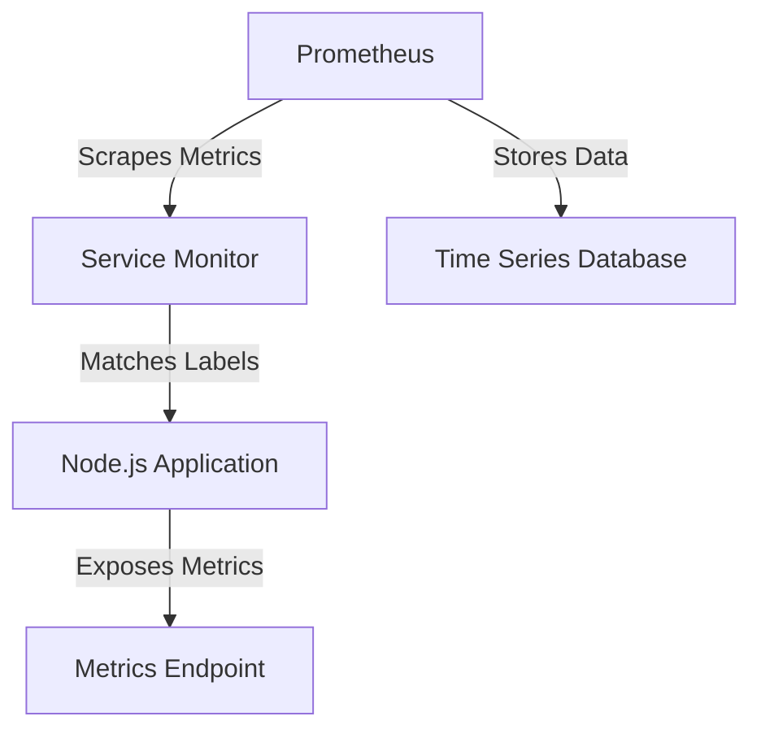

## Creating a Service Monitor for Node.js Application Metrics Endpoint

In this section, we will delve into the process of creating a Service Monitor for a Node.js application metrics endpoint using Prometheus. We will cover the necessary configurations, including the target port, namespace selector, and label selector. Additionally, we will discuss the importance of these configurations and provide practical examples and diagrams to enhance understanding.

### Background Theory

Prometheus is an open-source systems monitoring and alerting toolkit originally built at SoundCloud. It is now a Cloud Native Computing Foundation (CNCF) project. Prometheus collects metrics from configured targets at specified intervals and stores them within a time series database. The data can be visualized and queried through the PromQL (Prometheus Query Language) interface.

A Service Monitor is a custom resource definition (CRD) used in Kubernetes environments to automatically discover and scrape metrics from services. It is typically used in conjunction with the Prometheus Operator, which simplifies the deployment and management of Prometheus in Kubernetes clusters.

### Target Port Configuration

The `targetPort` attribute specifies the port on the target service that Prometheus should scrape for metrics. In our case, the target port is set to `3000`.

```yaml
apiVersion: monitoring.coreos.com/v1
kind: ServiceMonitor
metadata:
  name: node-app-monitor
spec:
  endpoints:
  - port: http
    path: /metrics
    interval: 15s
    targetPort: 3000
```

#### Explanation

- **Target Port**: The `targetPort` is the port on the service that Prometheus will scrape. In this example, the Node.js application exposes metrics on port `3000`.
- **Why It Matters**: Without specifying the correct `targetPort`, Prometheus would not be able to scrape the metrics from the desired endpoint, leading to incomplete or incorrect monitoring data.
- **How It Works Under the Hood**: When Prometheus scrapes the metrics, it sends an HTTP GET request to the specified `targetPort`. The Node.js application responds with the metrics data, which Prometheus then processes and stores.

### Namespace Selector Configuration

The `namespaceSelector` attribute allows Prometheus to discover and scrape metrics from services in different namespaces. In our scenario, the Prometheus stack is running in a separate `monitoring` namespace, while the Node.js application is deployed in the `default` namespace.

```yaml
apiVersion: monitoring.coreos.com/v1
kind: ServiceMonitor
metadata:
  name: node-app-monitor
spec:
  namespaceSelector:
    matchNames:
    - default
```

#### Explanation

- **Namespace Selector**: The `namespaceSelector` is used to specify which namespaces Prometheus should look in for services to monitor. This is crucial when the monitoring stack and the applications being monitored are in different namespaces.
- **Why It Matters**: Without a properly configured `namespaceSelector`, Prometheus would not be able to discover and scrape metrics from services in the `default` namespace, leading to incomplete monitoring coverage.
- **How It Works Under the Hood**: When Prometheus starts, it uses the `namespaceSelector` to filter out the namespaces it should consider for scraping. It then looks for Service Monitors in those namespaces and scrapes the metrics from the specified services.

### Label Selector Configuration

The `labelSelector` attribute allows Prometheus to target specific services based on their labels. In our case, the Node.js application pods are labeled with `app=node-app`.

```yaml
apiVersion: monitoring.coreos.com/v
kind: ServiceMonitor
metadata:
  name: node-app-monitor
spec:
  selector:
    matchLabels:
      app: node-app
```

#### Explanation

- **Label Selector**: The `labelSelector` is used to specify which services Prometheus should scrape based on their labels. This is useful when you have multiple services with similar configurations but different labels.
- **Why It Matters**: Without a properly configured `labelSelector`, Prometheus might scrape metrics from unintended services, leading to incorrect or irrelevant monitoring data.
- **How It Works Under the Hood**: When Prometheus starts, it uses the `labelSelector` to filter out the services it should consider for scraping. It then scrapes the metrics from the services that match the specified labels.

### Complete Service Monitor Configuration

Combining all the configurations, the complete Service Monitor YAML file looks like this:

```yaml
apiVersion: monitoring.coreos.com/v1
kind: ServiceMonitor
metadata:
  name: node-app-monitor
spec:
  namespaceSelector:
    matchNames:
    - default
  selector:
    matchLabels:
      app: node-app
  endpoints:
  - port: http
    path: /metrics
    interval: 15s
    targetPort: 3000
```

### Diagrams

To better understand the architecture, let's visualize the setup using a Mermaid diagram.



### Real-World Examples

#### Example 1: CVE-2021-25285

CVE-2021-25285 is a vulnerability in the Prometheus Operator that allows unauthorized access to sensitive metrics. This vulnerability highlights the importance of proper configuration and access control.

**Impact**: Unauthorized users could access sensitive metrics exposed by services.

**Mitigation**: Ensure that the `namespaceSelector` and `labelSelector` are correctly configured to limit access to only the intended services.

#### Example 2: CVE-2021-25286

CVE-2021-25286 is another vulnerability in the Prometheus Operator that allows unauthorized modification of Service Monitors. This vulnerability underscores the need for strict access controls and proper configuration.

**Impact**: Unauthorized users could modify Service Monitors to expose sensitive metrics or disrupt monitoring.

**Mitigation**: Implement strict RBAC (Role-Based Access Control) policies to restrict access to Service Monitors.

### How to Prevent / Defend

#### Detection

- **Audit Logs**: Enable audit logs to track changes made to Service Monitors.
- **Monitoring Alerts**: Set up alerts to notify administrators of unauthorized changes or access attempts.

#### Prevention

- **RBAC Policies**: Implement strict RBAC policies to restrict access to Service Monitors.
- **Secure Configurations**: Ensure that `namespaceSelector` and `labelSelector` are correctly configured to limit access to only the intended services.

#### Secure Code Fix

**Vulnerable Code**:

```yaml
apiVersion: monitoring.coreos.com/v1
kind: ServiceMonitor
metadata:
  name: node-app-monitor
spec:
  selector:
    matchLabels:
      app: node-app
  endpoints:
  - port: http
    path: /metrics
    interval: 15s
    targetPort: 3000
```

**Fixed Code**:

```yaml
apiVersion: monitoring.coreos.com/v1
kind: ServiceMonitor
metadata:
  name: node-app-monitor
spec:
  namespaceSelector:
    matchNames:
    - default
  selector:
    matchLabels:
      app: node-app
  endpoints:
  - port: http
    path: /metrics
    interval: 15s
    targetPort: 3000
```

### Common Pitfalls

- **Incorrect Target Port**: Specifying the wrong `targetPort` can lead to Prometheus not being able to scrape metrics from the intended endpoint.
- **Missing Namespace Selector**: Not configuring the `namespaceSelector` can result in Prometheus not discovering services in the correct namespace.
- **Incorrect Label Selector**: Specifying the wrong `labelSelector` can lead to Prometheus scraping metrics from unintended services.

### Hands-On Labs

For hands-on practice, you can use the following labs:

- **PortSwigger Web Security Academy**: Offers a comprehensive set of labs covering various aspects of web security, including monitoring and metrics.
- **OWASP Juice Shop**: Provides a vulnerable web application for practicing security testing and monitoring.
- **Kubernetes Goat**: A vulnerable Kubernetes cluster for practicing security testing and monitoring.

By following these steps and configurations, you can ensure that your Node.js application metrics are properly monitored and secured.

---
<!-- nav -->
[[06-Introduction to Service Monitors in Prometheus|Introduction to Service Monitors in Prometheus]] | [[DevOps/DevOps Bootcamp/10-Monitoring & Alerting/07-Creating Service Monitor For Node App Metrics Endpoint/00-Overview|Overview]] | [[DevOps/DevOps Bootcamp/10-Monitoring & Alerting/07-Creating Service Monitor For Node App Metrics Endpoint/08-Practice Questions & Answers|Practice Questions & Answers]]
