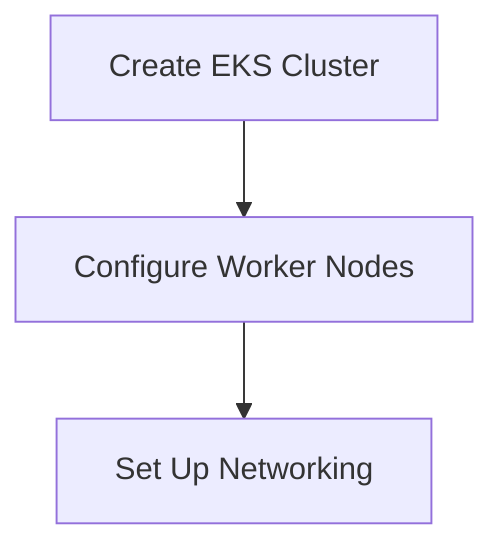
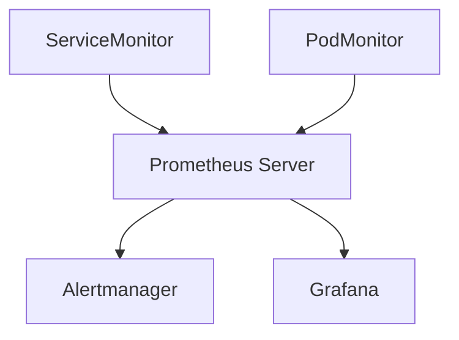

## Introduction to Monitoring with Prometheus on EKS

In the realm of DevOps, monitoring is a critical aspect of ensuring the health and performance of your applications and infrastructure. One of the most popular tools for monitoring is Prometheus, an open-source systems monitoring and alerting toolkit. This chapter will delve into deploying Prometheus on Amazon Elastic Kubernetes Service (EKS) using operators, providing a comprehensive understanding of the process, underlying concepts, and best practices.

### What is Prometheus?

Prometheus is a powerful monitoring system that collects and stores metrics from configured targets at regular intervals and then processes these metrics through a flexible query language called PromQL. It is designed to be highly scalable and capable of handling large volumes of data, making it ideal for monitoring complex systems such as Kubernetes clusters.

#### Why Use Prometheus?

Prometheus offers several advantages:

1. **High Scalability**: Prometheus is designed to handle large volumes of data, making it suitable for monitoring large-scale distributed systems.
2. **Flexible Query Language**: PromQL allows users to perform complex queries on collected metrics, enabling detailed analysis of system behavior.
3. **Integration with Kubernetes**: Prometheus integrates seamlessly with Kubernetes, allowing you to monitor various aspects of your cluster, including nodes, pods, and services.
4. **Alerting Mechanisms**: Prometheus supports alerting based on defined rules, enabling proactive management of your infrastructure.

### What is EKS?

Amazon Elastic Kubernetes Service (EKS) is a managed service that makes it easy to run Kubernetes on AWS without needing to install and operate your own Kubernetes control plane. EKS manages the availability and scalability of the Kubernetes control plane, allowing you to focus on deploying and managing your applications.

#### Why Use EKs?

Using EKS provides several benefits:

1. **Managed Control Plane**: EKS handles the management of the Kubernetes control plane, reducing the operational burden on your team.
2. **Scalability**: EKS allows you to scale your Kubernetes cluster easily, accommodating growing workloads.
3. **Security**: EKS integrates with AWS security features, providing robust security measures for your Kubernetes environment.
4. **Integration with AWS Services**: EKS seamlessly integrates with other AWS services, such as VPC, IAM, and CloudWatch, enhancing the overall manageability and observability of your cluster.

### What is an Operator?

An Operator is a method of packaging, deploying, and managing a Kubernetes application. It extends the Kubernetes API to create, configure, and manage instances of complex stateful applications on behalf of a Kubernetes user. Operators automate the tasks that would typically be performed manually by a human operator.

#### Why Use Operators?

Operators provide several advantages:

1. **Automation**: Operators automate the deployment and management of applications, reducing manual intervention.
2. **Complex Application Management**: Operators are particularly useful for managing complex stateful applications, which require careful orchestration.
3. **Customization**: Operators can be customized to meet specific requirements, providing flexibility in managing applications.

### Deploying Prometheus on EKS Using Operators

Deploying Prometheus on EKS using operators involves several steps. We will cover each step in detail, explaining the underlying concepts and providing practical examples.

#### Step 1: Setting Up the EKS Cluster

Before deploying Prometheus, you need to set up an EKS cluster. This involves creating the cluster, configuring the worker nodes, and setting up the necessary networking.



**Creating the EKS Cluster**

To create an EKS cluster, you can use the AWS Management Console, AWS CLI, or Terraform. Here’s an example using the AWS CLI:

```bash
aws eks create-cluster --name my-cluster --role-arn arn:aws:iam::123456789012:role/eksClusterRole --resources-vpc-config subnetIds=subnet-12345678,subnet-abcdefgh --version 1.21
```

**Configuring Worker Nodes**

Worker nodes are the compute resources that run your applications. You can launch worker nodes using an Auto Scaling group or manually. Here’s an example using an Auto Scaling group:

```bash
aws autoscaling create-launch-configuration --launch-configuration-name my-launch-config --image-id ami-12345678 --instance-type t2.medium --iam-instance-profile eksWorkerNodeInstanceProfile --key-name my-key-pair
aws autoscaling create-auto-scaling-group --auto-scaling-group-name my-asg --launch-configuration-name my-launch-config --vpc-zone-identifier subnet-12345678,subnet-abcdefgh --min-size 2 --max-size 4
```

**Setting Up Networking**

Networking is crucial for the proper functioning of your EKS cluster. You need to set up a VPC with subnets and route tables. Here’s an example using the AWS CLI:

```bash
aws ec2 create-vpc --cidr-block 10.0.0.0/16
aws ec2 create-subnet --vpc-id vpc-12345678 --cidr-block 10.0.1.0/24 --availability-zone us-west-2a
aws ec2 create-route-table --vpc-id vpc-12345678
aws ec2 associate-route-table --route-table-id rtb-12345678 --subnet-id subnet-12345678
```

#### Step 2: Deploying Prometheus Operator

Once the EKS cluster is set up, you can deploy the Prometheus Operator. The Prometheus Operator automates the deployment and management of Prometheus and related components.

**Installing the Prometheus Operator**

You can install the Prometheus Operator using Helm, a package manager for Kubernetes. First, add the Prometheus Helm chart repository:

```bash
helm repo add prometheus-community https://prometheus-community.github.io/helm-charts
helm repo update
```

Then, install the Prometheus Operator:

```bash
helm install prometheus-operator prometheus-community/prometheus-operator --namespace monitoring --create-namespace
```

**Understanding the Components**

The Prometheus Operator deploys several components:

- **Prometheus Server**: Collects and stores metrics.
- **Alertmanager**: Manages alerts.
- **Grafana**: Provides a visualization interface for metrics.
- **ServiceMonitor**: Configures Prometheus to scrape metrics from services.
- **PodMonitor**: Configures Prometheus to scrape metrics from pods.

Here’s a diagram showing the architecture:



#### Step 3: Configuring Metrics Collection

Once the Prometheus Operator is deployed, you need to configure it to collect metrics from your EKS cluster. This involves setting up ServiceMonitors and PodMonitors.

**ServiceMonitor Example**

A ServiceMonitor defines how Prometheus should scrape metrics from services. Here’s an example ServiceMonitor configuration:

```yaml
apiVersion: monitoring.coreos.com/v1
kind: ServiceMonitor
metadata:
  name: example-service-monitor
  namespace: monitoring
spec:
  selector:
    matchLabels:
      app: example-app
  endpoints:
  - port: http
    interval: 15s
    path: /metrics
```

**PodMonitor Example**

A PodMonitor defines how Prometheus should scrape metrics from pods. Here’s an example PodMonitor configuration:

```yaml
apiVersion: monitoring.coreos.com/v1
kind: PodMonitor
metadata:
  name: example-pod-monitor
  namespace: monitoring
spec:
  selector:
    matchLabels:
      app: example-app
  podMetricsEndpoints:
  - port: http
    interval: 15s
    path: /metrics
```

#### Step 4: Configuring Alerting

Alerting is a crucial feature of Prometheus. You can configure alerts based on defined rules.

**AlertRule Example**

An AlertRule defines conditions under which an alert should be triggered. Here’s an example AlertRule configuration:

```yaml
apiVersion: monitoring.coreos.com/v1
kind: AlertRule
metadata:
  name: example-alert-rule
  namespace: monitoring
spec:
  groups:
  - name: example-group
    rules:
    - alert: HighCPUUsage
      expr: sum(rate(container_cpu_usage_seconds_total{container_label_name!="POD"}[5m])) > 0.8
      for: 5m
      labels:
        severity: critical
      annotations:
        summary: "High CPU Usage"
        description: "CPU usage is above 80% for more than 5 minutes."
```

#### Step 5: Visualizing Metrics with Grafana

Grafana is a visualization tool that integrates seamlessly with Prometheus. You can use Grafana to create dashboards and visualize metrics.

**Grafana Dashboard Example**

Here’s an example of a Grafana dashboard configuration:

```json
{
  "annotations": {
    "list": [
      {
        "builtIn": 1,
        "datasource": "-- Grafana --",
        "enable": true,
        "hide": true,
        "iconColor": "rgba(0, 211, 255, 1)",
        "name": "Annotations & Alerts",
        "type": "dashboard"
      }
    ]
  },
  "editable": true,
  "gnetId": null,
  "id": 1,
  "iteration": 1624320000000,
  "links": [],
  "panels": [
    {
      "aliasColors": {},
      "bars": false,
      "dashLength": 10,
      "dashes": false,
      "datasource": "Prometheus",
      "fieldConfig": {
        "defaults": {
          "custom": {}
        },
        "overrides": []
      },
      "fill": 1,
      "fillGradient": 0,
      "gridPos": {
        "h": 9,
        "w": 12,
        "x": 0,
        "y": 0
      },
      "id": 2,
      "legend": {
        "avg": false,
        "current": false,
        "max": false,
        "min": false,
        "show": true,
        "total": false,
        "values": false
      },
      "lines": true,
      "linewidth": 1,
      "links": [],
      "nullPointMode": "connected",
      "options": {
        "alertThreshold": true
      },
      "percentage": false,
      "pluginVersion": "8.1.0",
      "pointradius": 5,
      "points": false,
      "renderer": "flot",
      "seriesOverrides": [],
      "spaceLength": 10,
      "stack": false,
      "steppedLine": false,
      "targets": [
        {
          "expr": "sum(rate(container_cpu_usage_seconds_total{container_label_name!='POD'}[5m]))",
          "interval": "",
          "legendFormat": "{{container_label_name}}",
          "refId": "A"
        }
      ],
      "thresholds": [],
      "timeFrom": null,
      "timeShift": null,
      "title": "CPU Usage",
      "tooltip": {
        "shared": true,
        "sort": 0,
        "value_type": "individual"
      },
      "type": "graph",
      "xaxis": {
        "buckets": null,
        "mode": "time",
        "name": null,
        "show": true,
        "values": []
      },
      "yaxes": [
        {
          "format": "short",
          "label": "CPU Usage (%)",
          "logBase": 1,
          "max": null,
          "min": null,
          "show": true
        },
        {
          "format": "short",
          "label": "",
          "logBase": 1,
          "max": null,
          "min": null,
          "show": false
        }
      ],
      "yaxis": {
        "align": false,
        "alignLevel": null
      }
    }
  ],
  "schemaVersion": 26,
  "style": "dark",
  "tags": [],
  "templating": {
    "list": []
  },
  "time": {
    "from": "now-6h",
    "to": "now"
  },
  "timepicker": {
    "hidden": false,
    "now": true,
    "refresh_interval": null,
    "time_options": [
      "5m",
      "15m",
      "1h",
      "6h",
      "12h",
      "24h",
      "2d",
      "7d",
      "30d"
    ]
  },
  "timezone": "",
  "title": "Example Dashboard",
  "uid": "example-dashboard",
  "version": 1
}
```

### Real-World Examples and Recent Breaches

Monitoring and alerting are crucial for detecting and responding to security incidents. Here are some real-world examples and recent breaches where monitoring played a significant role:

- **Capital One Data Breach (2019)**: In this breach, an attacker gained unauthorized access to sensitive customer data. Proper monitoring and alerting could have detected unusual activity and alerted the security team in time to mitigate the damage.
- **Twitter Hack (2020)**: In this incident, high-profile Twitter accounts were compromised, leading to the posting of fraudulent tweets. Monitoring and alerting could have detected the unauthorized access and prevented the spread of misinformation.

### How to Prevent / Defend

Proper monitoring and alerting are essential for detecting and responding to security incidents. Here are some best practices for securing your monitoring setup:

#### Secure Configuration

Ensure that your monitoring configurations are secure. Here’s an example of a vulnerable configuration and its secure counterpart:

**Vulnerable Configuration**

```yaml
apiVersion: monitoring.coreos.com/v1
kind: ServiceMonitor
metadata:
  name: example-service-monitor
  namespace: monitoring
spec:
  selector:
    matchLabels:
      app: example-app
  endpoints:
  - port: http
    interval: 15s
    path: /metrics
```

**Secure Configuration**

```yaml
apiVersion: monitoring.coreos.com/v1
kind: ServiceMonitor
metadata:
  name: example-service-monitor
  namespace: monitoring
spec:
  selector:
    matchLabels:
      app: example-app
  endpoints:
  - port: http
    interval: 15s
    path: /metrics
    scheme: https
    tlsConfig:
      insecureSkipVerify: false
```

#### Secure Access Control

Ensure that access to your monitoring tools is properly controlled. Here’s an example of a vulnerable IAM policy and its secure counterpart:

**Vulnerable IAM Policy**

```json
{
  "Version": "2012-10-17",
  "Statement": [
    {
      "Effect": "Allow",
      "Action": [
        "cloudwatch:GetMetricData",
        "cloudwatch:GetMetricStatistics",
        "cloudwatch:ListMetrics"
      ],
      "Resource": "*"
    }
  ]
}
```

**Secure IAM Policy**

```json
{
  "Version": "2012-10-17",
  "Statement": [
    {
      "Effect": "Allow",
      "Action": [
        "cloudwatch:GetMetricData",
        "cloudwatch:GetMetricStatistics",
        "cloudwatch:ListMetrics"
      ],
      "Resource": "arn:aws:cloudwatch:*:*:namespace/Prometheus/*"
    }
  ]
}
```

#### Regular Audits

Regularly audit your monitoring configurations to ensure they remain secure. Use tools like `kube-bench` to perform security audits on your Kubernetes cluster.

### Conclusion

Deploying Prometheus on EKS using operators is a powerful way to monitor your Kubernetes cluster. By following the steps outlined in this chapter, you can set up a robust monitoring solution that provides valuable insights into the health and performance of your applications and infrastructure. Remember to follow best practices for securing your monitoring setup to ensure that it remains effective in detecting and responding to security incidents.

### Practice Labs

For hands-on practice with deploying Prometheus on EKS using operators, consider the following labs:

- **PortSwigger Web Security Academy**: Offers a variety of labs focused on web application security, including monitoring and alerting.
- **OWASP Juice Shop**: A deliberately insecure web application for security training.
- **CloudGoat**: A series of labs focused on cloud security, including monitoring and alerting in AWS environments.

These labs will help you gain practical experience in deploying and managing Prometheus on EKS using operators.

---
<!-- nav -->
[[DevOps/DevOps Bootcamp/10-Monitoring & Alerting/08-Deploying Prometheus on EKS Using Operators/00-Overview|Overview]] | [[02-Introduction to Prometheus and Config Reloader|Introduction to Prometheus and Config Reloader]]
