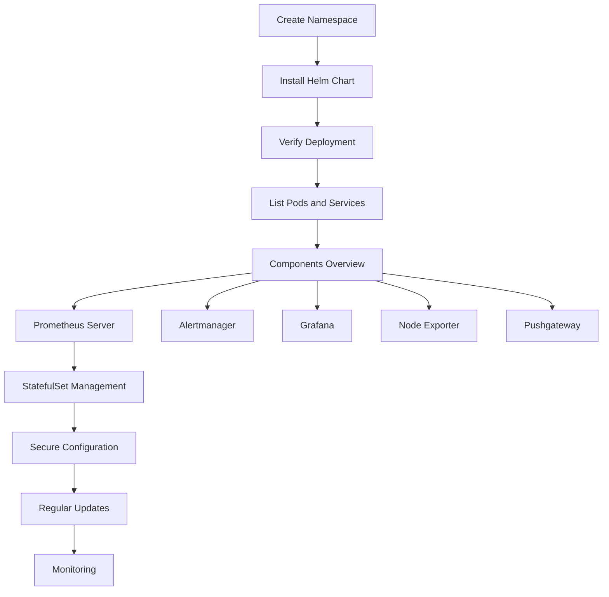

## Introduction to Prometheus and EKS

Prometheus is an open-source systems monitoring and alerting toolkit originally built at SoundCloud. It is now a Cloud Native Computing Foundation (CNCF) project. Prometheus collects metrics from configured targets at specified intervals and stores them within a time series database. The data can be visualized and queried using PromQL, a powerful declarative query language.

Elastic Kubernetes Service (EKS) is a fully managed Kubernetes service provided by Amazon Web Services (AWS). It allows you to run Kubernetes clusters in the AWS cloud without having to manage the underlying infrastructure.

In this section, we will cover how to deploy Prometheus on EKS using operators, ensuring a robust and scalable monitoring solution.

### Creating a Namespace for Monitoring

Before deploying Prometheus, it is essential to create a dedicated namespace for monitoring purposes. This helps in isolating the monitoring components from other applications, making management and troubleshooting easier.

```bash
kubectl create namespace monitoring
```

This command creates a new namespace named `monitoring`. Namespaces provide a scope for names, allowing multiple teams to use the same cluster without naming conflicts.

### Installing Prometheus via Helm Chart

Helm is a package manager for Kubernetes that simplifies the deployment and management of applications. We will use a Helm chart to install Prometheus.

#### Helm Chart Setup

The Helm chart we will use is called `Cube Prometheus stack`, which is a pre-configured set of components designed to work together seamlessly.

```bash
helm repo add cube https://cube.dev/charts
helm repo update
```

These commands add the Cube repository to your local Helm client and update the local cache of charts.

#### Installing the Chart

Now, we can install the Prometheus stack in the `monitoring` namespace:

```bash
helm install monitoring cube/prometheus-stack --namespace monitoring
```

This command installs the `prometheus-stack` chart from the Cube repository, naming the release `monitoring` and specifying the `monitoring` namespace.

### Understanding the Deployment

Once the installation is complete, we can verify the deployment by checking the pods and services in the `monitoring` namespace.

```bash
kubectl get pods -n monitoring
kubectl get svc -n monitoring
```

These commands list all the pods and services in the `monitoring` namespace, respectively.

### Components of the Prometheus Stack

The Prometheus stack consists of several key components:

1. **Prometheus Server**: The core component responsible for scraping metrics from targets and storing them.
2. **Alertmanager**: Manages alerts sent by Prometheus and handles notifications.
3. **Grafana**: A visualization tool for creating dashboards and graphs.
4. **Node Exporter**: Collects system metrics from nodes.
5. **Pushgateway**: Accepts metrics from short-lived jobs and exposes them to Prometheus.

#### Prometheus Server

The Prometheus server is the central component that scrapes metrics from various targets and stores them in a time-series database. It is deployed as a StatefulSet in Kubernetes, ensuring consistent storage and recovery.

```yaml
apiVersion: apps/v1
kind: StatefulSet
metadata:
  name: prometheus-server
spec:
  serviceName: prometheus-server
  replicas: 1
  template:
    spec:
      containers:
      - name: prometheus-server
        image: prom/prometheus:v2.35.0
        ports:
        - containerPort: 9090
```

This YAML defines a StatefulSet for the Prometheus server, specifying the image and port.

### Managing High-Level Components

The Prometheus stack includes two StatefulSets: one for the Prometheus server and another for the Alertmanager.

#### Prometheus StatefulSet

The Prometheus StatefulSet manages the core Prometheus server. It ensures that the server is running and provides a consistent storage mechanism.

```yaml
apiVersion: apps/v1
kind: StatefulSet
metadata:
  name: prometheus-server
spec:
  serviceName: prometheus-server
  replicas: 1
  template:
    spec:
      containers:
      - name: prometheus-server
        image: prom/prometheus:v2.35.0
        ports:
        - containerPort: 9090
```

This YAML defines the StatefulSet for the Prometheus server, ensuring it runs consistently.

### How to Prevent / Defend

#### Detection

To detect issues with the Prometheus deployment, you can monitor the logs and metrics of the Prometheus server and other components.

```bash
kubectl logs -l app=prometheus -n monitoring
```

This command retrieves the logs from the Prometheus server pod.

#### Prevention

To prevent issues, ensure proper configuration and monitoring:

1. **Secure Configuration**: Use secure configurations for the Prometheus server and other components.
2. **Regular Updates**: Keep the Prometheus server and other components up to date with the latest versions.
3. **Monitoring**: Set up alerts for critical metrics and regularly review logs.

#### Secure Code Fix

Here is an example of a vulnerable configuration and its secure counterpart:

**Vulnerable Configuration:**

```yaml
server:
  listenAddress: ":9090"
```

**Secure Configuration:**

```yaml
server:
  listenAddress: ":9090"
  tlsConfig:
    certFile: /etc/prometheus/prometheus.crt
    keyFile: /etc/prometheus/prometheus.key
```

This secure configuration adds TLS encryption to the Prometheus server.

### Real-World Examples

#### Recent CVEs and Breaches

One notable breach involving Prometheus was the exposure of sensitive metrics due to misconfigured access controls. In this case, Prometheus was accessible from the internet, leading to unauthorized access to sensitive data.

#### Example: CVE-2021-25285

CVE-2021-25285 is a vulnerability in the Prometheus server that allows remote code execution. This vulnerability highlights the importance of keeping Prometheus and other components up to date.

### Hands-On Labs

For hands-on practice, consider the following labs:

- **PortSwigger Web Security Academy**: Offers a comprehensive set of labs covering various aspects of web security.
- **OWASP Juice Shop**: A deliberately insecure web application for security training.
- **DVWA (Damn Vulnerable Web Application)**: Another popular web application for security testing.

### Conclusion

Deploying Prometheus on EKS using operators provides a robust and scalable monitoring solution. By creating a dedicated namespace, installing the Prometheus stack via Helm, and understanding the components involved, you can effectively monitor your Kubernetes cluster. Regular updates, secure configurations, and proper monitoring are crucial for maintaining a secure and reliable environment.



This diagram illustrates the process of deploying Prometheus on EKS, highlighting the key steps and components involved.

---
<!-- nav -->
[[02-Introduction to Prometheus and Config Reloader|Introduction to Prometheus and Config Reloader]] | [[DevOps/DevOps Bootcamp/10-Monitoring & Alerting/08-Deploying Prometheus on EKS Using Operators/00-Overview|Overview]] | [[04-Introduction to Prometheus and Monitoring in Kubernetes|Introduction to Prometheus and Monitoring in Kubernetes]]
