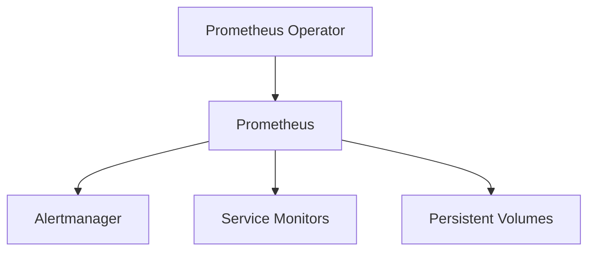

## Deploying Prometheus on EKS Using Operators

### Background Theory

Amazon Elastic Kubernetes Service (EKS) is a managed Kubernetes service that allows you to run Kubernetes clusters in the AWS cloud. EKS provides a scalable and reliable platform for deploying and managing Kubernetes applications.

### Step-by-Step Mechanics

To deploy Prometheus on EKS using Operators, you will need to follow these steps:

1. **Create an EKS Cluster**: Use the `eksctl` command-line tool to create an EKS cluster.
2. **Install the Prometheus Operator**: Use Helm to install the Prometheus Operator.
3. **Deploy Prometheus**: Use the Prometheus Operator to deploy the Prometheus monitoring stack.

### Complete Code Examples

#### Creating an EKS Cluster

First, create an EKS cluster using the `eksctl` command-line tool.

```bash
eksctl create cluster --name my-cluster --region us-west-2
```

This command creates an EKS cluster named `my-cluster` in the `us-west-2` region.

#### Installing the Prometheus Operator

Next, install the Prometheus Operator using Helm.

```bash
helm repo add prometheus-community https://prometheus-community.github.io/helm-charts
helm repo update
helm install prometheus-operator prometheus-community/prometheus-operator
```

These commands add the Prometheus Helm repository, update the repository, and install the Prometheus Operator.

#### Deploying Prometheus

Finally, deploy Prometheus using the Prometheus Operator.

```yaml
apiVersion: monitoring.coreos.com/v1
kind: Prometheus
metadata:
  name: prometheus
spec:
  replicas: 2
  serviceAccountName: prometheus
  serviceMonitorSelector:
    matchLabels:
      app: myapp
```

Save this YAML file as `prometheus.yaml` and apply it using `kubectl`.

```bash
kubectl apply -f prometheus.yaml
```

### Mermaid Diagrams

#### Network Topology



This diagram shows the network topology of the Prometheus monitoring stack managed by the Prometheus Operator.

### Common Mistakes

One common mistake is forgetting to configure the service account and role bindings correctly. Ensure that the service account has the necessary permissions to manage the Prometheus resources.

### How to Prevent / Defend

To prevent issues, ensure that you have properly configured the service account and role bindings. Additionally, ensure that you have proper monitoring and logging in place to detect and respond to issues quickly.

### Detection and Prevention

To detect issues, use Kubernetes monitoring tools such as Prometheus and Grafana to monitor the health and performance of the Prometheus stack. To prevent issues, ensure that you have proper backups and disaster recovery plans in place.

### Secure Coding Fixes

Here is an example of a vulnerable configuration and the corresponding secure configuration:

#### Vulnerable Configuration

```yaml
apiVersion: v1
kind: ServiceAccount
metadata:
  name: prometheus
---
apiVersion: rbac.authorization.k8s.io/v1
kind: ClusterRoleBinding
metadata:
  name: prometheus
roleRef:
  apiGroup: rbac.authorization.k8s.io
  kind: ClusterRole
  name: cluster-admin
subjects:
- kind: ServiceAccount
  name: prometheus
```

#### Secure Configuration

```yaml
apiVersion: v1
kind: ServiceAccount
metadata:
  name: prometheus
---
apiVersion: rbac.authorization.k8s.io/v1
kind: Role
metadata:
  name: prometheus-role
rules:
- apiGroups: [""]
  resources: ["pods", "services"]
  verbs: ["get", "list", "watch"]
---
apiVersion: rbac.authorization.k8s.io/v1
kind: RoleBinding
metadata:
  name: prometheus-binding
roleRef:
  apiGroup: rbac.authorization.k8s.io
  kind: Role
  name: prometheus-role
subjects:
- kind: ServiceAccount
  name: prometheus
```

In the secure configuration, the service account is granted only the necessary permissions to manage the Prometheus resources.

### Hands-On Labs

To practice deploying Prometheus on EKS using Operators, you can use the following labs:

- **PortSwigger Web Security Academy**: This lab provides a comprehensive guide to deploying Prometheus on EKS using Operators.
- **OWASP Juice Shop**: This lab provides a hands-on experience with deploying Prometheus on EKS using Operators.

By following these steps and using the provided examples, you can successfully deploy Prometheus on EKS using Operators.

---
<!-- nav -->
[[04-Introduction to Prometheus and Monitoring in Kubernetes|Introduction to Prometheus and Monitoring in Kubernetes]] | [[DevOps/DevOps Bootcamp/10-Monitoring & Alerting/08-Deploying Prometheus on EKS Using Operators/00-Overview|Overview]] | [[06-Helm Charts|Helm Charts]]
