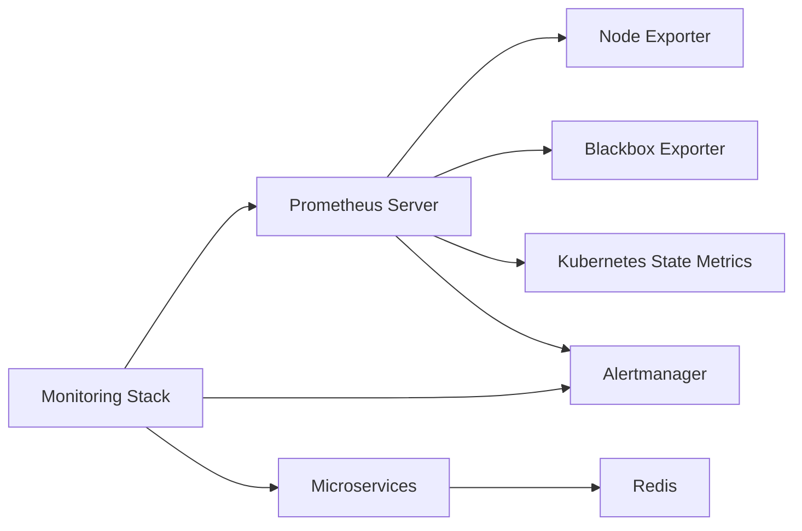

## Setting Up an Amazon EKS Cluster

Before diving into deploying Prometheus on an Amazon EKS (Elastic Kubernetes Service) cluster, let's understand the basics of setting up an EKS cluster. This involves creating a cluster with worker nodes and configuring the necessary AWS credentials.

### Creating an EKS Cluster

To create an EKS cluster, you need to configure your AWS credentials and specify the region where the cluster will be created. The cluster will consist of one or more worker nodes, which are EC2 instances managed by the EKS service.

#### Configuring AWS Credentials

AWS credentials are used to authenticate API requests made to AWS services. These credentials typically consist of an access key ID and a secret access key. You can configure these credentials using the `aws configure` command:

```bash
aws configure
```

This command prompts you to enter your access key ID and secret access key. Once configured, these credentials will be used to interact with AWS services.

#### Specifying the Region

The region specifies the geographical location where the EKS cluster will be created. For example, `us-east-1` (N. Virginia) is a commonly used region. You can specify the region using the `--region` flag in AWS CLI commands.

#### Creating the Cluster

To create an EKS cluster, you can use the `eksctl` tool, which is a command-line interface for creating and managing EKS clusters. Here is an example command to create a cluster with two worker nodes in the `us-east-1` region:

```bash
eksctl create cluster --name my-cluster --region us-east-1 --nodes 2
```

This command creates a cluster named `my-cluster` with two worker nodes in the `us-east-1` region. The creation process may take around 10 to 15 minutes to complete.

### Verifying the Cluster

Once the cluster is created, you can verify its status and view the nodes using the following commands:

```bash
kubectl get nodes
```

This command lists the nodes in the cluster. You should see two worker nodes listed.

### Deploying Microservices Application

With the cluster set up, you can now deploy the microservices application. This involves creating a YAML file that defines the deployment specifications for each microservice.

#### YAML File for Microservices

Here is an example YAML file for deploying a microservices application:

```yaml
apiVersion: apps/v1
kind: Deployment
metadata:
  name: email-service
spec:
  replicas: 1
  selector:
    matchLabels:
      app: email-service
  template:
    metadata:
      labels:
        app: email-service
    spec:
      containers:
      - name: email-service
        image: my-email-service:latest
        ports:
        - containerPort: 8080
---
apiVersion: apps/v1
kind: Deployment
metadata:
  name: recommendation-service
spec:
  replicas: 1
  selector:
    matchLabels:
      app: recommendation-service
  template:
    metadata:
      labels:
        app: recommendation-service
    spec:
      containers:
      - name: recommendation-service
        image: my-recommendation-service:latest
        ports:
        - containerPort: 8080
---
apiVersion: v1
kind: Service
metadata:
  name: redis
spec:
  ports:
  - port: 6379
  selector:
    app: redis
---
apiVersion: apps/v1
kind: Deployment
metadata:
  name: redis
spec:
  replicas: 1
  selector:
    matchLabels:
      app: redis
  template:
    metadata:
      labels:
        app: redis
    spec:
      containers:
      - name: redis
        image: redis:latest
        ports:
        - containerPort: 6379
```

This YAML file defines deployments for the `email-service`, `recommendation-service`, and `redis`. Each deployment specifies the number of replicas, the container image, and the exposed ports.

### Deploying the YAML File

To deploy the microservices application, you can use the `kubectl apply` command:

```bash
kubectl apply -f microservices.yaml
```

This command applies the YAML file and deploys the microservices to the cluster.

### Monitoring Stack Setup

Now that the microservices application is deployed, you can set up a monitoring stack to monitor the cluster and the applications running inside it. One popular choice for monitoring is Prometheus, which can be deployed using a Helm chart.

#### Helm Chart for Prometheus

Helm is a package manager for Kubernetes that simplifies the deployment and management of applications. A Helm chart is a collection of files that describe a related set of Kubernetes resources.

To deploy Prometheus using a Helm chart, you need to follow these steps:

1. **Add the Helm Repository**
2. **Update the Helm Repository**
3. **Install the Helm Chart**

##### Adding the Helm Repository

First, you need to add the Helm repository where the Prometheus chart is located. You can do this using the `helm repo add` command:

```bash
helm repo add prometheus-community https://prometheus-community.github.io/helm-charts
```

This command adds the `prometheus-community` repository to your local Helm configuration.

##### Updating the Helm Repository

After adding the repository, you need to update it to ensure that you have the latest versions of the charts:

```bash
helm repo update
```

This command updates the local cache of available charts.

##### Installing the Helm Chart

Finally, you can install the Prometheus chart using the `helm install` command. You can specify the namespace where the monitoring stack will be installed:

```bash
helm install prometheus prometheus-community/prometheus --namespace monitoring
```

This command installs the Prometheus chart in the `monitoring` namespace.

### Monitoring Stack Architecture

Let's visualize the architecture of the monitoring stack using a Mermaid diagram:



In this diagram:
- **Prometheus Server**: Collects metrics from various exporters.
- **Node Exporter**: Exposes hardware and OS metrics.
- **Blackbox Exporter**: Monitors endpoints over HTTP, DNS, etc.
- **Kubernetes State Metrics**: Exposes Kubernetes cluster state metrics.
- **Alertmanager**: Manages alerts sent by Prometheus.
- **Microservices**: Represents the deployed microservices.
- **Redis**: Represents the Redis service.
- **Monitoring Stack**: Represents the overall monitoring stack.

### Common Pitfalls and How to Prevent Them

#### Misconfigured Permissions

One common pitfall is misconfigured permissions, which can lead to unauthorized access to sensitive data. To prevent this, ensure that IAM roles and policies are correctly configured to grant only the necessary permissions.

**Secure Configuration Example:**

```json
{
  "Version": "2012-10-17",
  "Statement": [
    {
      "Effect": "Allow",
      "Action": [
        "eks:DescribeCluster",
        "eks:ListClusters"
      ],
      "Resource": "*"
    }
  ]
}
```

**Vulnerable Configuration Example:**

```json
{
  "Version": "2012-10-17",
  "Statement": [
    {
      "Effect": "Allow",
      "Action": "*",
      "Resource": "*"
    }
  ]
}
```

#### Insecure Communication

Another pitfall is insecure communication between components. Ensure that all communication channels are encrypted using TLS.

**Secure Configuration Example:**

```yaml
apiVersion: v1
kind: Secret
metadata:
  name: tls-secret
type: kubernetes.io/tls
data:
  tls.crt: <base64 encoded certificate>
  tls.key: <base64 encoded key>
```

**Vulnerable Configuration Example:**

```yaml
apiVersion: v1
kind: Secret
metadata:
  name: tls-secret
type: Opaque
data:
  tls.crt: <base64 encoded certificate>
  tls.key: <base64 encoded key>
```

### Real-World Examples

#### CVE-2021-25741

CVE-2021-25741 is a critical vulnerability in Kubernetes that allows attackers to bypass RBAC (Role-Based Access Control) restrictions. This vulnerability highlights the importance of keeping your Kubernetes components up to date and ensuring that RBAC policies are correctly configured.

**Detection:**

Use tools like `kube-bench` to scan your cluster for vulnerabilities and misconfigurations.

**Prevention:**

Ensure that all Kubernetes components are updated to the latest version and that RBAC policies are correctly configured to restrict access to sensitive resources.

### Hands-On Labs

For hands-on practice, consider the following labs:

- **PortSwigger Web Security Academy**: Offers a comprehensive set of labs for learning web security concepts.
- **OWASP Juice Shop**: A deliberately insecure web application for practicing web security skills.
- **DVWA (Damn Vulnerable Web Application)**: Another intentionally vulnerable web application for security training.
- **WebGoat**: An interactive web security training application.

These labs provide practical experience in deploying and securing Kubernetes clusters and microservices applications.

By following these steps and best practices, you can effectively set up and manage an EKS cluster with a robust monitoring stack using Prometheus.

---
<!-- nav -->
[[07-Operators|Operators]] | [[DevOps/DevOps Bootcamp/10-Monitoring & Alerting/08-Deploying Prometheus on EKS Using Operators/00-Overview|Overview]] | [[09-StatefulSets and Deployments|StatefulSets and Deployments]]
