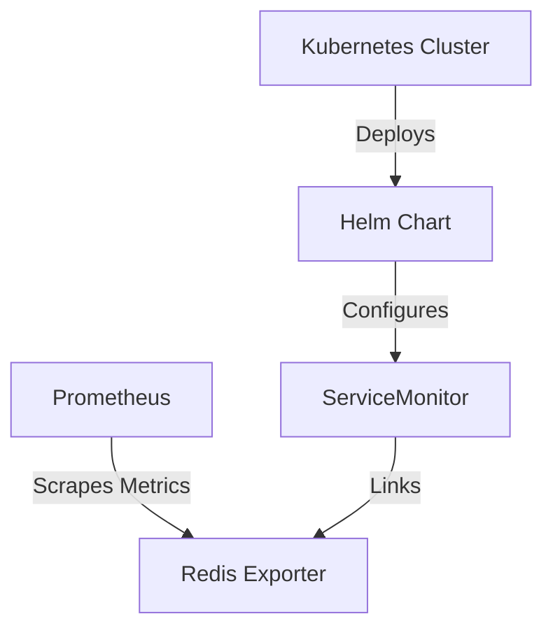

## Introduction to Redis Exporter Deployment Using Helm Charts

In this section, we will delve into the process of deploying the Redis Exporter using Helm charts. We will cover the necessary background, the steps involved, and the underlying concepts. Additionally, we will discuss potential pitfalls and how to defend against them.

### Background Theory

#### What is Redis?
Redis is an open-source, in-memory data structure store, used as a database, cache, and message broker. It supports various data structures such as strings, hashes, lists, sets, and sorted sets. Redis is widely used due to its high performance and flexibility.

#### What is Prometheus?
Prometheus is an open-source monitoring system and time series database. It collects metrics from configured targets at specified intervals and stores them internally. Prometheus provides a flexible query language to analyze these metrics and can alert on defined conditions.

#### What is the Redis Exporter?
The Redis Exporter is a Prometheus exporter that scrapes Redis instances and exposes metrics about their health and performance. These metrics can then be consumed by Prometheus for monitoring purposes.

#### What is a Helm Chart?
Helm is a package manager for Kubernetes that simplifies the deployment and management of applications. A Helm chart is a collection of files that describe a related set of Kubernetes resources. It allows you to define, install, and upgrade even the most complex Kubernetes applications reliably.

### Deploying Redis Exporter Using Helm Charts

To deploy the Redis Exporter using a Helm chart, we need to understand the components involved and the configuration options available.

#### Default Values and Overridable Attributes

When you click into the Helm chart for the Redis Exporter, you will see a set of default values and attributes that can be overridden. Some key attributes include:

- **Replica Count**: This determines the number of replicas of the Redis Exporter pods. By default, it is set to 1. To run the exporter in a high availability mode, you can increase this value.
- **Image Repository**: This specifies the Docker image or repository for the Redis Exporter application.
- **Environment Variables**: You can configure additional environment variables for the Redis Exporter.

Here is an example of the default values.yaml file:

```yaml
replicaCount: 1
image:
  repository: prom/blackbox-exporter
  tag: v0.18.0
serviceMonitor:
  enabled: false
```

#### Creating a Custom Values File

To customize the deployment, we need to create a `values.yaml` file in our project repository. This file will contain the specific configurations we want to apply.

Let's create a `redis-values.yaml` file and set the `serviceMonitor.enabled` attribute to `true`.

```yaml
# redis-values.yaml
serviceMonitor:
  enabled: true
```

This configuration tells the Helm chart to create a `ServiceMonitor` component when installing the chart.

### Service Monitor Component

A `ServiceMonitor` is a custom resource definition (CRD) used by Prometheus Operator to discover and scrape targets. It acts as a bridge between the exporter and Prometheus.

#### Purpose of Service Monitor

The `ServiceMonitor` component is essential because it informs Prometheus about the targets to scrape. Without it, Prometheus would not know about the Redis Exporter and would not scrape its metrics.

#### Enabling Service Monitor

By setting `serviceMonitor.enabled` to `true`, we instruct the Helm chart to create a `ServiceMonitor` resource. Here is an example of what the `ServiceMonitor` resource might look like:

```yaml
apiVersion: monitoring.coreos.com/v1
kind: ServiceMonitor
metadata:
  name: redis-exporter
spec:
  selector:
    matchLabels:
      app: redis-exporter
  endpoints:
  - port: http-metrics
    interval: 15s
```

### Installing the Helm Chart

To install the Redis Exporter using the Helm chart, we need to run the following commands:

```sh
helm repo add prometheus-community https://prometheus-community.github.io/helm-charts
helm repo update
helm install redis-exporter prometheus-community/prometheus-blackbox-exporter --values redis-values.yaml
```

### Full Example of Installation and Configuration

#### Complete Helm Install Command

```sh
helm install redis-exporter prometheus-community/prometheus-blackbox-exporter --values redis-values.yaml
```

#### Full Raw HTTP Request and Response

Since this is a CLI command, there is no HTTP request or response. However, the output of the installation command would look something like this:

```sh
NAME: redis-exporter
LAST DEPLOYED: <timestamp>
NAMESPACE: default
STATUS: deployed
REVISION: 1
TEST SUITE: None
```

### Diagrams and Topologies

#### Kubernetes Topology Diagram



### Potential Pitfalls and How to Prevent Them

#### Pitfall: Prometheus Not Scraping Metrics

If Prometheus does not scrape the metrics from the Redis Exporter, it could be due to several reasons:

- **Service Monitor Not Enabled**: Ensure that `serviceMonitor.enabled` is set to `true`.
- **Incorrect Endpoint Configuration**: Verify that the `ServiceMonitor` endpoint configuration matches the actual endpoint exposed by the Redis Exporter.

#### Secure Code Fix

**Vulnerable Configuration:**

```yaml
serviceMonitor:
  enabled: false
```

**Fixed Configuration:**

```yaml
serviceMonitor:
  enabled: true
```

#### Detection and Prevention

**Detection:**
- Check the Prometheus logs to ensure that it is attempting to scrape the Redis Exporter.
- Use the Prometheus UI to verify that the Redis Exporter is listed as a target.

**Prevention:**
- Always enable the `ServiceMonitor` component.
- Validate the configuration of the `ServiceMonitor` to ensure it correctly points to the Redis Exporter.

### Real-World Examples

#### Recent Breaches and CVEs

While there are no specific CVEs related to the Redis Exporter itself, misconfigurations in monitoring systems can lead to security issues. For example, exposing Prometheus metrics to unauthorized users can reveal sensitive information about the system.

#### Example: Exposed Prometheus Metrics

In a real-world scenario, if Prometheus metrics are exposed to the internet without proper authentication, an attacker could gain insights into the internal workings of the system. This could potentially lead to further attacks.

### Hands-On Labs

For hands-on practice, you can use the following labs:

- **PortSwigger Web Security Academy**: Offers a variety of labs related to web security, including monitoring and logging.
- **OWASP Juice Shop**: A deliberately insecure web application for security training.
- **Kubernetes Goat**: A Kubernetes-based security training platform.

### Conclusion

Deploying the Redis Exporter using Helm charts is a straightforward process once you understand the underlying concepts and configurations. By ensuring that the `ServiceMonitor` is properly configured, you can effectively integrate the Redis Exporter with Prometheus for comprehensive monitoring. Always validate your configurations and use secure practices to prevent potential security issues.

---
<!-- nav -->
[[01-Introduction to Prometheus and Service Monitors|Introduction to Prometheus and Service Monitors]] | [[DevOps/DevOps Bootcamp/10-Monitoring & Alerting/09-Deploying Redis Exporter Using Helm Chart/00-Overview|Overview]] | [[03-Introduction to Redis and Prometheus Monitoring|Introduction to Redis and Prometheus Monitoring]]
