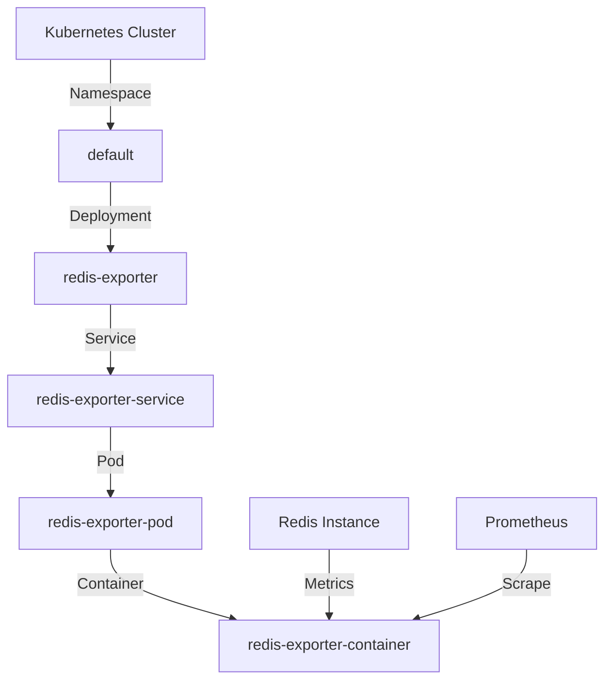

## Deploying Redis Exporter Using Helm Chart

Helm is a package manager for Kubernetes that simplifies the deployment and management of applications. A **Helm chart** is a collection of files that describe a related set of Kubernetes resources. Using a Helm chart to deploy the Redis exporter provides several benefits:

1. **Consistency**: Ensures that the deployment is consistent across different environments.
2. **Ease of Management**: Simplifies the management of the deployment through Helm commands.
3. **Customization**: Allows customization of the deployment through configurable parameters.

### Steps to Deploy Redis Exporter Using Helm Chart

#### Step 1: Install Helm

Before deploying the Redis exporter, ensure that Helm is installed on your system. You can install Helm by following the official documentation.

```bash
curl https://raw.githubusercontent.com/helm/helm/main/scripts/get-helm-3 | bash
```

#### Step 2: Add the Prometheus Community Helm Repository

The Prometheus community maintains a repository of Helm charts for various exporters. Add this repository to your Helm setup.

```bash
helm repo add prometheus-community https://prometheus-community.github.io/helm-charts
helm repo update
```

#### Step 3: Deploy the Redis Exporter

Use the `helm install` command to deploy the Redis exporter. The following example demonstrates how to deploy the Redis exporter with default settings.

```bash
helm install redis-exporter prometheus-community/prometheus-redis-exporter \
  --set redisHost=<your-redis-host> \
  --set redisPort=<your-redis-port>
```

Replace `<your-redis-host>` and `<your-redis-port>` with the actual host and port of your Redis instance.

### Complete Example

Here is a complete example of deploying the Redis exporter using Helm:

```bash
# Add the Prometheus community Helm repository
helm repo add prometheus-community https://prometheus-community.github.io/helm-charts
helm repo update

# Deploy the Redis exporter
helm install redis-exporter prometheus-community/prometheus-redis-exporter \
  --set redisHost=redis-master.default.svc.cluster.local \
  --set redisPort=6379
```

### Full Raw HTTP Request and Response

When deploying the Redis exporter using Helm, the interaction is primarily through the Helm CLI. However, the underlying Kubernetes API is involved. Here is a simplified representation of the HTTP request and response for deploying a Helm chart:

```http
POST /apis/helm/v1/namespaces/default/charts HTTP/1.1
Host: kubernetes-api-server
Content-Type: application/json

{
  "chart": "prometheus-redis-exporter",
  "namespace": "default",
  "values": {
    "redisHost": "redis-master.default.svc.cluster.local",
    "redisPort": 6379
  }
}
```

```http
HTTP/1.1 201 Created
Content-Type: application/json

{
  "status": "deployed",
  "namespace": "default",
  "releaseName": "redis-exporter"
}
```

### Diagram: Kubernetes Topology

The following diagram illustrates the topology of the Kubernetes cluster after deploying the Redis exporter using Helm.



### Common Pitfalls and How to Avoid Them

#### 1. Incorrect Configuration

**Issue**: Misconfiguration of the Redis exporter can lead to incorrect or incomplete metric collection.

**Solution**: Carefully review the configuration parameters and ensure they match the actual Redis instance settings.

#### 2. Resource Constraints

**Issue**: Insufficient resources allocated to the Redis exporter can affect its performance.

**Solution**: Monitor the resource usage of the Redis exporter and adjust the resource limits accordingly.

#### 3. Security Vulnerabilities

**Issue**: Insecure communication between the Redis exporter and the Redis instance can expose sensitive data.

**Solution**: Use secure communication protocols (e.g., TLS) and restrict access to the Redis instance.

### How to Prevent / Defend

#### Detection

Monitor the logs and metrics of the Redis exporter to detect any anomalies or errors. Use tools like Prometheus and Grafana to visualize the metrics and set up alerts.

#### Prevention

1. **Secure Communication**: Use TLS to encrypt the communication between the Redis exporter and the Redis instance.
2. **Access Control**: Restrict access to the Redis instance and the Redis exporter using network policies and RBAC (Role-Based Access Control).
3. **Regular Updates**: Keep the Redis exporter and its dependencies up to date to mitigate known vulnerabilities.

#### Secure Coding Fixes

Compare the vulnerable and secure versions of the configuration:

**Vulnerable Configuration**

```yaml
apiVersion: v1
kind: ConfigMap
metadata:
  name: redis-exporter-config
data:
  REDIS_HOST: redis-master.default.svc.cluster.local
  REDIS_PORT: "6379"
```

**Secure Configuration**

```yaml
apiVersion: v1
kind: ConfigMap
metadata:
  name: redis-exporter-config
data:
  REDIS_HOST: redis-master.default.svc.cluster.local
  REDIS_PORT: "6379"
  REDIS_TLS: "true"
  REDIS_CERT_FILE: "/etc/ssl/certs/redis-cert.pem"
  REDIS_KEY_FILE: "/etc/ssl/private/redis-key.pem"
```

### Real-World Examples and Breaches

#### CVE-2021-27415

This CVE highlights a vulnerability in the Redis exporter that could allow an attacker to execute arbitrary code. To prevent such vulnerabilities, ensure that the Redis exporter is kept up to date and that secure coding practices are followed.

### Hands-On Labs

To practice deploying the Redis exporter using Helm, consider the following labs:

- **PortSwigger Web Security Academy**: Offers a comprehensive course on Kubernetes security, including deployment and monitoring.
- **Kubernetes Goat**: Provides a hands-on environment to practice deploying and securing Kubernetes applications.

By following these steps and best practices, you can effectively deploy and manage the Redis exporter in your Kubernetes cluster, ensuring robust monitoring and alerting capabilities.

---
<!-- nav -->
[[03-Introduction to Redis and Prometheus Monitoring|Introduction to Redis and Prometheus Monitoring]] | [[DevOps/DevOps Bootcamp/10-Monitoring & Alerting/09-Deploying Redis Exporter Using Helm Chart/00-Overview|Overview]] | [[05-Understanding Exporters in Monitoring|Understanding Exporters in Monitoring]]
