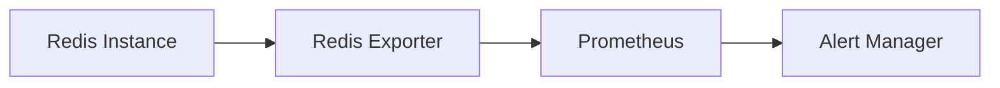

## Understanding Exporters in Monitoring

In the context of monitoring systems, an **exporter** is a specialized component designed to collect and expose metrics from a specific application or system. These metrics are typically in a format that can be easily consumed by monitoring tools like Prometheus. The primary role of an exporter is to bridge the gap between the monitored application and the monitoring system, translating the application-specific metrics into a standardized format.

### Why Use Exporters?

Exporters are crucial because many applications do not natively provide metrics in a format that is easily consumable by monitoring systems. By using an exporter, you can:

1. **Standardize Metrics**: Convert application-specific metrics into a standard format (e.g., Prometheus exposition format).
2. **Ease of Integration**: Simplify the integration process by providing a consistent interface for monitoring tools.
3. **Enhanced Monitoring Capabilities**: Enable more detailed and granular monitoring of the application.

### Example: Redis Exporter

The Redis exporter is specifically designed to collect metrics from Redis instances. Redis is an in-memory data structure store, often used as a database, cache, and message broker. Monitoring Redis is essential to ensure optimal performance and to detect issues such as high memory usage or slow response times.

### How Does the Redis Exporter Work?

The Redis exporter works by:

1. **Connecting to Redis**: Establishing a connection to the Redis instance.
2. **Collecting Metrics**: Retrieving various metrics from Redis, such as memory usage, key space statistics, and operation counts.
3. **Exposing Metrics**: Exposing these metrics in a format that Prometheus can scrape.

### Real-World Example: Redis Memory Pressure

Consider a scenario where a Redis instance is running out of memory. This can lead to performance degradation and even crashes. By using the Redis exporter, you can monitor memory usage and set up alerts to notify you when memory usage exceeds a certain threshold.

### Deployment Considerations

Deploying the Redis exporter requires careful consideration of several factors:

1. **Resource Usage**: Ensure that the exporter does not consume excessive resources.
2. **Security**: Secure the communication between the exporter and the monitored application.
3. **Configuration**: Properly configure the exporter to collect the necessary metrics.

---
<!-- nav -->
[[04-Deploying Redis Exporter Using Helm Chart|Deploying Redis Exporter Using Helm Chart]] | [[DevOps/DevOps Bootcamp/10-Monitoring & Alerting/09-Deploying Redis Exporter Using Helm Chart/00-Overview|Overview]] | [[DevOps/DevOps Bootcamp/10-Monitoring & Alerting/09-Deploying Redis Exporter Using Helm Chart/06-Practice Questions & Answers|Practice Questions & Answers]]
