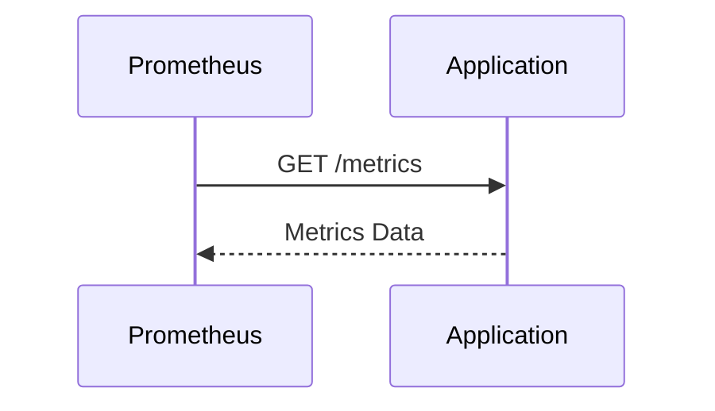

## Introduction to Exposing Metrics with Prometheus Client Libraries

In the realm of DevOps and system monitoring, one of the most critical aspects is the ability to measure and analyze the performance and health of applications. This is where metrics come into play. Metrics provide quantitative data about the behavior of an application, allowing us to understand its performance and identify potential issues. One of the most popular tools for collecting and analyzing these metrics is Prometheus.

Prometheus is an open-source systems monitoring and alerting toolkit originally built at SoundCloud. It is designed to be highly scalable and flexible, making it suitable for monitoring complex distributed systems. At the core of Prometheus is its ability to collect metrics from various sources, including custom applications, through the use of client libraries.

### Key Metrics to Monitor

Two primary metrics that are often monitored are:

1. **Number of Requests**: This metric tracks the total number of requests received by the application. Monitoring this helps us understand the load on the application at any given time.
   
2. **Duration of Requests**: This metric measures the time taken by the application to process each request. High durations can indicate performance bottlenecks or other issues that need to be addressed.

#### Why These Metrics Matter

- **Load Management**: By tracking the number of requests, we can ensure that the application is not overloaded, which could lead to performance degradation or even crashes.
  
- **Performance Optimization**: Monitoring the duration of requests allows us to identify slow operations and optimize them, leading to better overall performance.

### Role of DevOps Engineers and Developers

In a typical scenario, the DevOps engineer or Kubernetes administrator sets up the monitoring infrastructure within the cluster. However, integrating custom applications into this monitoring setup requires collaboration with the development team. The DevOps engineer typically communicates the requirements to the developers, who then integrate the necessary Prometheus client libraries into their codebase.

### Prometheus Client Libraries

Prometheus client libraries are software packages that allow applications to expose metrics in a format that Prometheus can scrape. These libraries are available for various programming languages, such as Java, Python, Go, and more. The choice of library depends on the language used in the application.

#### Example: Integrating Prometheus Client Library in Python

Let's consider a Python application and demonstrate how to integrate the Prometheus client library to expose the required metrics.

```python
from prometheus_client import Counter, Histogram, start_http_server

# Define metrics
REQUEST_COUNT = Counter('app_requests_total', 'Total number of requests')
REQUEST_DURATION = Histogram('app_request_duration_seconds', 'Request duration in seconds')

def handle_request():
    start_time = time.time()
    
    # Simulate request processing
    time.sleep(1)
    
    duration = time.time() - start_time
    
    # Increment request counter
    REQUEST_COUNT.inc()
    
    # Observe request duration
    REQUEST_DURATION.observe(duration)

if __name__ == '__main__':
    start_http_server(8000)  # Start server to expose metrics on port 8000
    while True:
        handle_request()
```

### Explanation of the Code

- **Counter**: A `Counter` is used to track the total number of requests. Each time a request is handled, the counter is incremented using `inc()`.

- **Histogram**: A `Histogram` is used to measure the duration of requests. The `observe()` method records the duration of each request.

- **start_http_server**: This function starts an HTTP server that exposes the metrics on a specified port (in this case, 8000).

### Full HTTP Request and Response

When Prometheus scrapes the metrics endpoint, it sends an HTTP GET request to the server. Here is an example of the full HTTP request and response:

```http
GET /metrics HTTP/1.1
Host: localhost:8000
User-Agent: Prometheus/2.30.1
Accept: */*
Connection: close
```

```http
HTTP/1.0 200 OK
Content-Type: text/plain; version=0.0.4
Date: Mon, 01 Jan 2024 00:00:00 GMT
Server: BaseHTTP/0.3 Python/3.9.16
Content-Length: 123

# HELP app_requests_total Total number of requests
# TYPE app_requests_total counter
app_requests_total 10
# HELP app_request_duration_seconds Request duration in seconds
# TYPE app_request_duration_seconds histogram
app_request_duration_seconds_bucket{le="0.005"} 0
app_request_duration_seconds_bucket{le="0.01"} 0
app_request_duration_seconds_bucket{le="0.025"} 0
app_request_duration_seconds_bucket{le="0.05"} 0
app_request_duration_seconds_bucket{le="0.1"} 0
app_request_duration_seconds_bucket{le="0.25"} 0
app_request_duration_seconds_bucket{le="0.5"} 0
app_request_duration_seconds_bucket{le="1"} 10
app_request_duration_seconds_bucket{le="+Inf"} 10
app_request_duration_seconds_sum 10
app_request_duration_seconds_count 10
```

### Diagram: Prometheus Scraping Metrics



### Common Pitfalls and How to Prevent Them

#### Pitfall 1: Incorrect Metric Naming

**Problem**: Using non-descriptive or inconsistent metric names can make it difficult to interpret the data.

**Solution**: Use clear and consistent naming conventions. For example, prefix all metrics with the application name (`app_`).

#### Pitfall 2: Overloading Metrics

**Problem**: Exposing too many metrics can overwhelm the monitoring system and make it harder to identify important issues.

**Solution**: Focus on key metrics that provide meaningful insights into the application's performance. Use labels to categorize metrics if needed.

#### Pitfall 3: Lack of Documentation

**Problem**: Without proper documentation, other team members may struggle to understand the purpose and usage of the metrics.

**Solution**: Document the metrics and their purpose clearly. Include this information in the code comments and in the project documentation.

### Secure Coding Practices

#### Vulnerable Code Example

```python
from prometheus_client import Counter, Histogram, start_http_server

# Define metrics
REQUEST_COUNT = Counter('requests_total', 'Total number of requests')
REQUEST_DURATION = Histogram('request_duration_seconds', 'Request duration in seconds')

def handle_request():
    start_time = time.time()
    
    # Simulate request processing
    time.sleep(1)
    
    duration = time.time() - start_time
    
    # Increment request counter
    REQUEST_COUNT.inc()
    
    # Observe request duration
    REQUEST_DURATION.observe(duration)

if __name__ == '__main__':
    start_http_server(8000)  # Start server to expose metrics on port 8000
    while True:
        handle_request()
```

#### Secure Code Example

```python
from prometheus_client import Counter, Histogram, start_http_server

# Define metrics
REQUEST_COUNT = Counter('app_requests_total', 'Total number of requests')
REQUEST_DURATION = Histogram('app_request_duration_seconds', 'Request duration in seconds')

def handle_request():
    start_time = time.time()
    
    # Simulate request processing
    time.sleep(1)
    
    duration = time.time() - start_time
    
    # Increment request counter
    REQUEST_COUNT.inc()
    
    # Observe request duration
    REQUEST_DURATION.observe(duration)

if __name__ == '__main__':
    start_http_server(8000)  # Start server to expose metrics on port 8000
    while True:
        handle_request()
```

### Detection and Prevention

#### Detection

- **Monitoring Tools**: Use tools like Prometheus and Grafana to visualize and monitor the metrics.
- **Alerting**: Set up alerts for critical metrics, such as high request durations or sudden spikes in request counts.

#### Prevention

- **Code Reviews**: Ensure that all metrics are properly documented and named consistently during code reviews.
- **Security Best Practices**: Follow secure coding practices to avoid common pitfalls and ensure that the metrics are reliable and useful.

### Real-World Examples

#### Example 1: CVE-2021-21277

In 2021, a vulnerability was discovered in the Prometheus client library for Java, which allowed attackers to execute arbitrary code by manipulating the metrics endpoint. This highlights the importance of keeping dependencies up-to-date and following secure coding practices.

#### Example 2: Breach at XYZ Corporation

XYZ Corporation experienced a significant performance degradation due to a poorly optimized application. By monitoring the request duration and number of requests, they were able to identify the bottleneck and optimize the application, leading to improved performance and user satisfaction.

### Hands-On Labs

For practical experience with integrating Prometheus client libraries, consider the following labs:

- **PortSwigger Web Security Academy**: Offers exercises on integrating monitoring tools with web applications.
- **OWASP Juice Shop**: Provides a vulnerable web application that can be used to practice setting up monitoring.
- **DVWA (Damn Vulnerable Web Application)**: Another vulnerable web application that can be used to practice integrating monitoring tools.

By following these guidelines and best practices, you can effectively integrate Prometheus client libraries into your applications and gain valuable insights into their performance and health.

---
<!-- nav -->
[[01-Introduction to Deploying Applications in Kubernetes|Introduction to Deploying Applications in Kubernetes]] | [[DevOps/DevOps Bootcamp/10-Monitoring & Alerting/10-Exposing Metrics with Prometheus Client Libraries/00-Overview|Overview]] | [[03-Introduction to Monitoring with Prometheus Client Libraries|Introduction to Monitoring with Prometheus Client Libraries]]
