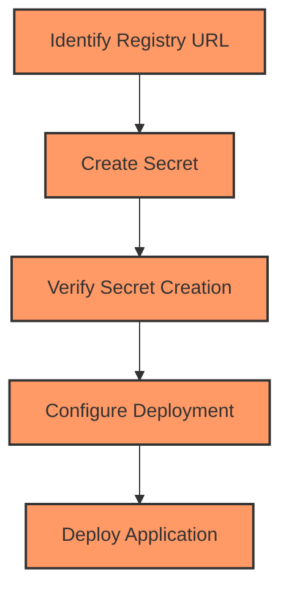

## Creating Docker Login Secrets in Kubernetes

In this section, we will delve into the process of creating a Docker login secret in a Kubernetes cluster. This is particularly important when you are deploying an application that uses images stored in a private Docker repository. The Kubernetes cluster needs to authenticate with the private repository to pull the required images. Let's break down the steps involved and understand why this is necessary.

### Background Theory

When deploying applications in Kubernetes, the pods require access to container images stored in a Docker registry. If these images are stored in a private registry, Kubernetes needs to authenticate with the registry to pull the images. This authentication is achieved through the creation of a Docker login secret, which contains the necessary credentials (username and password) to access the private registry.

### Why Create a Docker Login Secret?

Creating a Docker login secret ensures that your Kubernetes cluster can securely authenticate with a private Docker registry. Without this secret, Kubernetes would not be able to pull the required images, leading to deployment failures. Additionally, storing sensitive information such as usernames and passwords in plain text within your deployment configurations is highly insecure. Using secrets helps to keep this information encrypted and out of your deployment manifests.

### How to Create a Docker Login Secret

To create a Docker login secret, you use the `kubectl` command-line tool. Here’s a step-by-step guide:

#### Step 1: Identify the Registry URL

First, you need to know the URL of the Docker registry. For Docker Hub, the URL is `https://index.docker.io/v1/`. You can also retrieve this information using the `docker info` command, which provides details about the Docker daemon, including the registry URL.

```bash
docker info | grep "Registry"
```

This command will output something like:

```
Registry: https://index.docker.io/v1/
```

#### Step 2: Create the Secret

Next, you create the secret using the `kubectl create secret docker-registry` command. This command requires the following parameters:

- `--docker-server`: The URL of the Docker registry.
- `--docker-username`: Your Docker username.
- `--docker-password`: Your Docker password.
- `--docker-email`: Your email address associated with the Docker account (optional).

Here’s an example command:

```bash
kubectl create secret docker-registry my-registry-secret \
  --docker-server=https://index.docker.io/v1/ \
  --docker-username=your-docker-username \
  --docker-password=your-docker-password \
  --docker-email=your-email@example.com
```

#### Step 3: Verify the Secret Creation

After executing the command, you should verify that the secret was created successfully. You can list all secrets in the current namespace using the following command:

```bash
kubectl get secrets
```

You should see `my-registry-secret` listed among the other secrets.

### Example: Full Workflow

Let’s walk through a complete example of creating a Docker login secret and using it in a deployment.

#### Step 1: Retrieve the Registry URL

```bash
docker info | grep "Registry"
```

Output:

```
Registry: https://index.docker.io/v1/
```

#### Step 2: Create the Secret

```bash
kubectl create secret docker-registry my--registry-secret \
  --docker-server=https://index.docker.io/v1/ \
  --docker-username=your-docker-username \
  --docker-password=your-docker-password \
  --docker-email=your-email@example.com
```

#### Step 3: Verify the Secret Creation

```bash
kubectl get secrets
```

Output:

```
NAME                  TYPE                                  DATA   AGE
default-token-xxxx    kubernetes.io/service-account-token   3      1h
my-registry-secret    kubernetes.io/dockerconfigjson        1      1m
```

#### Step 4: Configure the Deployment

Now that the secret is created, you need to reference it in your deployment manifest. Here’s an example of a deployment YAML file that uses the secret:

```yaml
apiVersion: apps/v1
kind: Deployment
metadata:
  name: my-app-deployment
spec:
  replicas: 3
  selector:
    matchLabels:
      app: my-app
  template:
    metadata:
      labels:
        app: my-app
    spec:
      containers:
      - name: my-app-container
        image: your-private-repo/my-app:latest
        ports:
        - containerPort: 8080
      imagePullSecrets:
      - name: my-registry-secret
```

### Mermaid Diagram: Secret Creation and Usage

A visual representation of the process can help clarify the steps involved:



### Common Pitfalls and How to Avoid Them

1. **Incorrect Registry URL**: Ensure that the registry URL is correct. Use `docker info` to confirm the URL.
2. **Missing or Incorrect Credentials**: Double-check that the username and password are correct and that the user has permission to access the private repository.
3. **Forgetting to Reference the Secret**: Make sure to include the `imagePullSecrets` field in your deployment manifest to reference the secret.

### Real-World Examples and Recent Breaches

One notable breach involving Docker registry credentials occurred in 2021 when a misconfigured Docker registry exposed sensitive data. This highlights the importance of securing your registry credentials and ensuring that they are not accessible via public networks.

### How to Prevent / Defend

#### Detection

Regularly audit your Kubernetes cluster for secrets that may contain sensitive information. Tools like `kube-secrets-audit` can help identify secrets that might be misconfigured or exposed.

#### Prevention

1. **Use Strong Authentication**: Always use strong, unique credentials for accessing private Docker registries.
2. **Limit Access**: Restrict access to the private registry to only those users and services that need it.
3. **Monitor and Audit**: Regularly monitor and audit access logs to detect any unauthorized attempts to access the registry.

#### Secure Coding Fixes

**Vulnerable Code:**

```yaml
apiVersion: apps/v1
kind: Deployment
metadata:
  name: my-app-deployment
spec:
  replicas: 3
  selector:
    matchLabels:
      app: my-app
  template:
    metadata:
      labels:
        app: my-app
    spec:
      containers:
      - name: my-app-container
        image: your-private-repo/my-app:latest
        ports:
        - containerPort: 8080
```

**Secure Code:**

```yaml
apiVersion: apps/v1
kind: Deployment
metadata:
  name: my-app-deployment
spec:
  replicas: 3
  selector:
    matchLabels:
      app: my-app
  template:
    metadata:
      labels:
        app: my-app
    spec:
      containers:
      - name: my-app-container
        image: your-private-repo/my-app:latest
        ports:
        - containerPort: 8080
      imagePullSecrets:
      - name: my-registry-secret
```

### Conclusion

Creating a Docker login secret in Kubernetes is essential for securely pulling images from private repositories. By following the steps outlined above and adhering to best practices, you can ensure that your Kubernetes cluster can access the required images without exposing sensitive credentials.

### Practice Labs

For hands-on practice, consider the following labs:

- **PortSwigger Web Security Academy**: Offers exercises related to Kubernetes and Docker security.
- **CloudGoat**: Provides scenarios for practicing cloud security, including Kubernetes and Docker.
- **Kubernetes Goat**: Focuses specifically on Kubernetes security and includes exercises related to managing secrets.

These labs will provide practical experience in creating and managing Docker login secrets in a Kubernetes environment.

---
<!-- nav -->
[[04-Introduction to Prometheus Client Libraries|Introduction to Prometheus Client Libraries]] | [[DevOps/DevOps Bootcamp/10-Monitoring & Alerting/10-Exposing Metrics with Prometheus Client Libraries/00-Overview|Overview]] | [[06-Defining Custom Metrics|Defining Custom Metrics]]
