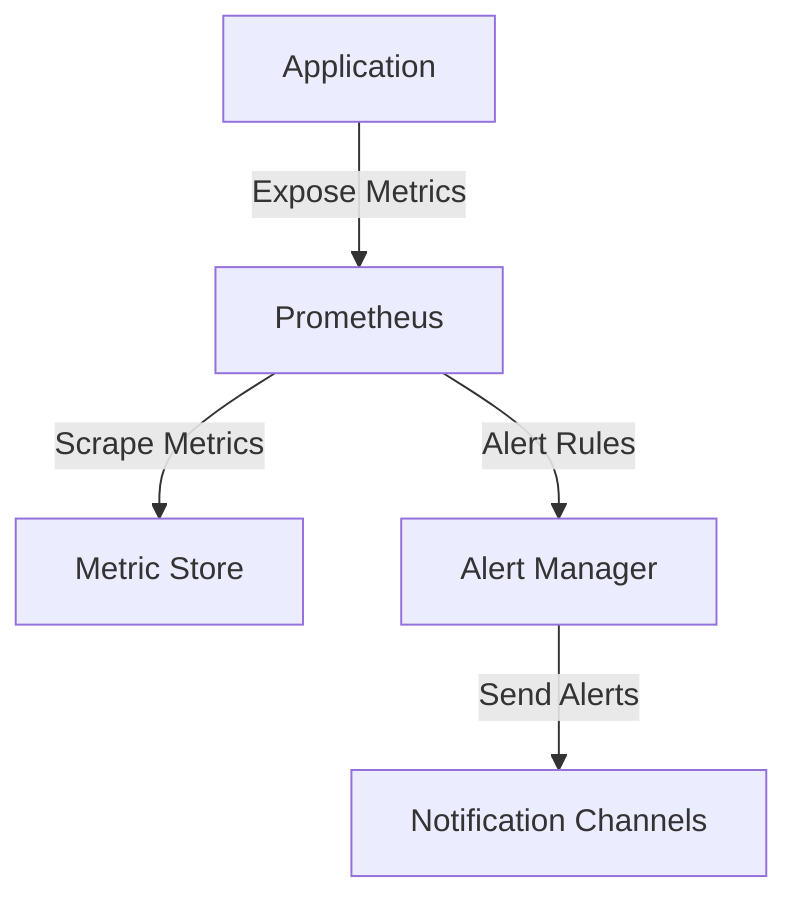
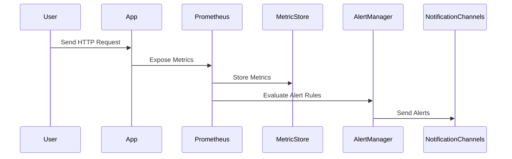

## Exposing Metrics with Prometheus Client Libraries

### Introduction to Prometheus and Monitoring

Prometheus is an open-source systems monitoring and alerting toolkit originally built at SoundCloud. It is now a Cloud Native Computing Foundation (CNCF) project. Prometheus collects and stores metrics from configured targets at regular intervals and then processes this data through user-defined rules. These rules can generate alerts and notify on-call personnel via various communication channels such as email, SMS, or chat applications.

Monitoring is crucial for maintaining the health and performance of your applications and infrastructure. By collecting and analyzing metrics, you can identify issues before they become critical, optimize resource usage, and ensure that your services meet their performance SLAs.

### Prometheus Client Libraries

To integrate Prometheus into your application, you need to use a Prometheus client library. These libraries provide the necessary tools to expose metrics that Prometheus can scrape and store. Each programming language has its own client library, ensuring compatibility across different environments.

#### Node.js Client Library: `prom-client`

For Node.js applications, the most commonly used client library is `prom-client`. This library allows you to easily expose metrics from your Node.js application so that Prometheus can collect them.

### Integrating `prom-client` into Your Node.js Application

Let's walk through the process of integrating `prom-client` into a Node.js application.

#### Step 1: Install `prom-client`

First, you need to install the `prom-client` library using npm (Node Package Manager).

```bash
npm install prom-client
```

This command adds `prom-client` as a dependency in your `package.json` file.

#### Step 2: Import and Configure `prom-client`

Next, you need to import and configure `prom-client` in your Node.js application. Typically, this is done in a file like `server.js`.

```javascript
const express = require('express');
const promClient = require('prom-client');

// Create a new Express app
const app = express();

// Initialize Prometheus client
const collectDefaultMetrics = promClient.collectDefaultMetrics;
collectDefaultMetrics();

// Define custom metrics
const httpRequestDurationMicroseconds = new promClient.Histogram({
  name: 'http_request_duration_seconds',
  help: 'Duration of HTTP requests in seconds',
  labelNames: ['method', 'route'],
});

app.use((req, res, next) => {
  const start = process.hrtime();
  res.on('finish', () => {
    const duration = process.hrtime(start);
    httpRequestDurationMicroseconds
      .labels(req.method, req.route.path)
      .observe(duration[0] + duration[1] * 1e-9);
  });
  next();
});

// Define a simple route
app.get('/', (req, res) => {
  res.send('Hello World!');
});

// Start the server
app.listen(3000, () => {
  console.log('Server listening on port 3000');
});
```

In this example, we:

1. Import `express` and `prom-client`.
2. Initialize Prometheus client metrics using `collectDefaultMetrics()`.
3. Define a custom histogram metric `httpRequestDurationMicroseconds` to measure the duration of HTTP requests.
4. Use middleware to record the duration of each request.
5. Define a simple route `/` that returns "Hello World!".
6. Start the server on port 3000.

### Prometheus Metrics Types

Prometheus supports several types of metrics:

- **Counter**: A cumulative metric that represents a single numerical value that only ever goes up.
- **Gauge**: A metric that represents a single numerical value that can arbitrarily go up and down.
- **Histogram**: A metric that measures the distribution of a set of observations. Histograms are particularly useful for measuring latency distributions.
- **Summary**: Similar to histograms, summaries measure the distribution of a set of observations. Summaries provide quantiles.

### Example Metrics

Here are some examples of metrics you might want to expose:

- **HTTP Request Count**: Number of HTTP requests received.
- **HTTP Request Duration**: Duration of HTTP requests.
- **Database Query Count**: Number of database queries executed.
- **Database Query Duration**: Duration of database queries.

### Prometheus Configuration

To scrape metrics from your Node.js application, you need to configure Prometheus to scrape the `/metrics` endpoint exposed by `prom-client`.

#### Prometheus Configuration File (`prometheus.yml`)

```yaml
scrape_configs:
  - job_name: 'nodejs-app'
    static_configs:
      - targets: ['localhost:3000']
```

In this configuration:

- `job_name`: The name of the job.
- `static_configs`: Specifies the targets to scrape.
- `targets`: The URL of the target to scrape.

### Prometheus Metrics Endpoint

When you run your Node.js application, `prom-client` exposes a `/metrics` endpoint that Prometheus can scrape. This endpoint returns a plain text format containing all the metrics collected by `prom-client`.

### Real-World Examples

#### CVE-2021-44228 (Log4Shell)

The Log4Shell vulnerability (CVE-2021-44228) affected many Java applications. While this vulnerability is not directly related to Prometheus, it highlights the importance of monitoring and alerting. By setting up Prometheus to monitor your application, you can quickly detect unusual behavior that may indicate a security issue.

#### Example: Monitoring HTTP Requests

Consider a scenario where you want to monitor HTTP requests to your Node.js application. You can use `prom-client` to expose metrics about the number of requests and their durations.

```javascript
const express = require('express');
const promClient = require('prom-client');

const app = express();

// Initialize Prometheus client
const collectDefaultMetrics = promClient.collectDefaultMetrics;
collectDefaultMetrics();

// Define custom metrics
const httpRequestCount = new promClient.Counter({
  name: 'http_requests_total',
  help: 'Total number of HTTP requests',
  labelNames: ['method', 'route'],
});

app.use((req, res, next) => {
  httpRequestCount.labels(req.method, req.route.path).inc();
  next();
});

app.get('/', (req, res) => {
  res.send('Hello World!');
});

app.listen(3000, () => {
  console.log('Server listening on port 3000');
});
```

In this example, we define a counter metric `httpRequestsTotal` to track the total number of HTTP requests.

### How to Prevent / Defend

#### Detection

To detect unusual behavior, you can set up alerts in Prometheus. For example, you can create an alert rule to notify you if the number of HTTP requests exceeds a certain threshold.

```yaml
alerting:
  rules:
    - alert: HighHttpRequestRate
      expr: http_requests_total > 1000
      for: 5m
      labels:
        severity: warning
      annotations:
        summary: "High HTTP request rate detected"
        description: "The number of HTTP requests has exceeded 1000 in the last 5 minutes."
```

#### Prevention

To prevent unauthorized access and ensure the security of your metrics, you should:

1. **Secure the `/metrics` endpoint**: Ensure that only authorized users can access the `/metrics` endpoint. You can use authentication mechanisms like OAuth or JWT.
2. **Use HTTPS**: Serve your metrics over HTTPS to encrypt the data in transit.
3. **Limit exposure**: Only expose metrics that are necessary for monitoring. Avoid exposing sensitive information.

#### Secure Code Fix

Here is an example of how to secure the `/metrics` endpoint using basic authentication:

```javascript
const express = require('express');
const promClient = require('prom-client');
const basicAuth = require('express-basic-auth');

const app = express();

// Initialize Prometheus client
const collectDefaultMetrics = promClient.collectDefaultMetrics;
collectDefaultMetrics();

// Define custom metrics
const httpRequestCount = new promClient.Counter({
  name: 'http_requests_total',
  help: 'Total number of HTTP requests',
  labelNames: ['method', 'route'],
});

app.use(basicAuth({
  users: { 'admin': 'password' },
  challenge: true,
}));

app.use((req, res, next) => {
  httpRequestCount.labels(req.method, req.route.path).inc();
  next();
});

app.get('/', (req, res) => {
  res.send('Hello World!');
});

app.get('/metrics', (req, res) => {
  res.set('Content-Type', promClient.register.contentType);
  res.end(promClient.register.metrics());
});

app.listen(3000, () => {
  console.log('Server listening on port 3000');
});
```

In this example, we use `express-basic-auth` to protect the `/metrics` endpoint with basic authentication.

### Conclusion

Integrating Prometheus client libraries into your Node.js application allows you to expose metrics that can be scraped by Prometheus. By monitoring these metrics, you can gain insights into the performance and health of your application. Additionally, by securing the `/metrics` endpoint and using HTTPS, you can ensure the confidentiality and integrity of your metrics.

### Practice Labs

For hands-on practice with Prometheus and `prom-client`, consider the following resources:

- **PortSwigger Web Security Academy**: Offers interactive labs on web security, including monitoring and alerting.
- **OWASP Juice Shop**: A deliberately insecure web application for security training.
- **DVWA (Damn Vulnerable Web Application)**: Another intentionally vulnerable web application for security testing.

These resources provide practical experience in integrating monitoring and alerting into your applications.

### Diagrams

#### Prometheus Architecture



This diagram illustrates the architecture of a Prometheus setup, showing how metrics are exposed by the application, scraped by Prometheus, stored in the metric store, and alerts are sent through notification channels.

#### Request/Response Flow



This sequence diagram shows the flow of a request from a user to the application, the exposure of metrics to Prometheus, the storage of metrics, evaluation of alert rules, and sending of alerts.

By following these steps and using the provided examples, you can effectively integrate Prometheus into your Node.js application and ensure robust monitoring and alerting.

---
<!-- nav -->
[[06-Defining Custom Metrics|Defining Custom Metrics]] | [[DevOps/DevOps Bootcamp/10-Monitoring & Alerting/10-Exposing Metrics with Prometheus Client Libraries/00-Overview|Overview]] | [[DevOps/DevOps Bootcamp/10-Monitoring & Alerting/10-Exposing Metrics with Prometheus Client Libraries/08-Practice Questions & Answers|Practice Questions & Answers]]
