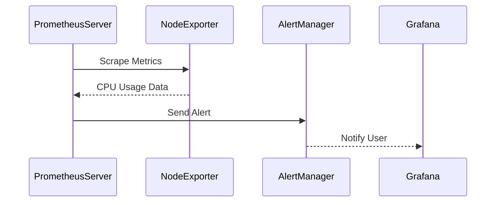

## Introduction to Monitoring Anomalies in Kubernetes Clusters with Prometheus

Monitoring is a critical aspect of maintaining the health and performance of any system, especially in complex environments like Kubernetes clusters. Prometheus, a powerful open-source monitoring system and time series database, plays a pivotal role in this context. This chapter delves into the intricacies of monitoring anomalies in Kubernetes clusters using Prometheus, covering the theoretical foundations, practical configurations, and real-world examples.

### What Is Prometheus?

Prometheus is an open-source systems monitoring and alerting toolkit originally built at SoundCloud. It collects metrics from configured targets at specified intervals and stores them within a time series database. The data can be visualized and queried through the PromQL (Prometheus Query Language) interface.

#### Components of the Prometheus Stack

The Prometheus stack consists of several key components:

1. **Prometheus Server**: The core component that scrapes metrics from targets and stores them in a time series database.
2. **Alertmanager**: Handles alerts sent by the Prometheus server and routes them to the appropriate receivers.
3. **Pushgateway**: A temporary storage for batch jobs to push metrics to.
4. **Exporter**: Tools that expose metrics from specific systems or services.
5. **Grafana**: A visualization tool that integrates with Prometheus to provide dashboards and graphs.

### Why Monitor Anomalies in Kubernetes Clusters?

Kubernetes clusters are dynamic environments where various components interact and scale based on demand. Monitoring anomalies helps in identifying issues early, ensuring high availability, and optimizing resource usage. Common anomalies include CPU spikes, memory leaks, storage exhaustion, and unexpected traffic patterns.

### Configuring Monitoring for Your Application

When configuring monitoring for your application, you need to decide what anomalies you want to observe. Here are some common scenarios:

1. **CPU Spikes**: High CPU usage can indicate that an application is under heavy load or experiencing inefficiencies.
2. **Storage Exhaustion**: Running out of storage can lead to application crashes and data loss.
3. **Unexpected Traffic**: Sudden increases in traffic can indicate a surge in user interest or a potential DDoS attack.
4. **Unauthenticated Requests**: Excessive unauthenticated requests might indicate a security breach.

### Example Metrics to Monitor

Let's consider a few example metrics that you might want to monitor in a Kubernetes cluster:

1. **CPU Usage**:
    ```yaml
    apiVersion: monitoring.coreos.com/v1
    kind: ServiceMonitor
    metadata:
      name: cpu-monitor
      labels:
        team: frontend
    spec:
      selector:
        matchLabels:
          app: my-app
      endpoints:
      - port: http
        interval: 15s
        metricRelabelings:
        - sourceLabels: [__name__]
          targetLabel: metric
          regex: container_cpu_usage_seconds_total
          replacement: cpu_usage
    ```

2. **Memory Usage**:
    ```yaml
    apiVersion: monitoring.coreos.com/v1
    kind: ServiceMonitor
    metadata:
      name: memory-monitor
      labels:
        team: frontend
    spec:
      selector:
        matchLabels:
          app: my-app
      endpoints:
      - port: http
        interval: 15s
        metricRelabelings:
        - sourceLabels: [__name__]
          targetLabel: metric
          regex: container_memory_usage_bytes
          replacement: memory_usage
    ```

3. **Storage Usage**:
    ```yaml
    apiVersion: monitoring.coreos.com/v1
    kind: ServiceMonitor
    metadata:
      name: storage-monitor
      labels:
        team: frontend
    spec:
      selector:
        matchLabels:
          app: my-app
      endpoints:
      - port: http
        interval: 15s
        metricRelabelings:
        - sourceLabels: [__name__]
          targetLabel: metric
          regex: node_filesystem_size_bytes
          replacement: storage_size
    ```

### Real-World Examples and Recent Breaches

#### Example: CPU Spike Leading to Application Crash

In a recent incident, a Kubernetes cluster experienced a sudden spike in CPU usage due to a poorly optimized application. This led to the application crashing and affecting user experience. By monitoring CPU usage metrics, the issue was identified and resolved quickly.



#### Example: Storage Exhaustion Causing Data Loss

Another incident involved a Kubernetes cluster running out of storage space, leading to data loss. By monitoring storage usage metrics, the issue was detected and additional storage was provisioned to prevent further data loss.


### How to Prevent / Defend Against Anomalies

#### Detection

To detect anomalies, you need to set up proper monitoring and alerting mechanisms. Here’s how you can configure Prometheus to detect CPU spikes:

```yaml
apiVersion: monitoring.coreos.com/v1
kind: Alert
metadata:
  name: HighCPUUsage
spec:
  expr: |
    rate(container_cpu_usage_seconds_total{container_label_com_docker_compose_service!="",pod_name!=""}[5m]) > 0.8
  for: 5m
  labels:
    severity: warning
  annotations:
    summary: "High CPU usage detected"
    description: "CPU usage is above 80% for pod {{ $labels.pod_name }}"
```

#### Prevention

To prevent anomalies, you can implement the following strategies:

1. **Resource Limits**: Set resource limits for pods to prevent them from consuming excessive resources.
    ```yaml
    apiVersion: v1
    kind: Pod
    metadata:
      name: my-pod
    spec:
      containers:
      - name: my-container
        image: my-image
        resources:
          limits:
            cpu: "1"
            memory: 512Mi
          requests:
            cpu: "0.5"
            memory: 256Mi
    ```

2. **Autoscaling**: Implement horizontal pod autoscaling to automatically adjust the number of replicas based on demand.
    ```yaml
    apiVersion: autoscaling/v2beta2
    kind: HorizontalPodAutoscaler
    metadata:
      name: my-hpa
    spec:
      scaleTargetRef:
        apiVersion: apps/v1
        kind: Deployment
        name: my-deployment
      minReplicas: 1
      maxReplicas: 10
      metrics:
      - type: Resource
        resource:
          name: cpu
          target:
            type: Utilization
            averageUtilization: 50
    ```

3. **Security Measures**: Implement security measures to prevent unauthorized access and attacks.
    ```yaml
    apiVersion: networking.k8s.io/v1
    kind: NetworkPolicy
    metadata:
      name: default-deny
    spec:
      podSelector: {}
      ingress:
      - from:
        - podSelector: {}
    ```

### Conclusion

Monitoring anomalies in Kubernetes clusters using Prometheus is crucial for maintaining the health and performance of your applications. By setting up proper monitoring and alerting mechanisms, you can detect and prevent issues before they affect your users. This chapter provided a comprehensive guide to configuring and utilizing Prometheus for anomaly detection, along with real-world examples and preventive measures.

### Practice Labs

For hands-on practice, consider the following labs:

- **PortSwigger Web Security Academy**: Offers a variety of labs related to web application security, including monitoring and anomaly detection.
- **OWASP Juice Shop**: A deliberately insecure web application for security training purposes.
- **Kubernetes Goat**: A security-focused Kubernetes environment for learning and testing security measures.

These labs provide practical experience in setting up and managing monitoring systems in Kubernetes clusters.

---
<!-- nav -->
[[DevOps/DevOps Bootcamp/10-Monitoring & Alerting/11-Monitoring Anomalies In Kubernetes Clusters With Prometheus/00-Overview|Overview]] | [[DevOps/DevOps Bootcamp/10-Monitoring & Alerting/11-Monitoring Anomalies In Kubernetes Clusters With Prometheus/02-Practice Questions & Answers|Practice Questions & Answers]]
