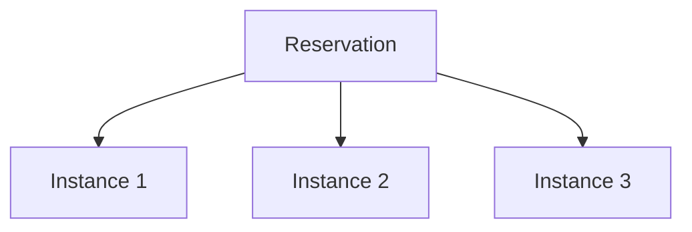

## Monitoring EC2 Instance States with Python

### Introduction to AWS EC2 Instances

Amazon Elastic Compute Cloud (EC2) is a web service that provides resizable compute capacity in the cloud. EC2 allows users to launch virtual servers called instances, which can run applications and services. Each instance is a virtual machine that runs in the Amazon Web Services (AWS) cloud.

#### What is a Reservation?

In the context of AWS EC2, a reservation is a logical grouping of one or more instances. This concept is particularly useful when you start or launch multiple instances at once. A reservation is essentially an act or intention of launching or starting instances. For example, if you launch three instances simultaneously, they will be grouped into a single reservation.



### Understanding the Response Structure

When you interact with EC2 using the AWS SDK or API, the response structure is crucial to understand. The `describe_instances` method returns a complex data structure that includes reservations and instances within those reservations.

#### Response Syntax

The response from the `describe_instances` method is a dictionary that contains a list of reservations. Each reservation contains a list of instances. Here is an example of what the response might look like:

```python
{
    "Reservations": [
        {
            "Instances": [
                {
                    "InstanceId": "i-0123456789abcdef0",
                    "State": {
                        "Name": "running"
                    }
                },
                {
                    "InstanceId": "i-0123456789abcdef1",
                    "State": {
                        "Name": "stopped"
                    }
                }
            ]
        }
    ]
}
```

### Using Python to Monitor EC2 Instances

To monitor the state of EC2 instances using Python, you can use the `boto3` library, which is the AWS SDK for Python. This library allows you to interact with AWS services programmatically.

#### Installing boto3

First, ensure you have `boto3` installed. You can install it using pip:

```bash
pip install boto3
```

#### Authenticating with AWS

Before you can use `boto3`, you need to authenticate with AWS. This typically involves setting up your AWS credentials. You can configure your credentials using the AWS CLI:

```bash
aws configure
```

This will prompt you to enter your AWS access key ID, secret access key, default region name, and default output format.

#### Describing EC2 Instances

Here is a complete example of how to describe EC2 instances using `boto3`:

```python
import boto3

# Create an EC2 client
ec2 = boto3.client('ec2')

# Describe instances
response = ec2.describe_instances()

# Print the response
print(response)
```

### Parsing the Response

The response from `describe_instances` is a nested dictionary. To extract the instance states, you need to navigate through the dictionary structure.

```python
for reservation in response['Reservations']:
    for instance in reservation['Instances']:
        instance_id = instance['InstanceId']
        instance_state = instance['State']['Name']
        print(f"Instance ID: {instance_id}, State: {instance_state}")
```

### Handling Edge Cases

There are several edge cases to consider when working with EC2 instances:

1. **Empty Reservations**: If there are no instances running, the `Reservations` list will be empty.
2. **Multiple Reservations**: If you have multiple reservations, you need to handle them appropriately.
3. **Partial Data**: Sometimes, the response might not contain all the information you expect. Ensure you handle partial data gracefully.

### Real-World Example: Monitoring EC2 Instances

Suppose you have a script that monitors the state of EC2 instances and sends an alert if an instance is stopped unexpectedly. Here is a complete example:

```python
import boto3
import smtplib
from email.mime.text import MIMEText

def send_email(subject, body):
    sender = 'your-email@example.com'
    receiver = 'receiver-email@example.com'
    password = 'your-email-password'

    msg = MIMEText(body)
    msg['Subject'] = subject
    msg['From'] = sender
    msg['To'] = receiver

    server = smtplib.SMTP('smtp.example.com', 587)
    server.starttls()
    server.login(sender, password)
    server.sendmail(sender, receiver, msg.as_string())
    server.quit()

def monitor_ec2_instances():
    ec2 = boto3.client('ec2')
    response = ec2.describe_instances()

    for reservation in response['Reservations']:
        for instance in reservation['Instances']:
            instance_id = instance['InstanceId']
            instance_state = instance['State']['Name']

            if instance_state == 'stopped':
                subject = f"Alert: Instance {instance_id} is stopped"
                body = f"The instance {instance_id} is currently in the stopped state."
                send_email(subject, body)

if __name__ == "__main__":
    monitor_ec2_instances()
```

### How to Prevent / Defend

#### Detection

To detect unexpected changes in instance states, you can set up CloudWatch Alarms. CloudWatch Alarms can trigger notifications based on specific conditions, such as an instance being stopped.

#### Prevention

1. **IAM Policies**: Ensure that IAM policies are properly configured to restrict who can stop or terminate instances.
2. **Security Groups**: Use security groups to control inbound and outbound traffic to your instances.
3. **Auto Scaling**: Use Auto Scaling to automatically replace stopped instances.

#### Secure Coding Fixes

Here is an example of how to securely configure IAM policies to restrict stopping instances:

```json
{
    "Version": "2012-10-17",
    "Statement": [
        {
            "Effect": "Deny",
            "Action": "ec2:StopInstances",
            "Resource": "*"
        }
    ]
}
```

### Conclusion

Monitoring EC2 instances is a critical task in managing cloud infrastructure. By understanding the response structure and using tools like `boto3`, you can effectively monitor and manage your instances. Always ensure you have proper detection and prevention mechanisms in place to secure your environment.

### Practice Labs

For hands-on practice with monitoring EC2 instances, consider the following labs:

- **PortSwigger Web Security Academy**: Offers exercises related to AWS security and monitoring.
- **CloudGoat**: Provides scenarios for practicing cloud security, including EC2 management.
- **AWS Official Workshops**: Includes detailed labs on using AWS services, including EC2 monitoring.

These labs will help you gain practical experience in monitoring and managing EC2 instances.

---
<!-- nav -->
[[03-Introduction to Monitoring EC2 Instances with Python|Introduction to Monitoring EC2 Instances with Python]] | [[DevOps/DevOps Bootcamp/10-Monitoring & Alerting/12-Monitoring EC2 Instance States with Python/00-Overview|Overview]] | [[DevOps/DevOps Bootcamp/10-Monitoring & Alerting/12-Monitoring EC2 Instance States with Python/05-Practice Questions & Answers|Practice Questions & Answers]]
