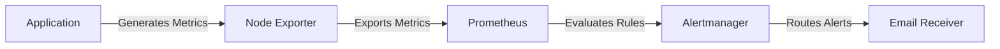
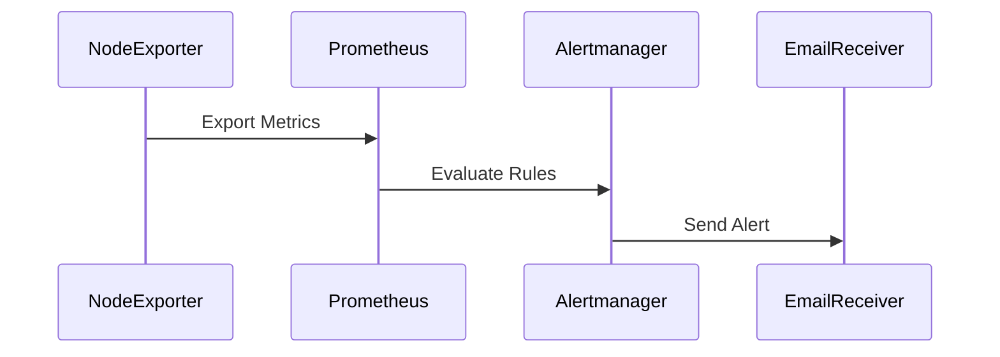

## Monitoring High CPU Load Alerts

### Introduction to Monitoring Systems

Monitoring systems play a critical role in maintaining the health and performance of modern applications and infrastructure. They provide real-time insights into various metrics such as CPU usage, memory consumption, disk space, and network traffic. One of the most common issues that monitoring systems detect is high CPU load, which can significantly affect the performance and stability of an application.

In this section, we will delve into the details of how to monitor and handle high CPU load alerts using a popular monitoring tool, Prometheus, along with Alertmanager for alert routing and notification.

### Understanding CPU Load

CPU load refers to the amount of work that the CPU is performing. It is typically measured as a percentage of the total available processing power. A high CPU load indicates that the CPU is being heavily utilized, which can lead to performance degradation and even system crashes if not addressed promptly.

#### Why Monitor CPU Load?

Monitoring CPU load is essential for several reasons:

1. **Performance Optimization**: High CPU load can indicate inefficiencies in the application or infrastructure. By identifying and addressing these inefficiencies, you can improve overall performance.
   
2. **Resource Management**: Monitoring CPU load helps in managing resources effectively. You can scale up or down based on the actual load, ensuring optimal resource utilization.
   
3. **Troubleshooting**: High CPU load can be indicative of underlying issues such as bugs, inefficient algorithms, or misconfigurations. Monitoring helps in quickly identifying and resolving these issues.

### Setting Up Prometheus and Alertmanager

To set up monitoring for high CPU load, we will use Prometheus as the monitoring tool and Alertmanager for handling alerts.

#### Installing Prometheus

Prometheus is an open-source monitoring system and time series database. To install Prometheus, follow these steps:

1. **Download Prometheus**:
   ```bash
   wget https://github.com/prometheus/prometheus/releases/download/v2.35.0/prometheus-2.35.0.linux-amd64.tar.gz
   ```

2. **Extract the tarball**:
   ```bash
   tar xvfz prometheus-2.35.0.linux-amd64.tar.gz
   cd prometheus-2.35.0.linux-amd64
   ```

3. **Start Prometheus**:
   ```bash
   ./prometheus --config.file=prometheus.yml
   ```

#### Configuring Prometheus

The `prometheus.yml` file is the main configuration file for Prometheus. Here is an example configuration:

```yaml
global:
  scrape_interval: 15s

scrape_configs:
  - job_name: 'prometheus'
    static_configs:
      - targets: ['localhost:9090']
```

This configuration sets the scrape interval to 15 seconds and specifies the target as `localhost:9090`.

#### Installing Alertmanager

Alertmanager is responsible for handling alerts generated by Prometheus. To install Alertmanager, follow these steps:

1. **Download Alertmanager**:
   ```bash
   wget https://github.com/prometheus/alertmanager/releases/download/v0.23.0/alertmanager-0.23.0.linux-amd64.tar.gz
   ```

2. **Extract the tarball**:
   ```bash
   tar xvfz alertmanager-0.23.0.linux-amd64.tar.gz
   cd alertmanager-0.23.0.linux-amd64
   ```

3. **Start Alertmanager**:
   ```bash
   ./alertmanager --config.file=alertmanager.yml
   ```

#### Configuring Alertmanager

The `alertmanager.yml` file is the main configuration file for Alertmanager. Here is an example configuration:

```yaml
route:
  receiver: 'email'
receivers:
  - name: 'email'
    email_configs:
      - to: 'admin@example.com'
        from: 'alertmanager@example.com'
        smarthost: 'smtp.example.com:587'
        auth_username: 'alertmanager@example.com'
        auth_password: 'yourpassword'
        require_tls: true
```

This configuration sets up an email receiver for alerts.

### Creating High CPU Load Alerts

Now that we have Prometheus and Alertmanager set up, we can create alerts for high CPU load.

#### Defining the Alert Rule

We define the alert rule in the `rules.yml` file. Here is an example rule for high CPU load:

```yaml
groups:
  - name: cpu_load_rules
    rules:
      - alert: HighCPULoad
        expr: node_cpu_seconds_total{mode="idle"} / node_cpu_core_total * 100 < 16
        for: 5m
        labels:
          severity: "critical"
        annotations:
          summary: "High CPU Load"
          description: "Instance {{ $labels.instance }} has a high CPU load of {{ $value }}%"
```

This rule checks if the idle CPU percentage is less than 16% for more than 5 minutes. If so, it triggers an alert.

#### Applying the Alert Rule

To apply the alert rule, you need to reload the configuration in Prometheus:

```bash
curl -X POST http://localhost:9090/-/reload
```

### Handling Alerts

Once an alert is triggered, Alertmanager routes it to the appropriate receiver. In this case, the receiver is an email.

#### Receiving the Alert Email

When an alert is triggered, you will receive an email similar to the following:

```plaintext
Subject: [ALERT] High CPU Load - Instance: localhost:9100

Summary: High CPU Load
Description: Instance localhost:9100 has a high CPU load of 84%

Labels:
- alertname: HighCPULoad
- instance: localhost:9100
- severity: critical

Annotations:
- summary: High CPU Load
- description: Instance localhost:9100 has a high CPU load of  84%
```

This email provides detailed information about the alert, including the instance, the current CPU load, and the severity level.

### Troubleshooting and Debugging Alerts

If you receive an alert but are unsure about the cause, you can use the following steps to troubleshoot and debug:

1. **Check the Prometheus Metrics**:
   - Access the Prometheus UI at `http://localhost:9090`.
   - Navigate to the `Graph` tab and query the relevant metrics, such as `node_cpu_seconds_total` and `node_cpu_core_total`.

2. **Check the Alertmanager Logs**:
   - If the alert is not being received, check the Alertmanager logs for any errors.
   - The logs can be found in the `alertmanager.log` file.

3. **Verify Email Configuration**:
   - Ensure that the email configuration in `alertmanager.yml` is correct.
   - Check for any authentication issues with the email provider.

### Real-World Examples

#### Recent Breaches and CVEs

High CPU load can be indicative of various security issues, such as DDoS attacks, malware infections, or misconfigurations. For example, the Log4j vulnerability (CVE-2021-44228) led to numerous DDoS attacks that caused high CPU load on affected servers.

#### Case Study: DDoS Attack

A recent DDoS attack on a financial institution caused high CPU load on their servers. The attack was detected through monitoring tools, and the institution was able to mitigate the attack by scaling up their infrastructure and implementing rate limiting.

### How to Prevent / Defend

#### Detection

To detect high CPU load, you can use monitoring tools like Prometheus and Grafana. Set up alerts for CPU load thresholds and monitor the metrics regularly.

#### Prevention

To prevent high CPU load, you can implement the following measures:

1. **Optimize Application Code**: Review and optimize the application code to reduce unnecessary CPU usage.
   
2. **Implement Resource Limits**: Use Kubernetes resource limits to prevent individual pods from consuming excessive CPU resources.

3. **Scale Automatically**: Implement auto-scaling policies to automatically scale up or down based on the actual CPU load.

#### Secure Coding Fixes

Here is an example of a vulnerable code snippet and its secure version:

**Vulnerable Code**:
```python
def process_data(data):
    result = []
    for item in data:
        result.append(item * 2)
    return result
```

**Secure Code**:
```python
import concurrent.futures

def process_data(data):
    with concurrent.futures.ThreadPoolExecutor() as executor:
        result = list(executor.map(lambda x: x * 2, data))
    return result
```

The secure version uses multithreading to distribute the workload across multiple threads, reducing the CPU load.

#### Configuration Hardening

To harden the configuration, ensure that the following settings are in place:

1. **Email Authentication**: Use SMTP authentication to secure email notifications.
   
2. **TLS Encryption**: Enable TLS encryption for email communication to prevent eavesdropping.

3. **Access Control**: Restrict access to monitoring and alerting tools to authorized personnel only.

### Complete Example

Here is a complete example of setting up monitoring for high CPU load:

#### Prometheus Configuration (`prometheus.yml`)

```yaml
global:
  scrape_interval: 15s

scrape_configs:
  - job_name: 'node_exporter'
    static_configs:
      - targets: ['localhost:9100']
```

#### Alertmanager Configuration (`alertmanager.yml`)

```yaml
route:
  receiver: 'email'

receivers:
  - name: 'email'
    email_configs:
      - to: 'admin@example.com'
        from: 'alertmanager@example.com'
        smarthost: 'smtp.example.com:587'
        auth_username: 'alertmanager@example.com'
        auth_password: 'yourpassword'
        require_tls: true
```

#### Alert Rule (`rules.yml`)

```yaml
groups:
  - name: cpu_load_rules
    rules:
      - alert: HighCPULoad
        expr: node_cpu_seconds_total{mode="idle"} / node_cpu_core_total * 100 < 16
        for: 5m
        labels:
          severity: "critical"
        annotations:
          summary: "High CPU Load"
          description: "Instance {{ $labels.instance }} has a high CPU load of {{ $value }}%"
```

#### Full HTTP Request and Response

Here is an example of a full HTTP request and response for triggering an alert:

**HTTP Request**

```http
POST /api/v1/alerts HTTP/1.1
Host: localhost:9093
Content-Type: application/json

{
  "receiver": "email",
  "status": "firing",
  "alerts": [
    {
      "labels": {
        "alertname": "HighCPULoad",
        "instance": "localhost:9100",
        "severity": "critical"
      },
      "annotations": {
        "summary": "High CPU Load",
        "description": "Instance localhost:9100 has a high CPU load of 84%"
      }
    }
  ]
}
```

**HTTP Response**

```http
HTTP/1.1 200 OK
Content-Type: application/json

{
  "status": "success",
  "data": null
}
```

### Mermaid Diagrams

#### Monitoring Architecture



#### Alert Flow



### Practice Labs

For hands-on practice, consider the following labs:

- **PortSwigger Web Security Academy**: Offers a comprehensive set of labs for learning web security.
- **OWASP Juice Shop**: A deliberately insecure web application for practicing web security skills.
- **DVWA (Damn Vulnerable Web Application)**: A PHP/MySQL web application that is riddled with vulnerabilities.

These labs provide a practical environment to test and learn monitoring and alerting techniques.

### Conclusion

Monitoring high CPU load is crucial for maintaining the performance and stability of modern applications and infrastructure. By setting up monitoring tools like Prometheus and Alertmanager, you can detect and respond to high CPU load alerts promptly. This chapter provided a comprehensive guide to setting up and troubleshooting high CPU load alerts, along with real-world examples and secure coding practices.

---
<!-- nav -->
[[02-Introduction to Monitoring High CPU Load Alerts|Introduction to Monitoring High CPU Load Alerts]] | [[DevOps/DevOps Bootcamp/10-Monitoring & Alerting/13-Monitoring High CPU Load Alerts/00-Overview|Overview]] | [[DevOps/DevOps Bootcamp/10-Monitoring & Alerting/13-Monitoring High CPU Load Alerts/04-Practice Questions & Answers|Practice Questions & Answers]]
