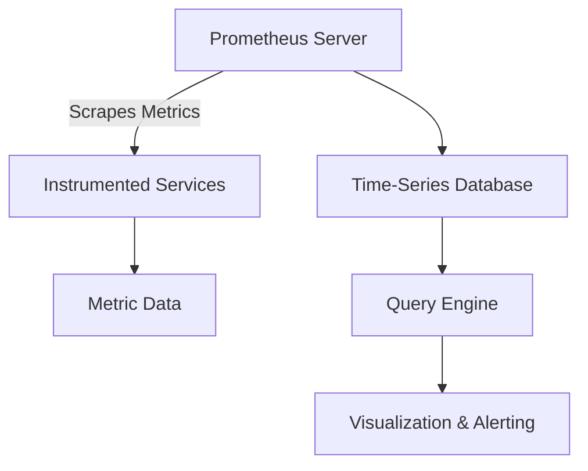

## Introduction to Monitoring Kubernetes Microservices with Prometheus

### Why Monitor?

Monitoring is essential for maintaining the health, performance, and reliability of your applications and infrastructure. In the context of Kubernetes, which is a container orchestration platform, monitoring helps you:

- **Detect issues early**: Identify problems before they affect users.
- **Optimize resource usage**: Ensure that your resources (CPU, memory, etc.) are being used efficiently.
- **Ensure compliance**: Meet regulatory requirements and internal policies.
- **Troubleshoot effectively**: Quickly diagnose and resolve issues when they occur.

Without monitoring, you would be flying blind, unable to make informed decisions about your system’s performance and health.

### What is Prometheus?

Prometheus is an open-source systems monitoring and alerting toolkit originally built at SoundCloud. It is now a standalone project and is widely adopted across various industries. Prometheus is designed to be:

- **Highly scalable**: Can handle large volumes of metrics from thousands of sources.
- **Self-contained**: Includes a powerful query language (PromQL) and visualization capabilities.
- **Flexible**: Supports a wide range of data sources and integrations.

#### How Prometheus Works

Prometheus operates on a pull-based model, where it periodically scrapes metrics from instrumented services. These metrics are then stored in a time-series database, allowing for efficient querying and analysis.



### Benefits of Using Prometheus

- **Centralized Monitoring**: Provides a unified view of your entire infrastructure.
- **Rich Query Language**: Allows complex queries to be written easily.
- **Alerting**: Can trigger alerts based on defined rules.
- **Integration**: Easily integrates with other tools and services.

### Hands-On Project Overview

In this module, we will set up a Kubernetes cluster using Amazon Elastic Kubernetes Service (EKS) and deploy an online shop microservices application. We will then configure Prometheus to monitor the cluster and the application.

### Step-by-Step Guide

#### Step 1: Create a Kubernetes Cluster with EKS

To create a Kubernetes cluster using EKS, follow these steps:

1. **Set Up AWS CLI**:
   Ensure you have the AWS Command Line Interface (CLI) installed and configured with your AWS credentials.

2. **Create an EKS Cluster**:
   Use the AWS Management Console or the AWS CLI to create an EKS cluster.

   ```bash
   aws eks create-cluster --name my-cluster --role-arn arn:aws:iam::123456789012:role/eksClusterRole --resources-vpc-config subnetIds=subnet-12345678,subnet-abcdefgh --version 1.21
   ```

3. **Configure kubectl**:
   Configure `kubectl` to interact with your new EKS cluster.

   ```bash
   aws eks update-kubeconfig --name my-cluster
   ```

#### Step 2: Deploy an Online Shop Microservices Application

Deploy an online shop microservices application to your EKS cluster. This can be done using Helm charts or Kubernetes manifests.

```yaml
# Example deployment manifest
apiVersion: apps/v1
kind: Deployment
metadata:
  name: online-shop
spec:
  replicas: 3
  selector:
    matchLabels:
      app: online-shop
  template:
    metadata:
      labels:
        app: online-shop
    spec:
      containers:
      - name: online-shop
        image: myregistry.com/online-shop:latest
        ports:
        - containerPort: 8080
```

Apply the manifest using `kubectl`.

```bash
kubectl apply -f online-shop-deployment.yaml
```

#### Step 3: Deploy Prometheus Monitoring Stack

Deploy Prometheus to monitor your EKS cluster and the online shop application.

1. **Install Prometheus Operator**:
   Use the Prometheus Operator to manage Prometheus instances.

   ```bash
   helm repo add prometheus-community https://prometheus-community.github.io/helm-charts
   helm repo update
   helm install prometheus prometheus-community/prometheus
   ```

2. **Configure Prometheus Targets**:
   Define the targets that Prometheus should scrape metrics from.

   ```yaml
   # Example Prometheus configuration
   scrape_configs:
     - job_name: 'kubernetes-nodes'
       kubernetes_sd_configs:
         - role: node
       relabel_configs:
         - action: labelmap
           regex: __meta_kubernetes_node_label_(.+)
         - target_label: __address__
           replacement: kubernetes.default.svc:443
         - source_labels: [__meta_kubernetes_node_name]
           regex: (.+)
           target_label: __metrics_path__
           replacement: /api/v1/nodes/${1}/proxy/metrics
   ```

Apply the configuration using `kubectl`.

```bash
kubectl apply -f prometheus-config.yaml
```

### Monitoring Components

Once Prometheus is deployed, several components are created within the cluster:

- **Prometheus Server**: Scrapes metrics from targets.
- **Alertmanager**: Handles alerts generated by Prometheus.
- **Grafana**: Provides a dashboard for visualizing metrics.
- **Node Exporter**: Exports metrics from Kubernetes nodes.

#### Step 4: Monitor Cluster Nodes

The first level of monitoring involves the cluster nodes themselves. We need to monitor the usage of resources such as CPU, RAM, and storage.

1. **CPU Usage**:
   - **Metrics**: `node_cpu_seconds_total`
   - **Query**: `sum(rate(node_cpu_seconds_total{mode!="idle"}[5m])) by (instance)`
   - **Explanation**: This query calculates the average CPU usage over the last 5 minutes.

2. **RAM Usage**:
   - **Metrics**: `node_memory_MemTotal_bytes`, `node_memory_MemFree_bytes`
   - **Query**: `(node_memory_MemTotal_bytes - node_memory_MemFree_bytes) / node_memory_MemTotal_bytes * 100`
   - **Explanation**: This query calculates the percentage of RAM usage.

3. **Storage Usage**:
   - **Metrics**: `node_filesystem_size_bytes`, `node_filesystem_free_bytes`
   - **Query**: `(node_filesystem_size_bytes - node_filesystem_free_bytes) / node_filesystem_size_bytes * 100`
   - **Explanation**: This query calculates the percentage of storage usage.

### Real-World Examples

#### Recent CVEs and Breaches

- **CVE-2021-25741**: A vulnerability in the Kubernetes API server allowed unauthorized access to sensitive information. Proper monitoring could have detected unusual activity and alerted administrators.
- **SolarWinds Supply Chain Attack**: This attack compromised numerous organizations. Monitoring and alerting systems could have detected anomalous behavior and prevented further damage.

### Common Pitfalls and How to Avoid Them

#### Pitfall 1: Overloading Prometheus with Metrics

**Problem**: Collecting too many metrics can overwhelm Prometheus and degrade performance.

**Solution**: Use sampling and aggregation techniques to reduce the number of metrics collected.

```yaml
# Example sampling configuration
scrape_configs:
  - job_name: 'example'
    metrics_path: '/metrics'
    static_configs:
      - targets: ['localhost:8080']
    relabel_configs:
      - source_labels: [__address__]
        target_label: instance
      - source_labels: [job]
        target_label: __tmp_job
      - target_label: job
        replacement: example
    metric_relabel_configs:
      - source_labels: [__name__]
        regex: '.*'
        action: keep
      - source_labels: [__name__]
        regex: 'http_requests_total'
        action: drop
```

#### Pitfall 2: Missing Critical Metrics

**Problem**: Not collecting critical metrics can lead to undetected issues.

**Solution**: Ensure that all critical metrics are being collected and monitored.

```yaml
# Example critical metrics configuration
scrape_configs:
  - job_name: 'critical-metrics'
    metrics_path: '/metrics'
    static_configs:
      - targets: ['localhost:8080']
    relabel_configs:
      - source_labels: [__address__]
        target_label: instance
      - source_labels: [job]
        target_label: __tmp_job
      - target_label: job
        replacement: critical-metrics
    metric_relabel_configs:
      - source_labels: [__name__]
        regex: '.*'
        action: keep
      - source_labels: [__name__]
        regex: 'http_requests_total'
        action: keep
```

### How to Prevent / Defend

#### Detection

- **Anomaly Detection**: Use machine learning algorithms to detect anomalies in metrics.
- **Threshold Alerts**: Set thresholds for critical metrics and trigger alerts when exceeded.

#### Prevention

- **Secure Configuration**: Ensure that Prometheus and related components are securely configured.
- **Regular Audits**: Perform regular audits to ensure that all components are functioning correctly.

#### Secure Coding Fixes

- **Vulnerable Code**:
  ```yaml
  # Vulnerable configuration
  scrape_configs:
    - job_name: 'example'
      metrics_path: '/metrics'
      static_configs:
        - targets: ['localhost:8080']
  ```
- **Fixed Code**:
  ```yaml
  # Fixed configuration
  scrape_configs:
    - job_name: 'example'
      metrics_path: '/metrics'
      static_configs:
        - targets: ['localhost:8080']
      relabel_configs:
        - source_labels: [__address__]
          target_label: instance
        - source_labels: [job]
          target_label: __tmp_job
        - target_label: job
          replacement: example
      metric_relabel_configs:
        - source_labels: [__name__]
          regex: '.*'
          action: keep
        - source_labels: [__name__]
          regex: 'http_requests_total'
          action: drop
  ```

### Complete Example

#### Full HTTP Request and Response

```http
GET /api/v1/query?query=node_cpu_seconds_total{mode!="idle"}[5m] HTTP/1.1
Host: localhost:9090
Accept: application/json

HTTP/1.1 200 OK
Content-Type: application/json
Date: Mon, 01 Jan 2024 00:00:00 GMT
Content-Length: 123

{
  "status": "success",
  "data": {
    "resultType": "vector",
    "result": [
      {
        "metric": {
          "__name__": "node_cpu_seconds_total",
          "mode": "idle"
        },
        "value": [1672531200, "12345"]
      }
    ]
  }
}
```

#### Expected Result

The query returns the total CPU usage over the last 5 minutes.

### Conclusion

By following this comprehensive guide, you will be able to set up and configure Prometheus to monitor your Kubernetes cluster and microservices application effectively. This will help you maintain the health, performance, and reliability of your system.

### Practice Labs

For hands-on experience, consider the following labs:

- **PortSwigger Web Security Academy**: Offers a variety of labs focused on web application security.
- **OWASP Juice Shop**: A deliberately insecure web application for security training.
- **DVWA (Damn Vulnerable Web Application)**: A PHP/MySQL web application that is riddled with vulnerabilities.
- **WebGoat**: An interactive, gamified security training application.

These labs provide practical experience in setting up and configuring monitoring tools like Prometheus in a real-world environment.

---
<!-- nav -->
[[DevOps/DevOps Bootcamp/10-Monitoring & Alerting/14-Monitoring Kubernetes Microservices With Prometheus/00-Overview|Overview]] | [[02-Monitoring Kubernetes Microservices with Prometheus|Monitoring Kubernetes Microservices with Prometheus]]
