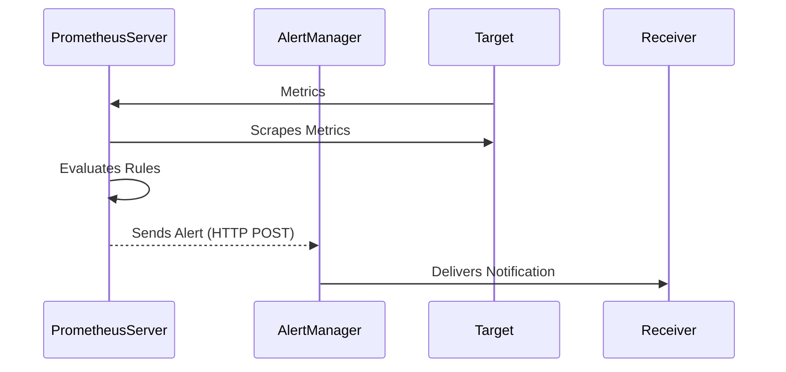

## Introduction to Prometheus Alerting Workflow and Configuration

Prometheus is a powerful monitoring system that allows you to track various metrics and set up alerts based on specific conditions. One of the key components of Prometheus is its ability to detect anomalies and trigger alerts when certain thresholds are crossed. This chapter will delve deep into the Prometheus alerting workflow and configuration, explaining how alerts are generated, managed, and delivered to the appropriate channels.

### What is Prometheus?

Prometheus is an open-source systems monitoring and alerting toolkit originally built at SoundCloud. It is now a standalone project and maintained by the Cloud Native Computing Foundation (CNCF). Prometheus collects and stores metrics from configured targets at regular intervals and then processes this data to provide real-time insights into your infrastructure.

### Key Components of Prometheus

Prometheus consists of several key components:

1. **Prometheus Server**: The central component that scrapes metrics from instrumented jobs and stores them in a time series database.
2. **Alertmanager**: A separate application that handles alerts sent by the Prometheus server.
3. **Targets**: These are the services or applications that Prometheus scrapes for metrics.
4. **Rules**: These define the conditions under which alerts should be triggered.

### Understanding Alerts in Prometheus

An alert in Prometheus is essentially a rule that defines a condition. When this condition is met, Prometheus marks the alert as "firing." Let's break down the process:

1. **Condition Evaluation**: Prometheus continuously evaluates rules to check if the defined conditions are met.
2. **Firing State**: If a condition is met, the alert enters a "firing" state.
3. **Notification**: Prometheus sends the alert to Alertmanager, which then handles the delivery of notifications.

#### Example Scenario: High CPU Load

Consider a scenario where you want to monitor CPU load in your cluster. You can define an alert rule that triggers when the CPU load exceeds a certain threshold.

```yaml
# Example alert rule for high CPU load
groups:
- name: example
  rules:
  - alert: HighCPULoad
    expr: sum(node_cpu_seconds_total{mode="idle"}) by (instance) < 0.1 * count(node_cpu_seconds_total{mode="idle"}) by (instance)
    for: 5m
    labels:
      severity: critical
    annotations:
      summary: "High CPU load on {{ $labels.instance }}"
      description: "The CPU load on {{ $labels.instance }} is above the threshold."
```

In this example:
- `expr`: The expression checks if the idle CPU time is less than 10% of the total CPU time.
- `for`: The alert will only fire if the condition persists for 5 minutes.
- `labels`: Additional metadata about the alert.
- `annotations`: Human-readable summaries and descriptions.

### Prometheus Alerting Workflow

Let's explore the detailed workflow of how Prometheus handles alerts:

1. **Rule Evaluation**:
   - Prometheus periodically evaluates the alert rules.
   - If a rule condition is met, the alert enters a "firing" state.

2. **Sending Alerts to Alertmanager**:
   - Once an alert is in a "firing" state, Prometheus sends the alert to Alertmanager.
   - This is done via HTTP POST requests to the Alertmanager API.

3. **Handling Alerts in Alertmanager**:
   - Alertmanager receives the alerts and manages their delivery.
   - It can route alerts to different receivers based on configurations.

#### Detailed Workflow Diagram



### Configuring Alertmanager

Alertmanager is a separate application that handles the delivery of alerts. To ensure alerts are properly delivered, you need to configure Alertmanager correctly.

#### Example Alertmanager Configuration

```yaml
global:
  resolve_timeout: 5m

route:
  group_by: ['alertname']
  group_wait: 30s
  group_interval: 5m
  repeat_interval: 1h
  receiver: email

receivers:
- name: email
  email_configs:
  - to: 'admin@example.com'
    from: 'prometheus@example.com'
    smarthost: 'smtp.example.com:587'
    auth_username: 'username'
    auth_password: 'password'
    auth_secret: 'secret'
```

In this configuration:
- `global`: Global settings for Alertmanager.
- `route`: Defines how alerts are grouped and routed.
- `receiver`: Specifies the method of notification (email in this case).

### Common Pitfalls and How to Avoid Them

#### Pitfall 1: Misconfigured Alert Rules

**Problem**: Incorrectly configured alert rules can lead to false positives or missed alerts.

**Solution**: Thoroughly test alert rules using synthetic data or by simulating conditions that should trigger alerts.

#### Pitfall 2: Unhandled Alerts

**Problem**: If Alertmanager is not configured, alerts may be ignored.

**Solution**: Ensure Alertmanager is properly configured and integrated with Prometheus.

#### Pitfall 3: Overloading Notification Channels

**Problem**: Sending too many alerts can overwhelm notification channels.

**Solution**: Implement rate limiting and grouping strategies in Alertmanager.

### Real-World Examples and Recent Breaches

#### Example: CVE-2021-42287

CVE-2021-42287 is a vulnerability in Prometheus that could allow an attacker to execute arbitrary code. This highlights the importance of keeping Prometheus and Alertmanager updated to the latest versions.

#### Example: High CPU Load in Kubernetes Clusters

A recent incident involved a Kubernetes cluster experiencing high CPU load due to a misconfigured application. Proper alerting and monitoring would have helped detect and mitigate the issue earlier.

### How to Prevent / Defend

#### Detection

- Regularly review alert logs to identify patterns and potential issues.
- Use tools like Grafana to visualize alert data and trends.

#### Prevention

- Keep Prometheus and Alertmanager updated to the latest versions.
- Implement strict access controls and authentication mechanisms.

#### Secure Coding Fixes

**Vulnerable Code**:
```yaml
groups:
- name: example
  rules:
  - alert: HighCPULoad
    expr: sum(node_cpu_seconds_total{mode="idle"}) by (instance) < 0.1 * count(node_cpu_seconds_total{mode="idle"}) by (instance)
    for: 5m
    labels:
      severity: critical
    annotations:
      summary: "High CPU load on {{ $labels.instance }}"
      description: "The CPU load on {{ $labels.instance }} is above the threshold."
```

**Secure Code**:
```yaml
groups:
- name: example
  rules:
  - alert: HighCPULoad
    expr: sum(node_cpu_seconds_total{mode="idle"}) by (instance) < 0.1 * count(node_cpu_seconds_total{mode="idle"}) by (instance)
    for: 5m
    labels:
      severity: critical
    annotations:
      summary: "High CPU load on {{ $labels.instance }}"
      description: "The CPU load on {{ $labels.instance }} is above the threshold."
    # Add additional checks and validation
```

#### Configuration Hardening

- Enable TLS encryption for communication between Prometheus and Alertmanager.
- Use strong authentication mechanisms for accessing Alertmanager.

### Practice Labs

For hands-on practice with Prometheus and Alertmanager, consider the following labs:

- **PortSwigger Web Security Academy**: Offers comprehensive labs on web application security.
- **OWASP Juice Shop**: A deliberately insecure web application for practicing web security skills.
- **DVWA (Damn Vulnerable Web Application)**: A PHP/MySQL web application that is riddled with vulnerabilities.
- **WebGoat**: An interactive, gamified training application for learning web security.

These labs provide practical experience in setting up and configuring Prometheus and Alertmanager in real-world scenarios.

### Conclusion

Understanding the Prometheus alerting workflow and configuration is crucial for effective monitoring and alerting in modern DevOps environments. By thoroughly testing and configuring your alert rules and integrating with Alertmanager, you can ensure timely and accurate notifications for any issues in your infrastructure.

---
<!-- nav -->
[[DevOps/DevOps Bootcamp/10-Monitoring & Alerting/16-Prometheus Alerting Workflow And Configuration/00-Overview|Overview]] | [[02-Introduction to Prometheus Alerting|Introduction to Prometheus Alerting]]
