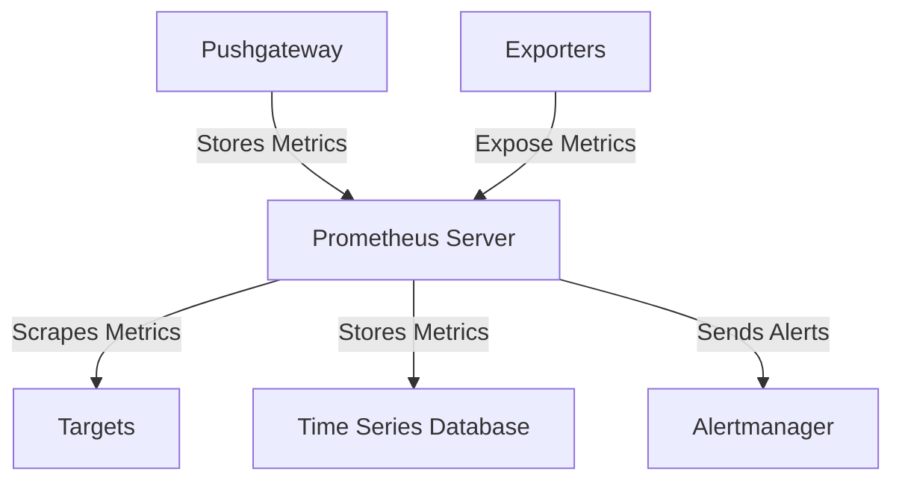

## Introduction to Prometheus Monitoring

Prometheus is an open-source systems monitoring and alerting toolkit originally built at SoundCloud and now maintained by the Cloud Native Computing Foundation (CNCF). It is designed to monitor highly dynamic container environments like Kubernetes and Docker Swarm but can also be used in traditional non-container infrastructures. Prometheus has gained widespread acceptance due to its powerful features and ease of integration, making it a crucial tool in modern DevOps practices.

### What is Prometheus?

Prometheus is a monitoring system and time series database. It collects metrics from configured targets at specified intervals and stores them internally. These metrics can be visualized and queried using PromQL, a powerful query language. Prometheus supports a wide range of exporters and integrations, allowing it to monitor various systems and services.

#### Key Components of Prometheus

1. **Server**: The central component that scrapes metrics from targets and stores them in a time series database.
2. **Alertmanager**: A component that handles alerts sent by Prometheus and routes them to the appropriate receivers.
3. **Pushgateway**: A temporary storage for metrics that are pushed rather than pulled.
4. **Exporters**: Programs that expose metrics to Prometheus. There are many exporters available for different services and systems.



### Why is Prometheus Important?

Modern DevOps environments are increasingly complex, with multiple servers running containerized applications and hundreds of interconnected processes. Maintaining such setups to run smoothly and avoid application downtimes is challenging. Prometheus addresses these challenges by providing:

1. **High Scalability**: Prometheus can handle large volumes of metrics efficiently.
2. **Dynamic Discovery**: It supports service discovery mechanisms to automatically discover and scrape metrics from new targets.
3. **Rich Query Language**: PromQL allows users to perform complex queries and aggregations on collected metrics.
4. **Visualization**: Integrates with visualization tools like Grafana to provide intuitive dashboards.

### Use Cases of Prometheus

Prometheus is widely used in various scenarios, including:

1. **Containerized Environments**: Monitoring Kubernetes clusters, Docker Swarm, and other container orchestration platforms.
2. **Traditional Infrastructure**: Monitoring bare-metal servers and applications deployed directly on them.
3. **Microservices Architecture**: Tracking performance and health of individual microservices.
4. **Cloud Services**: Monitoring cloud-based services and resources.

### Example Configuration

Here is a basic example of a Prometheus configuration file (`prometheus.yml`):

```yaml
global:
  scrape_interval: 15s

scrape_configs:
  - job_name: 'prometheus'
    static_configs:
      - targets: ['localhost:9090']

  - job_name: 'node_exporter'
    static_configs:
      - targets: ['localhost:9100']
```

This configuration defines two jobs: one for scraping metrics from the Prometheus server itself and another for scraping metrics from a `node_exporter` running on the same host.

### Key Characteristics of Prometheus

1. **Pull-Based Model**: Prometheus uses a pull-based model to collect metrics from targets. This ensures that the monitoring system is decoupled from the monitored services.
2. **Multi-dimensional Data Model**: Metrics are stored as time series data with labels, allowing for flexible querying and aggregation.
3. **Service Discovery**: Prometheus supports various service discovery mechanisms to dynamically discover and scrape metrics from new targets.
4. **Reliable Storage**: Prometheus stores metrics in a time series database, ensuring reliable and efficient storage and retrieval.

### Real-World Examples

Prometheus has been adopted by numerous organizations due to its robust features and flexibility. Here are a few real-world examples:

1. **Netflix**: Uses Prometheus for monitoring their microservices architecture.
2. **Google**: Employs Prometheus for internal monitoring and has contributed significantly to its development.
3. **Uber**: Utilizes Prometheus for monitoring their containerized infrastructure.

### Pitfalls and How to Prevent/Defend

While Prometheus is a powerful tool, it is not without its challenges. Some common pitfalls include:

1. **Overloading the Prometheus Server**: Collecting too many metrics can overwhelm the server. To prevent this, configure appropriate retention policies and limit the number of metrics collected.
2. **Incorrect Service Discovery**: Misconfigured service discovery can lead to missed targets. Ensure that service discovery configurations are correct and up-to-date.
3. **Security Vulnerabilities**: Prometheus should be secured to prevent unauthorized access. Use authentication and authorization mechanisms provided by Prometheus and integrate with external identity providers.

#### Secure Configuration Example

Here is an example of a secure Prometheus configuration:

```yaml
global:
  scrape_interval: 15s

scrape_configs:
  - job_name: 'prometheus'
    static_configs:
      - targets: ['localhost:9090']
    basic_auth:
      username: 'prometheus_user'
      password: 'secure_password'

  - job_name: 'node_exporter'
    static_configs:
      - targets: ['localhost:9100']
    bearer_token: 'secure_bearer_token'
```

In this configuration, basic authentication is enabled for the Prometheus job, and a bearer token is used for the `node_exporter` job.

### Conclusion

Prometheus is a vital tool in modern DevOps environments, providing scalable and flexible monitoring capabilities. Its rich feature set and ease of integration make it a preferred choice for monitoring both containerized and traditional infrastructures. By understanding its architecture, use cases, and best practices, you can effectively leverage Prometheus to maintain the smooth operation of your systems.

### Hands-On Labs

To gain practical experience with Prometheus, consider the following labs:

- **PortSwigger Web Security Academy**: Offers a module on monitoring and logging, which includes Prometheus.
- **Grafana Learning Center**: Provides tutorials and labs specifically focused on Prometheus and Grafana integration.
- **Kubernetes Goat**: A hands-on lab for learning Kubernetes security, which includes Prometheus monitoring.

By completing these labs, you will gain a deeper understanding of how to implement and manage Prometheus in real-world scenarios.

---
<!-- nav -->
[[01-Introduction to Prometheus Monitoring in Dynamic Environments|Introduction to Prometheus Monitoring in Dynamic Environments]] | [[DevOps/DevOps Bootcamp/10-Monitoring & Alerting/17-Prometheus Monitoring In Dynamic Environments/00-Overview|Overview]] | [[03-Evaluation Interval|Evaluation Interval]]
