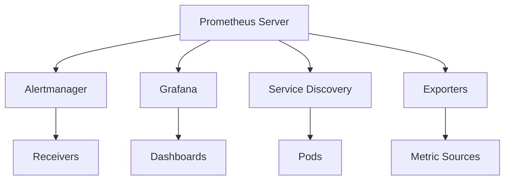
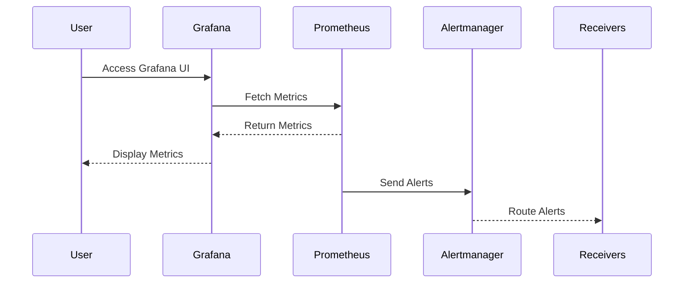

## Introduction to Prometheus Monitoring Stack in Kubernetes

Prometheus is an open-source systems monitoring and alerting toolkit originally built at SoundCloud. It is now a standalone project and maintained by the Cloud Native Computing Foundation (CNCF). Prometheus is designed to monitor and alert on various metrics collected from different sources within a Kubernetes cluster. The Prometheus monitoring stack consists of several components that work together to provide comprehensive monitoring capabilities.

### Components of the Prometheus Monitoring Stack

The key components of the Prometheus monitoring stack include:

1. **Prometheus Server**: The core component that scrapes metrics from instrumented jobs and stores them in a time series database.
2. **Alertmanager**: Handles alerts sent by the Prometheus server and routes them to the appropriate receiver based on rules.
3. **Grafana**: A visualization tool that allows users to create dashboards and visualize the metrics collected by Prometheus.
4. **Service Discovery**: Mechanisms that allow Prometheus to discover and scrape metrics from dynamically changing sets of targets.
5. **Exporters**: Tools that expose metrics from specific applications or systems in a format that Prometheus can consume.

### Understanding the Interconnectedness of Components

All these components are interconnected and work together to form a cohesive monitoring system. The Prometheus server scrapes metrics from exporters and stores them in its time series database. Alertmanager handles alerts generated by Prometheus based on predefined rules. Grafana provides a user interface to visualize these metrics and create custom dashboards.

#### Importance of Understanding Alert Rules and Configuration

While it is not necessary to understand every intricate detail of how these components interact, it is crucial to understand how to add or adjust alert rules and configurations. This knowledge allows you to customize the monitoring stack to meet your specific needs.

### Accessing Grafana in a Kubernetes Cluster

To access Grafana, which is the UI for visualizing Prometheus data, you need to understand the networking setup within the Kubernetes cluster. By default, services in a Kubernetes cluster are of type `ClusterIP`, which means they are only accessible internally within the cluster. To access Grafana externally, you typically configure an ingress controller and point ingress rules to Grafana.

However, for development or testing purposes, you can use `kubectl port-forward` to forward traffic from a local port to a pod in the cluster. This method is useful when you want to quickly access Grafana without setting up an ingress controller.

### Setting Up Grafana Using `kubectl port-forward`

Let's walk through the steps to set up Grafana using `kubectl port-forward`.

#### Step 1: Identify the Grafana Pod

First, you need to identify the Grafana pod in your Kubernetes cluster. You can list all pods in a namespace using the following command:

```sh
kubectl get pods --namespace <namespace>
```

Replace `<namespace>` with the actual namespace where Grafana is deployed. For example:

```sh
kubectl get pods --namespace monitoring
```

This will list all pods in the `monitoring` namespace. Look for the pod named `grafana`.

#### Step 2: Forward Traffic to the Grafana Pod

Once you have identified the Grafana pod, you can use `kubectl port-forward` to forward traffic from a local port to the Grafana pod. The typical command looks like this:

```sh
kubectl port-forward <pod-name> <local-port>:<pod-port>
```

For example, if the Grafana pod is named `grafana-7894567894-fghjk` and you want to forward traffic from local port `3000` to the Grafana pod's port `3000`, you would run:

```sh
kubectl port-forward grafana-7894567894-fghjk 3000:3000
```

This command forwards traffic from your local machine's port `3000` to the Grafana pod's port `3000`.

#### Step 3: Access Grafana

After running the `kubectl port-forward` command, you can access Grafana by navigating to `http://localhost:3000` in your web browser.

### Example: Full Workflow to Access Grafana

Here is a complete example of the workflow to access Grafana using `kubectl port-forward`:

1. **List Pods**:
    ```sh
    kubectl get pods --namespace monitoring
    ```

    Output:
    ```
    NAME                                READY   STATUS    RESTARTS   AGE
    grafana-7894567894-fghjk            1/1     Running   0          1h
    prometheus-server-0                2/2     Running   0          1h
    ```

2. **Forward Traffic**:
    ```sh
    kubectl port-forward grafana-7894567894-fghjk 3000:3000
    ```

3. **Access Grafana**:
    Open your web browser and navigate to `http://localhost:3000`.

### Configuring Prometheus and Adding New Endpoints

To configure Prometheus and add new endpoints for scraping, you need to modify the Prometheus configuration file. The configuration file is typically stored as a ConfigMap in the Kubernetes cluster.

#### Step 1: Edit the Prometheus ConfigMap

First, you need to edit the ConfigMap that contains the Prometheus configuration. You can do this using the `kubectl edit` command:

```sh
kubectl edit configmap prometheus-config --namespace monitoring
```

This command opens the ConfigMap in your default editor. Look for the `scrape_configs` section, which defines the targets that Prometheus should scrape.

#### Step 2: Add a New Endpoint

To add a new endpoint, you need to define a new scrape configuration. Here is an example of how to add a new endpoint:

```yaml
scrape_configs:
  - job_name: 'kubernetes-nodes'
    static_configs:
      - targets: ['node1.example.com:9100', 'node2.example.com:9100']
  - job_name: 'new-endpoint'
    static_configs:
      - targets: ['new-endpoint.example.com:9100']
```

In this example, a new job named `new-endpoint` is added with a target `new-endpoint.example.com:9100`.

#### Step 3: Apply the Changes

After editing the ConfigMap, save the changes and exit the editor. The changes will be applied automatically, and Prometheus will start scraping the new endpoint.

### Example: Full Workflow to Add a New Endpoint

Here is a complete example of the workflow to add a new endpoint to Prometheus:

1. **Edit ConfigMap**:
    ```sh
    kubectl edit configmap prometheus-config --namespace monitoring
    ```

2. **Add New Endpoint**:
    Modify the `scrape_configs` section to include the new endpoint:

    ```yaml
    scrape_configs:
      - job_name: 'kubernetes-nodes'
        static_configs:
          - targets: ['node1.example.com:9100', 'node2.example.com:9100']
      - job_name: 'new-endpoint'
        static_configs:
          - targets: ['new-endpoint.example.com:9100']
    ```

3. **Save and Exit**:
    Save the changes and exit the editor.

### Creating and Adjusting Alert Rules

Alert rules in Prometheus define conditions under which alerts should be triggered. These rules are defined in the `rules` section of the Prometheus configuration file.

#### Step 1: Define Alert Rules

To define alert rules, you need to modify the `rules` section of the Prometheus configuration file. Here is an example of how to define an alert rule:

```yaml
alerting:
  alertmanagers:
    - static_configs:
        - targets: ['alertmanager:9093']

rule_files:
  - /etc/prometheus/rules/*.yml
```

In this example, the `rule_files` section specifies the location of the alert rule files.

#### Step 2: Create a New Alert Rule File

Create a new alert rule file, for example, `alert_rules.yml`, and define the alert rules:

```yaml
groups:
  - name: example
    rules:
      - alert: HighRequestLatency
        expr: http_request_duration_seconds > 0.5
        for: 5m
        labels:
          severity: critical
        annotations:
          summary: "High request latency on {{ $labels.instance }}"
          description: "{{ $labels.instance }} has high request latency."
```

In this example, an alert named `HighRequestLatency` is defined, which triggers if the `http_request_duration_seconds` metric exceeds `0.5` for more than `5` minutes.

#### Step 3: Apply the Changes

After creating the alert rule file, apply the changes by restarting the Prometheus server or reloading the configuration.

### Example: Full Workflow to Create an Alert Rule

Here is a complete example of the workflow to create an alert rule:

1. **Define Alert Rules**:
    Modify the `rules` section of the Prometheus configuration file to include the location of the alert rule files:

    ```yaml
    rule_files:
      - /etc/prometheus/rules/*.yml
    ```

2. **Create Alert Rule File**:
    Create a new alert rule file, for example, `alert_rules.yml`:

    ```yaml
    groups:
      - name: example
        rules:
          - alert: HighRequestLatency
            expr: http_request_duration_seconds > 0.5
            for: 5m
            labels:
              severity: critical
            annotations:
              summary: "High request latency on {{ $labels.instance }}"
              description: "{{ $labels.instance }} has high request latency."
    ```

3. **Apply the Changes**:
    Restart the Prometheus server or reload the configuration to apply the changes.

### Visualization with Grafana

Grafana is a powerful visualization tool that allows you to create custom dashboards to visualize the metrics collected by Prometheus. To create a dashboard in Grafana, follow these steps:

1. **Log in to Grafana**:
    Navigate to `http://localhost:3000` and log in using the default credentials (username: `admin`, password: `admin`).

2. **Add Data Source**:
    Click on the gear icon in the left sidebar and select `Data Sources`. Click on `Add data source` and select `Prometheus`. Configure the data source to point to your Prometheus server.

3. **Create a Dashboard**:
    Click on the plus icon in the left sidebar and select `Dashboard`. Click on `Add panel` to add a new panel to the dashboard. Select the data source and define the query to retrieve the desired metrics.

4. **Save the Dashboard**:
    Once you have created the dashboard, click on the `Save` button and give it a name.

### Example: Full Workflow to Create a Dashboard in Grafana

Here is a complete example of the workflow to create a dashboard in Grafana:

1. **Log in to Grafana**:
    Navigate to `http://localhost:3000` and log in using the default credentials (username: `admin`, password: `admin`).

2. **Add Data Source**:
    Click on the gear icon in the left sidebar and select `Data Sources`. Click on `Add data source` and select `Prometheus`. Configure the data source to point to your Prometheus server.

3. **Create a Dashboard**:
    Click on the plus icon in the left sidebar and select `Dashboard`. Click on `Add panel` to add a new panel to the dashboard. Select the data source and define the query to retrieve the desired metrics.

4. **Save the Dashboard**:
    Once you have created the dashboard, click on the `Save` button and give it a name.

### How to Prevent / Defend

#### Detection

To detect issues with the Prometheus monitoring stack, you can monitor the following:

- **Prometheus Server Logs**: Check the logs for any errors or warnings.
- **Alertmanager Logs**: Check the logs for any failed alerts.
- **Grafana Logs**: Check the logs for any issues with the visualization.

#### Prevention

To prevent issues with the Prometheus monitoring stack, you can take the following steps:

- **Regularly Update**: Keep Prometheus, Alertmanager, and Grafana up to date with the latest versions.
- **Secure Configuration**: Ensure that the configuration files are secure and not exposed to unauthorized access.
- **Backup Configuration**: Regularly backup the configuration files to prevent data loss.

#### Secure Coding Fixes

Here is an example of a vulnerable configuration and the corresponding secure configuration:

**Vulnerable Configuration**:
```yaml
scrape_configs:
  - job_name: 'kubernetes-nodes'
    static_configs:
      - targets: ['node1.example.com:9100', 'node2.example.com:9100']
```

**Secure Configuration**:
```yaml
scrape_configs:
  - job_name: 'kubernetes-nodes'
    static_configs:
      - targets: ['node1.example.com:9100', 'node2.example.com:9100']
    basic_auth:
      username: 'prometheus'
      password: 'secretpassword'
```

In the secure configuration, basic authentication is enabled to prevent unauthorized access.

### Conclusion

Understanding the Prometheus monitoring stack in Kubernetes is crucial for effective monitoring and alerting. By understanding how to add or adjust alert rules and configurations, you can customize the monitoring stack to meet your specific needs. Additionally, by using Grafana to visualize the metrics collected by Prometheus, you can gain valuable insights into the performance of your applications.

### Practice Labs

To practice setting up and configuring Prometheus in a Kubernetes cluster, you can use the following labs:

- **PortSwigger Web Security Academy**: Offers hands-on labs to practice web application security.
- **OWASP Juice Shop**: A deliberately insecure web application for security training.
- **DVWA (Damn Vulnerable Web Application)**: A PHP/MySQL web application that is riddled with vulnerabilities.
- **WebGoat**: An interactive, gamified web security training application.

These labs provide a practical way to learn and practice the concepts covered in this chapter.

### Diagrams

#### Architecture Diagram



#### Request/Response Flow



### Code Examples

#### Prometheus Configuration

```yaml
scrape_configs:
  - job_name: 'kubernetes-nodes'
    static_configs:
      - targets: ['node1.example.com:9100', 'node2.example.com:9100']
  - job_name: 'new-endpoint'
    static_configs:
      - targets: ['new-endpoint.example.com:9100']
```

#### Alert Rule

```yaml
groups:
  - name: example
    rules:
      - alert: HighRequestLatency
        expr: http_request_duration_seconds > 0.5
        for: 5m
        labels:
          severity: critical
        annotations:
          summary: "High request latency on {{ $labels.instance }}"
          description: "{{ $labels.instance }} has high request latency."
```

#### Grafana Query

```sql
SELECT *
FROM prometheus
WHERE $__timeFilter(time)
ORDER BY time DESC
LIMIT 100
```

By following these detailed steps and understanding the underlying concepts, you can effectively set up and manage the Prometheus monitoring stack in a Kubernetes cluster.

---
<!-- nav -->
[[DevOps/DevOps Bootcamp/10-Monitoring & Alerting/18-Prometheus Setup In Kubernetes Clusters/00-Overview|Overview]] | [[02-Introduction to Prometheus Monitoring in Kubernetes|Introduction to Prometheus Monitoring in Kubernetes]]
