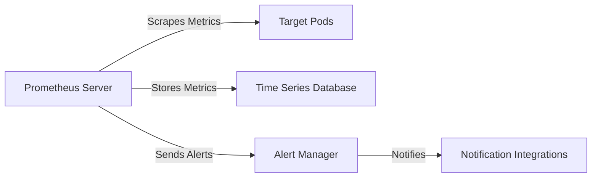

## Introduction to Prometheus in Kubernetes

Prometheus is an open-source monitoring system and time series database designed to collect metrics from configured targets at specified intervals and store them within a time series database. It provides a flexible query language to aggregate metrics and visualize the results. In this section, we will delve into setting up Prometheus in a Kubernetes cluster using Helm charts, understand the components involved, and explore the underlying mechanisms.

### Background Theory

Before diving into the setup process, it's essential to understand the key concepts and components of Prometheus:

1. **Prometheus Server**: This is the central component that scrapes metrics from targets, processes them, and stores them in a time series database.
2. **Alert Manager**: Manages and de-duplicates alerts sent by the Prometheus server and sends notifications via various integrations like email, Slack, etc.
3. **StatefulSets**: A Kubernetes resource that ensures stable, unique network identifiers for pods and maintains storage even when the pod is rescheduled.
4. **Helm**: A package manager for Kubernetes that simplifies the deployment and management of applications.

### Setting Up Prometheus Using Helm

To set up Prometheus in a Kubernetes cluster, we will use Helm charts. Helm charts are packages that contain all the information necessary to deploy a specific application to a Kubernetes cluster.

#### Step-by-Step Setup

1. **Add the Helm Repository**:
   First, we need to add the official Helm repository for Prometheus. This can be done using the `helm repo add` command.

   ```sh
   helm repo add prometheus-community https://prometheus-community.github.io/helm-charts
   ```

2. **Update the Helm Repository**:
   After adding the repository, update it to ensure you have the latest versions of the charts.

   ```sh
   helm repo update
   ```

3. **Install Prometheus Using Helm**:
   Now, we can install Prometheus using the Helm chart. We will use the `prometheus` chart from the `prometheus-community` repository.

   ```sh
   helm install prometheus prometheus-community/prometheus
   ```

   This command installs the Prometheus server and Alert Manager along with other necessary components.

### Understanding the Components

Once the installation is complete, we can inspect the components created by the Helm chart. Let's break down the components and their roles:

1. **Pods**:
   Pods are the smallest deployable units in Kubernetes. They encapsulate application containers, storage resources, and options that define how the container should run.

   ```sh
   kubectl get pods
   ```

   Example output:

   ```
   NAME                                    READY   STATUS    RESTARTS   AGE
   prometheus-alertmanager-0               2/2     Running   0          5m
   prometheus-kube-state-metrics-7b6c8d9f8-zhjzr   1/1     Running   0          5m
   prometheus-node-exporter-bn67v          1/1     Running   0          5m
   prometheus-pushgateway-67f79b6687-6lqkq 1/1     Running   0          5m
   prometheus-server-0                     2/2     Running   0          5m
   ```

2. **Services**:
   Services provide a stable endpoint for accessing pods. They abstract away the details of individual pods and provide load balancing.

   ```sh
   kubectl get svc
   ```

   Example output:

   ```
   NAME                       TYPE        CLUSTER-IP      EXTERNAL-IP   PORT(S)    AGE
   prometheus-alertmanager    ClusterIP   10.96.0.1       <none>        9093/TCP   5m
   prometheus-kube-state-metrics   ClusterIP   10.96.0.2       <none>        8080/TCP   5m
   prometheus-node-exporter   ClusterIP   10.96.0.3       <none>        9100/TCP   5m
   prometheus-pushgateway     ClusterIP   10.96.0.4       <none>        9091/TCP   5m
   prometheus-server          ClusterIP   10.96.0.5       <none>        9090/TCP   5m
   ```

3. **StatefulSets**:
   StatefulSets ensure that each pod has a unique identity and persistent storage. They are used for stateful applications like databases and monitoring systems.

   ```sh
   kubectl get statefulsets
   ```

   Example output:

   ```
   NAME                  READY   AGE
   prometheus-alertmanager   1/1     5m
   prometheus-server         1/1     5m
   ```

### Detailed Explanation of Components

#### Prometheus Server

The Prometheus server is responsible for scraping metrics from targets and storing them in a time series database. It also provides a query interface to retrieve and aggregate metrics.

- **StatefulSet**: `prometheus-server`
- **Pods**: `prometheus-server-0`
- **Service**: `prometheus-server`

#### Alert Manager

The Alert Manager manages and de-duplicates alerts sent by the Prometheus server. It can send notifications via various integrations like email, Slack, etc.

- **StatefulSet**: `prometheus-alertmanager`
- **Pods**: `prometheus-alertmanager-0`
- **Service**: `prometheus-alertmanager`

### Mermaid Diagrams

Let's visualize the architecture of the Prometheus setup in Kubernetes using Mermaid diagrams.



### Common Pitfalls and How to Prevent Them

#### Pitfall 1: Incorrect Configuration of Scrape Intervals

Incorrect scrape intervals can lead to missed data points or excessive resource usage. Ensure that the scrape interval is set appropriately for your use case.

- **Vulnerable Configuration**:
  ```yaml
  scrape_interval: 15s
  ```

- **Secure Configuration**:
  ```yaml
  scrape_interval: 15s
  evaluation_interval: 15s
  ```

#### Pitfall 2: Insufficient Resource Allocation

Insufficient resource allocation can cause the Prometheus server to become unresponsive or crash. Ensure that the Prometheus server has enough CPU and memory allocated.

- **Vulnerable Configuration**:
  ```yaml
  resources:
    limits:
      cpu: 100m
      memory: 128Mi
    requests:
      cpu: 50m
      memory: 64Mi
  ```

- **Secure Configuration**:
  ```yaml
  resources:
    limits:
      cpu: 500m
      memory: 512Mi
    requests:
      cpu: 250m
      memory: 256Mi
  ```

### Real-World Examples

#### Example 1: CVE-2021-25285

CVE-2021-25285 is a vulnerability in the Prometheus server that allows remote code execution due to improper validation of user input. This vulnerability can be exploited to gain unauthorized access to the system.

- **Detection**:
  Check for the presence of the vulnerability using tools like `trivy` or `clair`.

  ```sh
  trivy image my-prometheus-image
  ```

- **Prevention**:
  Ensure that the Prometheus server is kept up-to-date with the latest security patches.

  ```sh
  kubectl set image deployment/prometheus-server prometheus-server=quay.io/prometheus/prometheus:v2.26.0
  ```

### Hands-On Labs

For hands-on practice, consider the following labs:

- **PortSwigger Web Security Academy**: Offers a comprehensive course on web security, including sections on monitoring and logging.
- **OWASP Juice Shop**: A deliberately insecure web application for security training purposes. It includes features for monitoring and logging.
- **Kubernetes Goat**: A Kubernetes-based security training platform that includes exercises on monitoring and logging.

These labs provide practical experience in setting up and securing Prometheus in a Kubernetes environment.

### Conclusion

In this section, we have covered the setup of Prometheus in a Kubernetes cluster using Helm charts, understood the components involved, and explored the underlying mechanisms. We have also discussed common pitfalls and provided real-world examples to illustrate the importance of proper configuration and security practices. By following these guidelines, you can ensure a robust and secure monitoring setup in your Kubernetes environment.

---
<!-- nav -->
[[03-Introduction to Prometheus in Kubernetes Clusters|Introduction to Prometheus in Kubernetes Clusters]] | [[DevOps/DevOps Bootcamp/10-Monitoring & Alerting/18-Prometheus Setup In Kubernetes Clusters/00-Overview|Overview]] | [[05-Prometheus Setup in Kubernetes Clusters|Prometheus Setup in Kubernetes Clusters]]
