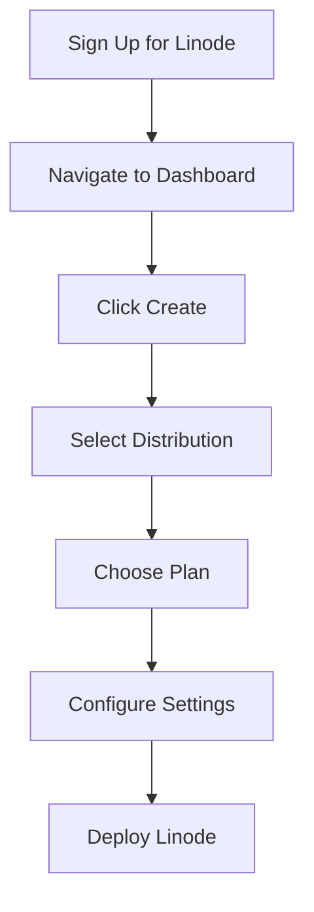
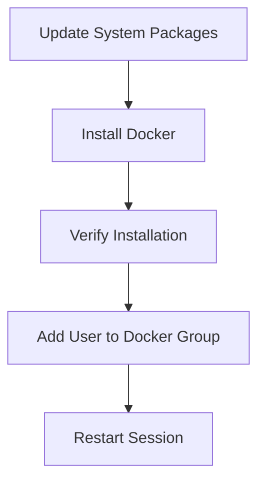
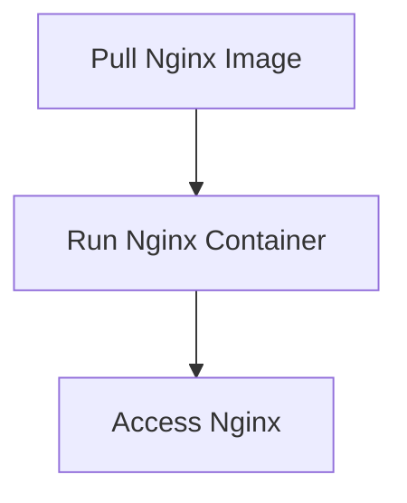

## Introduction to Python Automation for Website Monitoring

In this section, we delve into the practical aspects of automating website monitoring using Python. While previous sections focused on automating tasks within specific infrastructure platforms such as AWS using the BOTO library, this section broadens our scope to cover general website monitoring. This is a crucial skill in the DevOps toolkit, as it allows us to ensure the availability and performance of websites hosted on various cloud servers or even on-premise servers.

### Overview of the Setup

The primary goal is to set up a simple website running on a cloud server and then monitor it using Python scripts. For this demonstration, we will use Linode as our cloud provider, but the principles and techniques can be applied to other providers such as DigitalOcean, AWS, or even on-premise servers.

### Step-by-Step Guide

#### 1. Setting Up the Cloud Server

First, we need to create a cloud server. In this case, we will use Linode, but the process is similar for other providers.

##### Creating a Linode Instance

1. **Sign Up for Linode**: Visit the Linode website and sign up for an account.
2. **Create a New Linode**: Navigate to the Linode dashboard and click on "Create" to start a new Linode.
3. **Select Configuration**: Choose a distribution (e.g., Ubuntu 20.04 LTS) and select the desired plan based on your requirements.
4. **Configure Settings**: Set up the root password, hostname, and other settings as needed.
5. **Deploy the Linode**: Click "Deploy" to create the Linode instance.



#### 2. Installing Docker

Once the Linode instance is created, we need to install Docker on it. Docker is a platform that allows us to package applications into containers, making them portable and easy to manage.

##### Installing Docker

1. **Update System Packages**:
    ```sh
    sudo apt-get update
    sudo apt-get upgrade
    ```

2. **Install Docker**:
    ```sh
    sudo apt-get install docker.io
    ```

3. **Verify Installation**:
    ```sh
    sudo systemctl status docker
    ```

4. **Add User to Docker Group**:
    ```sh
    sudo usermod -aG docker $USER
    ```

5. **Restart the Session**:
    Log out and log back in to apply the group changes.



#### 3. Running a Simple Nginx Container

Next, we will run a simple Nginx container on the Linode instance. Nginx is a popular web server that can serve static content and act as a reverse proxy.

##### Running Nginx Container

1. **Pull Nginx Image**:
    ```sh
    docker pull nginx
    ```

2. **Run Nginx Container**:
    ```sh
    docker run --name my-nginx -p 80:80 -d nginx
    ```

3. **Access Nginx**:
    Open a web browser and navigate to the public IP address of the Linode instance. You should see the default Nginx welcome page.



### Automating Website Monitoring with Python

Now that we have a simple website running on a cloud server, we can proceed to automate its monitoring using Python.

#### 1. Writing the Python Script

We will write a Python script that periodically checks the availability and response time of the website.

##### Importing Required Libraries

```python
import requests
import time
from datetime import datetime
```

##### Defining the Monitoring Function

```python
def monitor_website(url, interval=60):
    while True:
        try:
            response = requests.get(url)
            status_code = response.status_code
            response_time = response.elapsed.total_seconds()
            timestamp = datetime.now().strftime("%Y-%m-%d %H:%M:%S")
            print(f"{timestamp} - Status Code: {status_code}, Response Time: {response_time:.2f}s")
        except requests.exceptions.RequestException as e:
            timestamp = datetime.now().strftime("%Y-%m-%d %H:%M:%S")
            print(f"{timestamp} - Error: {str(e)}")
        
        time.sleep(interval)
```

##### Running the Monitoring Script

```python
if __name__ == "__main__":
    url = "http://<Linode_IP_Address>"
    monitor_website(url)
```

#### 2. Running the Script

To run the script, save it to a file (e.g., `monitor_website.py`) and execute it using Python:

```sh
python monitor_website.py
```

### Real-World Examples and Security Considerations

#### Example: CVE-2021-21277

CVE-2021-21277 is a critical vulnerability in the Nginx web server that allows remote code execution. This highlights the importance of keeping your web server software up to date and monitoring its health regularly.

##### Secure Coding Practices

To prevent such vulnerabilities, ensure that you:

1. **Keep Software Updated**: Regularly update Nginx and other dependencies to the latest versions.
2. **Use Secure Configurations**: Follow best practices for configuring Nginx, such as disabling unnecessary modules and securing sensitive data.
3. **Monitor Logs**: Regularly review logs for suspicious activity.

#### Example: Heartbleed Bug (CVE-2014-0160)

The Heartbleed bug was a serious vulnerability in OpenSSL that allowed attackers to steal sensitive information from servers. This underscores the importance of comprehensive monitoring and timely updates.

##### Secure Coding Practices

To mitigate such risks:

1. **Patch Management**: Implement a robust patch management system to ensure timely updates.
2. **Regular Audits**: Conduct regular security audits to identify and address vulnerabilities.
3. **Encryption**: Use strong encryption protocols to protect sensitive data.

### How to Prevent / Defend

#### Detection

To detect issues with your website, you can:

1. **Log Analysis**: Analyze logs for unusual patterns or errors.
2. **Monitoring Tools**: Use tools like Prometheus and Grafana to visualize and monitor key metrics.

#### Prevention

To prevent issues, you can:

1. **Automated Testing**: Implement automated testing to catch bugs early.
2. **Security Policies**: Enforce strict security policies and guidelines.
3. **Regular Updates**: Keep all software components up to date.

#### Secure Coding Fixes

Compare the insecure and secure versions of the code:

**Insecure Version:**

```python
def monitor_website(url, interval=60):
    while True:
        response = requests.get(url)
        status_code = response.status_code
        response_time = response.elapsed.total_seconds()
        print(f"Status Code: {status_code}, Response Time: {response_time:.2f}s")
        time.sleep(interval)
```

**Secure Version:**

```python
def monitor_website(url, interval=60):
    while True:
        try:
            response = requests.get(url)
            status_code = response.status_code
            response_time = response.elapsed.total_seconds()
            timestamp = datetime.now().strftime("%Y-%m-%d %H:%M:%S")
            print(f"{timestamp} - Status Code: {status_code}, Response Time: {response_time:.2f}s")
        except requests.exceptions.RequestException as e:
            timestamp = datetime.now().strftime("%Y-%m-%d %H:%M:%S")
            print(f"{timestamp} - Error: {str(e)}")
        
        time.sleep(interval)
```

### Conclusion

This section provided a comprehensive guide to setting up a simple website on a cloud server and automating its monitoring using Python. By following these steps, you can ensure the availability and performance of your website. Additionally, we covered important security considerations and best practices to prevent and detect potential issues.

### Hands-On Labs

For hands-on practice, consider the following labs:

- **PortSwigger Web Security Academy**: Offers interactive labs to learn about web security.
- **OWASP Juice Shop**: A deliberately insecure web application for practicing web security skills.
- **DVWA (Damn Vulnerable Web Application)**: Another intentionally vulnerable web application for learning web security.

These labs provide practical experience in setting up and monitoring web applications, as well as identifying and mitigating security vulnerabilities.

---
<!-- nav -->
[[02-Introduction to Linode and Virtual Servers|Introduction to Linode and Virtual Servers]] | [[DevOps/DevOps Bootcamp/10-Monitoring & Alerting/19-Python Automation for Website Monitoring/00-Overview|Overview]] | [[04-Introduction to Website Monitoring with Python Automation|Introduction to Website Monitoring with Python Automation]]
