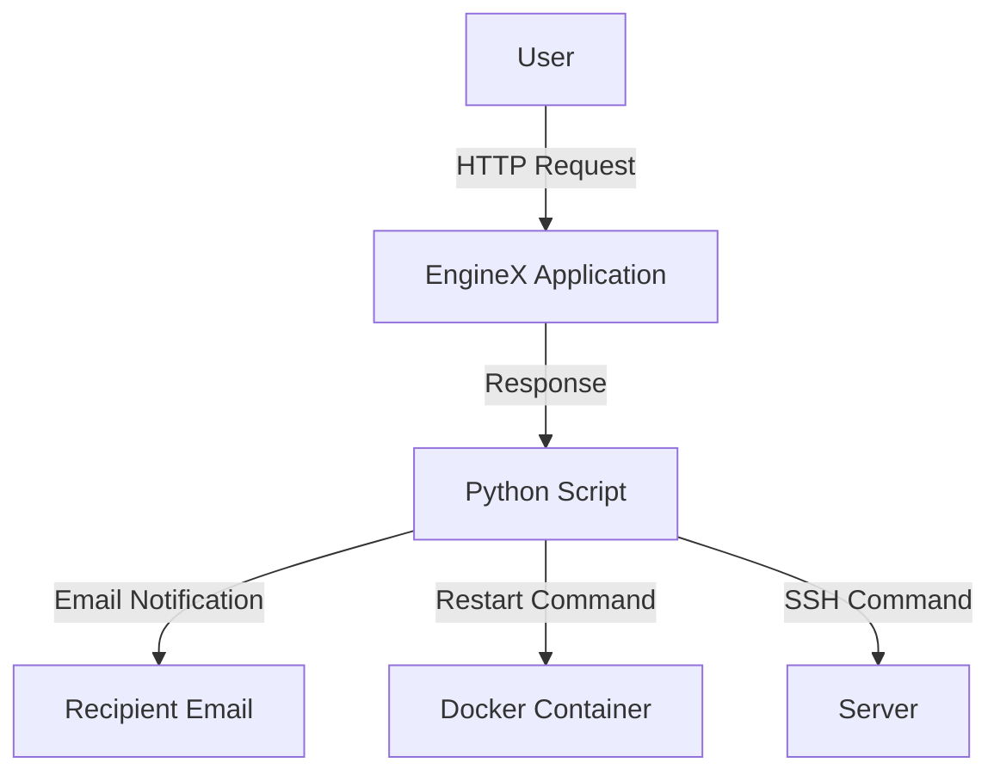

## Introduction to Website Monitoring with Python Automation

In this section, we will delve into the process of creating a Python-based automation script for monitoring a website hosted on a Linode server. This script will check the status of the application, notify you via email if the application is down, and even attempt to restart the Docker container or the server itself to resolve the issue. We'll cover the entire process, including setting up the Linode server, running the EngineX container, writing the Python script, and implementing the notification and recovery mechanisms.

### Setting Up the Linode Server

Before we start writing the Python script, we need to set up a Linode server and run the EngineX container on it. Linode is a popular cloud hosting provider that offers virtual private servers (VPS) for various purposes, including web hosting, development environments, and more.

#### Creating a Linode Server

To create a Linode server:

1. **Sign up for a Linode account**: Visit the Linode website and sign up for an account.
2. **Create a new Linode**: Navigate to the Linode dashboard and click on "Create" to start creating a new Linode.
3. **Choose a distribution**: Select a Linux distribution such as Ubuntu or Debian.
4. **Select a plan**: Choose a plan that suits your needs. For a basic setup, a smaller plan like the $5/month plan should suffice.
5. **Configure the Linode**: Set the root password and other configurations as needed.
6. **Deploy the Linode**: Click on "Deploy" to create and deploy your Linode server.

#### Running the EngineX Container

Once the Linode server is up and running, we can proceed to run the EngineX container on it. EngineX is a hypothetical application for this example, but you can replace it with any application you wish to monitor.

1. **Install Docker**: Ensure Docker is installed on your Linode server. You can install Docker using the following commands:

    ```bash
    sudo apt-get update
    sudo apt-get install -y docker.io
    ```

2. **Run the EngineX container**: Use the `docker run` command to start the EngineX container. Replace `engine-x-image` with the actual image name of your application.

    ```bash
    docker run -d --name engine-x -p 8080:8080 engine-x-image
    ```

### Writing the Python Script for Monitoring

Now that the Linode server and the EngineX container are set up, we can write a Python script to monitor the application. The script will make an HTTP request to the application endpoint and check the response status.

#### Importing Required Libraries

We will use the `requests` library to make HTTP requests and the `smtplib` library to send emails. Install these libraries using pip if they are not already installed:

```bash
pip install requests
```

Here is the initial structure of the Python script:

```python
import requests
import smtplib
from email.mime.text import MIMEText
from email.mime.multipart import MIMEMultipart

# Configuration
APP_ENDPOINT = "http://your-linode-ip:8080"
EMAIL_FROM = "your-email@example.com"
EMAIL_TO = "recipient-email@example.com"
EMAIL_PASSWORD = "your-email-password"

def check_app_status():
    try:
        response = requests.get(APP_ENDPOINT)
        if response.status_code == 200:
            print("Application is up and running.")
        else:
            print(f"Application is down. Status code: {response.status_code}")
            send_email_notification()
    except requests.exceptions.RequestException as e:
        print(f"Error checking application status: {e}")
        send_email_notification()

def send_email_notification():
    subject = "Website Down Notification"
    body = f"The website at {APP_ENDPOINT} is down. Please check and take necessary actions."
    
    msg = MIMEMultipart()
    msg['From'] = EMAIL_FROM
    msg['To'] = EMAIL_TO
    msg['Subject'] = subject
    
    msg.attach(MIMEText(body, 'plain'))
    
    server = smtplib.SMTP('smtp.gmail.com', 587)
    server.starttls()
    server.login(EMAIL_FROM, EMAIL_PASSWORD)
    text = msg.as_string()
    server.sendmail(EMAIL_FROM, EMAIL_TO, text)
    server.quit()

if __name__ == "__main__":
    check_app_status()
```

### Explanation of the Code

Let's break down the code to understand each part:

1. **Importing Libraries**:
    - `requests`: Used to make HTTP requests.
    - `smtplib`, `MIMEText`, `MIMEMultipart`: Used to send emails.

2. **Configuration**:
    - `APP_ENDPOINT`: The URL of the EngineX application.
    - `EMAIL_FROM`, `EMAIL_TO`, `EMAIL_PASSWORD`: Email details for sending notifications.

3. **Function `check_app_status`**:
    - Makes an HTTP GET request to the `APP_ENDPOINT`.
    - Checks the response status code.
    - If the status code is not 200, it calls `send_email_notification`.

4. **Function `send_email_notification`**:
    - Constructs the email message.
    - Sends the email using SMTP.

### Automating the Fix

The next step is to automate the fixing of the issue. If the application is down, the script should attempt to restart the Docker container or the server itself.

#### Restarting the Docker Container

To restart the Docker container, we can use the `docker` command within the Python script.

```python
import subprocess

def restart_docker_container():
    try:
        subprocess.run(["docker", "restart", "engine-x"], check=True)
        print("Docker container restarted successfully.")
    except subprocess.CalledProcessError as e:
        print(f"Failed to restart Docker container: {e}")
        restart_server()
```

#### Restarting the Server

If the server itself is down, we can use SSH to restart it.

```python
import paramiko

def restart_server():
    ssh_client = paramiko.SSHClient()
    ssh_client.set_missing_host_key_policy(paramiko.AutoAddPolicy())
    try:
        ssh_client.connect(hostname="your-linode-ip", username="root", password="your-root-password")
        stdin, stdout, stderr = ssh_client.exec_command("reboot")
        print("Server reboot initiated.")
    except Exception as e:
        print(f"Failed to restart server: {e}")
    finally:
        ssh_client.close()
```

### Full Python Script with Automated Fixes

Combining all the parts together, the full Python script looks like this:

```python
import requests
import smtplib
from email.mime.text import MIMEText
from email.mime.multipart import MIMEMultipart
import subprocess
import paramiko

# Configuration
APP_ENDPOINT = "http://your-linode-ip:8080"
EMAIL_FROM = "your-email@example.com"
EMAIL_TO = "recipient-email@example.com"
EMAIL_PASSWORD = "your-email-password"
LINODE_IP = "your-linode-ip"
ROOT_PASSWORD = "your-root-password"

def check_app_status():
    try:
        response = requests.get(APP_ENDPOINT)
        if response.status_code == 200:
            print("Application is up and running.")
        else:
            print(f"Application is down. Status code: {response.status_code}")
            send_email_notification()
            restart_docker_container()
    except requests.exceptions.RequestException as e:
        print(f"Error checking application status: {e}")
        send_email_notification()
        restart_docker_container()

def send_email_notification():
    subject = "Website Down Notification"
    body = f"The website at {APP_ENDPOINT} is down. Please check and take necessary actions."
    
    msg = MIMEMultipart()
    msg['From'] = EMAIL_FROM
    msg['To'] = EMAIL_TO
    msg['Subject'] = subject
    
    msg.attach(MIMEText(body, 'plain'))
    
    server = smtplib.SMTP('smtp.gmail.com',  587)
    server.starttls()
    server.login(EMAIL_FROM, EMAIL_PASSWORD)
    text = msg.as_string()
    server.sendmail(EMAIL_FROM, EMAIL_TO, text)
    server.quit()

def restart_docker_container():
    try:
        subprocess.run(["docker", "restart", "engine-x"], check=True)
        print("Docker container restarted successfully.")
    except subprocess.CalledProcessError as e:
        print(f"Failed to restart Docker container: {e}")
        restart_server()

def restart_server():
    ssh_client = paramiko.SSHClient()
    ssh_client.set_missing_host_key_policy(paramiko.AutoAddPolicy())
    try:
        ssh_client.connect(hostname=LINODE_IP, username="root", password=ROOT_PASSWORD)
        stdin, stdout, stderr = ssh_client.exec_command("reboot")
        print("Server reboot initiated.")
    except Exception as e:
        print(f"Failed to restart server: {e}")
    finally:
        ssh_client.close()

if __name__ == "__main__":
    check_app_status()
```

### Diagrams and Topologies

To visualize the architecture, we can use Mermaid diagrams.



### Pitfalls and Common Mistakes

1. **Incorrect Endpoint URL**: Ensure the `APP_ENDPOINT` is correct and accessible.
2. **Email Configuration**: Double-check the email credentials and SMTP settings.
3. **Docker and SSH Commands**: Ensure the commands to restart the Docker container and the server are correct and have the necessary permissions.

### How to Prevent / Defend

#### Detection

- **Monitoring Tools**: Use tools like Prometheus and Grafana for continuous monitoring.
- **Logs**: Regularly check logs for errors and warnings.

#### Prevention

- **Regular Updates**: Keep the application and server software updated.
- **Security Best Practices**: Follow security guidelines for Docker and server configurations.

#### Secure Coding Fixes

Compare the vulnerable and secure versions of the code:

**Vulnerable Code**:
```python
subprocess.run(["docker", "restart", "engine-x"])
```

**Secure Code**:
```python
try:
    subprocess.run(["docker", "restart", "engine-x"], check=True)
except subprocess.CalledProcessError as e:
    print(f"Failed to restart Docker container: {e}")
```

### Conclusion

In this section, we covered the entire process of setting up a Linode server, running a Docker container, writing a Python script for monitoring, and automating the fixing of issues. By following these steps, you can ensure your application is monitored and automatically recovered in case of failures.

### Practice Labs

For hands-on practice, consider the following labs:

- **PortSwigger Web Security Academy**: Focus on web application security.
- **OWASP Juice Shop**: Practice web application security challenges.
- **DVWA (Damn Vulnerable Web Application)**: Learn about web application vulnerabilities.
- **WebGoat**: Another web application security training platform.

These labs will help you gain practical experience in web application security and automation.

---
<!-- nav -->
[[03-Introduction to Python Automation for Website Monitoring|Introduction to Python Automation for Website Monitoring]] | [[DevOps/DevOps Bootcamp/10-Monitoring & Alerting/19-Python Automation for Website Monitoring/00-Overview|Overview]] | [[05-Introduction to Website Monitoring with Python|Introduction to Website Monitoring with Python]]
