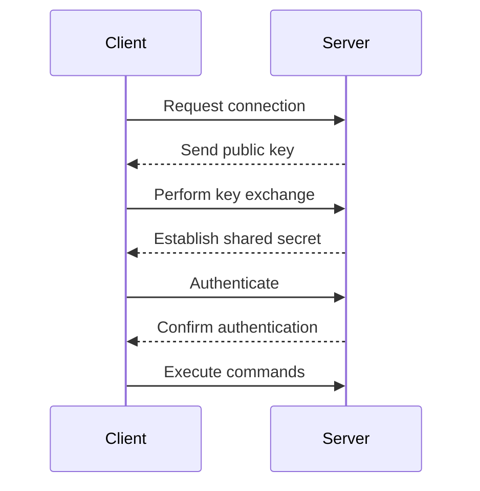

## Connecting to the Server Using SSH

When working with servers, especially in a DevOps context, it is crucial to understand how to securely connect to them. One of the most common methods is through Secure Shell (SSH). SSH provides a secure way to remotely access a server and perform administrative tasks.

### What is SSH?

SSH stands for Secure Shell. It is a cryptographic network protocol used for secure communication between a client and a server. SSH allows users to log into remote machines and execute commands on those machines. It is widely used for managing servers and deploying applications.

### Why Use SSH?

SSH offers several advantages:

1. **Security**: SSH encrypts all data transmitted between the client and the server, including passwords and other sensitive information.
2. **Authentication**: SSH supports various authentication mechanisms, such as password-based authentication, public key authentication, and two-factor authentication.
3. **Remote Access**: SSH enables users to remotely access and manage servers, making it easier to perform administrative tasks without physically being present at the server location.

### How SSH Works

SSH operates on a client-server model. The client initiates a connection to the server, and the server responds. Here’s a high-level overview of the process:

1. **Client Requests Connection**: The client sends a request to connect to the server.
2. **Server Responds**: The server responds with its public key.
3. **Key Exchange**: The client and server perform a key exchange to establish a shared secret.
4. **Encryption**: All subsequent communication is encrypted using the shared secret.
5. **Authentication**: The client authenticates itself to the server using one of the supported authentication methods.
6. **Session Establishment**: Once authenticated, the client establishes a session with the server and can execute commands.

### SSH Access Command

To connect to a server using SSH, you typically use the following command format:

```bash
ssh username@server_ip_address
```

For example, if your server IP address is `192.168.1.10` and your username is `root`, the command would be:

```bash
ssh root@192.168.1.10
```

### Example: Connecting to a Linode Server

Let's assume you have a Linode server with the public IP address `192.168.1.10`. You can connect to the server using the following steps:

1. **Copy the SSH Command**: From the Linode dashboard, you can find the SSH command to connect to the server. It might look something like this:

    ```bash
    ssh root@192.168.1.10
    ```

2. **Execute the SSH Command**: Open your terminal and paste the SSH command:

    ```bash
    ssh root@192.168.1.10
    ```

3. **Authenticate**: If prompted, enter the password for the `root` user. Alternatively, if you have set up public key authentication, you may not need to enter a password.

### Mermaid Diagram: SSH Connection Flow

Here is a mermaid diagram illustrating the SSH connection flow:



### Pitfalls and Best Practices

#### Common Pitfalls

1. **Incorrect IP Address**: Ensure you are using the correct IP address for the server.
2. **Firewall Rules**: Make sure the server's firewall rules allow incoming SSH connections.
3. **Authentication Issues**: Ensure the username and password are correct, or that public key authentication is properly configured.

#### Best Practices

1. **Use Strong Passwords**: If using password-based authentication, ensure the password is strong and complex.
2. **Enable Public Key Authentication**: Consider enabling public key authentication for added security.
3. **Limit SSH Access**: Restrict SSH access to trusted IP addresses and disable root login if possible.

### How to Prevent / Defend

#### Detection

1. **Log Monitoring**: Regularly monitor SSH logs for unauthorized access attempts.
2. **Intrusion Detection Systems (IDS)**: Implement IDS to detect and alert on suspicious activity.

#### Prevention

1. **Strong Authentication**: Use multi-factor authentication (MFA) to enhance security.
2. **Firewall Configuration**: Configure firewalls to restrict SSH access to trusted IP addresses.
3. **Secure Configuration**: Follow best practices for securing SSH configurations, such as disabling root login and using strong encryption algorithms.

### Secure Code Fix

#### Vulnerable Code

```bash
ssh root@192.168.1.10
```

#### Secure Code

```bash
ssh -i ~/.ssh/id_rsa user@192.168.1.10
```

In the secure code example, `-i ~/.ssh/id_rsa` specifies the path to the private key for public key authentication, and `user` is a non-root user.

---
<!-- nav -->
[[05-Introduction to Website Monitoring with Python|Introduction to Website Monitoring with Python]] | [[DevOps/DevOps Bootcamp/10-Monitoring & Alerting/19-Python Automation for Website Monitoring/00-Overview|Overview]] | [[07-Installing Docker on a Debian Server|Installing Docker on a Debian Server]]
