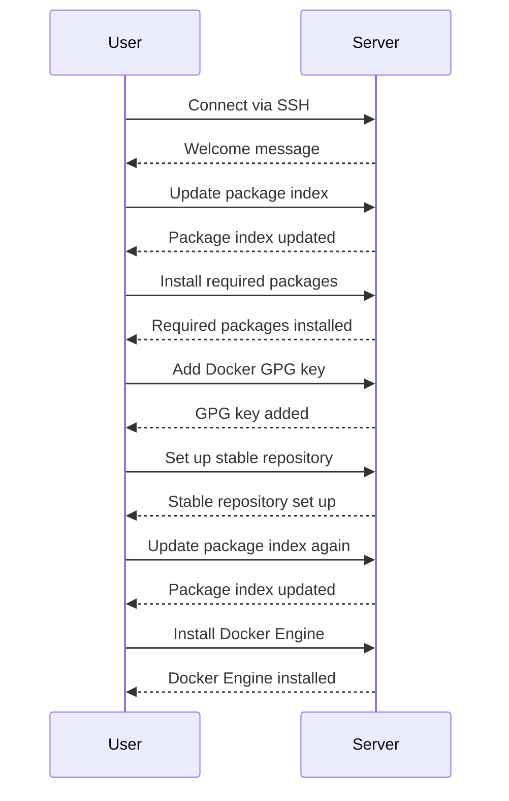

## Installing Docker on a Debian Server

Once connected to the server, the next step is to install Docker. Docker is a platform that allows developers to package their applications into containers, which can then be easily deployed and run on any system that supports Docker.

### What is Docker?

Docker is a containerization technology that allows developers to package their applications along with all their dependencies into a lightweight, portable container. These containers can then be run on any system that supports Docker, ensuring consistency across development, testing, and production environments.

### Why Use Docker?

Docker offers several benefits:

1. **Portability**: Docker containers are portable and can run on any system that supports Docker, ensuring consistency across different environments.
2. **Isolation**: Each Docker container runs in isolation, reducing conflicts between different applications.
3. **Efficiency**: Docker containers are lightweight and use fewer resources compared to traditional virtual machines.

### How Docker Works

Docker operates on a client-server architecture. The Docker client communicates with the Docker daemon, which manages the containers. Here’s a high-level overview of the process:

1. **Build Image**: Developers build Docker images containing their application and its dependencies.
2. **Run Container**: The Docker daemon runs the image as a container.
3. **Manage Containers**: The Docker daemon manages the lifecycle of the containers, including starting, stopping, and removing them.

### Installing Docker on Debian

To install Docker on a Debian server, you can follow the official Docker installation guide for Debian. Here are the steps:

1. **Update Package Index**: First, update the package index to ensure you have the latest package information.

    ```bash
    sudo apt-get update
    ```

2. **Install Required Packages**: Install the required packages to allow `apt` to use a repository over HTTPS.

    ```bash
    sudo apt-get install apt-transport-https ca-certificates curl gnupg lsb-release
    ```

3. **Add Docker’s Official GPG Key**: Add Docker’s official GPG key to ensure the authenticity of the packages.

    ```bash
    curl -fsSL https://download.docker.com/linux/debian/gpg | sudo gpg --dearmor -o /usr/share/keyrings/docker-archive-keyring.gpg
    ```

4. **Set Up the Stable Repository**: Set up the stable repository for Docker.

    ```bash
    echo \
      "deb [arch=$(dpkg --print-architecture) signed-by=/usr/share/keyrings/docker-archive-keyring.gpg] https://download.docker.com/linux/debian \
      $(lsb_release -cs) stable" | sudo tee /etc/apt/sources.list.d/docker.list > /dev/null
    ```

5. **Update Package Index Again**: Update the package index again to include the new repository.

    ```bash

    sudo apt-get update
    ```

6. **Install Docker Engine**: Finally, install Docker Engine.

    ```bash
    sudo apt-get install docker-ce docker-ce-cli containerd.io
    ```

### Example: Installing Docker on a Debian Server

Let's walk through the complete process of installing Docker on a Debian server:

1. **Connect to the Server**: Connect to the server using SSH.

    ```bash
    ssh root@192.168.1.10
    ```

2. **Update Package Index**: Update the package index.

    ```bash
    sudo apt-get update
    ```

3. **Install Required Packages**: Install the required packages.

    ```bash
    sudo apt-get install apt-transport-https ca-certificates curl gnupg lsb-release
    ```

4. **Add Docker’s Official GPG Key**: Add Docker’s official GPG key.

    ```bash
    curl -fsSL https://download.docker.com/linux/debian/gpg | sudo gpg --dearmor -o /usr/share/keyrings/docker-archive-keyring.gpg
    ```

5. **Set Up the Stable Repository**: Set up the stable repository.

    ```bash
    echo \
      "deb [arch=$(dpkg --print-architecture) signed-by=/usr/share/keyrings/docker-archive-keyring.gpg] https://download.docker.com/linux/debian \
      $(lsb_release -cs) stable" | sudo tee /etc/apt/sources.list.d/docker.list > /dev/null
    ```

6. **Update Package Index Again**: Update the package index again.

    ```bash
    sudo apt-get update
    ```

7. **Install Docker Engine**: Install Docker Engine.

    ```bash
    sudo apt-get install docker-ce docker-ce-cli containerd.io
    ```

### Mermaid Diagram: Docker Installation Flow

Here is a mermaid diagram illustrating the Docker installation flow:



### Pitfalls and Best Practices

#### Common Pitfalls

1. **Outdated Package Index**: Ensure the package index is up-to-date before installing Docker.
2. **Missing Dependencies**: Ensure all required dependencies are installed before proceeding with the Docker installation.
3. **Incorrect Repository**: Ensure the correct repository is set up for Docker.

#### Best Practices

1. **Follow Official Documentation**: Always follow the official Docker documentation for the most accurate and up-to-date instructions.
2. **Verify GPG Key**: Verify the authenticity of the Docker GPG key before adding it to the system.
3. **Regular Updates**: Keep Docker and its dependencies up-to-date to ensure security and functionality.

### How to Prevent / Defend

#### Detection

1. **Log Monitoring**: Regularly monitor Docker logs for any unusual activity.
2. **Container Scanning**: Use tools like Clair to scan Docker images for vulnerabilities.

#### Prevention

1. **Use Official Images**: Use official Docker images from trusted sources to reduce the risk of vulnerabilities.
2. **Regular Updates**: Regularly update Docker and its dependencies to ensure security patches are applied.
3. **Least Privilege Principle**: Run Docker containers with the least privileges necessary to minimize potential damage in case of a breach.

### Secure Code Fix

#### Vulnerable Code

```bash
sudo apt-get install docker-ce
```

#### Secure Code

```bash
sudo apt-get update
sudo apt-get install apt-transport-https ca-certificates curl gnupg lsb-release
curl -fsSL https://download.docker.com/linux/debian/gpg | sudo gpg --dearmor -o /usr/share/keyrings/docker-archive-keyring.gpg
echo \
  "deb [arch=$(dpkg --print-architecture) signed-by=/usr/share/keyrings/docker-archive-keyring.gpg] https://download.docker.com/linux/debian \
  $(lsb_release -cs) stable" | sudo tee /etc/apt/sources.list.d/docker.list > /dev/null
sudo apt-get update
sudo apt-get install docker-ce docker-ce-cli containerd.io
```

In the secure code example, the full installation process is followed, ensuring all required steps are completed for a secure Docker installation.

---
<!-- nav -->
[[06-Connecting to the Server Using SSH|Connecting to the Server Using SSH]] | [[DevOps/DevOps Bootcamp/10-Monitoring & Alerting/19-Python Automation for Website Monitoring/00-Overview|Overview]] | [[08-Running an EngineX Container|Running an EngineX Container]]
