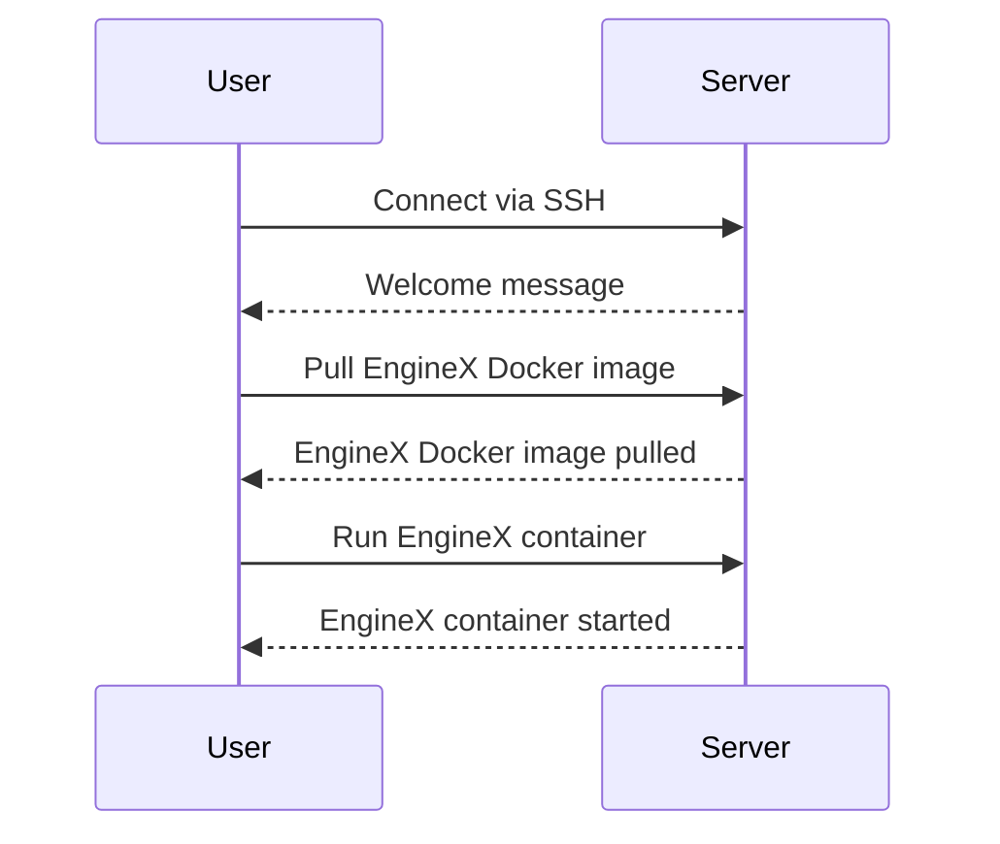

## Running an EngineX Container

After installing Docker, the next step is to run an EngineX container. EngineX is a hypothetical application for the sake of this example. In a real-world scenario, you would replace EngineX with the actual application you want to run.

### What is EngineX?

EngineX is a hypothetical application that demonstrates the process of running a containerized application using Docker. In a real-world scenario, EngineX could be replaced with any application that can be containerized.

### Why Use EngineX?

Using EngineX as an example allows us to demonstrate the process of running a containerized application using Docker. This process can be applied to any application that can be containerized.

### How to Run an EngineX Container

To run an EngineX container, you need to pull the EngineX Docker image and then start a container based on that image. Here are the steps:

1. **Pull the EngineX Docker Image**: Use the `docker pull` command to download the EngineX Docker image.

    ```bash
    docker pull enginex:latest
    ```

2. **Run the EngineX Container**: Use the `docker run` command to start a container based on the EngineX Docker image.

    ```bash
    docker run -d --name enginex enginex:latest
    ```

### Example: Running an EngineX Container

Let's walk through the complete process of running an EngineX container:

1. **Connect to the Server**: Connect to the server using SSH.

    ```bash
    ssh root@192.168.1.10
    ```

2. **Pull the EngineX Docker Image**: Pull the EngineX Docker image.

    ```bash
    docker pull enginex:latest
    ```

3. **Run the EngineX Container**: Run the EngineX container.

    ```bash
    docker run -d --name enginex enginex:latest
    ```

### Mermaid Diagram: EngineX Container Flow

Here is a mermaid diagram illustrating the EngineX container flow:



### Pitfalls and Best Practices

#### Common Pitfalls

1. **Incorrect Image Name**: Ensure the correct image name is used when pulling the Docker image.
2. **Missing Ports**: Ensure the necessary ports are exposed when running the container.
3. **Resource Constraints**: Ensure the server has sufficient resources to run the container.

#### Best Practices

1. **Use Latest Tags**: Use the `latest` tag to ensure you are using the most recent version of the Docker image.
2. **Expose Necessary Ports**: Expose the necessary ports when running the container to ensure proper communication.
3. **Monitor Resource Usage**: Monitor the resource usage of the container to ensure it does not exceed the available resources.

### How to Prevent / Defend

#### Detection

1. **Log Monitoring**: Regularly monitor Docker logs for any unusual activity.
2. **Container Scanning**: Use tools like Clair to scan Docker images for vulnerabilities.

#### Prevention

1. **Use Official Images**: Use official Docker images from trusted sources to reduce the risk of vulnerabilities.
2. **Regular Updates**: Regularly update Docker and its dependencies to ensure security patches are applied.
3. **Least Privilege Principle**: Run Docker containers with the least privileges necessary to minimize potential damage in case of a breach.

### Secure Code Fix

#### Vulnerable Code

```bash
docker run -d --name enginex enginex:latest
```

#### Secure Code

```bash
docker pull enginex:latest
docker run -d --name enginex -p 8080:80 enginex:latest
```

In the secure code example, the necessary ports are exposed when running the container, ensuring proper communication.

---
<!-- nav -->
[[07-Installing Docker on a Debian Server|Installing Docker on a Debian Server]] | [[DevOps/DevOps Bootcamp/10-Monitoring & Alerting/19-Python Automation for Website Monitoring/00-Overview|Overview]] | [[09-Setting Up the Repository for Docker Installation|Setting Up the Repository for Docker Installation]]
