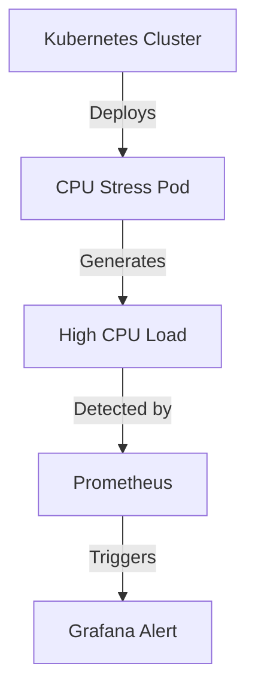
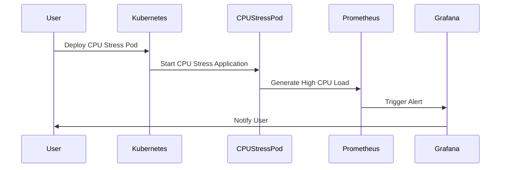

## Simulating CPU Load to Trigger Alerts

In this section, we will delve into the process of simulating CPU load within a Kubernetes cluster to trigger alerts. This exercise is crucial for ensuring that monitoring systems are correctly configured and can detect abnormal conditions in real-time. We'll cover the theoretical background, practical steps, potential pitfalls, and defensive measures to ensure robust system monitoring.

### Background Theory

#### What is CPU Load?

CPU load refers to the amount of work that a CPU is performing at any given moment. In a Kubernetes cluster, each node (or worker machine) has one or more CPUs, and the load on these CPUs can vary depending on the workload being executed by the pods (containers) running on them.

#### Why Simulate CPU Load?

Simulating CPU load is essential for several reasons:

1. **Testing Monitoring Systems**: By creating artificial load, you can test whether your monitoring tools (like Prometheus and Grafana) are correctly detecting and alerting on high CPU usage.
   
2. **Performance Testing**: Understanding how your system behaves under high load helps in optimizing resource allocation and improving overall performance.

3. **Security Testing**: High CPU usage can sometimes indicate malicious activity, such as a DDoS attack or a crypto-mining operation. Simulating load helps in identifying and mitigating such threats.

### Practical Steps

#### Step 1: Setting Up the Environment

Before simulating CPU load, ensure that your Kubernetes cluster is properly set up and that you have access to the necessary tools:

- **Kubernetes Cluster**: Ensure that your cluster is running and accessible via `kubectl`.
- **Monitoring Tools**: Install and configure Prometheus and Grafana for monitoring and alerting.

#### Step 2: Creating a CPU Stress Pod

To simulate CPU load, we will deploy a pod that runs a CPU stress application. One popular choice is the `cyrus-and/cyrus-stress` Docker image available on Docker Hub.

##### Docker Image Selection

The `cyrus-and/cyrus-stress` image is widely used for simulating CPU load. Here’s how to find and select it:

1. **Navigate to Docker Hub**:
   - Open your browser and go to [Docker Hub](https://hub.docker.com/).
   - Search for `cpu stress`.

2. **Select the Appropriate Image**:
   - Look for the `cyrus-and/cyrus-stress` image, which has a high number of downloads and positive reviews.

##### Example Usage

The `cyrus-and/cyrus-stress` image provides a simple way to simulate CPU load. Here’s how to use it:

```bash
docker run --rm cyrus-and/cyrus-stress -c 4 -t 60
```

- `-c 4`: Specifies the number of CPU cores to stress.
- `-t 60`: Specifies the duration of the stress test in seconds.

#### Step 3: Deploying the CPU Stress Pod

To deploy the CPU stress pod in your Kubernetes cluster, follow these steps:

1. **Create a Deployment Manifest**:
   - Create a YAML file named `cpu-stress-deployment.yaml` with the following content:

```yaml
apiVersion: apps/v1
kind: Deployment
metadata:
  name: cpu-stress
spec:
  replicas: 1
  selector:
    matchLabels:
      app: cpu-stress
  template:
    metadata:
      labels:
        app: cpu-stress
    spec:
      containers:
      - name: cpu-stress
        image: cyrus-and/cyrus-stress
        args: ["-c", "4", "-t", "60"]
```

2. **Deploy the Pod**:
   - Apply the deployment using `kubectl`:

```bash
kubectl apply -f cpu-stress-deployment.yaml
```

#### Step 4: Monitoring CPU Utilization

Once the pod is deployed, you can monitor the CPU utilization using Grafana:

1. **Access Grafana Dashboard**:
   - Open your browser and navigate to the Grafana dashboard URL.
   - Ensure that you have the CPU utilization dashboard set up.

2. **Observe the Spike**:
   - Watch the CPU utilization graph for a spike indicating the increased load.

### Potential Pitfalls

#### Overloading the Cluster

One major pitfall is overloading the cluster, which can lead to performance degradation or even crashes. To avoid this:

- **Monitor Real-Time Metrics**: Use tools like Prometheus to monitor real-time metrics and ensure that the load does not exceed safe limits.
- **Gradual Increase**: Start with a small number of CPU cores and gradually increase the load to observe the system's behavior.

#### Misconfigured Alerts

Misconfigured alerts can result in false positives or missed alerts. To prevent this:

- **Validate Alert Conditions**: Ensure that the alert conditions are correctly defined and tested.
- **Test Alerts**: Regularly test alerts to ensure they fire as expected.

### How to Prevent / Defend

#### Detection

To detect high CPU load, you can set up alerts in Prometheus and Grafana:

1. **Create a Prometheus Rule**:
   - Define a rule in Prometheus to trigger an alert when CPU usage exceeds a certain threshold.

```yaml
groups:
- name: cpu-load-rules
  rules:
  - alert: HighCPULoad
    expr: sum(rate(container_cpu_usage_seconds_total{container_label_name!="POD"}[5m])) by (instance) > 0.5
    for: 5m
    labels:
      severity: critical
    annotations:
      summary: "High CPU Load detected"
      description: "CPU usage on {{ $labels.instance }} is above 50%."
```

2. **Configure Grafana Alert**:
   - Set up an alert in Grafana to notify you when the rule triggers.

#### Prevention

To prevent high CPU load from causing issues:

1. **Resource Limits**:
   - Set resource limits for pods to prevent them from consuming excessive CPU resources.

```yaml
resources:
  limits:
    cpu: "2"
  requests:
    cpu: "1"
```

2. **Horizontal Pod Autoscaling (HPA)**:
   - Use HPA to automatically scale the number of pods based on CPU usage.

```yaml
apiVersion: autoscaling/v2beta2
kind: HorizontalPodAutoscaler
metadata:
  name: my-app-hpa
spec:
  scaleTargetRef:
    apiVersion: apps/v1
    kind: Deployment
    name: my-app
  minReplicas: 1
  maxReplicas: 10
  metrics:
  - type: Resource
    resource:
      name: cpu
      target:
        type: Utilization
        averageUtilization: 50
```

#### Secure Coding Fixes

Compare the insecure and secure versions of the deployment manifest:

**Insecure Version**:

```yaml
apiVersion: apps/v1
kind: Deployment
metadata:
  name: my-app
spec:
  replicas: 1
  selector:
    matchLabels:
      app: my-app
  template:
    metadata:
      labels:
        app: my-app
    spec:
      containers:
      - name: my-app
        image: my-app-image
```

**Secure Version**:

```yaml
apiVersion: apps/v1
kind: Deployment
metadata:
  name: my-app
spec:
  replicas: 1
  selector:
    matchLabels:
      app: my-app
  template:
    metadata:
      labels:
        app: my-app
    spec:
      containers:
      - name: my-app
        image: my-app-image
        resources:
          limits:
            cpu: "2"
          requests:
            cpu: "1"
```

### Real-World Examples

#### Recent Breaches and CVEs

High CPU load can be indicative of malicious activities such as crypto-mining or DDoS attacks. For instance:

- **CVE-2021-44228 (Log4j)**: This vulnerability allowed attackers to execute arbitrary code, leading to high CPU usage. Ensuring proper monitoring and alerting helped in detecting and mitigating such attacks.

- **Crypto-Mining Malware**: In 2022, several organizations reported high CPU usage due to crypto-mining malware. Proper monitoring and alerting helped in identifying and removing the malware.

### Complete Code Examples

#### Full HTTP Request and Response

When setting up alerts in Prometheus and Grafana, you might interact with their APIs. Here’s an example of a full HTTP request and response:

**HTTP Request**:

```http
POST /api/prom/rules HTTP/1.1
Host: prometheus.example.com
Content-Type: application/json

{
  "groups": [
    {
      "name": "cpu-load-rules",
      "rules": [
        {
          "alert": "HighCPULoad",
          "expr": "sum(rate(container_cpu_usage_seconds_total{container_label_name!='POD'}[5m])) by (instance) > 0.5",
          "for": "5m",
          "labels": {
            "severity": "critical"
          },
          "annotations": {
            "summary": "High CPU Load detected",
            "description": "CPU usage on {{ $labels.instance }} is above  50%."
          }
        }
      ]
    }
  ]
}
```

**HTTP Response**:

```http
HTTP/1.1 200 OK
Content-Type: application/json

{
  "status": "success",
  "data": {
    "groups": [
      {
        "name": "cpu-load-rules",
        "rules": [
          {
            "alert": "HighCPULoad",
            "expr": "sum(rate(container_cpu_usage_seconds_total{container_label_name!='POD'}[5m])) by (instance) > 0.5",
            "for": "5m",
            "labels": {
              "severity": "critical"
            },
            "annotations": {
              "summary": "High CPU Load detected",
              "description": "CPU usage on {{ $labels.instance }} is above 50%."
            }
          }
        ]
      }
    ]
  }
}
```

### Mermaid Diagrams

#### Network Topology

Here’s a mermaid diagram showing the network topology involved in simulating CPU load and triggering alerts:



#### Sequence Diagram

Here’s a mermaid sequence diagram illustrating the sequence of events:



### Practice Labs

For hands-on practice, consider the following labs:

- **PortSwigger Web Security Academy**: Offers exercises on simulating CPU load and monitoring alerts.
- **OWASP Juice Shop**: Provides a simulated environment for testing monitoring and alerting systems.
- **DVWA (Damn Vulnerable Web Application)**: Useful for understanding how high CPU load can be indicative of security issues.

By thoroughly understanding and practicing these concepts, you can ensure that your Kubernetes cluster is robustly monitored and alerted for high CPU load scenarios.

---
<!-- nav -->
[[01-Introduction to Kubernetes and Pod Management|Introduction to Kubernetes and Pod Management]] | [[DevOps/DevOps Bootcamp/10-Monitoring & Alerting/20-Simulating CPU Load to Trigger Alerts/00-Overview|Overview]] | [[03-Understanding CPU Load and Its Impact on Clusters|Understanding CPU Load and Its Impact on Clusters]]
