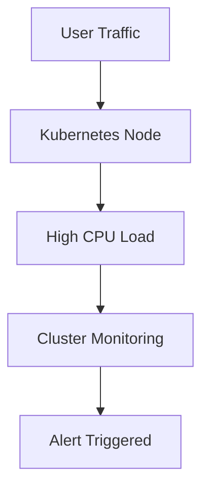
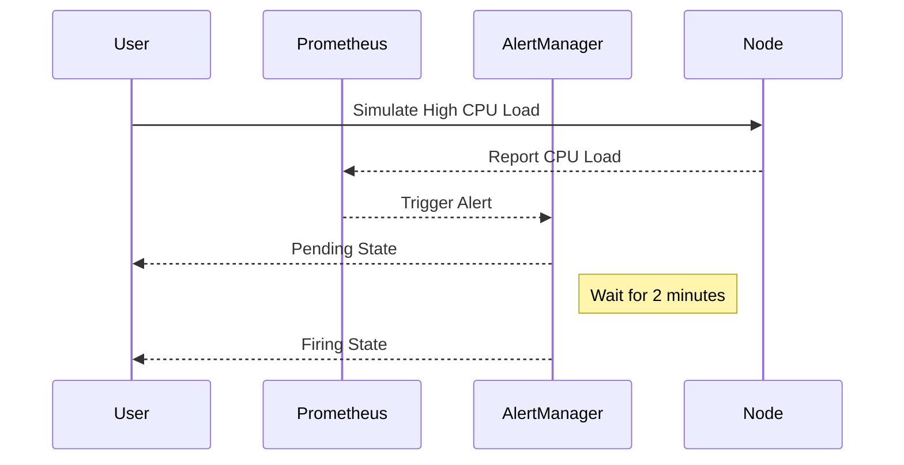

## Understanding CPU Load and Its Impact on Clusters

### What is CPU Load?

CPU load refers to the amount of work that a computer's central processing unit (CPU) performs at any given time. This workload is typically measured as a percentage of the total available processing power. High CPU load can indicate that the system is under heavy usage, which can lead to performance degradation and potential failures if not managed properly.

### Why Does CPU Load Matter in Clusters?

In a cluster environment, multiple nodes work together to handle various tasks. Each node contributes to the overall processing capacity of the cluster. Monitoring CPU load across the entire cluster helps ensure that no single node becomes overloaded, which could affect the performance and reliability of the entire system.

### How CPU Load is Measured

CPU load is often measured using tools like `top`, `htop`, or monitoring services provided by cloud providers such as AWS CloudWatch, Google Cloud Monitoring, or Azure Monitor. These tools provide real-time data on CPU utilization, which can be used to trigger alerts when certain thresholds are exceeded.

### Real-World Example: High CPU Load in a Kubernetes Cluster

Consider a Kubernetes cluster where a sudden surge in traffic causes one of the nodes to experience high CPU load. This scenario can be observed in real-world incidents such as the 2021 GitHub outage, where a misconfigured application caused excessive CPU usage, leading to degraded service performance.



### Simulating CPU Load

To understand how CPU load affects a cluster, it is useful to simulate high CPU load conditions. This can be done using tools like `stress` or `stress-ng`.

#### Using `stress` to Simulate CPU Load

The `stress` tool allows you to simulate CPU load by creating multiple worker threads that perform intensive computations.

```bash
stress --cpu 4 --timeout 60s
```

This command creates 4 worker threads that run for 60 seconds, simulating high CPU load.

### Monitoring CPU Load in a Cluster

Monitoring CPU load in a cluster involves setting up alert rules that trigger when certain thresholds are exceeded. These rules can be configured using monitoring tools like Prometheus, Grafana, or cloud provider-specific services.

#### Setting Up Alert Rules with Prometheus

Prometheus is a popular open-source monitoring tool that can be used to monitor CPU load in a cluster.

```yaml
# prometheus.yml
alerting:
  alertmanagers:
  - static_configs:
    - targets:
      - localhost:9093

rule_files:
- "rules/prometheus.rules"

scrape_configs:
- job_name: 'node'
  static_configs:
  - targets: ['localhost:9100']
```

#### Creating an Alert Rule

Create an alert rule to trigger when CPU load exceeds a certain threshold.

```yaml
# rules/prometheus.rules
groups:
- name: cpu_load_alerts
  rules:
  - alert: HighCPULoad
    expr: node_cpu_seconds_total{mode="idle"} < 0.5 * scalar(node_cpu_cores)
    for: 2m
    labels:
      severity: critical
    annotations:
      summary: "High CPU Load"
      description: "CPU load on {{ $labels.instance }} is above 50%"
```

### Understanding the Alert Workflow

When the CPU load exceeds the threshold, the alert rule triggers and enters a pending state. If the load remains high for the specified duration (e.g., 2 minutes), the alert transitions to a firing state.



### Handling the Alert

Once the alert is triggered, it is important to take appropriate action to mitigate the issue. This may involve scaling resources, optimizing applications, or identifying and fixing the root cause of the high CPU load.

#### Scaling Resources

If the high CPU load is due to insufficient resources, scaling the cluster can help alleviate the issue. This can be done manually or automatically using tools like Kubernetes Horizontal Pod Autoscaler (HPA).

```yaml
apiVersion: autoscaling/v2beta2
kind: HorizontalPodAutoscaler
metadata:
  name: my-app-hpa
spec:
  scaleTargetRef:
    apiVersion: apps/v1
    kind: Deployment
    name: my-app-deployment
  minReplicas: 1
  maxReplicas: 10
  metrics:
  - type: Resource
    resource:
      name: cpu
      target:
        type: Utilization
        averageUtilization: 50
```

### Preventing and Defending Against High CPU Load

#### Detection

Regularly monitoring CPU load and setting up alert rules helps detect high CPU load early. Tools like Prometheus and Grafana provide visualizations and alerts to help identify issues quickly.

#### Prevention

Preventing high CPU load involves optimizing applications, ensuring proper resource allocation, and implementing auto-scaling mechanisms.

##### Optimizing Applications

Optimizing applications to reduce CPU usage can significantly lower the risk of high CPU load. Techniques include:

- **Code Optimization**: Refactoring inefficient code to improve performance.
- **Concurrency Management**: Properly managing concurrency to avoid unnecessary CPU usage.

```python
# Inefficient Code
for i in range(1000000):
    result = i * i

# Optimized Code
from concurrent.futures import ThreadPoolExecutor

def compute_square(i):
    return i * i

with ThreadPoolExecutor(max_workers=4) as executor:
    results = list(executor.map(compute_square, range(1000000)))
```

##### Proper Resource Allocation

Properly allocating resources ensures that the cluster can handle the expected workload without becoming overloaded.

```yaml
apiVersion: v1
kind: Pod
metadata:
  name: my-pod
spec:
  containers:
  - name: my-container
    image: my-image
    resources:
      requests:
        cpu: "100m"
        memory: "128Mi"
      limits:
        cpu: "500m"
        memory: "512Mi"
```

#### Secure Coding Practices

Implementing secure coding practices helps prevent vulnerabilities that could lead to high CPU load. For example, preventing denial-of-service (DoS) attacks through proper input validation and rate limiting.

```python
# Vulnerable Code
def process_request(request):
    for i in range(int(request['count'])):
        # Intensive computation
        pass

# Secure Code
def process_request(request):
    count = int(request['count'])
    if count > 1000:
        raise ValueError("Count exceeds maximum allowed value")
    for i in range(count):
        # Intensive computation
        pass
```

### Conclusion

Understanding and managing CPU load in a cluster is crucial for maintaining optimal performance and reliability. By simulating high CPU load, setting up effective monitoring and alerting systems, and implementing preventive measures, you can ensure that your cluster remains stable and responsive under varying workloads.

### Practice Labs

For hands-on practice, consider the following labs:

- **PortSwigger Web Security Academy**: Offers exercises related to web application security, including scenarios involving high CPU load.
- **OWASP Juice Shop**: Provides a vulnerable web application for testing and learning about various security issues, including those related to CPU load.
- **Kubernetes Goat**: A vulnerable Kubernetes cluster for learning about security and operational issues in Kubernetes environments.

These labs provide practical experience in detecting, preventing, and mitigating high CPU load scenarios in real-world environments.

---
<!-- nav -->
[[02-Simulating CPU Load to Trigger Alerts|Simulating CPU Load to Trigger Alerts]] | [[DevOps/DevOps Bootcamp/10-Monitoring & Alerting/20-Simulating CPU Load to Trigger Alerts/00-Overview|Overview]] | [[DevOps/DevOps Bootcamp/10-Monitoring & Alerting/20-Simulating CPU Load to Trigger Alerts/04-Practice Questions & Answers|Practice Questions & Answers]]
