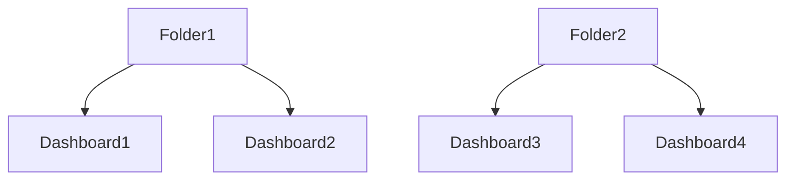
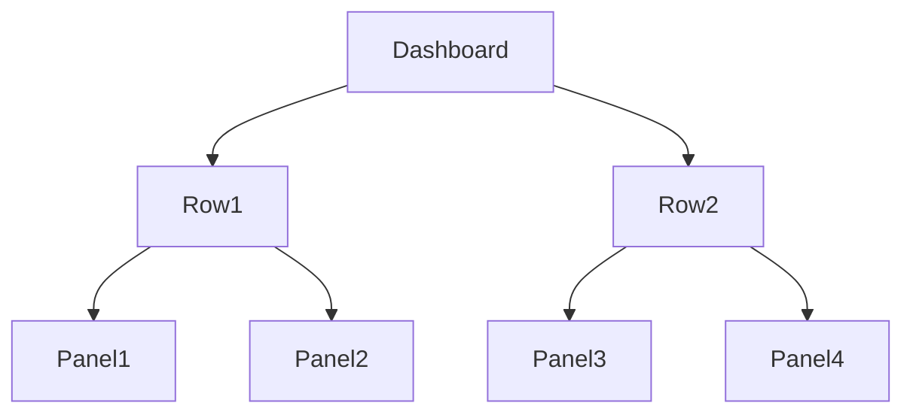
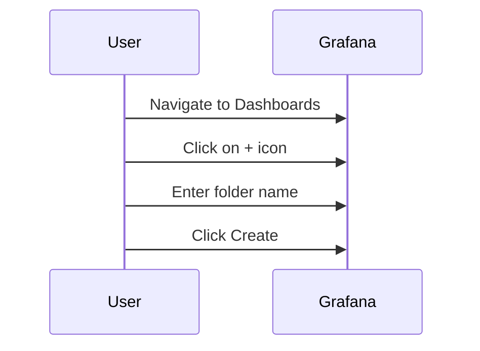
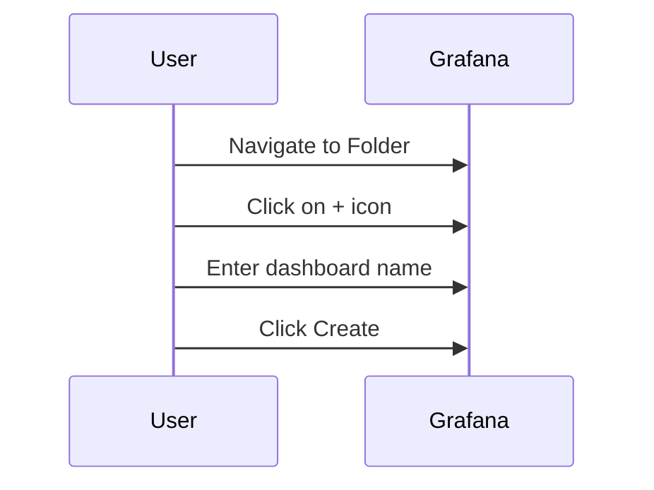
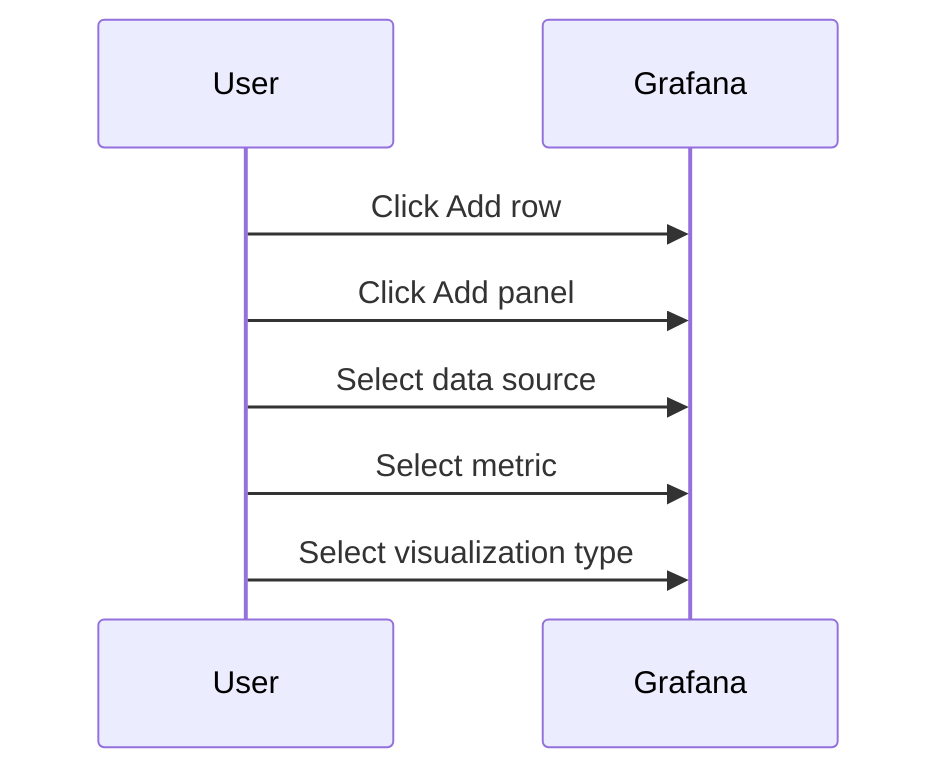
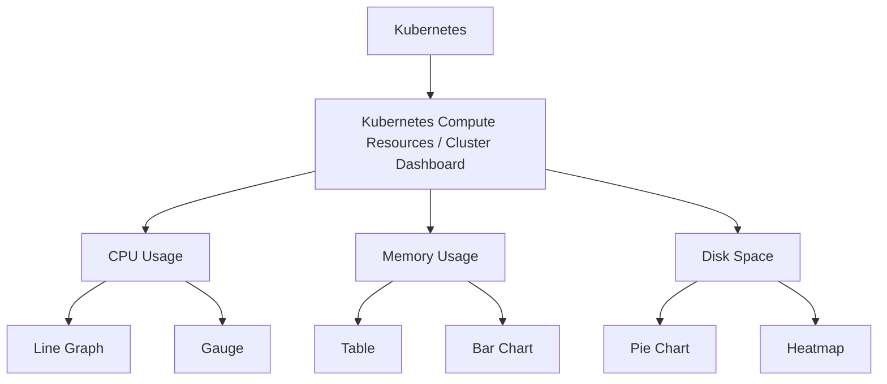
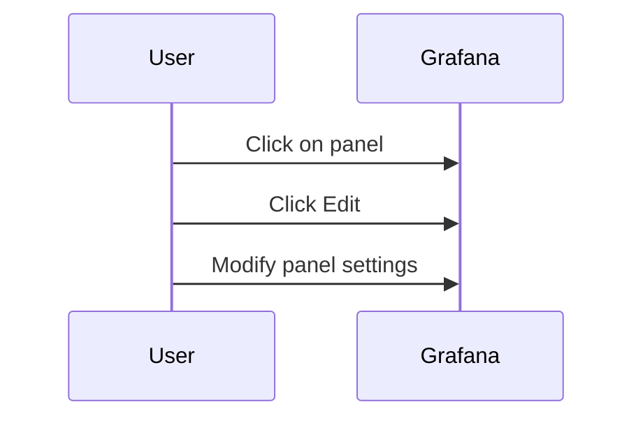
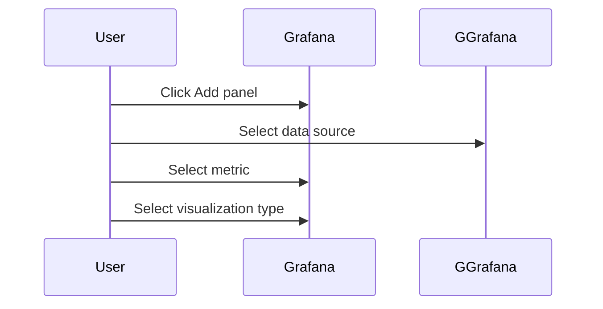

## Introduction to Grafana UI for Visualizing Metrics

Grafana is a powerful, open-source platform designed for visualizing time-series metrics and logs. It provides a flexible and intuitive interface for creating custom dashboards that can help you monitor and analyze various aspects of your infrastructure, applications, and services. In this chapter, we will delve deep into the process of visualizing metrics using the Grafana UI, covering everything from basic concepts to advanced configurations.

### What is Grafana?

Grafana is a multi-platform visualization tool that allows users to query, visualize, and explore time series data. It supports a wide range of data sources including Prometheus, Elasticsearch, InfluxDB, MySQL, PostgreSQL, and many others. Grafana is widely used in DevOps environments to monitor application performance, system health, and other critical metrics.

#### Why Use Grafana?

1. **Flexibility**: Grafana supports numerous data sources, making it versatile for different types of monitoring needs.
2. **Customizability**: Users can create highly customized dashboards with various visualizations.
3. **Community Support**: Being an open-source project, Grafana benefits from a large community of contributors and users.
4. **Integration Capabilities**: Grafana integrates seamlessly with popular monitoring tools and services.

### Basic Concepts in Grafana UI

Before diving into the specifics of creating and managing dashboards, it’s essential to understand the fundamental components of the Grafana UI.

#### Folders

Folders in Grafana are used to organize dashboards. They provide a hierarchical structure to manage multiple dashboards efficiently. Each folder can contain multiple dashboards, and you can create new folders as needed.



**Example**: Suppose you have a Kubernetes cluster and want to monitor different aspects of it. You might create a folder named `Kubernetes` and place dashboards related to compute resources, storage, and network within this folder.

#### Dashboards

A dashboard in Grafana is a collection of visualizations (panels) that display data from one or more data sources. Dashboards are the primary means of presenting and analyzing data in Grafana.



**Example**: Consider a dashboard named `Cluster Overview`. This dashboard might contain rows for CPU usage, memory usage, and disk space. Each row would have multiple panels displaying specific metrics.

#### Rows

Rows in a dashboard are used to group related panels together. They provide a logical structure to the dashboard, making it easier to navigate and understand.

**Example**: In the `Cluster Overview` dashboard, you might have a row for CPU usage, another for memory usage, and a third for disk space. Each row would contain panels displaying specific metrics related to that resource.

#### Panels

Panels are the individual visualizations within a dashboard. They can display data in various formats such as graphs, tables, gauges, and more. Panels are the building blocks of a dashboard.

**Example**: A panel might display a line graph showing CPU usage over time, or a gauge showing current memory usage.

### Creating and Managing Dashboards

Now that we have covered the basic concepts, let’s dive into the process of creating and managing dashboards in Grafana.

#### Creating a New Folder

To create a new folder in Grafana:

1. Navigate to the `Dashboards` section.
2. Click on the `+` icon to create a new folder.
3. Enter a name for the folder and click `Create`.



#### Creating a New Dashboard

To create a new dashboard within a folder:

1. Navigate to the desired folder.
2. Click on the `+` icon to create a new dashboard.
3. Enter a name for the dashboard and click `Create`.



#### Adding Rows and Panels

Once you have created a dashboard, you can start adding rows and panels to it.

1. Click on the `Add row` button to add a new row.
2. Click on the `Add panel` button to add a new panel to the row.
3. Configure the panel by selecting the data source, metric, and visualization type.



### Exploring Pre-built Dashboards

Grafana comes with several pre-built dashboards that can be used out-of-the-box for common monitoring scenarios. These dashboards are designed to provide quick insights into various aspects of your infrastructure.

#### Example: Kubernetes Compute Resources Dashboard

Let’s take a closer look at the `Kubernetes Compute Resources / Cluster Dashboard`.

1. Navigate to the `Kubernetes` folder.
2. Open the `Kubernetes Compute Resources / Cluster Dashboard`.
3. Explore the different rows and panels within the dashboard.



### Customizing Dashboards

While pre-built dashboards are useful, you often need to customize them to suit your specific requirements. Let’s explore how to customize dashboards in Grafana.

#### Editing Panels

To edit a panel:

1. Click on the panel to select it.
2. Click on the `Edit` button to open the panel editor.
3. Modify the panel settings such as data source, metric, and visualization type.



#### Adding New Panels

To add a new panel:

1. Click on the `Add panel` button to add a new panel to the row.
2. Configure the panel by selecting the data source, metric, and visualization type.



### Real-World Examples and Best Practices

#### Real-World Example: Monitoring Kubernetes Cluster

Suppose you are managing a Kubernetes cluster and want to monitor its compute resources. You can use the `Kubernetes Compute Resources / Cluster Dashboard` to get an overview of CPU, memory, and disk usage.


#### Best Practices

1. **Organize Dashboards**: Use folders to organize dashboards logically.
2. **Use Pre-built Dashboards**: Leverage pre-built dashboards for common monitoring scenarios.
3. **Customize Dashboards**: Customize dashboards to suit your specific requirements.
4. **Regularly Update Dashboards**: Keep dashboards up-to-date with the latest metrics and visualizations.

### How to Prevent / Defend

#### Detection

To ensure that your Grafana dashboards are functioning correctly, you should regularly check the following:

1. **Data Source Health**: Ensure that all data sources are healthy and connected.
2. **Panel Performance**: Monitor the performance of panels to ensure they are not causing excessive load.
3. **Dashboard Load Time**: Check the load time of dashboards to ensure they are not taking too long to render.

#### Prevention

To prevent issues with your Grafana dashboards, follow these best practices:

1. **Use Caching**: Enable caching for frequently accessed data to improve performance.
2. **Optimize Queries**: Optimize queries to reduce the load on data sources.
3. **Limit Data Retention**: Limit the retention period of data to prevent excessive storage usage.

#### Secure Coding Fixes

Here is an example of a vulnerable dashboard configuration and its secure counterpart:

**Vulnerable Configuration**:
```json
{
  "title": "Cluster Overview",
  "panels": [
    {
      "type": "graph",
      "datasource": "prometheus",
      "targets": [
        { "expr": "sum(kube_node_info)" }
      ]
    }
  ]
}
```

**Secure Configuration**:
```json
{
  "title": "Cluster Overview",
  "panels": [
    {
      "type": "graph",
      "datasource": "prometheus",
      "targets": [
        { "expr": "sum(kube_node_info{job='kube-state-metrics'})" }
      ]
    }
  ]
}
```

In the secure configuration, we have added a label selector to the query to ensure that only relevant data is fetched.

### Conclusion

In this chapter, we have explored the process of visualizing metrics using the Grafana UI. We have covered the basic concepts, creating and managing dashboards, exploring pre-built dashboards, customizing dashboards, and best practices. By following these guidelines, you can effectively monitor and analyze various aspects of your infrastructure using Grafana.

### Practice Labs

For hands-on practice with Grafana, consider the following labs:

- **PortSwigger Web Security Academy**: Offers a variety of labs related to web application security, including some that involve monitoring and visualizing metrics.
- **OWASP Juice Shop**: A deliberately insecure web application for security training. You can use Grafana to monitor the application’s performance and security metrics.
- **DVWA (Damn Vulnerable Web Application)**: Another web application for security training. You can use Grafana to monitor the application’s performance and security metrics.

By completing these labs, you can gain practical experience in using Grafana to monitor and visualize metrics in real-world scenarios.

---
<!-- nav -->
[[01-Introduction to Data Visualization Tools|Introduction to Data Visualization Tools]] | [[DevOps/DevOps Bootcamp/10-Monitoring & Alerting/21-Visualizing Metrics with Grafana UI/00-Overview|Overview]] | [[03-Introduction to Grafana and Data Visualization|Introduction to Grafana and Data Visualization]]
