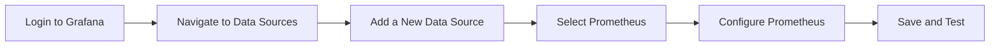
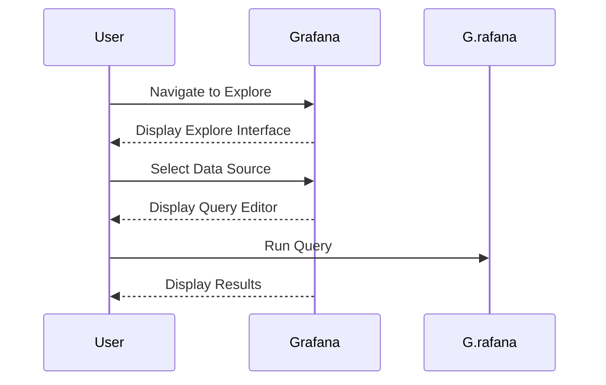

## Introduction to Grafana and Data Visualization

Grafana is an open-source platform designed for monitoring and observability. It provides a powerful interface for visualizing metrics, logs, and traces from various data sources. One of the key features of Grafana is its ability to integrate with multiple data sources, allowing users to create comprehensive dashboards that provide insights into their systems.

### What is Grafana?

Grafana is a highly customizable, multi-platform, open-source analytics and interactive visualization web application. It is primarily used for visualizing time series data from various sources. Grafana supports a wide range of data sources, including Prometheus, InfluxDB, MySQL, PostgreSQL, Elasticsearch, and more. This flexibility makes it a popular choice for DevOps teams and system administrators.

### Why Use Grafana?

The primary reason to use Grafana is its ability to provide a unified view of your system's performance and health. By integrating with multiple data sources, Grafana allows you to:

- **Monitor Performance**: Track CPU usage, memory consumption, disk I/O, and network traffic.
- **Analyze Logs**: Visualize log data to identify patterns and anomalies.
- **Trace Requests**: Understand the flow of requests through your system.
- **Alerting**: Set up alerts based on specific conditions to notify you of issues.

### How Does Grafana Work?

Grafana operates by connecting to one or more data sources. These data sources can be time-series databases like Prometheus, relational databases like MySQL, or even cloud services like AWS CloudWatch. Once connected, Grafana can query these data sources to retrieve the necessary data and present it in a variety of visual formats, such as graphs, tables, and heatmaps.

### Data Sources in Grafana

Data sources are the backbone of Grafana. They are the repositories from which Grafana retrieves the data needed to populate its dashboards. Each data source type has its own set of query languages and capabilities. For instance, Prometheus uses PromQL (Prometheus Query Language), while InfluxDB uses InfluxQL.

#### Configuring Data Sources

To configure a data source in Grafana, follow these steps:

1. **Navigate to Data Sources**: Log in to your Grafana instance and navigate to `Configuration` > `Data Sources`.
2. **Add a New Data Source**: Click on the `Add data source` button.
3. **Select the Data Source Type**: Choose the type of data source you want to add (e.g., Prometheus, InfluxDB, MySQL).
4. **Configure the Data Source**: Fill in the required fields such as URL, access method, and authentication details.
5. **Save and Test**: Save the configuration and test the connection to ensure it is working correctly.

### Example: Configuring Prometheus as a Data Source

Let's walk through the process of configuring Prometheus as a data source in Grafana.

#### Step-by-Step Configuration

1. **Log in to Grafana**: Open your browser and navigate to the Grafana login page.
2. **Navigate to Data Sources**: Click on the gear icon in the left sidebar to access the Configuration menu, then select `Data Sources`.
3. **Add a New Data Source**: Click on the `Add data source` button.
4. **Select Prometheus**: From the list of available data sources, select `Prometheus`.
5. **Configure Prometheus**: Fill in the required fields:
    - **Name**: Enter a name for your data source (e.g., `Prometheus`).
    - **URL**: Enter the URL of your Prometheus server (e.g., `http://prometheus-server:9090`).
    - **Access**: Choose `Server (default)` if Grafana and Prometheus are running on the same server, or `Browser` if they are running on different servers.
    - **Basic Auth**: If your Prometheus server requires basic authentication, enter the username and password.
6. **Save and Test**: Click on the `Save & Test` button to save the configuration and verify that the connection is successful.



### Exploring Data Sources in Grafana

Once you have configured your data sources, you can start exploring the data they provide. Grafana offers a powerful `Explore` feature that allows you to run ad-hoc queries against your data sources and visualize the results.

#### Using the Explore Feature

1. **Navigate to Explore**: Click on the `Explore` button in the top navigation bar.
2. **Select a Data Source**: From the dropdown menu, select the data source you want to query (e.g., `Prometheus`).
3. **Run a Query**: Enter a query in the query editor. For example, if you are querying Prometheus, you might use a query like `rate(http_requests_total[5m])` to get the rate of HTTP requests over the past 5 minutes.
4. **Visualize the Results**: Click on the `Execute` button to run the query and visualize the results.



### Real-World Examples

#### Example 1: Monitoring Kubernetes Cluster with Prometheus and Grafana

In a real-world scenario, you might use Prometheus and Grafana to monitor a Kubernetes cluster. Here’s how you can set it up:

1. **Install Prometheus Operator**: Use the Prometheus Operator to deploy Prometheus and Grafana in your Kubernetes cluster.
2. **Configure Prometheus**: Configure Prometheus to scrape metrics from your Kubernetes nodes and pods.
3. **Deploy Grafana**: Deploy Grafana and configure it to use Prometheus as a data source.
4. **Create Dashboards**: Create dashboards in Grafana to visualize CPU usage, memory consumption, and network traffic.

```yaml
# Example Prometheus configuration for Kubernetes
scrape_configs:
  - job_name: 'kubernetes-nodes'
    kubernetes_sd_configs:
      - role: node
    relabel_configs:
      - source_labels: [__address__]
        regex: '(.*):.*'
        target_label: __address__
        replacement: '${1}:10255'

  - job_name: 'kubernetes-pods'
    kubernetes_sd_configs:
      - role: pod
    relabel_configs:
      - source_labels: [__meta_kubernetes_pod_annotation_prometheus_io_scrape]
        regex: true
      - source_labels: [__meta_kubernetes_pod_annotation_prometheus_io_path]
        regex: (.+)
        target_label: __metrics_path__
        replacement: ${1}
      - source_labels: [__address__, __meta_kubernetes_pod_annotation_prometheus_io_port]
        regex: ([^:]+)(?::\d+)?;(\d+)
        target_label: __address__
        replacement: ${1}:${2}
```

#### Example 2: Monitoring Application Logs with Loki and Grafana

Another common use case is monitoring application logs. You can use Loki, a horizontally scalable, highly available, multi-tenant log aggregation system inspired by Prometheus, to store and query logs.

1. **Install Loki**: Deploy Loki in your Kubernetes cluster.
2. **Configure Loki**: Configure Loki to collect logs from your applications.
3. **Deploy Grafana**: Deploy Grafana and configure it to use Loki as a data source.
4. **Create Dashboards**: Create dashboards in Grafana to visualize log data.

```yaml
# Example Loki configuration
server:
  http_listen_port: 3100
  grpc_listen_port: 9095

auth_enabled: false

ingester:
  lifecycler:
    address: 127.0.0.1
    ring:
      kvstore:
        store: inmemory
      replication_factor: 1
    retention:
      period: 168h
    window: 5m
  chunk_idle_period: 5m
  chunk_retain_period: 1h
  max_transfer_retries: 0

schema_config:
  configs:
    - from: 2020-10-24
      store: boltdb
      object_store: filesystem
      schema: v11
      index:
        prefix: index_
        period: 168h

storage_config:
  boltdb:
    directory: /tmp/loki/boltdb
  filesystem:
    directory: /tmp/loki/chunks

limits_config:
  reject_old_samples: true
  max_samples_per_query: 100000

chunk_store_config:
  max_look_back_period: 0s

table_manager:
  retention_deletes_enabled: true
  retention_period: 0s
```

### Common Pitfalls and Best Practices

When using Grafana, there are several common pitfalls to avoid:

1. **Overloading Dashboards**: Avoid creating overly complex dashboards that are difficult to read and understand.
2. **Incorrect Data Source Configuration**: Ensure that your data sources are correctly configured to avoid issues with data retrieval.
3. **Security Concerns**: Protect your Grafana instance by enabling authentication and limiting access to sensitive data.

### How to Prevent / Defend

#### Detection

To detect potential issues with your Grafana setup, regularly review the following:

- **Logs**: Check the Grafana logs for any errors or warnings.
- **Metrics**: Monitor the performance of your Grafana instance using built-in metrics.
- **Dashboards**: Regularly review your dashboards to ensure they are providing accurate and useful information.

#### Prevention

To prevent issues, follow these best practices:

- **Secure Configuration**: Enable authentication and limit access to sensitive data.
- **Regular Updates**: Keep your Grafana and data source configurations up to date.
- **Backup**: Regularly back up your Grafana configuration and data sources.

#### Secure Coding Fixes

Here’s an example of how to securely configure Grafana:

**Vulnerable Configuration:**

```yaml
server:
  http_listen_port: 3000
  domain: localhost
  root_url: http://localhost:3000/
  serve_from_sub_path: false
  protocol: http
```

**Secure Configuration:**

```yaml
server:
  http_listen_port: 3000
  domain: localhost
  root_url: https://grafana.example.com/
  serve_from_sub_path: false
  protocol: https
auth:
  enabled: true
  allow_sign_up: false
  allow_org_create: false
```

### Conclusion

Grafana is a powerful tool for visualizing metrics, logs, and traces from various data sources. By understanding how to configure and use data sources effectively, you can gain valuable insights into your systems and improve their performance and reliability. Always remember to follow best practices for security and regular maintenance to ensure your Grafana setup remains robust and reliable.

### Practice Labs

For hands-on practice with Grafana, consider the following labs:

- **PortSwigger Web Security Academy**: Offers a variety of labs focused on web application security, including some that involve monitoring and visualizing data with Grafana.
- **OWASP Juice Shop**: A deliberately insecure web application for security training. While it doesn’t focus specifically on Grafana, you can use it to practice setting up monitoring and visualization tools.
- **Kubernetes Goat**: A Kubernetes-based security training platform that includes exercises involving monitoring and visualization with tools like Grafana.

By completing these labs, you can gain practical experience with Grafana and improve your skills in monitoring and observability.

---
<!-- nav -->
[[02-Introduction to Grafana UI for Visualizing Metrics|Introduction to Grafana UI for Visualizing Metrics]] | [[DevOps/DevOps Bootcamp/10-Monitoring & Alerting/21-Visualizing Metrics with Grafana UI/00-Overview|Overview]] | [[04-Introduction to Grafana and Metrics Visualization|Introduction to Grafana and Metrics Visualization]]
