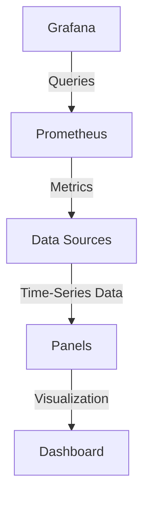
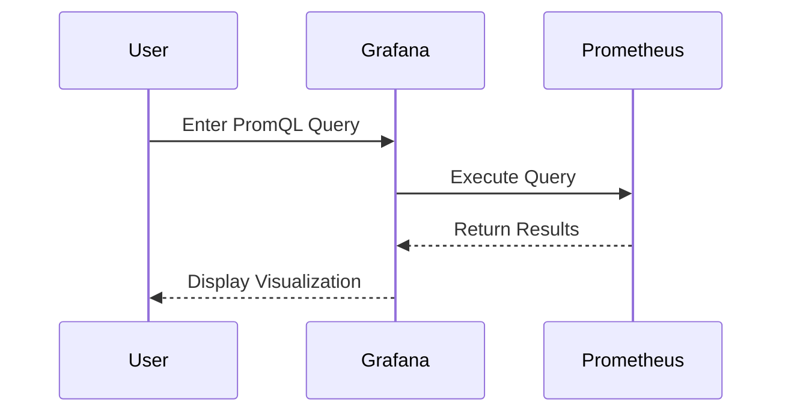

## Introduction to Grafana and Metrics Visualization

Grafana is an open-source platform used for monitoring and observability. It provides a powerful interface for visualizing time-series data from various sources, including Prometheus, InfluxDB, Elasticsearch, and more. This chapter focuses on using Grafana to visualize metrics, particularly those generated by Prometheus, and how to create custom dashboards.

### What is Grafana?

Grafana is a highly customizable, open-source analytics and monitoring solution that allows users to query, visualize, and explore time-series data. It supports a wide range of data sources, making it a versatile tool for monitoring applications, infrastructure, and business metrics.

#### Why Use Grafana?

1. **Visualization**: Grafana provides a rich set of visualization options, including graphs, tables, heatmaps, and more.
2. **Customization**: Users can create custom dashboards and panels to suit their specific needs.
3. **Integration**: Grafana integrates seamlessly with many popular data sources, such as Prometheus, InfluxDB, and Elasticsearch.
4. **Community Support**: Being open-source, Grafana benefits from a large community of contributors and users, ensuring continuous improvements and support.

### What is Prometheus?

Prometheus is an open-source systems monitoring and alerting toolkit originally built at SoundCloud. It records real-time metrics in a time series database and offers a flexible query language to analyze and visualize the data.

#### Why Use Prometheus?

1. **Scalability**: Prometheus is designed to scale horizontally, making it suitable for large-scale monitoring.
2. **Metrics Model**: Prometheus uses a multi-dimensional data model with time series identified by metric name and key-value pairs.
3. **Query Language**: Prometheus Query Language (PromQL) is a powerful tool for querying and analyzing time-series data.
4. **Alerting**: Prometheus includes built-in alerting capabilities, allowing users to define and manage alerts based on metrics.

### Basic PromQL Syntax

PromQL is the query language used by Prometheus to retrieve and manipulate time-series data. Understanding PromQL is essential for creating effective dashboards in Grafana.

#### Key Concepts in PromQL

1. **Metrics**: A metric is a named time series of data points. Each data point consists of a timestamp and a value.
2. **Labels**: Labels are key-value pairs attached to a metric. They provide additional context and allow for filtering and aggregation.
3. **Functions**: PromQL includes a variety of functions for manipulating and aggregating data, such as `sum`, `avg`, `rate`, and `increase`.

#### Example PromQL Queries

```promql
# Retrieve the total CPU usage for all nodes in the cluster
cluster_node_cpu_total

# Calculate the rate of increase in CPU usage over the past 5 minutes
rate(cluster_node_cpu_total[5m])

# Sum the CPU usage across all nodes
sum(cluster_node_cpu_total)
```

### Creating Dashboards in Grafana

Creating a dashboard in Grafana involves selecting metrics and configuring panels to visualize the data. This section covers the process of creating a custom dashboard using both manual PromQL queries and the metrics browser.

#### Using the Metrics Browser

The metrics browser in Grafana simplifies the process of selecting metrics and labels. Here’s how to use it:

1. **Select Metrics**: Choose the metrics you want to visualize from the list provided by the metrics browser.
2. **Select Labels**: Apply labels to filter the metrics and refine the data.
3. **Execute Query**: Execute the query to see the results in a graph or table.

#### Example: Cluster Node CPU Total

Let’s walk through the process of creating a dashboard to visualize the total CPU usage for each node in the cluster.

1. **Open Grafana**: Log in to your Grafana instance.
2. **Create New Dashboard**: Click on the "+" icon to create a new dashboard.
3. **Add Panel**: Click on the "Add panel" button to add a new panel to the dashboard.
4. **Select Data Source**: Choose Prometheus as the data source.
5. **Use Metrics Browser**:
    - Open the metrics browser.
    - Select the `cluster_node_cpu_total` metric.
    - Apply any necessary labels to filter the data.
    - Execute the query.

6. **Configure Visualization**:
    - Choose the type of visualization (graph, table, etc.).
    - Customize the visualization settings as needed.

#### Full HTTP Request and Response

Here’s an example of a full HTTP request and response for executing a PromQL query via the Prometheus API:

```http
GET /api/v1/query?query=cluster_node_cpu_total HTTP/1.1
Host: localhost:9090
Accept: application/json

HTTP/1.1 200 OK
Content-Type: application/json

{
  "status": "success",
  "data": {
    "resultType": "vector",
    "result": [
      {
        "metric": {
          "__name__": "cluster_node_cpu_total",
          "instance": "localhost:9100",
          "job": "node"
        },
        "value": [1638456000, "10"]
      }
    ]
  }
}
```

### Customizing Panels

Grafana provides extensive customization options for panels, allowing users to tailor the visualization to their specific needs.

#### Types of Panels

1. **Graph**: Displays time-series data as a line graph.
2. **Table**: Displays data in a tabular format.
3. **Heatmap**: Visualizes data using color gradients.
4. **Stat**: Displays a single value, often used for KPIs.

#### Example: Graph Panel Configuration

To configure a graph panel to display the total CPU usage for each node:

1. **Select Data Source**: Choose Prometheus.
2. **Enter Query**: Enter the PromQL query `cluster_node_cpu_total`.
3. **Apply Labels**: Add any necessary labels to filter the data.
4. **Customize Visualization**:
    - Set the legend format to display the node name.
    - Configure the Y-axis to display the CPU usage percentage.
    - Adjust the time range to show recent data.

### Ready-to-Use Dashboards

For most use cases, Grafana provides pre-built dashboards that can be easily imported and customized. These dashboards are designed to work with popular data sources and provide a comprehensive view of system metrics.

#### Importing a Pre-Built Dashboard

1. **Navigate to Dashboards**: Click on the "Dashboards" menu in Grafana.
2. **Import Dashboard**: Click on the "Import" button to import a pre-built dashboard.
3. **Select Data Source**: Choose the appropriate data source (e.g., Prometheus).
4. **Customize**: Modify the dashboard as needed to fit your specific requirements.

### High-Level Overview Dashboard

A high-level overview dashboard provides a summary of resource consumption in the cluster for each node. This type of dashboard is useful for quickly identifying trends and anomalies.

#### Example: Resource Consumption Dashboard

To create a dashboard that shows the high-level overview of resource consumption:

1. **Add Panels**: Add multiple panels to display different metrics (CPU, memory, disk usage).
2. **Use PromQL Queries**: Use PromQL queries to retrieve the relevant metrics.
3. **Configure Visualization**: Customize the visualization settings to display the data effectively.

### Real-World Examples

Real-world examples help illustrate the practical application of Grafana and Prometheus in monitoring and observability.

#### Example: Monitoring Kubernetes Cluster

In a Kubernetes environment, Grafana can be used to monitor the resource consumption of nodes and pods. Here’s an example of how to set up a dashboard to monitor a Kubernetes cluster:

1. **Install Prometheus Operator**: Deploy the Prometheus Operator to manage monitoring components.
2. **Configure Prometheus**: Configure Prometheus to scrape metrics from Kubernetes nodes and pods.
3. **Create Dashboard**: Create a dashboard in Grafana to visualize the metrics.

#### Full HTTP Request and Response

Here’s an example of a full HTTP request and response for retrieving Kubernetes node metrics:

```http
GET /api/v1/query?query=kube_node_info HTTP/1.1
Host: localhost:9090
Accept: application/json

HTTP/1.1 200 OK
Content-Type: application/json

{
  "status": "success",
  "data": {
    "resultType": "vector",
    "result": [
      {
        "metric": {
          "__name__": "kube_node_info",
          "instance": "localhost:9100",
          "job": "kubernetes-nodes",
          "kubernetes_io_arch": "amd64",
          "kubernetes_io_hostname": "minikube",
          "kubernetes_io_os": "linux",
          "node": "minikube"
        },
        "value": [1638456000, "1"]
      }
    ]
  }
}
```

### Pitfalls and Common Mistakes

When working with Grafana and Prometheus, there are several common pitfalls and mistakes to avoid.

#### Misconfigured Queries

Misconfigured PromQL queries can lead to incorrect or incomplete data. Always ensure that queries are correctly formed and that all necessary labels are applied.

#### Overloading Dashboards

Overloading dashboards with too many panels can make them difficult to read and interpret. Keep dashboards focused and limit the number of panels to a manageable level.

#### Insufficient Labeling

Insufficient labeling of metrics can make it difficult to filter and aggregate data. Ensure that all relevant labels are applied to metrics.

### How to Prevent / Defend

#### Detection

To detect issues with Grafana and Prometheus configurations, regularly review dashboards and queries to ensure they are functioning as intended. Use logging and alerting features to identify and address problems.

#### Prevention

To prevent issues, follow best practices for configuring and managing Grafana and Prometheus:

1. **Regularly Update**: Keep Grafana and Prometheus updated to the latest versions to benefit from security patches and new features.
2. **Secure Configurations**: Secure configurations by limiting access to sensitive data and using strong authentication methods.
3. **Monitor Performance**: Monitor the performance of Grafana and Prometheus to ensure they are operating efficiently.

#### Secure Coding Fixes

Here’s an example of a secure coding fix for a vulnerable PromQL query:

**Vulnerable Query**:
```promql
cluster_node_cpu_total
```

**Fixed Query**:
```promql
sum(cluster_node_cpu_total{instance="localhost:9100"})
```

By applying the `instance` label, the query is filtered to only include data from the specified instance, reducing the risk of data exposure.

### Conclusion

Visualizing metrics with Grafana and Prometheus is a powerful way to gain insights into system performance and resource consumption. By following best practices and leveraging the full capabilities of these tools, users can create effective dashboards that provide valuable information for monitoring and observability.

### Practice Labs

For hands-on practice with Grafana and Prometheus, consider the following labs:

- **PortSwigger Web Security Academy**: Offers a variety of labs for learning web security concepts.
- **OWASP Juice Shop**: A deliberately insecure web application for practicing web security skills.
- **DVWA (Damn Vulnerable Web Application)**: A PHP/MySQL web application that is riddled with vulnerabilities for educational purposes.
- **WebGoat**: An interactive, gamified training application for learning about web security.

These labs provide a practical way to apply the concepts learned in this chapter and gain hands-on experience with Grafana and Prometheus.

### Diagrams

#### Mermaid Diagram: Grafana Dashboard Architecture



This diagram illustrates the architecture of a Grafana dashboard, showing how queries are sent to Prometheus, which retrieves metrics from data sources, and how the data is visualized in panels to create a dashboard.

#### Mermaid Diagram: Prometheus Query Flow



This sequence diagram illustrates the flow of a PromQL query from the user through Grafana to Prometheus and back to the user for visualization.

### Summary

In this chapter, we covered the basics of using Grafana to visualize metrics from Prometheus. We explored the PromQL query language, the process of creating custom dashboards, and the use of pre-built dashboards. We also discussed common pitfalls and provided guidance on how to prevent and detect issues. With this knowledge, you should be able to effectively monitor and visualize system metrics using Grafana and Prometheus.

---
<!-- nav -->
[[03-Introduction to Grafana and Data Visualization|Introduction to Grafana and Data Visualization]] | [[DevOps/DevOps Bootcamp/10-Monitoring & Alerting/21-Visualizing Metrics with Grafana UI/00-Overview|Overview]] | [[05-Introduction to Monitoring and Visualization with Grafana|Introduction to Monitoring and Visualization with Grafana]]
