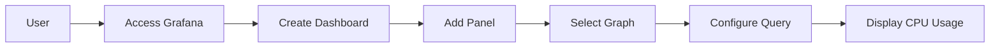
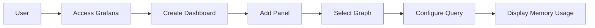
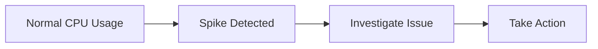

## Introduction to Monitoring and Visualization with Grafana

Monitoring and visualization tools are crucial components in modern DevOps practices. They provide insights into the health and performance of systems, enabling teams to quickly identify and resolve issues. One such powerful tool is Grafana, which allows users to visualize metrics from various data sources. This chapter delves into the details of using Grafana to monitor and visualize metrics, particularly focusing on CPU and memory usage in a Kubernetes cluster.

### Background Theory

Before diving into the specifics of using Grafana, it's essential to understand the underlying concepts of monitoring and visualization.

#### What is Monitoring?

Monitoring refers to the process of continuously observing and recording the status and performance of a system. In the context of DevOps, this typically involves tracking metrics such as CPU usage, memory consumption, disk space, network traffic, and more. Effective monitoring helps in identifying potential issues before they become critical, ensuring the smooth operation of applications and services.

#### Why is Monitoring Important?

Monitoring is crucial because it provides visibility into the health and performance of systems. Without proper monitoring, issues can go unnoticed until they cause significant disruptions. By having real-time data, teams can proactively address problems, optimize resource utilization, and ensure high availability and reliability of services.

#### What is Visualization?

Visualization is the process of representing complex data in a graphical format. This makes it easier for humans to interpret and understand the information. In the context of monitoring, visualization tools like Grafana help in presenting metrics in a way that highlights trends, anomalies, and patterns.

### Introduction to Grafana

Grafana is an open-source platform for monitoring and observability. It provides a user-friendly interface to visualize metrics from various data sources, including Prometheus, InfluxDB, Elasticsearch, and others. Grafana supports a wide range of visualizations, including graphs, tables, heatmaps, and more.

#### Key Features of Grafana

- **Multi-data Source Support**: Grafana can connect to multiple data sources, allowing users to aggregate and visualize data from different sources in a single dashboard.
- **Rich Visualization Options**: Grafana offers a variety of visualization options, making it easy to create meaningful dashboards.
- **Dashboards and Panels**: Users can create custom dashboards with multiple panels, each displaying different types of data.
- **Alerting**: Grafana supports alerting based on defined thresholds, enabling proactive issue resolution.
- **Annotations**: Users can add annotations to dashboards to mark significant events or changes.

### Setting Up Grafana for Kubernetes Monitoring

To set up Grafana for monitoring a Kubernetes cluster, you need to configure data sources and create dashboards. This section walks through the steps to set up Grafana and visualize CPU and memory usage.

#### Prerequisites

- A running Kubernetes cluster.
- Grafana installed in the cluster.
- Prometheus configured to scrape metrics from the cluster.

#### Step-by-Step Setup

1. **Install Grafana**:
   ```bash
   kubectl apply -f https://raw.githubusercontent.com/grafana/grafana/main/deploy/kubernetes/grafana.yaml
   ```

2. **Configure Prometheus as Data Source**:
   - Access the Grafana UI by port-forwarding:
     ```bash
     kubectl port-forward svc/grafana 3000:80
     ```
   - Open `http://localhost:3000` in a browser and log in with default credentials (`admin/admin`).
   - Add Prometheus as a data source:
     - Go to `Configuration > Data Sources`.
     - Click `Add data source`.
     - Select `Prometheus`.
     - Enter the URL of your Prometheus server (e.g., `http://prometheus-server:9090`).
     - Save and test the connection.

3. **Create Dashboards**:
   - Go to `Create > Dashboard`.
   - Add panels to display CPU and memory usage:
     - Click `Add panel`.
     - Choose `Graph` as the visualization type.
     - Configure the query to fetch CPU and memory usage metrics from Prometheus.
     - Example query for CPU usage:
       ```promql
       sum(rate(container_cpu_usage_seconds_total{namespace!="",pod!="",container!="POD"}[1m])) by (namespace)
       ```
     - Example query for memory usage:
       ```promql
       sum(container_memory_usage_bytes{namespace!="",pod!="",container!="POD"}) by (namespace)
       ```

### Visualizing CPU and Memory Usage

Once the setup is complete, you can start visualizing CPU and memory usage in your Kubernetes cluster.

#### CPU Usage Visualization

CPU usage is typically displayed as a percentage of the total available CPU resources. In Grafana, you can create a graph panel to visualize CPU usage per namespace.



Example query for CPU usage:
```promql
sum(rate(container_cpu_usage_seconds_total{namespace!="",pod!="",container!="POD"}[1m])) by (namespace)
```

#### Memory Usage Visualization

Memory usage is typically displayed in bytes or as a percentage of the total available memory. In Grafana, you can create a graph panel to visualize memory usage per namespace.



Example query for memory usage:
```promql
sum(container_memory_usage_bytes{namespace!="",pod!="",container!="POD"}) by (namespace)
```

### Analyzing Metrics

When analyzing metrics, you should look for anomalies such as spikes or out-of-ordinary behavior. Consistent average flow indicates normal operation, while sudden spikes may indicate issues.

#### Identifying Anomalies

Anomalies can be identified by observing sudden increases in CPU or memory usage. These spikes can be caused by various factors, such as unexpected workload, resource leaks, or misconfigurations.

Example of a spike in CPU usage:


### Real-World Examples

Recent real-world examples of monitoring and visualization include incidents where sudden spikes in CPU and memory usage led to service disruptions. For instance, in the case of a major cloud provider outage in 2021, monitoring tools like Grafana were crucial in identifying and resolving the issue.

#### CVE Example

CVE-2021-21277 is an example of a vulnerability that could lead to excessive resource consumption, causing spikes in CPU and memory usage. By monitoring these metrics, organizations can quickly identify and mitigate such vulnerabilities.

### How to Prevent / Defend

To prevent and defend against issues related to CPU and memory usage, follow these best practices:

#### Detection

- **Set Up Alerts**: Configure alerts in Grafana to notify you when CPU or memory usage exceeds predefined thresholds.
- **Regular Monitoring**: Continuously monitor metrics to identify anomalies early.

#### Prevention

- **Resource Limits**: Set resource limits for pods to prevent them from consuming excessive resources.
- **Optimize Applications**: Optimize applications to reduce unnecessary resource consumption.

#### Secure Coding Fixes

Vulnerable pattern:
```yaml
apiVersion: v1
kind: Pod
metadata:
  name: my-pod
spec:
  containers:
  - name: my-container
    image: my-image
```

Secure pattern:
```yaml
apiVersion: v1
kind: Pod
metadata:
  name: my-pod
spec:
  containers:
  - name: my-container
    image: my-image
    resources:
      limits:
        cpu: "1"
        memory: "512Mi"
      requests:
        cpu: "0.5"
        memory: "256Mi"
```

#### Configuration Hardening

- **Enable Resource Quotas**: Use Kubernetes resource quotas to enforce limits on resource consumption across namespaces.
- **Use Horizontal Pod Autoscaler (HPA)**: Automatically scale pods based on CPU and memory usage to maintain optimal performance.

### Complete Example

Here is a complete example of setting up monitoring and visualization with Grafana:

#### Full HTTP Request and Response

HTTP Request:
```http
GET /api/datasources HTTP/1.1
Host: localhost:3000
Authorization: Bearer <your_token>
Content-Type: application/json
```

HTTP Response:
```http
HTTP/1.1 200 OK
Content-Type: application/json

[
    {
        "id": 1,
        "name": "Prometheus",
        "type": "prometheus",
        "url": "http://prometheus-server:9090",
        "access": "proxy",
        "isDefault": true,
        "jsonData": {}
    }
]
```

#### Full Policy/Config File

Kubernetes Resource Quota:
```yaml
apiVersion: v1
kind: ResourceQuota
metadata:
  name: compute-resources
spec:
  hard:
    requests.cpu: "1"
    requests.memory: 512Mi
    limits.cpu: "2"
    limits.memory: 1Gi
```

#### Expected Result/Output

Expected output of the above configuration:
- Pods within the namespace will be limited to a maximum of 1 CPU and 512Mi memory requests.
- Pods will be limited to a maximum of 2 CPUs and 1Gi memory limits.

### Practice Labs

For hands-on practice, consider the following labs:

- **PortSwigger Web Security Academy**: Focuses on web application security but includes sections on monitoring and logging.
- **OWASP Juice Shop**: While primarily a web application security training tool, it can be used to practice monitoring and logging techniques.
- **CloudGoat**: Provides scenarios for practicing cloud security, including monitoring and visualization.

By following these steps and best practices, you can effectively use Grafana to monitor and visualize metrics in your Kubernetes cluster, ensuring optimal performance and reliability.

---
<!-- nav -->
[[04-Introduction to Grafana and Metrics Visualization|Introduction to Grafana and Metrics Visualization]] | [[DevOps/DevOps Bootcamp/10-Monitoring & Alerting/21-Visualizing Metrics with Grafana UI/00-Overview|Overview]] | [[06-Introduction to Monitoring with Grafana and Prometheus|Introduction to Monitoring with Grafana and Prometheus]]
