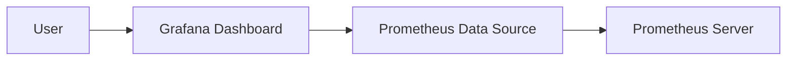
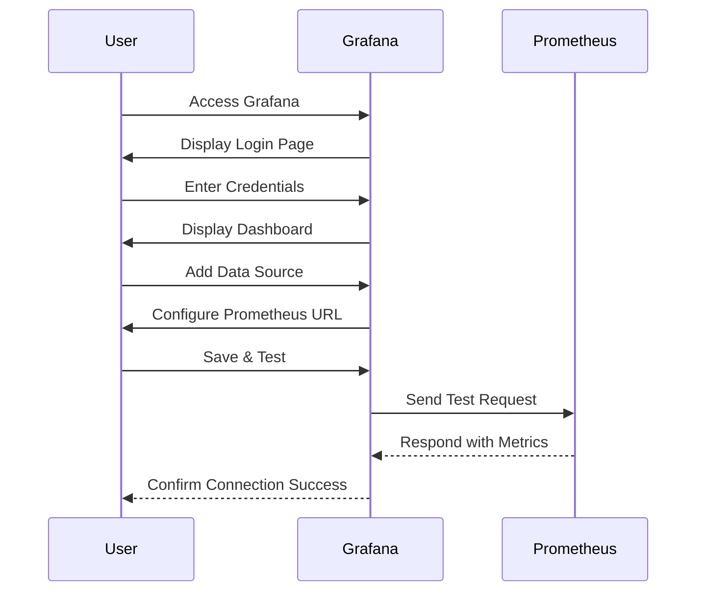

## Introduction to Monitoring with Grafana and Prometheus

In modern DevOps environments, monitoring is crucial for maintaining system health, performance, and reliability. One of the most popular tools for visualizing and monitoring metrics is Grafana, paired with Prometheus as the data source. This chapter will delve into the intricacies of using Grafana to visualize metrics collected by Prometheus, covering everything from basic concepts to advanced configurations and security practices.

### What is Grafana?

Grafana is an open-source platform used for monitoring and observability. It allows users to query, visualize, and alert on data from multiple sources. Grafana supports a wide range of data sources, including Prometheus, Elasticsearch, InfluxDB, and many others. Its primary function is to provide a user-friendly interface for creating and managing dashboards that display various metrics and logs.

#### Why Use Grafana?

1. **Visualization**: Grafana provides a rich set of visualization options, making it easy to understand complex data.
2. **Flexibility**: It supports multiple data sources, allowing you to integrate different systems and databases.
3. **Community Support**: Being open-source, Grafana benefits from a large community that contributes plugins, documentation, and support.
4. **Customization**: Users can create custom panels, alerts, and dashboards tailored to their specific needs.

### What is Prometheus?

Prometheus is an open-source monitoring and alerting toolkit originally built at SoundCloud. It is designed for monitoring applications, services, and infrastructure. Prometheus collects and stores metrics from configured targets at regular intervals and exposes them via a REST API.

#### Why Use Prometheus?

1. **Scraping Model**: Prometheus uses a pull model to scrape metrics from targets, reducing the load on monitored systems.
2. **Metrics Model**: It supports a multi-dimensional data model using time series distinguished by metric name and key-value pairs.
3. **Query Language**: Prometheus includes a powerful query language called PromQL, which allows for flexible querying and aggregation of metrics.
4. **Alerting**: Prometheus can trigger alerts based on rules defined in the configuration.

### Integration of Grafana and Prometheus

To effectively use Grafana for monitoring, it must be integrated with Prometheus. This integration allows Grafana to fetch and display metrics collected by Prometheus.

#### How Does Grafana Get Data from Prometheus?

Grafana retrieves data from Prometheus through a configured data source. This data source specifies the endpoint where Prometheus is running and the authentication details if required.



### Configuring Grafana to Use Prometheus

To configure Grafana to use Prometheus as a data source, follow these steps:

1. **Install Grafana**: Ensure Grafana is installed and running. You can install it using Docker, package managers, or download the binary from the official website.
   
   ```bash
   docker run -d --name=grafana -p 3000:3000 grafana/grafana
   ```

2. **Access Grafana**: Open your browser and navigate to `http://localhost:3000`. Log in using the default credentials (`admin/admin`).

3. **Add Prometheus Data Source**:
   - Click on the gear icon in the left sidebar to access the Configuration view.
   - Navigate to the Data Sources section.
   - Click on "Add data source".
   - Select "Prometheus" from the list of available data sources.
   - Configure the URL to point to your Prometheus instance (e.g., `http://localhost:9090`).
   - Click "Save & Test" to verify the connection.



### Monitoring Metrics with Grafana

Once Grafana is configured to use Prometheus, you can start monitoring various metrics. Common metrics include CPU usage, memory usage, disk space, network traffic, and application-specific metrics.

#### Example Metrics

1. **CPU Usage**:
   - Query: `rate(node_cpu_seconds_total{mode="user"}[1m])`
   - Description: Measures the rate of CPU usage in user mode over the past minute.

2. **Memory Usage**:
   - Query: `node_memory_MemTotal - node_memory_MemFree`
   - Description: Calculates the total memory minus free memory to get used memory.

3. **Disk Space**:
   - Query: `node_filesystem_free{mountpoint="/"}`
   - Description: Measures the free disk space on the root mount point.

4. **Network Traffic**:
   - Query: `rate(node_network_receive_bytes_total[1m])`
   - Description: Measures the rate of bytes received over the past minute.

### Creating Dashboards in Grafana

Dashboards in Grafana allow you to visualize multiple metrics in a single view. You can create custom panels to display specific metrics and configure alerts based on thresholds.

#### Steps to Create a Dashboard

1. **Create a New Dashboard**:
   - Click on the "+" icon in the left sidebar to create a new dashboard.
   - Name your dashboard and click "Add panel".

2. **Configure Panels**:
   - Choose the type of panel (e.g., Graph, Gauge, Table).
   - Select the data source (Prometheus).
   - Write the PromQL query to fetch the desired metric.
   - Customize the panel settings (e.g., title, colors, thresholds).

3. **Save and Share**:
   - Click "Save" to save the dashboard.
   - Share the dashboard URL with team members or embed it in a web page.

### Monitoring Application Behavior

When monitoring applications, it's essential to focus on key metrics that indicate normal behavior and potential anomalies. For example, a sudden spike in CPU usage might indicate a performance issue or a potential security breach.

#### Example Scenario: CPU Spike

Suppose you notice a spike in CPU usage for a specific application. To diagnose the issue, you can:

1. **Check Logs**: Review application logs to see if there are any errors or warnings around the time of the spike.
2. **Analyze Metrics**: Use Grafana to drill down into the metrics and identify which processes are consuming the most CPU.
3. **Set Alerts**: Configure alerts in Grafana to notify you when CPU usage exceeds a certain threshold.

### Configuring Users and Teams in Grafana

Grafana supports user management and team configurations, allowing you to control access to dashboards and data sources.

#### Steps to Configure Users and Teams

1. **Add Users**:
   - Navigate to the Configuration view and select "Users".
   - Click "Add user" and enter the user details.
   - Assign roles (e.g., Admin, Editor, Viewer).

2. **Manage Teams**:
   - Navigate to the Configuration view and select "Teams".
   - Click "Add team" and enter the team details.
   - Assign users to teams and configure permissions.

### Security Considerations

While Grafana and Prometheus provide powerful monitoring capabilities, it's crucial to implement security measures to protect sensitive data and prevent unauthorized access.

#### How to Prevent / Defend

1. **Secure Authentication**:
   - Enable authentication for Grafana using LDAP, OAuth, or other methods.
   - Use strong passwords and enable two-factor authentication.

2. **Limit Access**:
   - Restrict access to sensitive dashboards and data sources.
   - Use role-based access control (RBAC) to manage user permissions.

3. **Monitor Logs**:
   - Regularly review Grafana and Prometheus logs for suspicious activity.
   - Set up alerts for unusual login attempts or access patterns.

4. **Use HTTPS**:
   - Ensure that Grafana and Prometheus communicate over HTTPS to encrypt data in transit.
   - Use TLS certificates to secure connections.

### Real-World Examples

#### Recent CVEs and Breaches

1. **CVE-2021-42287**: A vulnerability in Grafana allowed attackers to bypass authentication and gain unauthorized access to dashboards. This highlights the importance of keeping Grafana updated and securing authentication mechanisms.

2. **Prometheus Remote Write Endpoint Exploit**: In 2022, a security researcher discovered that the Prometheus remote write endpoint could be exploited to execute arbitrary code. This underscores the need to properly configure and secure Prometheus endpoints.

### Complete Example: Full HTTP Request and Response

Here’s a complete example of configuring a data source in Grafana and fetching metrics from Prometheus:

#### HTTP Request to Add Data Source

```http
POST /api/datasources HTTP/1.1
Host: localhost:3000
Authorization: Bearer <your_api_key>
Content-Type: application/json

{
  "name": "Prometheus",
  "type": "prometheus",
  "url": "http://localhost:9090",
  "access": "proxy",
  "isDefault": true,
  "jsonData": {
    "timeInterval": "5s"
  }
}
```

#### HTTP Response

```http
HTTP/1.1 200 OK
Content-Type: application/json

{
  "id": 1,
  "uid": "abcdefgh",
  "orgId": 1,
  "name": "Prometheus",
  "type": "prometheus",
  "typeName": "Prometheus",
  "typeLogoUrl": "/public/app/plugins/datasource/prometheus/img/prometheus_logo.svg",
  "access": "proxy",
  "url": "http://localhost:9090",
  "password": "",
  "user": "",
  "database": "",
  "basicAuth": false,
  "basicAuthUser": "",
  "basicAuthPassword": "",
  "withCredentials": false,
  "isDefault": true,
  "jsonData": {
    "timeInterval": "5s"
  },
  "secureJsonFields": {},
  "version": 1,
  "readOnly": false
}
```

### Conclusion

Monitoring and observability are critical components of modern DevOps practices. By integrating Grafana with Prometheus, you can effectively visualize and analyze metrics from your applications and infrastructure. This chapter covered the basics of setting up and configuring Grafana, creating dashboards, and securing the environment. With this knowledge, you can build robust monitoring solutions that help maintain system health and performance.

### Practice Labs

For hands-on practice, consider the following labs:

- **PortSwigger Web Security Academy**: Offers a variety of labs focused on web application security, including monitoring and logging.
- **OWASP Juice Shop**: A deliberately insecure web application for practicing security testing and monitoring.
- **DVWA (Damn Vulnerable Web Application)**: Another popular web application for learning security concepts, including monitoring and logging.

These labs provide practical experience in setting up and using Grafana and Prometheus for monitoring purposes.

---
<!-- nav -->
[[05-Introduction to Monitoring and Visualization with Grafana|Introduction to Monitoring and Visualization with Grafana]] | [[DevOps/DevOps Bootcamp/10-Monitoring & Alerting/21-Visualizing Metrics with Grafana UI/00-Overview|Overview]] | [[07-Introduction to Visualizing Metrics with Grafana UI|Introduction to Visualizing Metrics with Grafana UI]]
