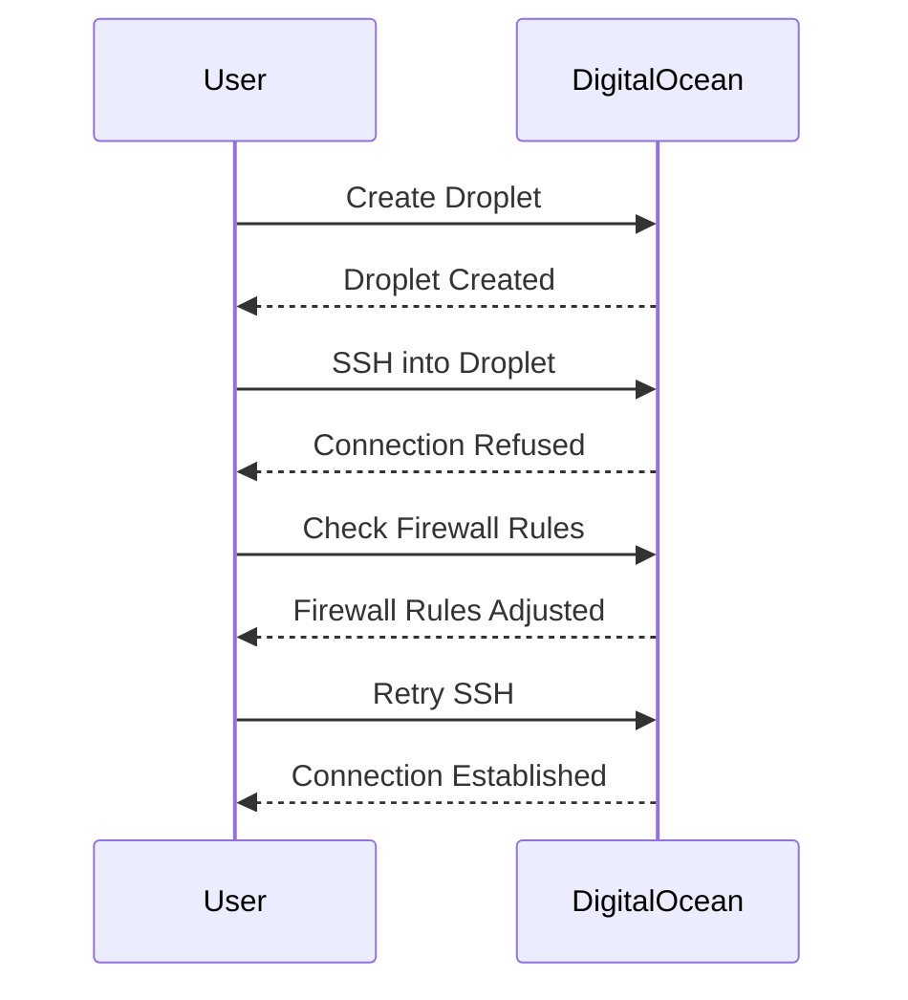
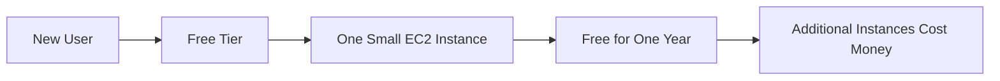
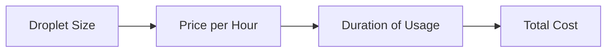
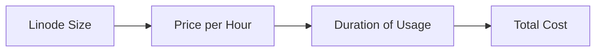
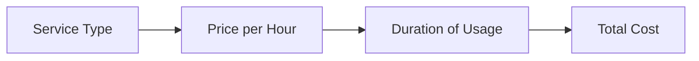
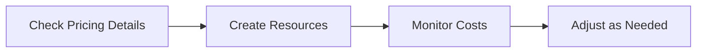
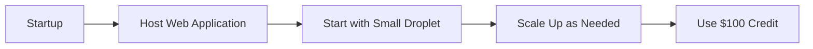
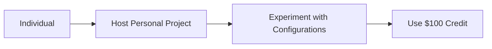
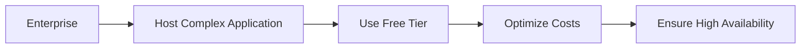

## Introduction to Cloud Platforms and Virtual Servers

In the realm of DevOps, understanding cloud platforms and virtual servers is crucial. This section delves into the practical aspects of using cloud platforms such as DigitalOcean, Linode, and Amazon Web Services (AWS). We will explore the importance of active learning, the pricing models of these platforms, and best practices for managing resources efficiently.

### Importance of Active Learning

Active learning is a cornerstone of mastering DevOps tools and cloud platforms. Theoretical knowledge is essential, but practical experience is equally critical. When you encounter issues and troubleshoot them, you gain a deeper understanding of how the tools work under the hood. This hands-on approach helps you become proficient and confident in your abilities.

#### Why Active Learning Matters

Active learning fosters problem-solving skills and resilience. When you face challenges, you learn to adapt and find solutions. This process is invaluable because it simulates real-world scenarios where unexpected issues often arise. By actively engaging with the tools, you build a robust foundation of practical knowledge.

#### Example: Troubleshooting a Cloud Server

Consider a scenario where you are setting up a web server on DigitalOcean. Initially, you might encounter issues such as connectivity problems or configuration errors. By actively troubleshooting these issues, you gain insights into networking concepts, server configurations, and error handling. This experience is far more valuable than simply reading about these topics.

### Cloud Platforms Overview

Cloud platforms provide scalable and flexible infrastructure for deploying applications and services. Three popular cloud platforms are DigitalOcean, Linode, and AWS. Each platform offers unique features and pricing models, catering to different use cases and budgets.

#### DigitalOcean

DigitalOcean is known for its simplicity and ease of use. It provides a straightforward interface for creating and managing virtual servers called Droplets. DigitalOcean is particularly popular among developers and startups due to its user-friendly nature and competitive pricing.

##### Free Startup Package

New users on DigitalOcean receive a $100 credit to use within 60 days. This credit can be used to create and manage Droplets, which are essentially virtual servers. The credit covers the cost of hosting and running these servers.

#### Linode

Linode is another cloud platform that offers virtual servers called Linodes. Similar to DigitalOcean, Linode provides a simple and intuitive interface for managing these servers. Linode is favored for its reliability and performance.

##### Free Startup Package

Linode also offers a $100 credit for new users to use within 60 days. This credit can be utilized to create and manage Linodes, covering the costs associated with hosting and running these servers.

#### Amazon Web Services (AWS)

AWS is one of the largest and most comprehensive cloud platforms. It offers a wide range of services, including Elastic Compute Cloud (EC2) for virtual servers, Elastic Kubernetes Service (EKS) for container orchestration, and many others. AWS is widely used by enterprises and large organizations due to its extensive feature set and scalability.

##### Free Tier

AWS provides a free tier that includes one small EC2 instance for free for a year. However, other services like EKS and additional EC2 instances incur charges. The free tier is designed to help new users get started with AWS without incurring immediate costs.

### Pricing Models

All cloud platforms charge based on the resources used and the duration of usage. Understanding the pricing models is crucial to managing costs effectively.

#### DigitalOcean Pricing

DigitalOcean charges based on the size of the Droplet and the duration of usage. The pricing varies depending on the type of Droplet (CPU-optimized, memory-optimized, etc.) and the region where it is hosted.

#### Linode Pricing

Linode follows a similar pricing model, charging based on the size of the Linode and the duration of usage. The pricing also depends on the type of Linode and the region where it is hosted.

#### AWS Pricing

AWS offers a variety of pricing models, including on-demand, reserved instances, and spot instances. The pricing depends on the specific service used, the region, and the duration of usage.

### Best Practices for Managing Resources

To avoid unnecessary costs, it is essential to follow best practices for managing cloud resources.

#### Checking Pricing Before Usage

Before creating and managing resources on a cloud platform, it is crucial to check the pricing details. This ensures that you understand the costs associated with different types of resources and can make informed decisions.

#### Deleting Unused Resources

Deleting unused resources is a key practice to avoid unnecessary costs. When you are done learning or no longer need certain resources, it is important to delete them to prevent ongoing charges.

### Real-World Examples and Case Studies

Understanding the practical implications of using cloud platforms can be enhanced through real-world examples and case studies.

#### Example: DigitalOcean for a Startup

A startup might use DigitalOcean to host their web application. They start with a small Droplet and scale up as needed. By leveraging the $100 credit, they can focus on developing their product without worrying about immediate costs.

#### Example: Linode for a Personal Project

An individual might use Linode to host a personal project, such as a blog or a small web application. By utilizing the $100 credit, they can experiment with different configurations and settings without incurring significant costs.

#### Example: AWS for an Enterprise

An enterprise might use AWS to host a complex application with multiple services. By leveraging the free tier and reserved instances, they can optimize their costs and ensure high availability and scalability.

### Hands-On Labs and Practice

To gain practical experience with cloud platforms, it is recommended to participate in hands-on labs and practice exercises.

#### Recommended Labs

- **PortSwigger Web Security Academy**: Focuses on web application security and includes exercises related to cloud security.
- **OWASP Juice Shop**: A deliberately insecure web application for practicing web security skills.
- **DVWA (Damn Vulnerable Web Application)**: Another web application for practicing web security skills.
- **WebGoat**: An interactive web application for learning about web security vulnerabilities.

These labs provide a safe environment to practice and apply the concepts learned in this chapter.

### Conclusion

Mastering cloud platforms and virtual servers is a critical skill in the DevOps landscape. By actively learning, understanding the pricing models, and following best practices, you can effectively manage cloud resources and avoid unnecessary costs. Through hands-on practice and real-world examples, you can gain the practical knowledge needed to succeed in DevOps.

---

This expanded chapter provides a comprehensive overview of cloud platforms and virtual servers, emphasizing the importance of active learning, pricing models, and best practices. It includes detailed explanations, real-world examples, and hands-on labs to ensure a deep understanding of the topic.

---
<!-- nav -->
[[DevOps/DevOps Bootcamp/11-Miscellaneous/01-DevOps Bootcamp Comprehensive Tools And Practices/00-Overview|Overview]] | [[02-Introduction to DevOps Bootcamp Completion and Certification|Introduction to DevOps Bootcamp Completion and Certification]]
