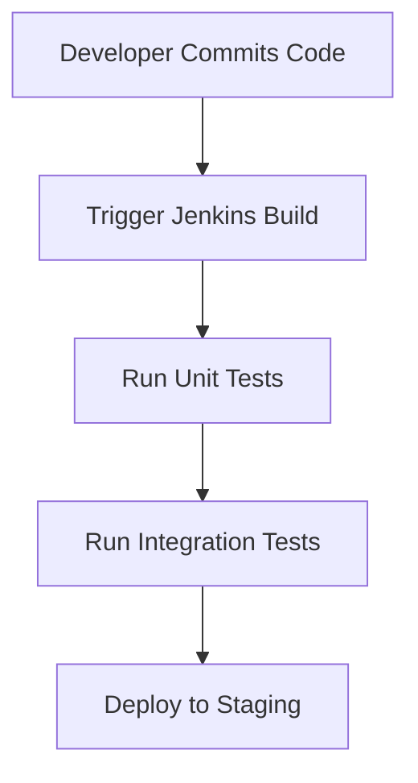
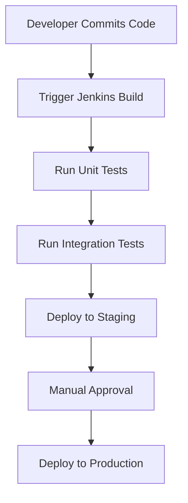

## Introduction to DevOps Concepts and Tools

### Overview of DevOps

DevOps is an approach to software development that emphasizes collaboration between development and operations teams to improve the speed and quality of software releases. By the end of this comprehensive DevOps boot camp, you will be equipped with the skills necessary to set up a complete DevOps pipeline. This includes understanding key DevOps concepts and gaining hands-on experience with widely-used tools.

### Key Concepts in DevOps

#### Continuous Integration (CI)

Continuous Integration (CI) is a practice where developers frequently merge their code changes into a central repository, followed by automated builds and tests. This ensures that the codebase remains stable and that issues are identified early.

**Why CI Matters:**
- **Early Detection of Issues:** Frequent integration helps catch bugs and conflicts early, reducing the time and effort required to resolve them.
- **Improved Code Quality:** Automated testing ensures that new code changes do not break existing functionality.
- **Faster Feedback Loops:** Developers receive immediate feedback on their changes, allowing them to make corrections quickly.

**How CI Works:**
1. **Code Commit:** Developers commit their changes to the central repository.
2. **Automated Build:** A CI server automatically triggers a build process.
3. **Automated Tests:** The build process runs automated tests to ensure the code works as expected.
4. **Deployment:** If the tests pass, the code can be deployed to a staging environment for further testing.

**Example: Jenkins CI Pipeline**



**Real-World Example:**
- **CVE-2021-21974:** A vulnerability in Jenkins allowed attackers to execute arbitrary code. This highlights the importance of keeping CI tools updated and securing access controls.

**How to Prevent / Defend:**
- **Secure Access Controls:** Ensure that only authorized users can access the CI server.
- **Regular Updates:** Keep the CI tool and plugins up to date to patch known vulnerabilities.
- **Secure Configuration:** Harden the CI server configuration to minimize attack surfaces.

**Vulnerable vs. Secure Code Example:**

```yaml
# Vulnerable Jenkinsfile
pipeline {
    agent any
    stages {
        stage('Build') {
            steps {
                sh 'npm install'
            }
        }
    }
}

# Secure Jenkinsfile
pipeline {
    agent any
    stages {
        stage('Build') {
            steps {
                sh 'npm ci --no-audit'
            }
        }
    }
}
```

### Continuous Delivery (CD)

Continuous Delivery (CD) extends CI by automating the deployment of applications to production-like environments. This ensures that the application can be released to production at any time.

**Why CD Matters:**
- **Reduced Deployment Risk:** Automated deployments reduce the risk of human error.
- **Faster Time-to-Market:** Applications can be released more quickly, giving businesses a competitive advantage.
- **Consistent Environments:** Ensures that the development, testing, and production environments are consistent, reducing environment-specific issues.

**How CD Works:**
1. **Automated Testing:** Run automated tests to ensure the application works as expected.
2. **Automated Deployment:** Deploy the application to a staging environment for further testing.
3. **Manual Approval:** Optionally, a manual approval step can be added before deploying to production.
4. **Production Deployment:** Once approved, deploy the application to production.

**Example: Jenkins CD Pipeline**



**Real-World Example:**
- **AWS CodePipeline:** AWS CodePipeline is a fully managed continuous delivery service that enables you to automate your release processes.

**How to Prevent / Defend:**
- **Environment Consistency:** Use containerization (Docker) to ensure consistent environments.
- **Security Scanning:** Integrate security scanning tools (e.g., SonarQube) to identify and fix security vulnerabilities.
- **Access Controls:** Implement strict access controls to prevent unauthorized access to the CD pipeline.

### Infrastructure as Code (IaC)

Infrastructure as Code (IaC) is the practice of managing and provisioning infrastructure through machine-readable definition files, rather than physical hardware configuration or interactive configuration tools.

**Why IaC Matters:**
- **Reproducibility:** IaC ensures that infrastructure can be consistently reproduced, reducing the risk of configuration drift.
- **Automation:** Automates the provisioning and management of infrastructure, reducing manual errors.
- **Version Control:** Infrastructure definitions can be stored in version control systems, enabling collaboration and tracking changes.

**How IaC Works:**
1. **Define Infrastructure:** Write infrastructure definitions using a declarative language (e.g., Terraform, Ansible).
2. **Apply Definitions:** Use a tool to apply the infrastructure definitions to the actual infrastructure.
3. **Track Changes:** Store the infrastructure definitions in a version control system to track changes and collaborate.

**Example: Terraform IaC**

```hcl
provider "aws" {
  region = "us-west-2"
}

resource "aws_instance" "example" {
  ami           = "ami-0c55b159cbfafe1f0"
  instance_type = "t2.micro"

  tags = {
    Name = "example-instance"
  }
}
```

**Real-World Example:**
- **Terraform:** Terraform is an open-source IaC tool that allows you to define and provision infrastructure across multiple cloud providers.

**How to Prevent / Defend:**
- **Secure Configuration:** Ensure that sensitive information (e.e., API keys, passwords) is securely stored and not hardcoded in the IaC files.
- **Least Privilege Principle:** Grant the minimum permissions necessary to the IaC tool to reduce the attack surface.
- **Regular Audits:** Regularly audit the IaC files to ensure compliance with security policies.

### Containerization

Containerization is the process of packaging an application and its dependencies into a single, portable unit called a container. Containers provide a lightweight and consistent runtime environment for applications.

**Why Containerization Matters:**
- **Portability:** Containers can run consistently across different environments (development, testing, production).
- **Resource Efficiency:** Containers share the host operating system kernel, making them more resource-efficient than virtual machines.
- **Isolation:** Containers provide isolation, ensuring that applications do not interfere with each other.

**How Containerization Works:**
1. **Create Dockerfile:** Define the application and its dependencies in a `Dockerfile`.
2. **Build Image:** Use the `docker build` command to create a Docker image.
3. **Run Container:** Use the `docker run` command to start a container from the image.

**Example: Dockerfile**

```Dockerfile
FROM python:3.9-slim

WORKDIR /app

COPY requirements.txt .
RUN pip install -r requirements.txt

COPY . .

CMD ["python", "app.py"]
```

**Real-World Example:**
- **Docker:** Docker is a popular containerization platform that allows you to package and run applications in containers.

**How to Prevent / Defend:**
- **Image Scanning:** Use tools like Docker Security Scanning to identify and fix vulnerabilities in Docker images.
- **Least Privilege Principle:** Run containers with the minimum necessary privileges to reduce the attack surface.
- **Network Isolation:** Use network policies to isolate containers and restrict communication.

### Monitoring and Logging

Monitoring and logging are critical components of DevOps that help in identifying and resolving issues in real-time.

**Why Monitoring and Logging Matter:**
- **Issue Detection:** Real-time monitoring helps in detecting issues before they affect users.
- **Troubleshooting:** Logs provide detailed information about the application's behavior, aiding in troubleshooting.
- **Performance Optimization:** Monitoring data can be used to optimize application performance.

**How Monitoring and Logging Work:**
1. **Instrumentation:** Add monitoring and logging instrumentation to the application.
2. **Data Collection:** Collect monitoring and log data from the application.
3. **Data Analysis:** Analyze the collected data to identify trends and issues.
4. **Alerting:** Set up alerts to notify when predefined conditions are met.

**Example: Prometheus and Grafana**

```yaml
# Prometheus configuration
scrape_configs:
  - job_name: 'prometheus'
    static_configs:
      - targets: ['localhost:9090']

# Grafana dashboard
{
  "title": "Application Metrics",
  "panels": [
    {
      "type": "timeseries",
      "title": "CPU Usage",
      "datasource": "Prometheus",
      "targets": [
        { "expr": "rate(process_cpu_seconds_total{job='prometheus'}[5m])" }
      ]
    }
  ]
}
```

**Real-World Example:**
- **Prometheus and Grafana:** Prometheus is a popular monitoring tool that collects metrics from applications, and Grafana is a visualization tool that provides dashboards for monitoring data.

**How to Prevent / Defend:**
- **Data Encryption:** Encrypt sensitive data in transit and at rest to protect against unauthorized access.
- **Access Controls:** Implement strict access controls to prevent unauthorized access to monitoring and logging data.
- **Regular Audits:** Regularly audit monitoring and logging configurations to ensure compliance with security policies.

### Conclusion

By the end of this comprehensive DevOps boot camp, you will have a solid foundation in DevOps concepts and hands-on experience with widely-used tools. This will enable you to confidently perform DevOps tasks and contribute to the success of your organization.

### Practice Labs

To gain practical experience, consider the following real-world labs:

- **PortSwigger Web Security Academy:** Focuses on web application security and provides hands-on exercises.
- **OWASP Juice Shop:** An intentionally insecure web application for practicing web security.
- **DVWA (Damn Vulnerable Web Application):** Another intentionally insecure web application for practicing web security.
- **WebGoat:** A deliberately insecure Java web application designed to teach web application security lessons.

These labs will help you apply the concepts learned in this boot camp and gain practical experience with DevOps tools and practices.

---
<!-- nav -->
[[02-Introduction to DevOps Bootcamp Completion and Certification|Introduction to DevOps Bootcamp Completion and Certification]] | [[DevOps/DevOps Bootcamp/11-Miscellaneous/01-DevOps Bootcamp Comprehensive Tools And Practices/00-Overview|Overview]] | [[04-Introduction to DevOps|Introduction to DevOps]]
