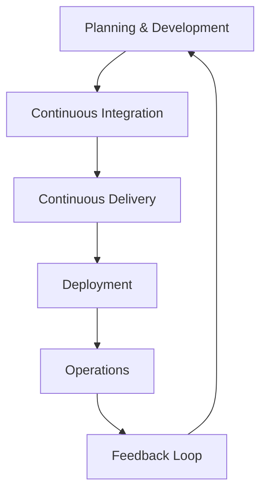

## Introduction to DevOps

Welcome to the comprehensive guide on DevOps practices and tools. This chapter aims to provide you with a deep understanding of the DevOps landscape, including the foundational concepts, tools, and practices that are essential for any aspiring DevOps engineer. By the end of this chapter, you will have a solid grasp of how DevOps fits into the overall software development and deployment process, and you will be equipped with the knowledge and hands-on experience needed to automate infrastructure provisioning and application deployment.

### What is DevOps?

DevOps is a set of practices that emphasizes the collaboration and communication between development and operations teams in order to improve the speed and quality of software releases. The primary goal of DevOps is to shorten the systems development life cycle and provide continuous delivery with high software quality.

#### Why DevOps Matters

In today’s fast-paced technological environment, businesses need to deliver software updates quickly and reliably. Traditional development and operations silos often lead to delays, inefficiencies, and errors. DevOps addresses these issues by fostering a culture of collaboration, automation, and continuous improvement.

#### How DevOps Works

DevOps integrates development and operations teams to streamline the software delivery process. This integration is achieved through various practices and tools that enable:

- **Continuous Integration (CI):** Automating the integration of code changes from multiple contributors into a shared repository.
- **Continuous Delivery (CD):** Automating the release process to ensure that software can be released to production at any time.
- **Infrastructure as Code (IaC):** Managing and provisioning infrastructure through code, enabling consistent and repeatable deployments.
- **Monitoring and Logging:** Collecting and analyzing system data to ensure performance and reliability.

### Big Picture Overview of DevOps

To truly understand DevOps, it is crucial to see how it fits into the entire software development and deployment lifecycle. Let’s break down the key components:

1. **Planning and Development:** This includes requirements gathering, design, coding, and unit testing.
2. **Continuous Integration:** Automated builds and tests to ensure code quality.
3. **Continuous Delivery:** Automated deployment pipelines to move code from development to production.
4. **Deployment:** Provisioning and configuring infrastructure to deploy applications.
5. **Operations:** Monitoring, logging, and maintaining the deployed applications.
6. **Feedback Loop:** Gathering feedback from users and stakeholders to iterate and improve the software.

#### Mermaid Diagram: DevOps Lifecycle



### Key DevOps Tools

Throughout this chapter, we will explore several key DevOps tools that are essential for automating and streamlining the software development and deployment process. These tools include:

- **Version Control Systems (VCS):** Git, SVN
- **Build Automation Tools:** Jenkins, Travis CI, CircleCI
- **Containerization Tools:** Docker, Kubernetes
- **Configuration Management Tools:** Ansible, Puppet, Chef
- **Monitoring and Logging Tools:** Prometheus, Grafana, ELK Stack (Elasticsearch, Logstash, Kibana)

#### Version Control Systems (VCS)

Version control systems are fundamental to DevOps practices. They allow developers to track changes in code, collaborate effectively, and maintain a history of modifications.

##### Git

Git is the most widely used VCS today. It provides features such as branching, merging, and tagging, which are crucial for managing codebases efficiently.

###### Example: Initializing a Git Repository

```bash
# Initialize a new Git repository
git init

# Add files to the staging area
git add .

# Commit changes with a descriptive message
git commit -m "Initial commit"
```

##### Subversion (SVN)

Subversion is another popular VCS, though less commonly used than Git. It follows a centralized model, where all changes are stored in a central repository.

###### Example: Creating a New SVN Repository

```bash
# Create a new SVN repository
svnadmin create /path/to/repository

# Import initial project files
svn import /path/to/project file:///path/to/repository -m "Initial import"
```

### Continuous Integration (CI)

Continuous Integration is the practice of automating the integration of code changes from multiple contributors into a shared repository. This ensures that code changes are tested and validated before being merged into the main branch.

#### Jenkins

Jenkins is a widely used open-source CI server that supports a wide range of plugins and integrations.

##### Setting Up a Jenkins Pipeline

A Jenkins pipeline defines the steps required to build, test, and deploy an application. Here is an example of a simple Jenkinsfile:

```groovy
pipeline {
    agent any
    stages {
        stage('Build') {
            steps {
                sh 'make'
            }
        }
        stage('Test') {
            steps {
                sh 'make test'
            }
        }
        stage('Deploy') {
            steps {
                sh 'make deploy'
            }
        }
    }
}
```

#### Travis CI

Travis CI is another popular CI service that integrates seamlessly with GitHub repositories.

##### Example: `.travis.yml` Configuration

```yaml
language: java
jdk:
  - oraclejdk8
script:
  - mvn clean test
deploy:
  provider: script
  script: ./deploy.sh
  on:
    branch: master
```

### Continuous Delivery (CD)

Continuous Delivery extends Continuous Integration by automating the deployment process. This ensures that software can be released to production at any time.

#### Docker

Docker is a containerization platform that allows developers to package their applications and dependencies into lightweight, portable containers.

##### Building a Docker Image

Here is an example of a `Dockerfile`:

```dockerfile
FROM python:3.9-slim
WORKDIR /app
COPY requirements.txt .
RUN pip install --no-cache-dir -r requirements.txt
COPY . .
CMD ["python", "app.py"]
```

To build the Docker image:

```bash
docker build -t myapp .
```

#### Kubernetes

Kubernetes is an orchestration tool that manages containerized applications across multiple hosts. It provides features such as scaling, load balancing, and self-healing.

##### Deploying an Application with Kubernetes

Here is an example of a `deployment.yaml` file:

```yaml
apiVersion: apps/v1
kind: Deployment
metadata:
  name: myapp-deployment
spec:
  replicas: 3
  selector:
    matchLabels:
      app: myapp
  template:
    metadata:
      labels:
        app: myapp
    spec:
      containers:
      - name: myapp
        image: myapp:latest
        ports:
        - containerPort: 80
```

To deploy the application:

```bash
kubectl apply -f deployment.yaml
```

### Infrastructure as Code (IaC)

Infrastructure as Code is the practice of managing and provisioning infrastructure through code. This enables consistent and repeatable deployments.

#### Ansible

Ansible is a configuration management tool that uses playbooks to define the desired state of infrastructure.

##### Example: `playbook.yml`

```yaml
---
- name: Configure web servers
  hosts: webservers
  become: yes
  tasks:
    - name: Ensure Apache is installed
      apt:
        name: apache2
        state: present
    - name: Start Apache service
      service:
        name: apache2
        state: started
        enabled: yes
```

To run the playbook:

```bash
ansible-playbook playbook.yml
```

#### Puppet

Puppet is another configuration management tool that uses manifests to define infrastructure.

##### Example: `manifest.pp`

```puppet
class { 'apache':
  ensure => present,
}

service { 'apache2':
  ensure => running,
  enable => true,
}
```

To apply the manifest:

```bash
puppet apply manifest.pp
```

### Monitoring and Logging

Monitoring and logging are critical for ensuring the performance and reliability of deployed applications.

#### Prometheus

Prometheus is a monitoring system and time series database that collects metrics from configured targets at specified intervals.

##### Example: `prometheus.yml`

```yaml
global:
  scrape_interval: 15s

scrape_configs:
  - job_name: 'node_exporter'
    static_configs:
      - targets: ['localhost:9100']
```

To start Prometheus:

```bash
prometheus --config.file=prometheus.yml
```

#### ELK Stack

The ELK Stack (Elasticsearch, Logstash, Kibana) is a powerful logging and analytics platform.

##### Example: `logstash.conf`

```conf
input {
  beats {
    port => 5044
  }
}

output {
  elasticsearch {
    hosts => ["localhost:9200"]
    index => "logs-%{+YYYY.MM.dd}"
  }
}
```

To start Logstash:

```bash
logstash -f logstash.conf
```

### Practical Exercises

To reinforce your understanding of DevOps practices and tools, it is essential to engage in practical exercises. Here are some recommended hands-on labs:

- **PortSwigger Web Security Academy:** Focuses on web application security but also covers DevOps practices.
- **OWASP Juice Shop:** A deliberately insecure web application for practicing security skills.
- **DVWA (Damn Vulnerable Web Application):** Another web application for practicing security skills.
- **WebGoat:** An interactive web application for learning about web security.

These labs will help you apply the concepts and tools you have learned in a real-world context.

### Conclusion

By the end of this chapter, you should have a comprehensive understanding of DevOps practices and tools. You will be equipped with the knowledge and hands-on experience needed to automate infrastructure provisioning and application deployment, making you extremely valuable to any IT team in your current or future company.

### How to Prevent / Defend

While DevOps practices significantly enhance efficiency and quality, it is crucial to implement security measures to protect against vulnerabilities and breaches.

#### Secure Coding Practices

Secure coding practices involve writing code that is resistant to common vulnerabilities such as SQL injection, cross-site scripting (XSS), and buffer overflows.

##### Example: SQL Injection Prevention

```sql
-- Vulnerable code
SELECT * FROM users WHERE username = '$username';

-- Secure code
SELECT * FROM users WHERE username = ?;
```

#### Infrastructure Hardening

Hardening infrastructure involves securing the underlying systems and services to prevent unauthorized access and attacks.

##### Example: Securing SSH

```bash
# Edit /etc/ssh/sshd_config
PermitRootLogin no
PasswordAuthentication no
PubkeyAuthentication yes
```

#### Regular Audits and Monitoring

Regular audits and monitoring are essential for detecting and responding to security incidents.

##### Example: Using Prometheus for Monitoring

```yaml
# prometheus.yml
alerting:
  alertmanagers:
    - static_configs:
        - targets: ['alertmanager:9093']

rule_files:
  - 'rules/*.rules'

scrape_configs:
  - job_name: 'node_exporter'
    static_configs:
      - targets: ['localhost:9100']
```

By following these practices and implementing robust security measures, you can ensure that your DevOps processes are both efficient and secure.

---

This concludes the comprehensive guide on DevOps practices and tools. We hope this chapter has provided you with a deep understanding of the DevOps landscape and equipped you with the knowledge and hands-on experience needed to excel in your career.

---
<!-- nav -->
[[03-Introduction to DevOps Concepts and Tools|Introduction to DevOps Concepts and Tools]] | [[DevOps/DevOps Bootcamp/11-Miscellaneous/01-DevOps Bootcamp Comprehensive Tools And Practices/00-Overview|Overview]] | [[05-John Doe|John Doe]]
