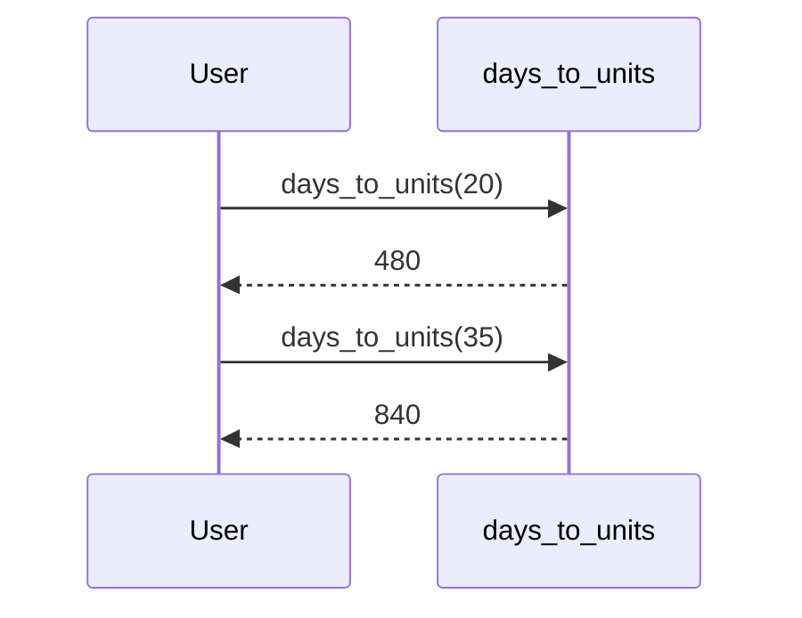

## Understanding Functions in Python

### What Are Functions?

Functions are a fundamental building block in programming languages, including Python. A function is a block of organized, reusable code that is used to perform a single, related action. Functions provide better modularity for your application and a high degree of code reusability. They help avoid code duplication and make programs shorter, easier to read, and maintain.

In Python, a function is defined using the `def` keyword followed by the function name and parentheses which may include parameters. The function body starts with a colon (`:`) and is indented.

### Why Use Functions?

Using functions helps in several ways:

1. **Code Reusability**: You can reuse the same function across different parts of your program, reducing redundancy.
2. **Modularity**: Functions allow you to break down complex problems into smaller, manageable pieces.
3. **Readability**: Functions make your code more readable by giving meaningful names to blocks of code.
4. **Maintainability**: If you need to change the behavior of a function, you only need to modify it in one place.

### How Functions Work

Let's consider the example provided in the lecture:

```python
def days_to_units(num_of_days):
    return num_of_days * 24
```

Here, `days_to_units` is a function that takes an input parameter `num_of_days` and returns the equivalent number of hours. The function definition includes:

- The `def` keyword.
- The function name `days_to_units`.
- The input parameter `num_of_days` inside parentheses.
- The function body, which performs the calculation and returns the result.

### Defining Input Parameters

Input parameters are variables that are passed to a function when it is called. In the example above, `num_of_days` is the input parameter. When you call the function, you pass a value for `num_of_days`.

For instance:

```python
hours = days_to_units(20)
print(hours)  # Output: 480
```

Here, `20` is the value passed to the `num_of_days` parameter when the function is called.

### Using Variables in Functions

Variables can be defined both inside and outside a function. Variables defined outside a function are accessible within the function, but variables defined inside a function are local to that function.

Consider the following example:

```python
def days_to_units(num_of_days):
    hours = num_of_days * 24
    return hours

total_days = 35
total_hours = days_to_units(total_days)
print(total_hours)  # Output: 840
```

In this example:
- `total_days` is a variable defined outside the function.
- `hours` is a variable defined inside the function.

### Avoiding Hardcoded Values

Hardcoding values directly into your functions can lead to inflexible and error-prone code. By using variables, you can make your functions more dynamic and adaptable.

For example, instead of:

```python
def days_to_units():
    return 20 * 24
```

Use:

```python
def days_to_units(num_of_days):
    return num_of_days * 24
```

This allows you to pass different values to the function, making it more versatile.

### Real-World Example: Code Duplication in Web Applications

Consider a scenario where a web application needs to calculate the total hours for different durations. Without functions, the code might look like this:

```python
# Calculate total hours for 20 days
total_hours_20 = 20 * 24
print(total_hours_20)

# Calculate total hours for 35 days
total_hours_35 = 35 * 24
print(total_hours_35)
```

This code is repetitive and difficult to maintain. By using a function, you can simplify it:

```python
def days_to_units(num_of_days):
    return num_of_days * 24

total_hours_20 = days_to_units(20)
print(total_hours_20)

total_hours_35 = days_to_units(35)
print(total_hours_35)
```

### Mermaid Diagram: Function Call Flow

A mermaid diagram can help visualize the flow of function calls:



### Common Pitfalls and How to Prevent Them

#### Pitfall: Overusing Global Variables

Overusing global variables can lead to code that is hard to understand and maintain. Instead, use local variables within functions and pass necessary data as parameters.

**Vulnerable Code:**

```python
total_days = 35
def days_to_units():
    return total_days * 24
```

**Secure Code:**

```python
def days_to_units(num_of_days):
    return num_of_days * 24

total_days = 35
total_hours = days_to_units(total_days)
```

#### Pitfall: Hardcoding Values

Hardcoding values makes your code inflexible and harder to maintain.

**Vulnerable Code:**

```python
def days_to_units():
    return 20 * 24
```

**Secure Code:**

```python
def days_to_units(num_of_days):
    return num_of_days * 24
```

### Detection and Prevention

To detect and prevent code duplication and poor function usage:

1. **Static Analysis Tools**: Use tools like PyLint, Flake8, or Bandit to identify potential issues in your code.
2. **Code Reviews**: Regular code reviews can help catch issues early.
3. **Unit Testing**: Write unit tests to ensure your functions behave as expected.

### Conclusion

Using functions effectively is crucial for writing clean, maintainable, and efficient code. By avoiding hardcoded values and using variables appropriately, you can make your functions more flexible and reusable. Always strive to keep your code modular and well-organized to improve readability and maintainability.

### Practice Labs

For hands-on practice with functions and code organization, consider the following labs:

- **PortSwigger Web Security Academy**: Focuses on web application security but also covers general coding practices.
- **OWASP Juice Shop**: A deliberately insecure web application for security training.
- **DVWA (Damn Vulnerable Web Application)**: Another web application for learning about web vulnerabilities.

These labs will help you apply the concepts learned in a practical setting.

---
<!-- nav -->
[[03-Introduction to Functions in Python|Introduction to Functions in Python]] | [[DevOps/DevOps Bootcamp/11-Miscellaneous/02-Avoiding Code Duplication With Functions/00-Overview|Overview]] | [[05-Understanding Scope in Programming|Understanding Scope in Programming]]
